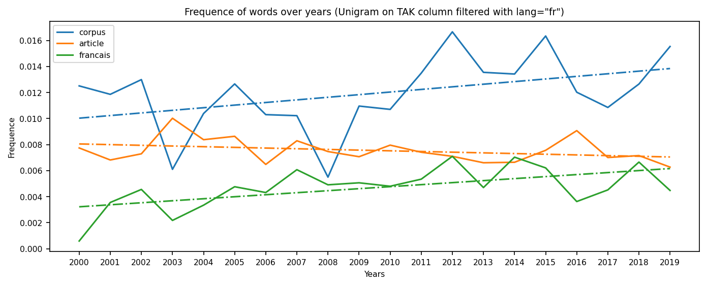
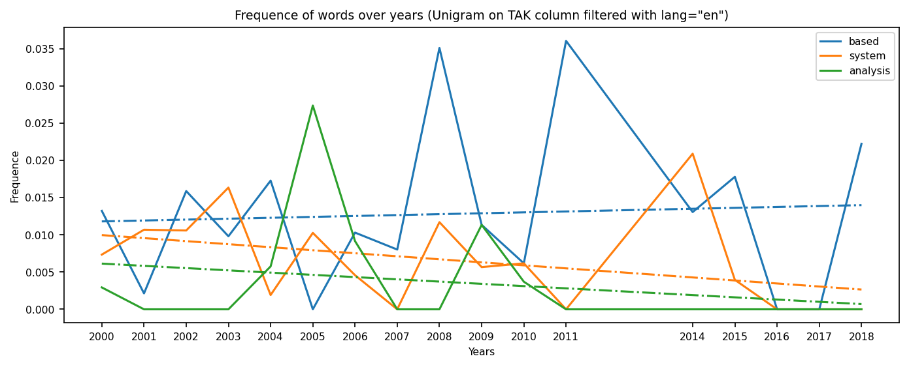

# Projet 1 :  Analyse et Synthèse de texte sur le dataset TALN

Ce travail a été effectué par :


*   Axel THEVENOT
*   Julien PYTEL


## Objectifs

Le but du projet est d'utiliser une synthèse de données textuelles d'un grand nombre d'articles scientifiques sur le traitement du langage naturel.
Le jeu de données TALN n'est pas vraiment grand, juste 44Mo, mais il est assez grand pour être trop compliqué pour être traité à la main. 
La manière de générer la synthèse et le type de synthèse sont totalement ouverts ! 
Nous pouvons nous concentrer sur les résumés ou les titres (moins d'effort de calcul) ou sélectionner un sous-ensemble spécifique. 
Si une approche ne fonctionne pas comme prévu, vous pouvez le montrer et l'expliquer. 
Ce projet contiendra un rapport pour expliquer la logique de nos approches et de nos résultats.

Dataset (44Mo) : https://www.ortolang.fr/market/corpora/corpus-taln

## Import packages et Google Drive


```
from google.colab import drive
drive.mount('/content/drive')
```

    Drive already mounted at /content/drive; to attempt to forcibly remount, call drive.mount("/content/drive", force_remount=True).


```
root = '/content/drive/MyDrive/'
root += 'A5/Advanced Machine Learning for Big Data and Text Processing/project1'
```


```
%%capture
%matplotlib inline
# system
import os
# regular expressions
import re
# xml trees (our dataset)
import xml.etree.ElementTree as ET
# data encoding
import unicodedata as ucd
# avoid warnings
import warnings
warnings.filterwarnings("ignore")

# deal with data
import numpy as np
import pandas as pd
pd.set_option('max_colwidth', 50)  # default = 50
# display data
import matplotlib.pyplot as plt
plt.rcParams['figure.figsize'] = [11, 4]
plt.rcParams['figure.dpi'] = 150
plt.rcParams['font.size'] = 7.5 # default = 10.0
# easy access
plt.default_colors = plt.rcParams['axes.prop_cycle'].by_key()['color']

# sklearn for vectorization on tfidf and K-Means (unsupervised clusterization)
from sklearn.feature_extraction.text import TfidfVectorizer
from sklearn.cluster import KMeans

# beautiful visualization of clusters
from wordcloud import WordCloud


# Natural Langage Processing
import nltk
nltk.download('stopwords')
from nltk.tokenize import RegexpTokenizer
from nltk.corpus import stopwords

# to use the lemmatization package and its french and english vocabulary
import spacy 
!pip install spacy
!python3 -m spacy download fr
!python3 -m spacy download en

# to perform and visualize LDA
! pip install pyldavis
import gensim
import pyLDAvis.gensim
pyLDAvis.enable_notebook()


# create a saving directory
save_dir = os.path.join(root, 'save_dir')
if not os.path.exists(save_dir):
    os.makedirs(save_dir)

# to export the notebook
!apt-get install texlive texlive-xetex texlive-latex-extra pandoc
!pip install pypandoc
```

## Import du dataset TALN
### Format XML


```
corpus_filepath = os.path.join(root, 'corpus-taln/2/corpus_taln_v1.tei.xml')
corpus_tree = ET.parse(corpus_filepath)
corpus_root = corpus_tree.getroot()
corpus_root.findall('./')[:7]
```


    [<Element '{http://www.tei-c.org/ns/1.0}teiHeader' at 0x7f71f0ee8958>,
     <Element '{http://www.tei-c.org/ns/1.0}TEI' at 0x7f71f0e798b8>,
     <Element '{http://www.tei-c.org/ns/1.0}TEI' at 0x7f71f0e8c1d8>,
     <Element '{http://www.tei-c.org/ns/1.0}TEI' at 0x7f71f0e95688>,
     <Element '{http://www.tei-c.org/ns/1.0}TEI' at 0x7f71f0e9b4a8>,
     <Element '{http://www.tei-c.org/ns/1.0}TEI' at 0x7f71f0eab638>,
     <Element '{http://www.tei-c.org/ns/1.0}TEI' at 0x7f71f0e3cd68>]


On voit qu'il existe des namespaces qui ne rendent pas la lecture et l'écriture facile alors nous allons nous créer un dictionnaire de ces namespaces pour le confort de tout le monde


```
ns = {
    "tal": "http://www.tei-c.org/ns/1.0",
    "xml": "http://www.w3.org/XML/1998/namespace"
}
```

Première vérification qui va déterminer la suite de notre étude. On regarde le nombre de publication, celles dont la langue est renseignée, celles en français et celles en anglais


```
print(
    'Nombre de publication :', 
    len(corpus_root.findall('./tal:TEI', namespaces=ns))
)
print(
    'Nombre de publication avec la langue renseignée :',
     len(corpus_root.findall('./tal:TEI[@xml:lang]', ns))
)
print(
    'Nombre de publication en francais :',
     len(corpus_root.findall('./tal:TEI[@xml:lang="fr"]', ns))
)
print(
    'Nombre de publication en anglais :',
     len(corpus_root.findall('./tal:TEI[@xml:lang="en"]', ns))
)

```

    Nombre de publication : 1602
    Nombre de publication avec la langue renseignée : 1602
    Nombre de publication en francais : 1502
    Nombre de publication en anglais : 100


On peut alors se dire que l'on va faire notre étude de texte sur les publications en français si on étudie les publications dans leur entièreté. 


```
print(
    'Nombre de publication avec abstract en francais :', 
    len(corpus_root.findall('./tal:TEI/tal:text/tal:front/tal:div[@type="abstract"][@xml:lang="fr"]', namespaces=ns))
)
print(
    'Nombre de publication avec abstract en anglais :', 
    len(corpus_root.findall('./tal:TEI/tal:text/tal:front/tal:div[@type="abstract"][@xml:lang="en"]', namespaces=ns))
)
print(
    'Nombre de publication avec keywords en francais :', 
    len(corpus_root.findall('./tal:TEI/tal:text/tal:front/tal:div[@type="keywords"][@xml:lang="fr"]', namespaces=ns))
)
print(
    'Nombre de publication avec keywords en anglais :', 
    len(corpus_root.findall('./tal:TEI/tal:text/tal:front/tal:div[@type="keywords"][@xml:lang="en"]', namespaces=ns))
)

```

    Nombre de publication avec abstract en francais : 1602
    Nombre de publication avec abstract en anglais : 1602
    Nombre de publication avec keywords en francais : 1602
    Nombre de publication avec keywords en anglais : 1602


Par contre on peut voir que toutes les publications ont leur balise abstract et leurs mots clés présentes en anglais ET en francais. Cela va nous faciliter la tâche lors du scrapping même si ces balises sont vides. Si ces balises sont traduites, une comparaison ou une combinaison francais-anglais sera possible.

### Conversion en dataframe avec pandas
Pour se construire notre dataframe avec pandas on aura besoin d'extraire les données de chaque TEI. Pour cela nous allons créer une méthode python pour préciser le nom des colonnes du dataframe recherché et la facon dont chaque colonne sera parsé depuis le root du TEI


```
def xml_to_pandas(root, ns={}):
    # create a dataframe with the columns as the keys in data_element_parsing
    
    df = pd.DataFrame(
        columns=[
            'title',
            'author',
            'pubplace',
            'date',
            'lang',
            'abstract_fr',
            'keywords_fr',
            'abstract_en',
            'keywords_en',
            'content'
        ]
    )

    # get and parse the data of each element (TEI)
    for element in root.findall('./tal:TEI', ns):
        # get all the data elements

        data_element = {}
        data_element['lang'] = element.attrib["{http://www.w3.org/XML/1998/namespace}lang"]
        data_element['title'] = element.find('./tal:teiHeader/tal:fileDesc/tal:titleStmt/tal:title', ns).text
        data_element['author'] = ', '.join([
            x.text for x in element.findall('./tal:teiHeader/tal:fileDesc/tal:titleStmt/tal:author/tal:persName/tal:name', ns) if x is not None
        ])
        data_element['pubplace'] = element.find('./tal:teiHeader/tal:fileDesc/tal:publicationStmt/tal:pubPlace', ns).text
        data_element['date'] = element.find('./tal:teiHeader/tal:fileDesc/tal:publicationStmt/tal:date', ns).text

        data_element['abstract_fr'] = element.find('./tal:text/tal:front/tal:div[@type="abstract"][@xml:lang="fr"]/tal:p', ns).text
        data_element['abstract_en'] = element.find('./tal:text/tal:front/tal:div[@type="abstract"][@xml:lang="en"]/tal:p', ns).text
        data_element['keywords_fr'] = element.find('./tal:text/tal:front/tal:div[@type="keywords"][@xml:lang="fr"]/tal:p', ns).text
        data_element['keywords_en'] = element.find('./tal:text/tal:front/tal:div[@type="keywords"][@xml:lang="en"]/tal:p', ns).text

        # get all the content on sections and subsections by concatenate
        # everything (not matter the order) in a single variable
        data_element['content'] = ''
        sections = element.findall('.//tal:div[@type="section"]/tal:p', ns)
        subsections = element.findall('.//tal:div[@type="subsection"]/tal:p', ns)
        error = 0

        for x in sections + subsections:
            try:
                data_element['content'] += x.text
            except:
                pass


        # append the element as a row in the dataframe
        df = df.append(data_element, ignore_index=True)
        df.date = df.date.astype(int)
    return df
```


```
corpus = xml_to_pandas(
    corpus_root,
    ns=ns
)
corpus
```


<div>
<style scoped>
    .dataframe tbody tr th:only-of-type {
        vertical-align: middle;
    }

    .dataframe tbody tr th {
        vertical-align: top;
    }

    .dataframe thead th {
        text-align: right;
    }
</style>
<table border="1" class="dataframe">
  <thead>
    <tr style="text-align: right;">
      <th></th>
      <th>title</th>
      <th>author</th>
      <th>pubplace</th>
      <th>date</th>
      <th>lang</th>
      <th>abstract_fr</th>
      <th>keywords_fr</th>
      <th>abstract_en</th>
      <th>keywords_en</th>
      <th>content</th>
    </tr>
  </thead>
  <tbody>
    <tr>
      <th>0</th>
      <td>\nÉléments de conception d'un système d'interp...</td>
      <td>Delphine Battistelli, Cyril Valliez</td>
      <td>Grenoble</td>
      <td>1997</td>
      <td>fr</td>
      <td>\nNous considérons dans notre travail la tâche...</td>
      <td>None</td>
      <td>None</td>
      <td>None</td>
      <td>\nLe modèle de la Grammaire Applicative et Cog...</td>
    </tr>
    <tr>
      <th>1</th>
      <td>\nInformatisation du dictionnaire explicatif e...</td>
      <td>Gilles Sérasset</td>
      <td>Grenoble</td>
      <td>1997</td>
      <td>fr</td>
      <td>\nNous donnons ici un aperçu du logiciel DECID...</td>
      <td>None</td>
      <td>None</td>
      <td>None</td>
      <td>\nDans le domaine de l'ingénierie linguistique...</td>
    </tr>
    <tr>
      <th>2</th>
      <td>\nConstruction d'une représentation sémantique...</td>
      <td>Pierre Zweigenbaum, Jacques Bouaud</td>
      <td>Grenoble</td>
      <td>1997</td>
      <td>fr</td>
      <td>\nDiverses méthodes ont été proposées pour con...</td>
      <td>None</td>
      <td>None</td>
      <td>None</td>
      <td></td>
    </tr>
    <tr>
      <th>3</th>
      <td>\nSystèmes de types pour la (lambda-)DRT ascen...</td>
      <td>Pascal Amsili, Nabil Hathout</td>
      <td>Paris</td>
      <td>1998</td>
      <td>fr</td>
      <td>\nLe terme de lambda-DRT désigne un ensemble d...</td>
      <td>None</td>
      <td>None</td>
      <td>None</td>
      <td>\nLa « Théorie des Représentations Discursives...</td>
    </tr>
    <tr>
      <th>4</th>
      <td>\nUne grammaire TAG vue comme une grammaire Se...</td>
      <td>Marie-Hélène Candito, Sylvain Kahane</td>
      <td>Paris</td>
      <td>1998</td>
      <td>fr</td>
      <td>\nDans cet article, nous comparons deux modèle...</td>
      <td>None</td>
      <td>None</td>
      <td>None</td>
      <td>\nTAG est un formalisme initialement développé...</td>
    </tr>
    <tr>
      <th>...</th>
      <td>...</td>
      <td>...</td>
      <td>...</td>
      <td>...</td>
      <td>...</td>
      <td>...</td>
      <td>...</td>
      <td>...</td>
      <td>...</td>
      <td>...</td>
    </tr>
    <tr>
      <th>1597</th>
      <td>\nCurriculum d'apprentissage : reconnaissance ...</td>
      <td>Antoine Caubrière, Natalia Tomashenko, Yannick...</td>
      <td>Toulouse</td>
      <td>2019</td>
      <td>fr</td>
      <td>\nDans cet article, nous présentons une approc...</td>
      <td>\nCurriculum d'apprentissage, transfert d'appr...</td>
      <td>None</td>
      <td>None</td>
      <td>\nL'apprentissage humain est réalisé par étape...</td>
    </tr>
    <tr>
      <th>1598</th>
      <td>\nDétection des ellipses dans des corpus de so...</td>
      <td>Anissa Hamza, Delphine Bernhard</td>
      <td>Toulouse</td>
      <td>2019</td>
      <td>fr</td>
      <td>\nCet article présente une méthodologie de dét...</td>
      <td>\nellipse, anglais, corpus, sous-titres, détec...</td>
      <td>None</td>
      <td>None</td>
      <td>\nL'ellipse renvoie à une incomplétude syntaxi...</td>
    </tr>
    <tr>
      <th>1599</th>
      <td>\nLa génération automatique de poésie en franç...</td>
      <td>Tim  Van de Cruys</td>
      <td>Toulouse</td>
      <td>2019</td>
      <td>fr</td>
      <td>\nLa génération automatique de poésie est une ...</td>
      <td>\ngénération de poésie, réseaux de neurones, f...</td>
      <td>None</td>
      <td>None</td>
      <td>\nLa génération automatique de poésie est une ...</td>
    </tr>
    <tr>
      <th>1600</th>
      <td>\nModèles neuronaux hybrides pour la modélisat...</td>
      <td>Marco Dinarelli, Loïc Grobol</td>
      <td>Toulouse</td>
      <td>2019</td>
      <td>fr</td>
      <td>\nNous proposons une architecture neuronale av...</td>
      <td>\nRéseaux neuronaux, modélisation de séquences...</td>
      <td>None</td>
      <td>None</td>
      <td>\nL'étiquetage de séquences est un problème im...</td>
    </tr>
    <tr>
      <th>1601</th>
      <td>\nPolylexFLE : une base de données d'expressio...</td>
      <td>Amalia Todirascu, Marion Cargill, Thomas Francois</td>
      <td>Toulouse</td>
      <td>2019</td>
      <td>fr</td>
      <td>\nNous présentons la base PolylexFLE, contenan...</td>
      <td>\nexpressions polylexicales vebales, niveau CE...</td>
      <td>None</td>
      <td>None</td>
      <td>\nLes expressions polylexicales (EP) constitue...</td>
    </tr>
  </tbody>
</table>
<p>1602 rows × 10 columns</p>
</div>


## Vérifications avant analyse(s)

Avant de commencer nos analyses, il est important de savoir ce que l'on peut analyser. Nous allons alors vérifier quelles sont les données manquante. Ainsi nous pourrons savoir ce qu'il nous est simplement impossible d'analyser dû au manque de données. Nous vérifierons aussi le nombre de sample où toutes les données sont présentes ce qui nous laisserait les possibilités les plus vastes d'analyse et de synthèse. 
Nos analyses se concentrerons alors sur le nombre de données manquantes selon les langues, pour les titres, les abstracts, les keywords et les contenus. 
Nous vérifierons aussi la répartitions des publications dans le temps ce qui nous permettra de savoir si une analyse temporelle est possible. 

Commençons par analyser les lignes où le content est vide si elles existent


```
print('Nombre de ligne avec un content vide : ', len(corpus[corpus.content == '']))
print('Dont publication francaise : ', len(corpus[(corpus.content == '') & (corpus.lang == 'fr')]))
print('Exemple :')
corpus[corpus.content == '']
```

    Nombre de ligne avec un content vide :  280
    Dont publication francaise :  181
    Exemple :


<div>
<style scoped>
    .dataframe tbody tr th:only-of-type {
        vertical-align: middle;
    }

    .dataframe tbody tr th {
        vertical-align: top;
    }

    .dataframe thead th {
        text-align: right;
    }
</style>
<table border="1" class="dataframe">
  <thead>
    <tr style="text-align: right;">
      <th></th>
      <th>title</th>
      <th>author</th>
      <th>pubplace</th>
      <th>date</th>
      <th>lang</th>
      <th>abstract_fr</th>
      <th>keywords_fr</th>
      <th>abstract_en</th>
      <th>keywords_en</th>
      <th>content</th>
    </tr>
  </thead>
  <tbody>
    <tr>
      <th>2</th>
      <td>\nConstruction d'une représentation sémantique...</td>
      <td>Pierre Zweigenbaum, Jacques Bouaud</td>
      <td>Grenoble</td>
      <td>1997</td>
      <td>fr</td>
      <td>\nDiverses méthodes ont été proposées pour con...</td>
      <td>None</td>
      <td>None</td>
      <td>None</td>
      <td></td>
    </tr>
    <tr>
      <th>12</th>
      <td>\nProméthée : un outil d'aide à l'acquisition ...</td>
      <td>Emmanuel Morin</td>
      <td>Paris</td>
      <td>1998</td>
      <td>fr</td>
      <td>\nLes outils d'aide à la construction de termi...</td>
      <td>None</td>
      <td>None</td>
      <td>None</td>
      <td></td>
    </tr>
    <tr>
      <th>17</th>
      <td>\nClitic Climbing and Tense Auxiliaries in Pol...</td>
      <td>Anna Kupsc</td>
      <td>Cargèse</td>
      <td>1999</td>
      <td>en</td>
      <td>None</td>
      <td>None</td>
      <td>\nThe aim of this paper is to compare the beha...</td>
      <td>None</td>
      <td></td>
    </tr>
    <tr>
      <th>20</th>
      <td>\nLexicalizing a shallow parser\n</td>
      <td>Roberto Basili, Maria Teresa Pazienza, Fabio M...</td>
      <td>Cargèse</td>
      <td>1999</td>
      <td>en</td>
      <td>None</td>
      <td>None</td>
      <td>\nCurrent NL parsers are expected to run with ...</td>
      <td>None</td>
      <td></td>
    </tr>
    <tr>
      <th>25</th>
      <td>\nOn TAG Parsing\n</td>
      <td>Pierre Boullier</td>
      <td>Cargèse</td>
      <td>1999</td>
      <td>fr</td>
      <td>None</td>
      <td>None</td>
      <td>\nThe subject of tree adjoining grammar parsin...</td>
      <td>None</td>
      <td></td>
    </tr>
    <tr>
      <th>...</th>
      <td>...</td>
      <td>...</td>
      <td>...</td>
      <td>...</td>
      <td>...</td>
      <td>...</td>
      <td>...</td>
      <td>...</td>
      <td>...</td>
      <td>...</td>
    </tr>
    <tr>
      <th>1534</th>
      <td>\nEtude comparative de plongements lexicaux et...</td>
      <td></td>
      <td>Rennes</td>
      <td>2018</td>
      <td>fr</td>
      <td>\nDétecter la complexité lexicale est une étap...</td>
      <td>\nComplexité lexicale, lisibilité, ordonnancem...</td>
      <td>None</td>
      <td>None</td>
      <td></td>
    </tr>
    <tr>
      <th>1537</th>
      <td>\nJeuxDeLiens: Word Embeddings and Path-Based ...</td>
      <td></td>
      <td>Rennes</td>
      <td>2018</td>
      <td>en</td>
      <td>\nLes systèmes de désambiguı̈sation d'entités ...</td>
      <td>\nentité nommée, désambiguı̈sation, jeuxdemots...</td>
      <td>None</td>
      <td>None</td>
      <td></td>
    </tr>
    <tr>
      <th>1545</th>
      <td>\nNéonaute, Enrichissement sémantique pour la ...</td>
      <td></td>
      <td>Rennes</td>
      <td>2018</td>
      <td>fr</td>
      <td>\n</td>
      <td>\n</td>
      <td>None</td>
      <td>None</td>
      <td></td>
    </tr>
    <tr>
      <th>1546</th>
      <td>\nNouveautés de l'analyseur linguistique LIMA\n</td>
      <td></td>
      <td>Rennes</td>
      <td>2018</td>
      <td>fr</td>
      <td>\nLIMA est un analyseur linguistique libre d'e...</td>
      <td>\ntokenisation, morphologie, étiquetage morpho...</td>
      <td>None</td>
      <td>None</td>
      <td></td>
    </tr>
    <tr>
      <th>1553</th>
      <td>Modeling infant segmentation of two\n</td>
      <td></td>
      <td>Rennes</td>
      <td>2018</td>
      <td>en</td>
      <td>\nLes nourrissons doivent trouver des limites ...</td>
      <td>\nvariation interlinguistique, apprentissage s...</td>
      <td>None</td>
      <td>None</td>
      <td></td>
    </tr>
  </tbody>
</table>
<p>280 rows × 10 columns</p>
</div>


On voit alors que 280 de nos publications dont 181 francaises ont été mal parsées. Autrement dit, le fichier XML a un défaut de format, des données manquantes ou la chaine de parsing que l'on a défini est mauvaise. 
Quoiqu'il en soit, on peut se dire que 280 sur 1602 est une que l'on peut se permettre pour nos analyses. 

On peut aussi remarquer qu'il y des données manquantes pour les abstracts et les keywords où on remarque des "None". 
Il est intéressant de savoir en détail quelles sont ces données où les None sont présents. 


```
miss_abs_fr = (corpus.abstract_fr == 'None')
miss_abs_en = (corpus.abstract_en == 'None')
miss_kwd_fr = (corpus.keywords_fr == 'None')
miss_kwd_en = (corpus.keywords_en == 'None')
print('Abstract francais manquant :', len(corpus[miss_abs_fr]))
print('Abstract anglais manquant :', len(corpus[miss_abs_en]))

print('Keywords francais manquant :', len(corpus[miss_kwd_fr]))
print('Keywords anglais manquant :', len(corpus[miss_kwd_en]))

miss_fr = miss_abs_fr & miss_kwd_fr
miss_en = miss_abs_en & miss_kwd_en
miss = miss_fr & miss_en
miss_and_content = (miss) & (corpus.content == '')
print('Dont Abstract et Keywords francais manquant :', len(corpus[miss_fr]))
print('Dont Abstract et Keywords anglais manquant :', len(corpus[miss_en]))
print('Dont Abstract et Keywords francais et anglais manquant :', len(corpus[miss]))
print('Dont Abstract et Keywords francais et anglais et content manquant :', len(corpus[miss_and_content]))
print('Exemple :')

corpus[miss_and_content]
```

    Abstract francais manquant : 67
    Abstract anglais manquant : 110
    Keywords francais manquant : 127
    Keywords anglais manquant : 153
    Dont Abstract et Keywords francais manquant : 57
    Dont Abstract et Keywords anglais manquant : 105
    Dont Abstract et Keywords francais et anglais manquant : 25
    Dont Abstract et Keywords francais et anglais et content manquant : 17
    Exemple :


<div>
<style scoped>
    .dataframe tbody tr th:only-of-type {
        vertical-align: middle;
    }

    .dataframe tbody tr th {
        vertical-align: top;
    }

    .dataframe thead th {
        text-align: right;
    }
</style>
<table border="1" class="dataframe">
  <thead>
    <tr style="text-align: right;">
      <th></th>
      <th>title</th>
      <th>author</th>
      <th>pubplace</th>
      <th>date</th>
      <th>lang</th>
      <th>abstract_fr</th>
      <th>keywords_fr</th>
      <th>abstract_en</th>
      <th>keywords_en</th>
      <th>content</th>
    </tr>
  </thead>
  <tbody>
    <tr>
      <th>47</th>
      <td>\nWSD evaluation and the looking-glass\n</td>
      <td>Elisabeth Aimelet, Veronika Lux, Corinne Jean,...</td>
      <td>Cargèse</td>
      <td>1999</td>
      <td>en</td>
      <td>None</td>
      <td>None</td>
      <td>None</td>
      <td>None</td>
      <td></td>
    </tr>
    <tr>
      <th>193</th>
      <td>\nWord Formation in Computational Linguistics\n</td>
      <td>Pius Ten Hacken</td>
      <td>Nancy</td>
      <td>2002</td>
      <td>en</td>
      <td>None</td>
      <td>None</td>
      <td>None</td>
      <td>None</td>
      <td></td>
    </tr>
    <tr>
      <th>932</th>
      <td>\nSpatiAnn, un outil pour annoter l'utilisatio...</td>
      <td>Annelies Braffort, Laurence Bolot</td>
      <td>Montpellier</td>
      <td>2011</td>
      <td>fr</td>
      <td>None</td>
      <td>None</td>
      <td>None</td>
      <td>None</td>
      <td></td>
    </tr>
    <tr>
      <th>933</th>
      <td>\nLibellex : une plateforme multiservices pour...</td>
      <td>François Brown de Colstoun, Estelle Delpech, E...</td>
      <td>Montpellier</td>
      <td>2011</td>
      <td>fr</td>
      <td>None</td>
      <td>None</td>
      <td>None</td>
      <td>None</td>
      <td></td>
    </tr>
    <tr>
      <th>936</th>
      <td>\nTTC TermSuite : une chaîne de traitement pou...</td>
      <td>Béatrice Daille, Christine Jacquin, Laura Monc...</td>
      <td>Montpellier</td>
      <td>2011</td>
      <td>fr</td>
      <td>None</td>
      <td>None</td>
      <td>None</td>
      <td>None</td>
      <td></td>
    </tr>
    <tr>
      <th>937</th>
      <td>\nUne Suite d'interaction de fouille basée sur...</td>
      <td>Rodolfo Delmonte, Vincenzo Pallotta, Violeta S...</td>
      <td>Montpellier</td>
      <td>2011</td>
      <td>fr</td>
      <td>None</td>
      <td>None</td>
      <td>None</td>
      <td>None</td>
      <td></td>
    </tr>
    <tr>
      <th>938</th>
      <td>\nDémonstration de l'API de NLGbAse\n</td>
      <td>François-Xavier Desmarais, Éric Chart-on</td>
      <td>Montpellier</td>
      <td>2011</td>
      <td>fr</td>
      <td>None</td>
      <td>None</td>
      <td>None</td>
      <td>None</td>
      <td></td>
    </tr>
    <tr>
      <th>940</th>
      <td>\nRefGen, outil d'identification automatique d...</td>
      <td>Laurence Longo, Amalia Todirascu</td>
      <td>Montpellier</td>
      <td>2011</td>
      <td>fr</td>
      <td>None</td>
      <td>None</td>
      <td>None</td>
      <td>None</td>
      <td></td>
    </tr>
    <tr>
      <th>941</th>
      <td>\nBabouk – exploration orientée du web pour la...</td>
      <td>Clément de Groc, Javier Couto, Helena Blancafo...</td>
      <td>Montpellier</td>
      <td>2011</td>
      <td>fr</td>
      <td>None</td>
      <td>None</td>
      <td>None</td>
      <td>None</td>
      <td></td>
    </tr>
    <tr>
      <th>942</th>
      <td>\nExtraction d'informations médicales au LIMSI\n</td>
      <td>Cyril Grouin, Louise Deléger, Anne-Lyse Minard...</td>
      <td>Montpellier</td>
      <td>2011</td>
      <td>fr</td>
      <td>None</td>
      <td>None</td>
      <td>None</td>
      <td>None</td>
      <td></td>
    </tr>
    <tr>
      <th>943</th>
      <td>\nSystème d'analyse catégorielle ACCG : adéqua...</td>
      <td>Juyeon Kang, Jean-Pierre Desclés</td>
      <td>Montpellier</td>
      <td>2011</td>
      <td>fr</td>
      <td>None</td>
      <td>None</td>
      <td>None</td>
      <td>None</td>
      <td></td>
    </tr>
    <tr>
      <th>944</th>
      <td>\nLOL : Langage objet dédié à la programmation...</td>
      <td>Jimmy Ma, Mickaël Mounier, Helena Blancafort, ...</td>
      <td>Montpellier</td>
      <td>2011</td>
      <td>fr</td>
      <td>None</td>
      <td>None</td>
      <td>None</td>
      <td>None</td>
      <td></td>
    </tr>
    <tr>
      <th>945</th>
      <td>\nAligner : un outil d'alignement et de mesure...</td>
      <td>Yann Mathet, Antoine Widlöcher</td>
      <td>Montpellier</td>
      <td>2011</td>
      <td>fr</td>
      <td>None</td>
      <td>None</td>
      <td>None</td>
      <td>None</td>
      <td></td>
    </tr>
    <tr>
      <th>946</th>
      <td>\nGlozzQL : un langage de requêtes incrémental...</td>
      <td>Yann Mathet, Antoine Widlöcher</td>
      <td>Montpellier</td>
      <td>2011</td>
      <td>fr</td>
      <td>None</td>
      <td>None</td>
      <td>None</td>
      <td>None</td>
      <td></td>
    </tr>
    <tr>
      <th>947</th>
      <td>\nEASYTEXT : un système opérationnel de généra...</td>
      <td>Frédéric Meunier, Laurence Danlos, Vanessa Combet</td>
      <td>Montpellier</td>
      <td>2011</td>
      <td>fr</td>
      <td>None</td>
      <td>None</td>
      <td>None</td>
      <td>None</td>
      <td></td>
    </tr>
    <tr>
      <th>948</th>
      <td>\nRestad : un logiciel d'indexation et de stoc...</td>
      <td>Yoann Moreau, Eric SanJuan, Patrice Bellot</td>
      <td>Montpellier</td>
      <td>2011</td>
      <td>fr</td>
      <td>None</td>
      <td>None</td>
      <td>None</td>
      <td>None</td>
      <td></td>
    </tr>
    <tr>
      <th>950</th>
      <td>\nDémonstration d'un outil de « Calcul Littéra...</td>
      <td>Jean Rohmer</td>
      <td>Montpellier</td>
      <td>2011</td>
      <td>fr</td>
      <td>None</td>
      <td>None</td>
      <td>None</td>
      <td>None</td>
      <td></td>
    </tr>
  </tbody>
</table>
</div>


On a un certain nombre de données manquantes que ce soit en francais, en anglais, et ce, sur l'abtract, les keywords et le content. 
Pour autant, nous ne supprimerons pas ces lignes car toutes contiennent un titre valable et doc sont utiles pour les analyses sur le titre. 


```
corpus.groupby(by='date').date.count().plot(
    title='Number of publication per year',  
    color='#8800ff'
)
plt.hlines(
    30, 
    corpus.date.min(), 
    corpus.date.max(), 
    colors='#999999', 
    linestyles='dashed'
)
pass
```


On peut alors remarquer que les publications sont assez bien réparties dans le temps ce qui nous donnera la possibilité de faire nos analyses avec un axe temporel en fonction de notre avancement. 
(A noter que la droite horizontale est le seuil arbitraire placer à count=30 pour lequel nous estimons qu'une analyse est possible. Selon ce seuil, nous pourrons analyser les données de toutes les publications à partir de l'année 2000)

## Nettoyage des données

Nous avons pu voir qu'aucune ligne n'est à supprimer puisque toutes nos données comportent au moins un titre ou un content ou un asbtract/keywords. 
Donc tout est utilisable à analyse. Mais il sera nécessaire et indispensable de nettoyer nos données.

Pour les exemples qui vont suivres, nous allons utiliser les 5 premières lignes de abstract_fr en tant que visualisation de notre nettoyage car ces sont des paragraphes courts contrairement aux contenus et ne contiennent pas seulement une phrase contrairement aux titres.


```
pd.set_option('max_colwidth', 400)  # default = 50

corpus_sample = corpus.iloc[:5][["abstract_fr", "lang"]]
corpus_sample
```


<div>
<style scoped>
    .dataframe tbody tr th:only-of-type {
        vertical-align: middle;
    }

    .dataframe tbody tr th {
        vertical-align: top;
    }

    .dataframe thead th {
        text-align: right;
    }
</style>
<table border="1" class="dataframe">
  <thead>
    <tr style="text-align: right;">
      <th></th>
      <th>abstract_fr</th>
      <th>lang</th>
    </tr>
  </thead>
  <tbody>
    <tr>
      <th>0</th>
      <td>\nNous considérons dans notre travail la tâche du traitement automatique visant à construire, à partir de textes issus d'un corpus de constats d'accidents de la route, des interprétations compatibles avec ces derniers, et à en proposer des illustrations sous forme de séquences d'images fixes. Notre recherche est le fruit d'une collaboration entre un laboratoire universitaire et une entreprise....</td>
      <td>fr</td>
    </tr>
    <tr>
      <th>1</th>
      <td>\nNous donnons ici un aperçu du logiciel DECID développé au GETA afin d'informatiser le processus de rédaction du dictionnaire explicatif et combinatoire du français contemporain.\n</td>
      <td>fr</td>
    </tr>
    <tr>
      <th>2</th>
      <td>\nDiverses méthodes ont été proposées pour construire un "graphe conceptuel" représentant le "sens" d'une phrase à partir de son analyse syntaxique. Cependant, peu d'entre elles reposent sur un véritable formalisme linguistique. Nous nous intéressons ici à la construction d'une telle représentation sémantique à partir de la représentation syntaxique produite par une analyse LFG, et montrons co...</td>
      <td>fr</td>
    </tr>
    <tr>
      <th>3</th>
      <td>\nLe terme de lambda-DRT désigne un ensemble de méthodes permettant de construire des représentations sémantiques (DRS) à partir d'arbres syntaxiques. La mise en oeuvre de telles méthodes nécessite l'élaboration de systèmes de types dont le détail est rarement présenté. C'est à la description d'un tel système que cet article est consacré.\n</td>
      <td>fr</td>
    </tr>
    <tr>
      <th>4</th>
      <td>\nDans cet article, nous comparons deux modèles linguistiques utilisés en TAL, les grammaires d'arbres adjoints [= TAG] et le Théorie Sens-Texte [= TST]. Nous montrons que ces deux modèles présentent des similitudes notables, et que les représentations les plus abstraites qu'ils donnent d'une phrase — la représentation sémantique en TST et l'arbre de dérivation en TAG — sont équivalentes. De c...</td>
      <td>fr</td>
    </tr>
  </tbody>
</table>
</div>


### Suppression des accents

La première étape est plutot simple. On enlève les accents en passant simplement pas la case ascii.


```
def remove_accent(text):
    norm = ucd.normalize('NFKD', text)
    ascii = norm.encode('ascii', 'ignore')
    text = ascii.decode('utf-8', 'ignore')
    return text

corpus_sample["abstract_fr"] = corpus_sample.apply(
    lambda x: remove_accent(x["abstract_fr"]), 
    axis=1
)
corpus_sample

```


<div>
<style scoped>
    .dataframe tbody tr th:only-of-type {
        vertical-align: middle;
    }

    .dataframe tbody tr th {
        vertical-align: top;
    }

    .dataframe thead th {
        text-align: right;
    }
</style>
<table border="1" class="dataframe">
  <thead>
    <tr style="text-align: right;">
      <th></th>
      <th>abstract_fr</th>
      <th>lang</th>
    </tr>
  </thead>
  <tbody>
    <tr>
      <th>0</th>
      <td>\nNous considerons dans notre travail la tache du traitement automatique visant a construire, a partir de textes issus d'un corpus de constats d'accidents de la route, des interpretations compatibles avec ces derniers, et a en proposer des illustrations sous forme de sequences d'images fixes. Notre recherche est le fruit d'une collaboration entre un laboratoire universitaire et une entreprise....</td>
      <td>fr</td>
    </tr>
    <tr>
      <th>1</th>
      <td>\nNous donnons ici un apercu du logiciel DECID developpe au GETA afin d'informatiser le processus de redaction du dictionnaire explicatif et combinatoire du francais contemporain.\n</td>
      <td>fr</td>
    </tr>
    <tr>
      <th>2</th>
      <td>\nDiverses methodes ont ete proposees pour construire un "graphe conceptuel" representant le "sens" d'une phrase a partir de son analyse syntaxique. Cependant, peu d'entre elles reposent sur un veritable formalisme linguistique. Nous nous interessons ici a la construction d'une telle representation semantique a partir de la representation syntaxique produite par une analyse LFG, et montrons co...</td>
      <td>fr</td>
    </tr>
    <tr>
      <th>3</th>
      <td>\nLe terme de lambda-DRT designe un ensemble de methodes permettant de construire des representations semantiques (DRS) a partir d'arbres syntaxiques. La mise en oeuvre de telles methodes necessite l'elaboration de systemes de types dont le detail est rarement presente. C'est a la description d'un tel systeme que cet article est consacre.\n</td>
      <td>fr</td>
    </tr>
    <tr>
      <th>4</th>
      <td>\nDans cet article, nous comparons deux modeles linguistiques utilises en TAL, les grammaires d'arbres adjoints [= TAG] et le Theorie Sens-Texte [= TST]. Nous montrons que ces deux modeles presentent des similitudes notables, et que les representations les plus abstraites qu'ils donnent d'une phrase  la representation semantique en TST et l'arbre de derivation en TAG  sont equivalentes. De ce ...</td>
      <td>fr</td>
    </tr>
  </tbody>
</table>
</div>


### Passage en minuscule

On met tout en minuscule puisque "n" est différent de "N" ce qui n'a pas trop de sens considérant un mot (sauf nom propres que l'on considèreras comme non essentiel)

A noter que ce choix délibéré de ne pas compter les noms propre semble pertinent mais dans le cas de papier de recherche, les noms propres peuvent avoir leur importance plus que dans un texte quelconque.


```
def set_lower(text):
    return text.lower()

corpus_sample["abstract_fr"] = corpus_sample.apply(
    lambda x: set_lower(x["abstract_fr"]), 
    axis=1
)
corpus_sample
```


<div>
<style scoped>
    .dataframe tbody tr th:only-of-type {
        vertical-align: middle;
    }

    .dataframe tbody tr th {
        vertical-align: top;
    }

    .dataframe thead th {
        text-align: right;
    }
</style>
<table border="1" class="dataframe">
  <thead>
    <tr style="text-align: right;">
      <th></th>
      <th>abstract_fr</th>
      <th>lang</th>
    </tr>
  </thead>
  <tbody>
    <tr>
      <th>0</th>
      <td>\nnous considerons dans notre travail la tache du traitement automatique visant a construire, a partir de textes issus d'un corpus de constats d'accidents de la route, des interpretations compatibles avec ces derniers, et a en proposer des illustrations sous forme de sequences d'images fixes. notre recherche est le fruit d'une collaboration entre un laboratoire universitaire et une entreprise....</td>
      <td>fr</td>
    </tr>
    <tr>
      <th>1</th>
      <td>\nnous donnons ici un apercu du logiciel decid developpe au geta afin d'informatiser le processus de redaction du dictionnaire explicatif et combinatoire du francais contemporain.\n</td>
      <td>fr</td>
    </tr>
    <tr>
      <th>2</th>
      <td>\ndiverses methodes ont ete proposees pour construire un "graphe conceptuel" representant le "sens" d'une phrase a partir de son analyse syntaxique. cependant, peu d'entre elles reposent sur un veritable formalisme linguistique. nous nous interessons ici a la construction d'une telle representation semantique a partir de la representation syntaxique produite par une analyse lfg, et montrons co...</td>
      <td>fr</td>
    </tr>
    <tr>
      <th>3</th>
      <td>\nle terme de lambda-drt designe un ensemble de methodes permettant de construire des representations semantiques (drs) a partir d'arbres syntaxiques. la mise en oeuvre de telles methodes necessite l'elaboration de systemes de types dont le detail est rarement presente. c'est a la description d'un tel systeme que cet article est consacre.\n</td>
      <td>fr</td>
    </tr>
    <tr>
      <th>4</th>
      <td>\ndans cet article, nous comparons deux modeles linguistiques utilises en tal, les grammaires d'arbres adjoints [= tag] et le theorie sens-texte [= tst]. nous montrons que ces deux modeles presentent des similitudes notables, et que les representations les plus abstraites qu'ils donnent d'une phrase  la representation semantique en tst et l'arbre de derivation en tag  sont equivalentes. de ce ...</td>
      <td>fr</td>
    </tr>
  </tbody>
</table>
</div>


### Replacements avec Expressions Régulières

Nous arrivons à la dernière étape de nettoyage de nos données et celle-ci est plus complexe. Nous utiliserons les expressions régulières pour traiter d'un coup unique plusieurs nettoyages. 


```
replacement_patterns = [
     # remove extra lines
     (r'\n', ''),
     # remove special characters
     (r'[^a-zA-Z\d\s]', ' '),
     # remove extra space
     (r'\s{2,}', ' '),
]

replacement_patterns_en = [
     # gestion de quelques contractions
     (r'n\'', 'ne '),
     (r'can\'t', 'cannot'),
     (r'i\'m', 'i am'),
     (r'ain\'t', 'is not'),
     (r'(\w+)\'ll', r'\g<1> will'),
     (r'(\w+)n\'t', r'\g<1> not'),
     (r'(\w+)\'ve', r'\g<1> have'),
     (r'(\w+)\'s', r'\g<1> is'),
     (r'(\w+)\'re', r'\g<1> are'),
     (r'(\w+)\'d', r'\g<1> would'),
] + replacement_patterns 

replacement_patterns_fr = [
     # remplacement des contractions avec seulement un "e" a la fin
     # exemple : "qu'ils" devient "que ils"
     (r'(\w+)\'', r'\g<1>e '),
] + replacement_patterns


class RegexpReplacer(object):

    def __init__(self):
        self.patterns = {
            'en': [(re.compile(regex), repl) for (regex, repl) in replacement_patterns_en],
            'fr': [(re.compile(regex), repl) for (regex, repl) in replacement_patterns_fr]
        }

    def __call__(self, text, lang):
        s = text
        for (pattern, repl) in self.patterns[lang]:
            s = re.sub(pattern, repl, s)
        return s

replace_regex = RegexpReplacer()


corpus_sample["abstract_fr"] = corpus_sample.apply(
    lambda x: replace_regex(x["abstract_fr"], "fr"), 
    axis=1
)
corpus_sample
```


<div>
<style scoped>
    .dataframe tbody tr th:only-of-type {
        vertical-align: middle;
    }

    .dataframe tbody tr th {
        vertical-align: top;
    }

    .dataframe thead th {
        text-align: right;
    }
</style>
<table border="1" class="dataframe">
  <thead>
    <tr style="text-align: right;">
      <th></th>
      <th>abstract_fr</th>
      <th>lang</th>
    </tr>
  </thead>
  <tbody>
    <tr>
      <th>0</th>
      <td>nous considerons dans notre travail la tache du traitement automatique visant a construire a partir de textes issus de un corpus de constats de accidents de la route des interpretations compatibles avec ces derniers et a en proposer des illustrations sous forme de sequences de images fixes notre recherche est le fruit de une collaboration entre un laboratoire universitaire et une entreprise el...</td>
      <td>fr</td>
    </tr>
    <tr>
      <th>1</th>
      <td>nous donnons ici un apercu du logiciel decid developpe au geta afin de informatiser le processus de redaction du dictionnaire explicatif et combinatoire du francais contemporain</td>
      <td>fr</td>
    </tr>
    <tr>
      <th>2</th>
      <td>diverses methodes ont ete proposees pour construire un graphe conceptuel representant le sens de une phrase a partir de son analyse syntaxique cependant peu de entre elles reposent sur un veritable formalisme linguistique nous nous interessons ici a la construction de une telle representation semantique a partir de la representation syntaxique produite par une analyse lfg et montrons comment u...</td>
      <td>fr</td>
    </tr>
    <tr>
      <th>3</th>
      <td>le terme de lambda drt designe un ensemble de methodes permettant de construire des representations semantiques drs a partir de arbres syntaxiques la mise en oeuvre de telles methodes necessite le elaboration de systemes de types dont le detail est rarement presente ce est a la description de un tel systeme que cet article est consacre</td>
      <td>fr</td>
    </tr>
    <tr>
      <th>4</th>
      <td>dans cet article nous comparons deux modeles linguistiques utilises en tal les grammaires de arbres adjoints tag et le theorie sens texte tst nous montrons que ces deux modeles presentent des similitudes notables et que les representations les plus abstraites que ils donnent de une phrase la representation semantique en tst et le arbre de derivation en tag sont equivalentes de ce rapprochement...</td>
      <td>fr</td>
    </tr>
  </tbody>
</table>
</div>


### Suppression des Stopwords

On va supprimer aussi les stopwords. Il faut aussi, comme dans les cas des regex, utiliser un set de stopwords qui sera propre à la langue dans laquelle est le texte. En l'occurence on télécharger les stopwrods de la langue anglaise et de la langue francaise


```
class StopWordsRemover(object):

    def __init__(self, regex_split=r'[a-zA-Z]+'):
        self.stopwords = {
            'en': set(stopwords.words('english')),
            'fr': set(stopwords.words('french'))
        }
        self.tokenizer = RegexpTokenizer(regex_split)

    def __call__(self, text, lang):
        text = self.tokenizer.tokenize(text)
        text = ' '.join([x for x in text if not x in self.stopwords[lang]])
        return text

remove_stopwords = StopWordsRemover()

corpus_sample["abstract_fr"] = corpus_sample.apply(
    lambda x: remove_stopwords(x["abstract_fr"], "fr"), 
    axis=1
)
corpus_sample
```


<div>
<style scoped>
    .dataframe tbody tr th:only-of-type {
        vertical-align: middle;
    }

    .dataframe tbody tr th {
        vertical-align: top;
    }

    .dataframe thead th {
        text-align: right;
    }
</style>
<table border="1" class="dataframe">
  <thead>
    <tr style="text-align: right;">
      <th></th>
      <th>abstract_fr</th>
      <th>lang</th>
    </tr>
  </thead>
  <tbody>
    <tr>
      <th>0</th>
      <td>considerons travail tache traitement automatique visant a construire a partir textes issus corpus constats accidents route interpretations compatibles derniers a proposer illustrations sous forme sequences images fixes recherche fruit collaboration entre laboratoire universitaire entreprise prend appui modele grammaire applicative cognitive vise particulier a expliquer a certain niveau cogniti...</td>
      <td>fr</td>
    </tr>
    <tr>
      <th>1</th>
      <td>donnons ici apercu logiciel decid developpe geta afin informatiser processus redaction dictionnaire explicatif combinatoire francais contemporain</td>
      <td>fr</td>
    </tr>
    <tr>
      <th>2</th>
      <td>diverses methodes ete proposees construire graphe conceptuel representant sens phrase a partir analyse syntaxique cependant peu entre elles reposent veritable formalisme linguistique interessons ici a construction telle representation semantique a partir representation syntaxique produite analyse lfg montrons comment transposition joint dirige graphes conceptuels permet effectuer cette constru...</td>
      <td>fr</td>
    </tr>
    <tr>
      <th>3</th>
      <td>terme lambda drt designe ensemble methodes permettant construire representations semantiques drs a partir arbres syntaxiques mise oeuvre telles methodes necessite elaboration systemes types dont detail rarement presente a description tel systeme cet article consacre</td>
      <td>fr</td>
    </tr>
    <tr>
      <th>4</th>
      <td>cet article comparons deux modeles linguistiques utilises tal grammaires arbres adjoints tag theorie sens texte tst montrons deux modeles presentent similitudes notables representations plus abstraites donnent phrase representation semantique tst arbre derivation tag equivalentes rapprochement decoule part peut inspirer procedure derivation tag operer correspondance sens texte autre part peut ...</td>
      <td>fr</td>
    </tr>
  </tbody>
</table>
</div>


### Lemmatization

Enfin notre dernière fonction permet de lemmatizer un texte. Encore une fois, il nous faut une possibilité francaise et une autre anglaise


```
class Lemmatizer(object):

    def __init__(self, regex_split=r'[a-zA-Z]+'):
        self.lemmatizer = {
            'en': spacy.load('en'),
            'fr': spacy.load('fr')
        }
        self.tokenizer = RegexpTokenizer(regex_split)

    def __call__(self, text, lang):
        text = ' '.join([x.lemma_ for x in self.lemmatizer[lang](text)])
        return text

lemmatize = Lemmatizer()


corpus_sample["abstract_fr"] = corpus_sample.apply(
    lambda x: lemmatize(x["abstract_fr"], "fr"), 
    axis=1
)
corpus_sample
```


<div>
<style scoped>
    .dataframe tbody tr th:only-of-type {
        vertical-align: middle;
    }

    .dataframe tbody tr th {
        vertical-align: top;
    }

    .dataframe thead th {
        text-align: right;
    }
</style>
<table border="1" class="dataframe">
  <thead>
    <tr style="text-align: right;">
      <th></th>
      <th>abstract_fr</th>
      <th>lang</th>
    </tr>
  </thead>
  <tbody>
    <tr>
      <th>0</th>
      <td>consideron travail tach traitement automatique viser avoir construir avoir partir texte issu corpus constat accident route interpretation compatible dernier avoir proposer illustration sous forme sequence image fixe recherche fruit collaboration entre laboratoire universitaire entreprise prendre appui modele grammair applicatif cognitif vis particulier avoir expliquer avoir certain niveau cogn...</td>
      <td>fr</td>
    </tr>
    <tr>
      <th>1</th>
      <td>donnon ici apercu logiciel decid developpe geta afin informatiser processus redaction dictionnair explicatif combinatoire francai contemporain</td>
      <td>fr</td>
    </tr>
    <tr>
      <th>2</th>
      <td>divers methode ete proposee construir graphe conceptuel representer sen phrase avoir partir analyse syntaxique cependant peu entre lui reposer veritabl formalisme linguistique interesson ici avoir construction tel representation semantiqu avoir partir representation syntaxique produire analyse lfg montron comment transposition joint diriger graphes conceptuel permettre effectuer ce constructio...</td>
      <td>fr</td>
    </tr>
    <tr>
      <th>3</th>
      <td>terme lambder drt designe ensembl methode permettre construir representation semantique dr avoir partir arbre syntaxique mise oeuvre tel methode necessite elaboration systemes type dont detail raremer presente avoir description tel systeme ce article consacr</td>
      <td>fr</td>
    </tr>
    <tr>
      <th>4</th>
      <td>ce article comparon deux modele linguistique utilise tal grammaire arbre adjoint tag theorie sen texte tst montron deux modele presenter similitude notable representation plus abstrait donner phrase representation semantiqu tst arbre derivation tag equivalente rapprochemer decoul part pouvoir inspirer procedure derivation tag operer correspondance sen texte autre part pouvoir concevoir grammai...</td>
      <td>fr</td>
    </tr>
  </tbody>
</table>
</div>


En regardant de plus près notre lemmatization, au jugé, nous trouvons qu'elle n'est pas superbe. Elle altère mal le texte francais car trop peu d'équivalents sont trouvés dans ce vocabulaire trop technique et peu courant qu'est celui de papier de recherche. Alors nous décidons finalement de ne pas utiliser de lemmatization au risque de nuire à nos données plus qu'autre chose

### N-Gram 

Enfin, nous aurons besoin de "Tokeniser" nos phrases après nettoyage. 
Nous faisons cette fonction à part pour deux raisons :
- nous ne sommes pas obligés de tokenizer pour tous les algorithmes
- nous pourrons tester des unigram, bigram, trigram... 


```
regex_split = r'[a-zA-Z]+'
tokenizer = RegexpTokenizer(regex_split)

def n_gram_tokenize(text, n, n_gram_jointure=None):
    # tokenization
    text_tokenized = tokenizer.tokenize(text)
    # n-gram 
    text_tokenized = [text_tokenized[i:i+n] for i in range(len(text_tokenized)- n + 1)]
    # jointure if asked
    if n_gram_jointure is not None:
        text_tokenized = [n_gram_jointure.join(x) for x in text_tokenized]
    return text_tokenized

corpus_sample["abstract_fr"] = corpus_sample.apply(
    lambda x: n_gram_tokenize(x["abstract_fr"], 2, n_gram_jointure=' '), 
    axis=1
)
corpus_sample
```


<div>
<style scoped>
    .dataframe tbody tr th:only-of-type {
        vertical-align: middle;
    }

    .dataframe tbody tr th {
        vertical-align: top;
    }

    .dataframe thead th {
        text-align: right;
    }
</style>
<table border="1" class="dataframe">
  <thead>
    <tr style="text-align: right;">
      <th></th>
      <th>abstract_fr</th>
      <th>lang</th>
    </tr>
  </thead>
  <tbody>
    <tr>
      <th>0</th>
      <td>[consideron travail, travail tach, tach traitement, traitement automatique, automatique viser, viser avoir, avoir construir, construir avoir, avoir partir, partir texte, texte issu, issu corpus, corpus constat, constat accident, accident route, route interpretation, interpretation compatible, compatible dernier, dernier avoir, avoir proposer, proposer illustration, illustration sous, sous form...</td>
      <td>fr</td>
    </tr>
    <tr>
      <th>1</th>
      <td>[donnon ici, ici apercu, apercu logiciel, logiciel decid, decid developpe, developpe geta, geta afin, afin informatiser, informatiser processus, processus redaction, redaction dictionnair, dictionnair explicatif, explicatif combinatoire, combinatoire francai, francai contemporain]</td>
      <td>fr</td>
    </tr>
    <tr>
      <th>2</th>
      <td>[divers methode, methode ete, ete proposee, proposee construir, construir graphe, graphe conceptuel, conceptuel representer, representer sen, sen phrase, phrase avoir, avoir partir, partir analyse, analyse syntaxique, syntaxique cependant, cependant peu, peu entre, entre lui, lui reposer, reposer veritabl, veritabl formalisme, formalisme linguistique, linguistique interesson, interesson ici, i...</td>
      <td>fr</td>
    </tr>
    <tr>
      <th>3</th>
      <td>[terme lambder, lambder drt, drt designe, designe ensembl, ensembl methode, methode permettre, permettre construir, construir representation, representation semantique, semantique dr, dr avoir, avoir partir, partir arbre, arbre syntaxique, syntaxique mise, mise oeuvre, oeuvre tel, tel methode, methode necessite, necessite elaboration, elaboration systemes, systemes type, type dont, dont detail...</td>
      <td>fr</td>
    </tr>
    <tr>
      <th>4</th>
      <td>[ce article, article comparon, comparon deux, deux modele, modele linguistique, linguistique utilise, utilise tal, tal grammaire, grammaire arbre, arbre adjoint, adjoint tag, tag theorie, theorie sen, sen texte, texte tst, tst montron, montron deux, deux modele, modele presenter, presenter similitude, similitude notable, notable representation, representation plus, plus abstrait, abstrait donn...</td>
      <td>fr</td>
    </tr>
  </tbody>
</table>
</div>


### Tout en un

Il ne reste plus qu'à  regrouper nos fonctions pour les appliquer par colonne facilement


```
def clean_column(df, col, lang, lang_is_col=False, n_gram=None, n_gram_jointure=None, inplace=False):
    if not inplace:
        df = df.copy()

    # avoid exceptions of None values replacing them with "None" values
    df[col] = df.apply(
        lambda x:x[col] if x[col] is not None else 'None',
        axis=1
    )

    # remove accents
    df[col] = df.apply(
        lambda x:remove_accent(x[col]),
        axis=1
    )
    # to lower
    df[col] = df.apply(
        lambda x:set_lower(x[col]),
        axis=1
    )
    # replace regex
    df[col] = df.apply(
        lambda x:replace_regex(x[col], x[lang] if lang_is_col else lang),
        axis=1
    )
    # remove stopwords
    df[col] = df.apply(
        lambda x:remove_stopwords(x[col], x[lang] if lang_is_col else lang),
        axis=1
    )
    # n gram
    if n_gram is not None:
        df[col] = df.apply(
            lambda x:n_gram_tokenize(x[col], n_gram, n_gram_jointure),
            axis=1
        )
    return df
```

### Nettoyage complet du corpus sans tokenization

Avant de faire toutes nos analyses, on aura besoin donc de notre corpus entièrement nettoyé. Mais nous gardons ce copurs sans tokenization pour en essayer des différentes. 


```
pd.set_option('max_colwidth', 50)  # default = 50
clean_column(corpus, 'title', 'lang', lang_is_col=True, n_gram=None, inplace=True)
clean_column(corpus, 'content', 'lang', lang_is_col=True, n_gram=None, inplace=True)
clean_column(corpus, 'abstract_fr', 'fr', n_gram=None, inplace=True)
clean_column(corpus, 'abstract_en', 'en', n_gram=None, inplace=True)
clean_column(corpus, 'keywords_fr', 'fr', n_gram=None, inplace=True)
clean_column(corpus, 'keywords_en', 'en', n_gram=None, inplace=True)
corpus
```


<div>
<style scoped>
    .dataframe tbody tr th:only-of-type {
        vertical-align: middle;
    }

    .dataframe tbody tr th {
        vertical-align: top;
    }

    .dataframe thead th {
        text-align: right;
    }
</style>
<table border="1" class="dataframe">
  <thead>
    <tr style="text-align: right;">
      <th></th>
      <th>title</th>
      <th>author</th>
      <th>pubplace</th>
      <th>date</th>
      <th>lang</th>
      <th>abstract_fr</th>
      <th>keywords_fr</th>
      <th>abstract_en</th>
      <th>keywords_en</th>
      <th>content</th>
    </tr>
  </thead>
  <tbody>
    <tr>
      <th>0</th>
      <td>elements conception systeme interpretation aut...</td>
      <td>Delphine Battistelli, Cyril Valliez</td>
      <td>Grenoble</td>
      <td>1997</td>
      <td>fr</td>
      <td>considerons travail tache traitement automatiq...</td>
      <td>none</td>
      <td>none</td>
      <td>none</td>
      <td>modele grammaire applicative cognitive ga post...</td>
    </tr>
    <tr>
      <th>1</th>
      <td>informatisation dictionnaire explicatif combin...</td>
      <td>Gilles Sérasset</td>
      <td>Grenoble</td>
      <td>1997</td>
      <td>fr</td>
      <td>donnons ici apercu logiciel decid developpe ge...</td>
      <td>none</td>
      <td>none</td>
      <td>none</td>
      <td>domaine ingenierie linguistique connaissance p...</td>
    </tr>
    <tr>
      <th>2</th>
      <td>construction representation semantique graphes...</td>
      <td>Pierre Zweigenbaum, Jacques Bouaud</td>
      <td>Grenoble</td>
      <td>1997</td>
      <td>fr</td>
      <td>diverses methodes ete proposees construire gra...</td>
      <td>none</td>
      <td>none</td>
      <td>none</td>
      <td></td>
    </tr>
    <tr>
      <th>3</th>
      <td>systemes types lambda drt ascendante</td>
      <td>Pascal Amsili, Nabil Hathout</td>
      <td>Paris</td>
      <td>1998</td>
      <td>fr</td>
      <td>terme lambda drt designe ensemble methodes per...</td>
      <td>none</td>
      <td>none</td>
      <td>none</td>
      <td>theorie representations discursives drt introd...</td>
    </tr>
    <tr>
      <th>4</th>
      <td>grammaire tag vue comme grammaire sens texte p...</td>
      <td>Marie-Hélène Candito, Sylvain Kahane</td>
      <td>Paris</td>
      <td>1998</td>
      <td>fr</td>
      <td>cet article comparons deux modeles linguistiqu...</td>
      <td>none</td>
      <td>none</td>
      <td>none</td>
      <td>tag formalisme initialement developpe cadre th...</td>
    </tr>
    <tr>
      <th>...</th>
      <td>...</td>
      <td>...</td>
      <td>...</td>
      <td>...</td>
      <td>...</td>
      <td>...</td>
      <td>...</td>
      <td>...</td>
      <td>...</td>
      <td>...</td>
    </tr>
    <tr>
      <th>1597</th>
      <td>curriculum apprentissage reconnaissance entite...</td>
      <td>Antoine Caubrière, Natalia Tomashenko, Yannick...</td>
      <td>Toulouse</td>
      <td>2019</td>
      <td>fr</td>
      <td>cet article presentons approche bout bout extr...</td>
      <td>curriculum apprentissage transfert apprentissa...</td>
      <td>none</td>
      <td>none</td>
      <td>apprentissage humain realise etapes successive...</td>
    </tr>
    <tr>
      <th>1598</th>
      <td>detection ellipses corpus sous titres anglais</td>
      <td>Anissa Hamza, Delphine Bernhard</td>
      <td>Toulouse</td>
      <td>2019</td>
      <td>fr</td>
      <td>cet article presente methodologie detection el...</td>
      <td>ellipse anglais corpus sous titres detection a...</td>
      <td>none</td>
      <td>none</td>
      <td>ellipse renvoie a incompletude syntaxique phra...</td>
    </tr>
    <tr>
      <th>1599</th>
      <td>generation automatique poesie francais</td>
      <td>Tim  Van de Cruys</td>
      <td>Toulouse</td>
      <td>2019</td>
      <td>fr</td>
      <td>generation automatique poesie tache ardue syst...</td>
      <td>generation poesie reseaux neurones factorisati...</td>
      <td>none</td>
      <td>none</td>
      <td>generation automatique poesie tache ardue syst...</td>
    </tr>
    <tr>
      <th>1600</th>
      <td>modeles neuronaux hybrides modelisation sequen...</td>
      <td>Marco Dinarelli, Loïc Grobol</td>
      <td>Toulouse</td>
      <td>2019</td>
      <td>fr</td>
      <td>proposons architecture neuronale caracteristiq...</td>
      <td>reseaux neuronaux modelisation sequences media...</td>
      <td>none</td>
      <td>none</td>
      <td>etiquetage sequences probleme important tal no...</td>
    </tr>
    <tr>
      <th>1601</th>
      <td>polylexfle base donnees expressions polylexica...</td>
      <td>Amalia Todirascu, Marion Cargill, Thomas Francois</td>
      <td>Toulouse</td>
      <td>2019</td>
      <td>fr</td>
      <td>presentons base polylexfle contenant expressio...</td>
      <td>expressions polylexicales vebales niveau cecr ...</td>
      <td>none</td>
      <td>none</td>
      <td>expressions polylexicales ep constituent class...</td>
    </tr>
  </tbody>
</table>
<p>1602 rows × 10 columns</p>
</div>


### Unigram et Bigram dataset

Nous pouvons alors à l'aide de notre corpus nettoyé, concevoir nos token. Pour cette étude nous avons décidé de ne traiter que des unigram et de bigram. Nous aurions pu aller plus loin dans les ngram mais plus le ngram est important et plus la complexité l'est aussi. Nous avons un tout petit dataset donc il se peut même que les bigram soient de trop. 
Nous verrons cela par la suite.


```
unigram_corpus = corpus.copy()
bigram_corpus = corpus.copy()
cols = ['title', 'abstract_fr', 'abstract_en', 'keywords_fr', 'keywords_en', 'content']

for col in cols:
    unigram_corpus[col] = unigram_corpus.apply(lambda x:n_gram_tokenize(x[col], 1, ' '), axis=1)
    bigram_corpus[col]  =  bigram_corpus.apply(lambda x:n_gram_tokenize(x[col], 2, ' '), axis=1) 
```


```
unigram_corpus
```


<div>
<style scoped>
    .dataframe tbody tr th:only-of-type {
        vertical-align: middle;
    }

    .dataframe tbody tr th {
        vertical-align: top;
    }

    .dataframe thead th {
        text-align: right;
    }
</style>
<table border="1" class="dataframe">
  <thead>
    <tr style="text-align: right;">
      <th></th>
      <th>title</th>
      <th>author</th>
      <th>pubplace</th>
      <th>date</th>
      <th>lang</th>
      <th>abstract_fr</th>
      <th>keywords_fr</th>
      <th>abstract_en</th>
      <th>keywords_en</th>
      <th>content</th>
    </tr>
  </thead>
  <tbody>
    <tr>
      <th>0</th>
      <td>[elements, conception, systeme, interpretation...</td>
      <td>Delphine Battistelli, Cyril Valliez</td>
      <td>Grenoble</td>
      <td>1997</td>
      <td>fr</td>
      <td>[considerons, travail, tache, traitement, auto...</td>
      <td>[none]</td>
      <td>[none]</td>
      <td>[none]</td>
      <td>[modele, grammaire, applicative, cognitive, ga...</td>
    </tr>
    <tr>
      <th>1</th>
      <td>[informatisation, dictionnaire, explicatif, co...</td>
      <td>Gilles Sérasset</td>
      <td>Grenoble</td>
      <td>1997</td>
      <td>fr</td>
      <td>[donnons, ici, apercu, logiciel, decid, develo...</td>
      <td>[none]</td>
      <td>[none]</td>
      <td>[none]</td>
      <td>[domaine, ingenierie, linguistique, connaissan...</td>
    </tr>
    <tr>
      <th>2</th>
      <td>[construction, representation, semantique, gra...</td>
      <td>Pierre Zweigenbaum, Jacques Bouaud</td>
      <td>Grenoble</td>
      <td>1997</td>
      <td>fr</td>
      <td>[diverses, methodes, ete, proposees, construir...</td>
      <td>[none]</td>
      <td>[none]</td>
      <td>[none]</td>
      <td>[]</td>
    </tr>
    <tr>
      <th>3</th>
      <td>[systemes, types, lambda, drt, ascendante]</td>
      <td>Pascal Amsili, Nabil Hathout</td>
      <td>Paris</td>
      <td>1998</td>
      <td>fr</td>
      <td>[terme, lambda, drt, designe, ensemble, method...</td>
      <td>[none]</td>
      <td>[none]</td>
      <td>[none]</td>
      <td>[theorie, representations, discursives, drt, i...</td>
    </tr>
    <tr>
      <th>4</th>
      <td>[grammaire, tag, vue, comme, grammaire, sens, ...</td>
      <td>Marie-Hélène Candito, Sylvain Kahane</td>
      <td>Paris</td>
      <td>1998</td>
      <td>fr</td>
      <td>[cet, article, comparons, deux, modeles, lingu...</td>
      <td>[none]</td>
      <td>[none]</td>
      <td>[none]</td>
      <td>[tag, formalisme, initialement, developpe, cad...</td>
    </tr>
    <tr>
      <th>...</th>
      <td>...</td>
      <td>...</td>
      <td>...</td>
      <td>...</td>
      <td>...</td>
      <td>...</td>
      <td>...</td>
      <td>...</td>
      <td>...</td>
      <td>...</td>
    </tr>
    <tr>
      <th>1597</th>
      <td>[curriculum, apprentissage, reconnaissance, en...</td>
      <td>Antoine Caubrière, Natalia Tomashenko, Yannick...</td>
      <td>Toulouse</td>
      <td>2019</td>
      <td>fr</td>
      <td>[cet, article, presentons, approche, bout, bou...</td>
      <td>[curriculum, apprentissage, transfert, apprent...</td>
      <td>[none]</td>
      <td>[none]</td>
      <td>[apprentissage, humain, realise, etapes, succe...</td>
    </tr>
    <tr>
      <th>1598</th>
      <td>[detection, ellipses, corpus, sous, titres, an...</td>
      <td>Anissa Hamza, Delphine Bernhard</td>
      <td>Toulouse</td>
      <td>2019</td>
      <td>fr</td>
      <td>[cet, article, presente, methodologie, detecti...</td>
      <td>[ellipse, anglais, corpus, sous, titres, detec...</td>
      <td>[none]</td>
      <td>[none]</td>
      <td>[ellipse, renvoie, a, incompletude, syntaxique...</td>
    </tr>
    <tr>
      <th>1599</th>
      <td>[generation, automatique, poesie, francais]</td>
      <td>Tim  Van de Cruys</td>
      <td>Toulouse</td>
      <td>2019</td>
      <td>fr</td>
      <td>[generation, automatique, poesie, tache, ardue...</td>
      <td>[generation, poesie, reseaux, neurones, factor...</td>
      <td>[none]</td>
      <td>[none]</td>
      <td>[generation, automatique, poesie, tache, ardue...</td>
    </tr>
    <tr>
      <th>1600</th>
      <td>[modeles, neuronaux, hybrides, modelisation, s...</td>
      <td>Marco Dinarelli, Loïc Grobol</td>
      <td>Toulouse</td>
      <td>2019</td>
      <td>fr</td>
      <td>[proposons, architecture, neuronale, caracteri...</td>
      <td>[reseaux, neuronaux, modelisation, sequences, ...</td>
      <td>[none]</td>
      <td>[none]</td>
      <td>[etiquetage, sequences, probleme, important, t...</td>
    </tr>
    <tr>
      <th>1601</th>
      <td>[polylexfle, base, donnees, expressions, polyl...</td>
      <td>Amalia Todirascu, Marion Cargill, Thomas Francois</td>
      <td>Toulouse</td>
      <td>2019</td>
      <td>fr</td>
      <td>[presentons, base, polylexfle, contenant, expr...</td>
      <td>[expressions, polylexicales, vebales, niveau, ...</td>
      <td>[none]</td>
      <td>[none]</td>
      <td>[expressions, polylexicales, ep, constituent, ...</td>
    </tr>
  </tbody>
</table>
<p>1602 rows × 10 columns</p>
</div>


```
bigram_corpus
```


<div>
<style scoped>
    .dataframe tbody tr th:only-of-type {
        vertical-align: middle;
    }

    .dataframe tbody tr th {
        vertical-align: top;
    }

    .dataframe thead th {
        text-align: right;
    }
</style>
<table border="1" class="dataframe">
  <thead>
    <tr style="text-align: right;">
      <th></th>
      <th>title</th>
      <th>author</th>
      <th>pubplace</th>
      <th>date</th>
      <th>lang</th>
      <th>abstract_fr</th>
      <th>keywords_fr</th>
      <th>abstract_en</th>
      <th>keywords_en</th>
      <th>content</th>
    </tr>
  </thead>
  <tbody>
    <tr>
      <th>0</th>
      <td>[elements conception, conception systeme, syst...</td>
      <td>Delphine Battistelli, Cyril Valliez</td>
      <td>Grenoble</td>
      <td>1997</td>
      <td>fr</td>
      <td>[considerons travail, travail tache, tache tra...</td>
      <td>[]</td>
      <td>[]</td>
      <td>[]</td>
      <td>[modele grammaire, grammaire applicative, appl...</td>
    </tr>
    <tr>
      <th>1</th>
      <td>[informatisation dictionnaire, dictionnaire ex...</td>
      <td>Gilles Sérasset</td>
      <td>Grenoble</td>
      <td>1997</td>
      <td>fr</td>
      <td>[donnons ici, ici apercu, apercu logiciel, log...</td>
      <td>[]</td>
      <td>[]</td>
      <td>[]</td>
      <td>[domaine ingenierie, ingenierie linguistique, ...</td>
    </tr>
    <tr>
      <th>2</th>
      <td>[construction representation, representation s...</td>
      <td>Pierre Zweigenbaum, Jacques Bouaud</td>
      <td>Grenoble</td>
      <td>1997</td>
      <td>fr</td>
      <td>[diverses methodes, methodes ete, ete proposee...</td>
      <td>[]</td>
      <td>[]</td>
      <td>[]</td>
      <td>[]</td>
    </tr>
    <tr>
      <th>3</th>
      <td>[systemes types, types lambda, lambda drt, drt...</td>
      <td>Pascal Amsili, Nabil Hathout</td>
      <td>Paris</td>
      <td>1998</td>
      <td>fr</td>
      <td>[terme lambda, lambda drt, drt designe, design...</td>
      <td>[]</td>
      <td>[]</td>
      <td>[]</td>
      <td>[theorie representations, representations disc...</td>
    </tr>
    <tr>
      <th>4</th>
      <td>[grammaire tag, tag vue, vue comme, comme gram...</td>
      <td>Marie-Hélène Candito, Sylvain Kahane</td>
      <td>Paris</td>
      <td>1998</td>
      <td>fr</td>
      <td>[cet article, article comparons, comparons deu...</td>
      <td>[]</td>
      <td>[]</td>
      <td>[]</td>
      <td>[tag formalisme, formalisme initialement, init...</td>
    </tr>
    <tr>
      <th>...</th>
      <td>...</td>
      <td>...</td>
      <td>...</td>
      <td>...</td>
      <td>...</td>
      <td>...</td>
      <td>...</td>
      <td>...</td>
      <td>...</td>
      <td>...</td>
    </tr>
    <tr>
      <th>1597</th>
      <td>[curriculum apprentissage, apprentissage recon...</td>
      <td>Antoine Caubrière, Natalia Tomashenko, Yannick...</td>
      <td>Toulouse</td>
      <td>2019</td>
      <td>fr</td>
      <td>[cet article, article presentons, presentons a...</td>
      <td>[curriculum apprentissage, apprentissage trans...</td>
      <td>[]</td>
      <td>[]</td>
      <td>[apprentissage humain, humain realise, realise...</td>
    </tr>
    <tr>
      <th>1598</th>
      <td>[detection ellipses, ellipses corpus, corpus s...</td>
      <td>Anissa Hamza, Delphine Bernhard</td>
      <td>Toulouse</td>
      <td>2019</td>
      <td>fr</td>
      <td>[cet article, article presente, presente metho...</td>
      <td>[ellipse anglais, anglais corpus, corpus sous,...</td>
      <td>[]</td>
      <td>[]</td>
      <td>[ellipse renvoie, renvoie a, a incompletude, i...</td>
    </tr>
    <tr>
      <th>1599</th>
      <td>[generation automatique, automatique poesie, p...</td>
      <td>Tim  Van de Cruys</td>
      <td>Toulouse</td>
      <td>2019</td>
      <td>fr</td>
      <td>[generation automatique, automatique poesie, p...</td>
      <td>[generation poesie, poesie reseaux, reseaux ne...</td>
      <td>[]</td>
      <td>[]</td>
      <td>[generation automatique, automatique poesie, p...</td>
    </tr>
    <tr>
      <th>1600</th>
      <td>[modeles neuronaux, neuronaux hybrides, hybrid...</td>
      <td>Marco Dinarelli, Loïc Grobol</td>
      <td>Toulouse</td>
      <td>2019</td>
      <td>fr</td>
      <td>[proposons architecture, architecture neuronal...</td>
      <td>[reseaux neuronaux, neuronaux modelisation, mo...</td>
      <td>[]</td>
      <td>[]</td>
      <td>[etiquetage sequences, sequences probleme, pro...</td>
    </tr>
    <tr>
      <th>1601</th>
      <td>[polylexfle base, base donnees, donnees expres...</td>
      <td>Amalia Todirascu, Marion Cargill, Thomas Francois</td>
      <td>Toulouse</td>
      <td>2019</td>
      <td>fr</td>
      <td>[presentons base, base polylexfle, polylexfle ...</td>
      <td>[expressions polylexicales, polylexicales veba...</td>
      <td>[]</td>
      <td>[]</td>
      <td>[expressions polylexicales, polylexicales ep, ...</td>
    </tr>
  </tbody>
</table>
<p>1602 rows × 10 columns</p>
</div>


## Loi de Zipf

La loi de Zipf est une observation empirique concernant la fréquence des mots dans un texte. La loi de Zipf dit que le nombre d'occurence d'un mot dans un corpus est inversement proportionnel à son rang. C'est une analyse intéressante selon nous. On voulait savoir si notre corpus de publication respecte cette distribution. 


### Création de la méthode

On se créer d'abord une méthode qui nous permet de nous retourner pour une colonne d'un dataframe donné, la liste des mots ordonnés par fréquence d'apparition et la liste de fréquence associée.


```
from nltk.probability import FreqDist

def zipf(df, col, df_mask=None, to_freq=False):
    if df_mask is not None:
        df = df[df_mask]
    # get the number of occurences of each words
    words = [word for value in df[col].values for word in value]
    fdist = FreqDist(words)
    # sort these words according to their occurence
    sorted_words = sorted(fdist, key=fdist.get, reverse=True)
    # get the frequence of these words
    sorted_occurences = np.array([fdist[word] for word in sorted_words])
    if to_freq:
        sorted_occurences = sorted_occurences / np.sum(sorted_occurences)
    return sorted_words, sorted_occurences
```

### Zipfs sur les Unigram


```
cols = ['title', 'title', 'content', 'content', 'abstract_fr', 'abstract_en', 'keywords_fr', 'keywords_en']
lang_filters = ['fr', 'en', 'fr', 'en', 'fr', 'en', 'fr', 'en']

for col, lang in zip(cols, lang_filters):
    # mask on langage
    mask = unigram_corpus.lang == lang 
    # get the words and frequencies in this columns for this langagz
    words, freqs = zipf(unigram_corpus, col, mask, to_freq=True)
    # plot it
    plt.plot(range(freqs.shape[0]), freqs, label=f'{col} (lang={lang})')

# add log scales to better visualize the Zip's law if exists
plt.xscale('log')
plt.yscale('log')
# Add title and axis names and legends
plt.title('Zipf\'s law on TALN corpus with unigram tokens')
plt.xlabel('log(rank_of_word)')
plt.ylabel('log(fred_of_word)')
plt.legend()
pass
```


### Zipfs sur les Bigram


```
cols = ['title', 'title', 'content', 'content', 'abstract_fr', 'abstract_en', 'keywords_fr', 'keywords_en']
lang_filters = ['fr', 'en', 'fr', 'en', 'fr', 'en', 'fr', 'en']

for col, lang in zip(cols, lang_filters):
    # mask on langage
    mask = bigram_corpus.lang == lang 
    # get the words and frequencies in this columns for this langagz
    words, freqs = zipf(bigram_corpus, col, mask,to_freq=True)
    # plot it
    plt.plot(range(freqs.shape[0]), freqs, label=f'{col} (lang={lang})')

# add log scales to better visualize the Zip's law if exists
plt.xscale('log')
plt.yscale('log')
# Add title and axis names and legends
plt.title('Zipf\'s law on TALN corpus with bigram tokens')
plt.xlabel('log(rank_of_word)')
plt.ylabel('log(fred_of_word)')
plt.legend()
pass
```


Il est très interessant de voir que en francais comme en anglais, pour le titre, l'abstract, le contenu ou les keywords, la répartition de chaque sous corpus semble suivre la loi de Zipf. 
Il semble (a l'oeil nu) qu'il y ait une forte relation proportionnelle entre le rang de chaque mot et sa fréquence, comme on peut le voir sur les deux graphs ci-dessus à echelle logarithmique. 
Par ailleurs, pas très étonnant mais cela fonctionne aussi bien sur les unigram que sur les bigram. 
On ne peut pas en tirer beaucoup d'informations intéressante avec cette loi mais au moins on sait que notre corpus, bien que technique et spécialisé dans le NLP, a une répartition de ses mots telle que la répartition des mots au sein d'une langue donnée. 


## Mots les plus récurrents

Dans cette partie, non loin de la précédente, nous allons essayer de comprendre quels sont les mots les plus récurrents de ce corpus. Nous ne traiterons que les titres, abstract et keywords car nous considérons que le contenu sera résumé par ces parties et n'apportera pas d'information supplémentaires quant à la pertinence des mots les plus récurrents.

### Francais Unigram

#### Concatenation titre, abstract, keywords

Nous allons donc nous créer une table dans laquelle nous ne garderons que les articles francais et nous y ajouterons une colonne qui concatène le titre, l'abstract et les keywords


```
pd.set_option('max_colwidth', 300)  # default = 50

unigram_corpus_fr = unigram_corpus[unigram_corpus.lang == 'fr']

# "tak" for title, abstract and keywords
cols = ['title', 'abstract_fr', 'keywords_fr']
unigram_corpus_fr['tak'] = unigram_corpus_fr[cols].apply(
    # flatten list of list x
    lambda x: [inner for outer in x for inner in outer]  
    , axis=1
)
unigram_corpus_fr[cols + ['tak']]

```


<div>
<style scoped>
    .dataframe tbody tr th:only-of-type {
        vertical-align: middle;
    }

    .dataframe tbody tr th {
        vertical-align: top;
    }

    .dataframe thead th {
        text-align: right;
    }
</style>
<table border="1" class="dataframe">
  <thead>
    <tr style="text-align: right;">
      <th></th>
      <th>title</th>
      <th>abstract_fr</th>
      <th>keywords_fr</th>
      <th>tak</th>
    </tr>
  </thead>
  <tbody>
    <tr>
      <th>0</th>
      <td>[elements, conception, systeme, interpretation, automatique, textes, images]</td>
      <td>[considerons, travail, tache, traitement, automatique, visant, a, construire, a, partir, textes, issus, corpus, constats, accidents, route, interpretations, compatibles, derniers, a, proposer, illustrations, sous, forme, sequences, images, fixes, recherche, fruit, collaboration, entre, laboratoi...</td>
      <td>[none]</td>
      <td>[elements, conception, systeme, interpretation, automatique, textes, images, considerons, travail, tache, traitement, automatique, visant, a, construire, a, partir, textes, issus, corpus, constats, accidents, route, interpretations, compatibles, derniers, a, proposer, illustrations, sous, forme,...</td>
    </tr>
    <tr>
      <th>1</th>
      <td>[informatisation, dictionnaire, explicatif, combinatoire]</td>
      <td>[donnons, ici, apercu, logiciel, decid, developpe, geta, afin, informatiser, processus, redaction, dictionnaire, explicatif, combinatoire, francais, contemporain]</td>
      <td>[none]</td>
      <td>[informatisation, dictionnaire, explicatif, combinatoire, donnons, ici, apercu, logiciel, decid, developpe, geta, afin, informatiser, processus, redaction, dictionnaire, explicatif, combinatoire, francais, contemporain, none]</td>
    </tr>
    <tr>
      <th>2</th>
      <td>[construction, representation, semantique, graphes, conceptuels, a, partir, analyse, lfg]</td>
      <td>[diverses, methodes, ete, proposees, construire, graphe, conceptuel, representant, sens, phrase, a, partir, analyse, syntaxique, cependant, peu, entre, elles, reposent, veritable, formalisme, linguistique, interessons, ici, a, construction, telle, representation, semantique, a, partir, represent...</td>
      <td>[none]</td>
      <td>[construction, representation, semantique, graphes, conceptuels, a, partir, analyse, lfg, diverses, methodes, ete, proposees, construire, graphe, conceptuel, representant, sens, phrase, a, partir, analyse, syntaxique, cependant, peu, entre, elles, reposent, veritable, formalisme, linguistique, i...</td>
    </tr>
    <tr>
      <th>3</th>
      <td>[systemes, types, lambda, drt, ascendante]</td>
      <td>[terme, lambda, drt, designe, ensemble, methodes, permettant, construire, representations, semantiques, drs, a, partir, arbres, syntaxiques, mise, oeuvre, telles, methodes, necessite, elaboration, systemes, types, dont, detail, rarement, presente, a, description, tel, systeme, cet, article, cons...</td>
      <td>[none]</td>
      <td>[systemes, types, lambda, drt, ascendante, terme, lambda, drt, designe, ensemble, methodes, permettant, construire, representations, semantiques, drs, a, partir, arbres, syntaxiques, mise, oeuvre, telles, methodes, necessite, elaboration, systemes, types, dont, detail, rarement, presente, a, des...</td>
    </tr>
    <tr>
      <th>4</th>
      <td>[grammaire, tag, vue, comme, grammaire, sens, texte, precompilee]</td>
      <td>[cet, article, comparons, deux, modeles, linguistiques, utilises, tal, grammaires, arbres, adjoints, tag, theorie, sens, texte, tst, montrons, deux, modeles, presentent, similitudes, notables, representations, plus, abstraites, donnent, phrase, representation, semantique, tst, arbre, derivation,...</td>
      <td>[none]</td>
      <td>[grammaire, tag, vue, comme, grammaire, sens, texte, precompilee, cet, article, comparons, deux, modeles, linguistiques, utilises, tal, grammaires, arbres, adjoints, tag, theorie, sens, texte, tst, montrons, deux, modeles, presentent, similitudes, notables, representations, plus, abstraites, don...</td>
    </tr>
    <tr>
      <th>...</th>
      <td>...</td>
      <td>...</td>
      <td>...</td>
      <td>...</td>
    </tr>
    <tr>
      <th>1597</th>
      <td>[curriculum, apprentissage, reconnaissance, entites, nommees, extraction, concepts, semantiques]</td>
      <td>[cet, article, presentons, approche, bout, bout, extraction, concepts, semantiquesde, parole, particulier, mettons, avant, apport, chaine, apprentissage, successifpilotee, strategie, curriculum, apprentissage, chaine, apprentissage, mise, place, exploitons, donnees, francaises, annotees, entites...</td>
      <td>[curriculum, apprentissage, transfert, apprentissage, bout, bout, extraction, concepts, semantiques, entites, nommees]</td>
      <td>[curriculum, apprentissage, reconnaissance, entites, nommees, extraction, concepts, semantiques, cet, article, presentons, approche, bout, bout, extraction, concepts, semantiquesde, parole, particulier, mettons, avant, apport, chaine, apprentissage, successifpilotee, strategie, curriculum, appre...</td>
    </tr>
    <tr>
      <th>1598</th>
      <td>[detection, ellipses, corpus, sous, titres, anglais]</td>
      <td>[cet, article, presente, methodologie, detection, ellipses, anglais, repose, patronscombinant, informations, tokens, etiquette, morphosyntaxique, lemme, lespatrons, evalues, deux, corpus, sous, titres, travaux, constituent, etape, prealable, a, uneetude, contrastive, multi, genres, ellipse]</td>
      <td>[ellipse, anglais, corpus, sous, titres, detection, automatique]</td>
      <td>[detection, ellipses, corpus, sous, titres, anglais, cet, article, presente, methodologie, detection, ellipses, anglais, repose, patronscombinant, informations, tokens, etiquette, morphosyntaxique, lemme, lespatrons, evalues, deux, corpus, sous, titres, travaux, constituent, etape, prealable, a,...</td>
    </tr>
    <tr>
      <th>1599</th>
      <td>[generation, automatique, poesie, francais]</td>
      <td>[generation, automatique, poesie, tache, ardue, systeme, informatique, unpoeme, sens, important, prendre, compte, a, fois, aspects, linguistiques, litteraires, dernieres, annees, certain, nombre, approches, fructueuses, apparues, capables, modeliserde, maniere, adequate, divers, aspects, langage...</td>
      <td>[generation, poesie, reseaux, neurones, factorisation, matrices, non, negatives]</td>
      <td>[generation, automatique, poesie, francais, generation, automatique, poesie, tache, ardue, systeme, informatique, unpoeme, sens, important, prendre, compte, a, fois, aspects, linguistiques, litteraires, dernieres, annees, certain, nombre, approches, fructueuses, apparues, capables, modeliserde, ...</td>
    </tr>
    <tr>
      <th>1600</th>
      <td>[modeles, neuronaux, hybrides, modelisation, sequences, meilleur, trois, mondes]</td>
      <td>[proposons, architecture, neuronale, caracteristiques, principales, modeles, neuronaux, dernieres, annees, reseaux, neuronaux, recurrents, bidirectionnels, modeles, encodeur, decodeur, modele, transformer, evaluons, modeles, trois, taches, etiquetage, sequence, resultats, environs, etat, art, so...</td>
      <td>[reseaux, neuronaux, modelisation, sequences, media, wsj, tiger]</td>
      <td>[modeles, neuronaux, hybrides, modelisation, sequences, meilleur, trois, mondes, proposons, architecture, neuronale, caracteristiques, principales, modeles, neuronaux, dernieres, annees, reseaux, neuronaux, recurrents, bidirectionnels, modeles, encodeur, decodeur, modele, transformer, evaluons, ...</td>
    </tr>
    <tr>
      <th>1601</th>
      <td>[polylexfle, base, donnees, expressions, polylexicales, fle]</td>
      <td>[presentons, base, polylexfle, contenant, expressions, polylexicales, integree, dansune, plateforme, apprentissage, fle, simpleapprenant, destinee, a, apprentissage, expressionspolylexicales, verbales, idiomatiques, collocations, expressions, figees, afin, proposer, desexercices, adaptes, niveau...</td>
      <td>[expressions, polylexicales, vebales, niveau, cecr, tal, didactique, fle]</td>
      <td>[polylexfle, base, donnees, expressions, polylexicales, fle, presentons, base, polylexfle, contenant, expressions, polylexicales, integree, dansune, plateforme, apprentissage, fle, simpleapprenant, destinee, a, apprentissage, expressionspolylexicales, verbales, idiomatiques, collocations, expres...</td>
    </tr>
  </tbody>
</table>
<p>1502 rows × 4 columns</p>
</div>


#### Création de méthode

On se créer une petite méthode pour que ça aille plus vite ensuite.


```
def get_top(df, col, n, df_mask=None, to_freq=False):
    
    words, freqs = zipf(df, col, df_mask, to_freq)
    # avoid index out of range
    n = min(len(words), n)
    # get the top ones
    words = words[:n]
    freqs = freqs[:n]
    return words, freqs

```


```
top_n = 100
top_words, top_freqs = get_top(unigram_corpus_fr, 'tak', top_n, to_freq=True)

plt.title(f'Top des {len(top_words)} mots les plus courants dans notre corpus (Unigram on TAK column filtered with lang="fr")')
plt.bar(range(len(top_words)), top_freqs, color='#2f9599')
plt.xticks(range(len(top_words)), top_words, rotation='vertical')
pass
```


On peut voir que lors de notre plot des 100 mots les plus fréquents on se retrouve avec des mots que l'on considère comme des stopwords. On note :
- a
- cet
- cette
- ...

donc nous n'allons pas les retirer mais on peut ici voir qu'ils n'apportent que peu d'information quant à notre étude et on peut alors comprendre les limites des telles approches de nettoyages de texte avec des stopwords. 
La limite est arbitraire et ce que nltk considère comme des stopwords n'est pas ce que nous considérons comme dse stopwords.

Par contre nous pouvons remarquer déjà quelque chose à l'oeil nu. C'est que le vocabulaire utilisé dans ce corpus est très technique et spécialisé. 
On remarque facilement lorsque l'on connait ces techniques qu'ils s'agit de vocabulaire issue du traitement de langage naturel (NLP).


```
top_n = 100
top_words, top_freqs = get_top(unigram_corpus_fr, 'tak', top_n, to_freq=True)

# remove other custom stop_words
other_stopwords = ['a', 'cet', 'cette']
stop_idx = np.where(np.in1d(top_words, other_stopwords))
top_words = np.delete(top_words, stop_idx)
top_freqs = np.delete(top_freqs, stop_idx)

plt.title(f'Frequence des {len(top_words)} mots les plus courants dans notre corpus (Unigram on TAK column filtered with lang="fr")')
plt.bar(range(len(top_words)), top_freqs, color='#2f9599')
plt.xticks(range(len(top_words)), top_words, rotation='vertical')
pass
```


#### Evolution des 100 premiers mots dans le temps

Comme on l'avait dit précédemment nous avons conclu que nous pourrions analyser le corpus temporellement à partir de l'année 2000. Alors nous pensons, que dans cette logique, il est intéressant de regarder l'évolution des 100 mots les plus courant (97 sans les 3 stop words que nous avons retirés) au cours du temps.


```
# get all the years in the corpus from 2000
years = np.array([year for year in unigram_corpus_fr.date.unique() if year > 1999])
```


```
def get_words_freq(df, col, words_list, df_mask=None):

    if df_mask is not None:
        df = df[df_mask]
    # get the number of occurences of each words
    words = [word for value in df[col].values for word in value]
    fdist = FreqDist(words)

    # get freqs of the given words
    sum_words_count = sum(fdist.values())
    freqs = [fdist[word] / sum_words_count for word in words_list]
    return freqs 

top_freqs = get_words_freq(unigram_corpus_fr, 'tak', top_words)
for i in range(10):
    print(f'word "{top_words[i]:12}" of frequence {top_freqs[i]:.4f}')  
```

    word "corpus      " of frequence 0.0119
    word "automatique " of frequence 0.0097
    word "analyse     " of frequence 0.0092
    word "article     " of frequence 0.0075
    word "systeme     " of frequence 0.0064
    word "semantique  " of frequence 0.0053
    word "francais    " of frequence 0.0049
    word "mots        " of frequence 0.0049
    word "plus        " of frequence 0.0048
    word "traduction  " of frequence 0.0046


On retrouve bien nos valeurs que l'on voit sur notre graphique donc notre fonction est bonne et peut être utilisée avec un masque par année.


```
def plot_add_regression_line(x, y, color):
    m, b = np.polyfit(x, y, 1)
    plt.plot(x, m * x + b, '-.', color=plt.default_colors[i])
```


```
# Create a dict to store top words frequencies by year
top_words_all = top_words
top_freqs_all = get_words_freq(unigram_corpus_fr, 'tak', top_words)
top_freqs_by_year = {word: [] for word in top_words_all}

# iterate by year to get all the word frequencie within this year
for year in years:
    mask_year = unigram_corpus_fr.date == year
    # get the frequencies
    freqs_year = get_words_freq(unigram_corpus_fr, 'tak', top_words, df_mask=mask_year)
    for word, freq in zip(top_words_all, freqs_year):
        top_freqs_by_year[word].append(freq)

exemple_words = top_words_all[:9:3]
for i, word in enumerate(exemple_words):
    plt.plot(years, top_freqs_by_year[word], label=word, color=plt.default_colors[i])
    # add regression line
    plot_add_regression_line(years, top_freqs_by_year[word], plt.default_colors[i]) 

plt.title('Frequence of words over years (Unigram on TAK column filtered with lang="fr")')
plt.xticks(years, years)
plt.xlabel('Years')
plt.ylabel('Frequence')
plt.legend()
pass

```





#### Plus grandes augmentations de fréquence 
Maintenant que nous avons les evolutions de chaque mot au cours du temps nous pouvons nous concentrer sur une simple regression linéaire et estimer alors lesquels mots sont de plus en plus fréquents et inversement


```
def get_slope(x, y):
    slope, intercept = np.polyfit(x, y, deg=1)
    return slope
```


```
dict_slopes = {
    word: get_slope(years, top_freqs_by_year[word])
    for word in top_words_all
}

exemple_words = top_words_all[:9:3]
for word in exemple_words:
    print(f'The word "{word:8}" has a slope of {dict_slopes[word]:.5f}')
    
```

    The word "corpus  " has a slope of 0.00020
    The word "article " has a slope of -0.00005
    The word "francais" has a slope of 0.00015


On peut donc savoir par exemple quels sont les 5 mots avec la meilleure évolution en terme de fréquence


```
dict_slopes = {
    word: slope 
    for word, slope in sorted(
        dict_slopes.items(), 
        key=lambda item: item[1],
        reverse=True
    )
}
n_best = 5
for i, (word, slope) in enumerate(dict_slopes.items()):
    if not i < n_best:
        break
    plt.plot(years, top_freqs_by_year[word], label=f'{word} (slope={slope:6f})')
    # add regression line
    plot_add_regression_line(years, top_freqs_by_year[word], plt.default_colors[i]) 
plt.title('Frequence of words over years (Unigram on TAK column filtered with lang="fr")')
plt.xticks(years, years)
plt.xlabel('Years')
plt.ylabel('Frequence')
plt.legend()
pass
```


Le résultat n'est pas tellement surprenant mais c'est amusant de remarquer que les sujets d'actualité ressortent parfaitement sur ce graphique. 
Depuis les 10 dernières années, les enejeux majeurs en NLP sont l'apprentissage automatique, la détection de toute sorte (OCR par exemple) et le manque de donnée qui peut ressortir dans les mots "corpus" et surtout "annotation"

#### Plus grandes diminutions de fréquence


```
dict_slopes = {
    word: slope 
    for word, slope in sorted(
        dict_slopes.items(), 
        key=lambda item: item[1],
    )
}
n_best = 5
for i, (word, slope) in enumerate(dict_slopes.items()):
    if not i < n_best:
        break
    plt.plot(years, top_freqs_by_year[word], label=f'{word} (slope={slope:6f})')
    # add regression line
    plot_add_regression_line(years, top_freqs_by_year[word], plt.default_colors[i]) 
plt.title('Frequence of words over years (Unigram on TAK column filtered with lang="fr")')
plt.xticks(years, years)
plt.xlabel('Years')
plt.ylabel('Frequence')
plt.legend()
pass
```


A l'inverse, même s'il est difficile de déterminer pourquoi ces mots sont de moins en moins utiliser mais nous pensons sans trop nous mouiller pouvoir tous ces mots sont de moins en moins utilisés parce que l'enjeu d'apprentissage peut remplacer "l'analyse", les "systèmes", les "grammaires" en non supervisé. Par contre pour "dialogue" on peut penser que ça a été remplacé par des mots tels que "chatbot" ou "conversation" qui sont plus en vogue

### Anglais Unigram

#### Concatenation titre, abstract, keywords

(Comme pour la section Francais)


Nous allons donc nous créer une table dans laquelle nous ne garderons que les articles francais et nous y ajouterons une colonne qui concatène le titre, l'abstract et les keywords


```
pd.set_option('max_colwidth', 300)  # default = 50

unigram_corpus_en = unigram_corpus[unigram_corpus.lang == 'en']

# "tak" for title, abstract and keywords
cols = ['title', 'abstract_en', 'keywords_en']
unigram_corpus_en['tak'] = unigram_corpus_en[cols].apply(
    # flatten list of list x
    lambda x: [inner for outer in x for inner in outer]  
    , axis=1
)
unigram_corpus_en[cols + ['tak']]

```


<div>
<style scoped>
    .dataframe tbody tr th:only-of-type {
        vertical-align: middle;
    }

    .dataframe tbody tr th {
        vertical-align: top;
    }

    .dataframe thead th {
        text-align: right;
    }
</style>
<table border="1" class="dataframe">
  <thead>
    <tr style="text-align: right;">
      <th></th>
      <th>title</th>
      <th>abstract_en</th>
      <th>keywords_en</th>
      <th>tak</th>
    </tr>
  </thead>
  <tbody>
    <tr>
      <th>17</th>
      <td>[clitic, climbing, tense, auxiliaries, polish, romance]</td>
      <td>[aim, paper, compare, behaviour, polish, romance, pronominal, clitics, tense, auxiliary, constructions, account, polish, facts, first, present, system, polish, auxiliaries, briefly, comparing, romance, discuss, clitic, climbing, cc, phenomenon, well, known, romance, contrast, polish, cc, cc, ita...</td>
      <td>[none]</td>
      <td>[clitic, climbing, tense, auxiliaries, polish, romance, aim, paper, compare, behaviour, polish, romance, pronominal, clitics, tense, auxiliary, constructions, account, polish, facts, first, present, system, polish, auxiliaries, briefly, comparing, romance, discuss, clitic, climbing, cc, phenomen...</td>
    </tr>
    <tr>
      <th>20</th>
      <td>[lexicalizing, shallow, parser]</td>
      <td>[current, nl, parsers, expected, run, throughput, rate, suitable, satisfy, time, constraints, real, applications, aim, present, work, one, hand, investigate, effects, lexical, information, shallow, parsing, environment, hand, study, limits, bootstrapping, architecture, automatically, learning, l...</td>
      <td>[none]</td>
      <td>[lexicalizing, shallow, parser, current, nl, parsers, expected, run, throughput, rate, suitable, satisfy, time, constraints, real, applications, aim, present, work, one, hand, investigate, effects, lexical, information, shallow, parsing, environment, hand, study, limits, bootstrapping, architect...</td>
    </tr>
    <tr>
      <th>26</th>
      <td>[achievements, vs, accomplishments, computational, treatment, atomicity, incrementality, perhaps, event, structure]</td>
      <td>[achievements, accomplishments, argued, paper, differ, w, r, atomicity, rather, punctuality, notion, strongly, exclusively, related, incrementality, e, eventobject, mapping, functions, latter, shown, unsufficient, account, certain, cases, non, atomicity, computational, treatment, incrementality,...</td>
      <td>[none]</td>
      <td>[achievements, vs, accomplishments, computational, treatment, atomicity, incrementality, perhaps, event, structure, achievements, accomplishments, argued, paper, differ, w, r, atomicity, rather, punctuality, notion, strongly, exclusively, related, incrementality, e, eventobject, mapping, functio...</td>
    </tr>
    <tr>
      <th>27</th>
      <td>[lattice, parsing, speech, recognition]</td>
      <td>[lot, work, remains, done, domain, better, integration, speech, recognition, language, pro, cessing, systems, paper, gives, overview, several, strategies, integrating, linguistic, models, speech, understanding, systems, investigates, several, ways, producing, sets, hypotheses, include, semantic,...</td>
      <td>[lattice, parsing, speech, recognition, syntactic, pro, cessing]</td>
      <td>[lattice, parsing, speech, recognition, lot, work, remains, done, domain, better, integration, speech, recognition, language, pro, cessing, systems, paper, gives, overview, several, strategies, integrating, linguistic, models, speech, understanding, systems, investigates, several, ways, producin...</td>
    </tr>
    <tr>
      <th>43</th>
      <td>[robust, partial, parsing, strategy, based, slot, unification, grammars]</td>
      <td>[paper, present, robust, partial, parser, slot, unification, partial, parser, supp, based, slot, unification, grammars, sug, parsing, strategy, analyzes, coordinated, nouns, prepositional, phrases, verbal, chunks, verbs, simple, compound, forms, verbal, periphrasis, guided, linguistic, phenomena...</td>
      <td>[none]</td>
      <td>[robust, partial, parsing, strategy, based, slot, unification, grammars, paper, present, robust, partial, parser, slot, unification, partial, parser, supp, based, slot, unification, grammars, sug, parsing, strategy, analyzes, coordinated, nouns, prepositional, phrases, verbal, chunks, verbs, sim...</td>
    </tr>
    <tr>
      <th>...</th>
      <td>...</td>
      <td>...</td>
      <td>...</td>
      <td>...</td>
    </tr>
    <tr>
      <th>1501</th>
      <td>[prototype, dependency, treebank, breton]</td>
      <td>[none]</td>
      <td>[none]</td>
      <td>[prototype, dependency, treebank, breton, none, none]</td>
    </tr>
    <tr>
      <th>1513</th>
      <td>[predicting, semantic, textual, similaritywith, siamese, cnn, lstm]</td>
      <td>[none]</td>
      <td>[none]</td>
      <td>[predicting, semantic, textual, similaritywith, siamese, cnn, lstm, none, none]</td>
    </tr>
    <tr>
      <th>1522</th>
      <td>[detecting, context, dependent, sentences, parallel, corpora]</td>
      <td>[none]</td>
      <td>[none]</td>
      <td>[detecting, context, dependent, sentences, parallel, corpora, none, none]</td>
    </tr>
    <tr>
      <th>1537</th>
      <td>[jeuxdeliens, word, embeddings, path, based, similarity, entity, linking, using, french, jeuxdemots, lexical, semantic, network]</td>
      <td>[none]</td>
      <td>[none]</td>
      <td>[jeuxdeliens, word, embeddings, path, based, similarity, entity, linking, using, french, jeuxdemots, lexical, semantic, network, none, none]</td>
    </tr>
    <tr>
      <th>1553</th>
      <td>[modeling, infant, segmentation, two]</td>
      <td>[none]</td>
      <td>[none]</td>
      <td>[modeling, infant, segmentation, two, none, none]</td>
    </tr>
  </tbody>
</table>
<p>100 rows × 4 columns</p>
</div>


#### Top 100 mots anglais


```
top_n = 100
top_words, top_freqs = get_top(unigram_corpus_en, 'tak', top_n, to_freq=True)

plt.title(f'Frequence des {len(top_words)} mots les plus courants dans notre corpus (Unigram on TAK column filtered with lang="en")')
plt.bar(range(len(top_words)), top_freqs, color='#2f9599')
plt.xticks(range(len(top_words)), top_words, rotation='vertical')
pass
```


Pareil que pour le cas des données en francais, nous pouvons remarquer déjà quelque chose à l'oeil nu. Le vocabulaire utilisé dans ce corpus est très technique et spécialisé en NLP. 


```
# remove other custom stop_words
other_stopwords = ['none']
stop_idx = np.where(np.in1d(top_words, other_stopwords))
top_words = np.delete(top_words, stop_idx)
top_freqs = np.delete(top_freqs, stop_idx)
```

#### Evolution des 100 premiers mots dans le temps

(Comme pour le cas francais)

Nous avons dressé le top 100 des mots les plus fréquents et nous allons analyser leur évolutions.


```
# get all the years in the corpus from 2000
years = np.array([year for year in unigram_corpus_en.date.unique() if year > 1999])
```


```
# Create a dict to store top words frequencies by year
top_words_all = top_words
top_freqs_all = get_words_freq(unigram_corpus_en, 'tak', top_words)
top_freqs_by_year = {word: [] for word in top_words_all}

# iterate by year to get all the word frequencie within this year
for year in years:
    mask_year = unigram_corpus_en.date == year
    # get the frequencies
    freqs_year = get_words_freq(unigram_corpus_en, 'tak', top_words, df_mask=mask_year)
    for word, freq in zip(top_words_all, freqs_year):
        top_freqs_by_year[word].append(freq)


exemple_words = top_words_all[:9:3]
for i, word in enumerate(exemple_words):
    plt.plot(years, top_freqs_by_year[word], label=word)
    # add regression line
    plot_add_regression_line(years, top_freqs_by_year[word], plt.default_colors[i]) 
plt.title('Frequence of words over years (Unigram on TAK column filtered with lang="en")')
plt.xticks(years, years)
plt.xlabel('Years')
plt.ylabel('Frequence')
plt.legend()
pass

```





#### Plus grandes augmentations de fréquence 
Maintenant que nous avons les evolutions de chaque mot au cours du temps nous pouvons nous concentrer sur une simple regression linéaire et estimer alors lesquels mots sont de plus en plus fréquents et inversement


```
dict_slopes = {
    word: get_slope(years, top_freqs_by_year[word])
    for word in top_words_all
}

exemple_words = top_words_all[:9:3]
for word in exemple_words:
    print(f'The word "{word:8}" has a slope of {dict_slopes[word]:.5f}')
    
```

    The word "based   " has a slope of 0.00012
    The word "system  " has a slope of -0.00041
    The word "analysis" has a slope of -0.00030


On peut donc savoir par exemple quels sont les 5 mots avec la meilleure évolution en terme de fréquence


```
dict_slopes = {
    word: slope 
    for word, slope in sorted(
        dict_slopes.items(), 
        key=lambda item: item[1],
        reverse=True
    )
}
n_best = 5
for i, (word, slope) in enumerate(dict_slopes.items()):
    if not i < n_best:
        break
    plt.plot(years, top_freqs_by_year[word], label=f'{word} (slope={slope:6f})')
    # add regression line
    plot_add_regression_line(years, top_freqs_by_year[word], plt.default_colors[i]) 
plt.title('Frequence of words over years (Unigram on TAK column filtered with lang="en")')
plt.xticks(years, years)
plt.xlabel('Years')
plt.ylabel('Frequence')
plt.legend()
pass
```


Ici on a un corpus francais de texte traduits en anglais donc il n'est pas étonnant de retrouver le mot "french" et on retrouve les mots "corpora", "document".

#### Plus grandes diminutions de fréquence


```
dict_slopes = {
    word: slope 
    for word, slope in sorted(
        dict_slopes.items(), 
        key=lambda item: item[1],
    )
}
n_best = 5
for i, (word, slope) in enumerate(dict_slopes.items()):
    if not i < n_best:
        break
    plt.plot(years, top_freqs_by_year[word], label=f'{word} (slope={slope:6f})')
    # add regression line
    plot_add_regression_line(years, top_freqs_by_year[word], plt.default_colors[i]) 

plt.title('Frequence of words over years (Unigram on TAK column filtered with lang="en")')
plt.xticks(years, years)
plt.xlabel('Years')
plt.ylabel('Frequence')
plt.legend()
pass
```


C'est intéressant de remarquer que l'on retrouve ici aussi le mot "grammars".

### Francais Bigram

Enfin nous analysons les bigram pour le corpus en francais. Nous ne le ferons pas pour le corpus en anglais puisqu'il est plus lacunaire donc la complexité avec des bigram en anglais ne serait pas très significative. 
Ceci étant dis, recommencons le process que l'on a déjà entammé par deux fois ci-dessus

#### Concatenation titre, abstract, keywords

(Comme pour la section Francais)


Nous allons donc nous créer une table dans laquelle nous ne garderons que les articles francais et nous y ajouterons une colonne qui concatène le titre, l'abstract et les keywords


```
pd.set_option('max_colwidth', 300)  # default = 50

bigram_corpus_fr = bigram_corpus[bigram_corpus.lang == 'fr']

# "tak" for title, abstract and keywords
cols = ['title', 'abstract_fr', 'keywords_fr']
bigram_corpus_fr['tak'] = bigram_corpus_fr[cols].apply(
    # flatten list of list x
    lambda x: [inner for outer in x for inner in outer]  
    , axis=1
)
bigram_corpus_fr[cols + ['tak']]

```


<div>
<style scoped>
    .dataframe tbody tr th:only-of-type {
        vertical-align: middle;
    }

    .dataframe tbody tr th {
        vertical-align: top;
    }

    .dataframe thead th {
        text-align: right;
    }
</style>
<table border="1" class="dataframe">
  <thead>
    <tr style="text-align: right;">
      <th></th>
      <th>title</th>
      <th>abstract_fr</th>
      <th>keywords_fr</th>
      <th>tak</th>
    </tr>
  </thead>
  <tbody>
    <tr>
      <th>0</th>
      <td>[elements conception, conception systeme, systeme interpretation, interpretation automatique, automatique textes, textes images]</td>
      <td>[considerons travail, travail tache, tache traitement, traitement automatique, automatique visant, visant a, a construire, construire a, a partir, partir textes, textes issus, issus corpus, corpus constats, constats accidents, accidents route, route interpretations, interpretations compatibles, ...</td>
      <td>[]</td>
      <td>[elements conception, conception systeme, systeme interpretation, interpretation automatique, automatique textes, textes images, considerons travail, travail tache, tache traitement, traitement automatique, automatique visant, visant a, a construire, construire a, a partir, partir textes, textes...</td>
    </tr>
    <tr>
      <th>1</th>
      <td>[informatisation dictionnaire, dictionnaire explicatif, explicatif combinatoire]</td>
      <td>[donnons ici, ici apercu, apercu logiciel, logiciel decid, decid developpe, developpe geta, geta afin, afin informatiser, informatiser processus, processus redaction, redaction dictionnaire, dictionnaire explicatif, explicatif combinatoire, combinatoire francais, francais contemporain]</td>
      <td>[]</td>
      <td>[informatisation dictionnaire, dictionnaire explicatif, explicatif combinatoire, donnons ici, ici apercu, apercu logiciel, logiciel decid, decid developpe, developpe geta, geta afin, afin informatiser, informatiser processus, processus redaction, redaction dictionnaire, dictionnaire explicatif, ...</td>
    </tr>
    <tr>
      <th>2</th>
      <td>[construction representation, representation semantique, semantique graphes, graphes conceptuels, conceptuels a, a partir, partir analyse, analyse lfg]</td>
      <td>[diverses methodes, methodes ete, ete proposees, proposees construire, construire graphe, graphe conceptuel, conceptuel representant, representant sens, sens phrase, phrase a, a partir, partir analyse, analyse syntaxique, syntaxique cependant, cependant peu, peu entre, entre elles, elles reposen...</td>
      <td>[]</td>
      <td>[construction representation, representation semantique, semantique graphes, graphes conceptuels, conceptuels a, a partir, partir analyse, analyse lfg, diverses methodes, methodes ete, ete proposees, proposees construire, construire graphe, graphe conceptuel, conceptuel representant, representan...</td>
    </tr>
    <tr>
      <th>3</th>
      <td>[systemes types, types lambda, lambda drt, drt ascendante]</td>
      <td>[terme lambda, lambda drt, drt designe, designe ensemble, ensemble methodes, methodes permettant, permettant construire, construire representations, representations semantiques, semantiques drs, drs a, a partir, partir arbres, arbres syntaxiques, syntaxiques mise, mise oeuvre, oeuvre telles, tel...</td>
      <td>[]</td>
      <td>[systemes types, types lambda, lambda drt, drt ascendante, terme lambda, lambda drt, drt designe, designe ensemble, ensemble methodes, methodes permettant, permettant construire, construire representations, representations semantiques, semantiques drs, drs a, a partir, partir arbres, arbres synt...</td>
    </tr>
    <tr>
      <th>4</th>
      <td>[grammaire tag, tag vue, vue comme, comme grammaire, grammaire sens, sens texte, texte precompilee]</td>
      <td>[cet article, article comparons, comparons deux, deux modeles, modeles linguistiques, linguistiques utilises, utilises tal, tal grammaires, grammaires arbres, arbres adjoints, adjoints tag, tag theorie, theorie sens, sens texte, texte tst, tst montrons, montrons deux, deux modeles, modeles prese...</td>
      <td>[]</td>
      <td>[grammaire tag, tag vue, vue comme, comme grammaire, grammaire sens, sens texte, texte precompilee, cet article, article comparons, comparons deux, deux modeles, modeles linguistiques, linguistiques utilises, utilises tal, tal grammaires, grammaires arbres, arbres adjoints, adjoints tag, tag the...</td>
    </tr>
    <tr>
      <th>...</th>
      <td>...</td>
      <td>...</td>
      <td>...</td>
      <td>...</td>
    </tr>
    <tr>
      <th>1597</th>
      <td>[curriculum apprentissage, apprentissage reconnaissance, reconnaissance entites, entites nommees, nommees extraction, extraction concepts, concepts semantiques]</td>
      <td>[cet article, article presentons, presentons approche, approche bout, bout bout, bout extraction, extraction concepts, concepts semantiquesde, semantiquesde parole, parole particulier, particulier mettons, mettons avant, avant apport, apport chaine, chaine apprentissage, apprentissage successifp...</td>
      <td>[curriculum apprentissage, apprentissage transfert, transfert apprentissage, apprentissage bout, bout bout, bout extraction, extraction concepts, concepts semantiques, semantiques entites, entites nommees]</td>
      <td>[curriculum apprentissage, apprentissage reconnaissance, reconnaissance entites, entites nommees, nommees extraction, extraction concepts, concepts semantiques, cet article, article presentons, presentons approche, approche bout, bout bout, bout extraction, extraction concepts, concepts semantiq...</td>
    </tr>
    <tr>
      <th>1598</th>
      <td>[detection ellipses, ellipses corpus, corpus sous, sous titres, titres anglais]</td>
      <td>[cet article, article presente, presente methodologie, methodologie detection, detection ellipses, ellipses anglais, anglais repose, repose patronscombinant, patronscombinant informations, informations tokens, tokens etiquette, etiquette morphosyntaxique, morphosyntaxique lemme, lemme lespatrons...</td>
      <td>[ellipse anglais, anglais corpus, corpus sous, sous titres, titres detection, detection automatique]</td>
      <td>[detection ellipses, ellipses corpus, corpus sous, sous titres, titres anglais, cet article, article presente, presente methodologie, methodologie detection, detection ellipses, ellipses anglais, anglais repose, repose patronscombinant, patronscombinant informations, informations tokens, tokens ...</td>
    </tr>
    <tr>
      <th>1599</th>
      <td>[generation automatique, automatique poesie, poesie francais]</td>
      <td>[generation automatique, automatique poesie, poesie tache, tache ardue, ardue systeme, systeme informatique, informatique unpoeme, unpoeme sens, sens important, important prendre, prendre compte, compte a, a fois, fois aspects, aspects linguistiques, linguistiques litteraires, litteraires dernie...</td>
      <td>[generation poesie, poesie reseaux, reseaux neurones, neurones factorisation, factorisation matrices, matrices non, non negatives]</td>
      <td>[generation automatique, automatique poesie, poesie francais, generation automatique, automatique poesie, poesie tache, tache ardue, ardue systeme, systeme informatique, informatique unpoeme, unpoeme sens, sens important, important prendre, prendre compte, compte a, a fois, fois aspects, aspects...</td>
    </tr>
    <tr>
      <th>1600</th>
      <td>[modeles neuronaux, neuronaux hybrides, hybrides modelisation, modelisation sequences, sequences meilleur, meilleur trois, trois mondes]</td>
      <td>[proposons architecture, architecture neuronale, neuronale caracteristiques, caracteristiques principales, principales modeles, modeles neuronaux, neuronaux dernieres, dernieres annees, annees reseaux, reseaux neuronaux, neuronaux recurrents, recurrents bidirectionnels, bidirectionnels modeles, ...</td>
      <td>[reseaux neuronaux, neuronaux modelisation, modelisation sequences, sequences media, media wsj, wsj tiger]</td>
      <td>[modeles neuronaux, neuronaux hybrides, hybrides modelisation, modelisation sequences, sequences meilleur, meilleur trois, trois mondes, proposons architecture, architecture neuronale, neuronale caracteristiques, caracteristiques principales, principales modeles, modeles neuronaux, neuronaux der...</td>
    </tr>
    <tr>
      <th>1601</th>
      <td>[polylexfle base, base donnees, donnees expressions, expressions polylexicales, polylexicales fle]</td>
      <td>[presentons base, base polylexfle, polylexfle contenant, contenant expressions, expressions polylexicales, polylexicales integree, integree dansune, dansune plateforme, plateforme apprentissage, apprentissage fle, fle simpleapprenant, simpleapprenant destinee, destinee a, a apprentissage, appren...</td>
      <td>[expressions polylexicales, polylexicales vebales, vebales niveau, niveau cecr, cecr tal, tal didactique, didactique fle]</td>
      <td>[polylexfle base, base donnees, donnees expressions, expressions polylexicales, polylexicales fle, presentons base, base polylexfle, polylexfle contenant, contenant expressions, expressions polylexicales, polylexicales integree, integree dansune, dansune plateforme, plateforme apprentissage, app...</td>
    </tr>
  </tbody>
</table>
<p>1502 rows × 4 columns</p>
</div>


#### Top 100 mots anglais


```
top_n = 100
top_words, top_freqs = get_top(bigram_corpus_fr, 'tak', top_n, to_freq=True)

plt.title(f'Frequence des {len(top_words)} mots les plus courants dans notre corpus (Bigram on TAK column filtered with lang="fr")')
plt.bar(range(len(top_words)), top_freqs, color='#2f9599')
plt.xticks(range(len(top_words)), top_words, rotation='vertical')
pass
```


Pareil que pour le cas des données en francais en unigram, nous pouvons remarquer que le vocabulaire utilisé dans ce corpus est très technique et spécialisé en NLP.
Mais il est beaucoup plus technique et spécialisé en bigram qu'en unigram grâce à l'association des mots. 
Ici, plus aucun doute, il s'agit à coup sûr d'un corpus de publication de NLP dont le premier bigram est d'ailleurs "cet article"


#### Evolution des 100 premiers mots dans le temps

(Comme pour le cas francais)

Nous avons dressé le top 100 des mots les plus fréquents et nous allons analyser leur évolutions.


```
# get all the years in the corpus from 2000
years =np.array([year for year in bigram_corpus_fr.date.unique() if year > 1999])
```


```
# Create a dict to store top words frequencies by year
top_words_all = top_words
top_freqs_all = get_words_freq(bigram_corpus_fr, 'tak', top_words)
top_freqs_by_year = {word: [] for word in top_words_all}

# iterate by year to get all the word frequencie within this year
for year in years:
    mask_year = bigram_corpus_fr.date == year
    # get the frequencies
    freqs_year = get_words_freq(bigram_corpus_fr, 'tak', top_words, df_mask=mask_year)
    for word, freq in zip(top_words_all, freqs_year):
        top_freqs_by_year[word].append(freq)

exemple_words = top_words_all[:9:3]
for i, word in enumerate(exemple_words):
    plt.plot(years, top_freqs_by_year[word], label=word)
    # add regression line
    plot_add_regression_line(years, top_freqs_by_year[word], plt.default_colors[i]) 
plt.title('Frequence of words over years (Bigram on TAK column filtered with lang="fr")')
plt.xticks(years, years)
plt.xlabel('Years')
plt.ylabel('Frequence')
plt.legend()
pass

```


#### Plus grandes augmentations de fréquence 
Maintenant que nous avons les evolutions de chaque mot au cours du temps nous pouvons nous concentrer sur une simple regression linéaire et estimer alors lesquels mots sont de plus en plus fréquents et inversement


```
dict_slopes = {
    word: get_slope(years, top_freqs_by_year[word])
    for word in top_words_all
}

exemple_words = top_words_all[:9:3]
for word in exemple_words:
    print(f'The word "{word:8}" has a slope of {dict_slopes[word]:.5f}')
    
```

    The word "cet article" has a slope of -0.00004
    The word "traduction automatique" has a slope of 0.00005
    The word "traitement automatique" has a slope of 0.00001


On peut donc savoir par exemple quels sont les 5 mots avec la meilleure évolution en terme de fréquence


```
dict_slopes = {
    word: slope 
    for word, slope in sorted(
        dict_slopes.items(), 
        key=lambda item: item[1],
        reverse=True
    )
}
n_best = 5
for i, (word, slope) in enumerate(dict_slopes.items()):
    if not i < n_best:
        break
    plt.plot(years, top_freqs_by_year[word], label=f'{word} (slope={slope:6f})')
    # add regression line
    plot_add_regression_line(years, top_freqs_by_year[word], plt.default_colors[i]) 

plt.title('Frequence of words over years (Bigram on TAK column filtered with lang="fr")')
plt.xticks(years, years)
plt.xlabel('Years')
plt.ylabel('Frequence')
plt.legend()
pass
```


Beaucoup plus intéressant que pour les unigram, ici on voit carrément la mentalité des publications de recherche ressortir (en extrapolant sur notre vécu)
Il est plus qu'évident que la comparaison à l'état de l'art est une tendance qui est de plus en plus forte. De même pour les réseaux neuronnaux et la recherche de sémantique dans du non supervisé et d'entité dans du non structuré (ce qui est d'ailleurs permis par les réseaux neuronaux).

#### Plus grandes diminutions de fréquence


```
dict_slopes = {
    word: slope 
    for word, slope in sorted(
        dict_slopes.items(), 
        key=lambda item: item[1],
    )
}
n_best = 5
for i, (word, slope) in enumerate(dict_slopes.items()):
    if not i < n_best:
        break
    plt.plot(years, top_freqs_by_year[word], label=f'{word} (slope={slope:6f})')
    # add regression line
    plot_add_regression_line(years, top_freqs_by_year[word], plt.default_colors[i]) 

plt.title('Frequence of words over years (Bigram on TAK column filtered with lang="fr")')
plt.xticks(years, years)
plt.xlabel('Years')
plt.ylabel('Frequence')
plt.legend()
pass
```


Pareil que la dernière fois, il est difficile de comprendre pourquoi tel ou tel bigram baisse. Mais c'est amusant ce remarquer que le "peut être" perd sa place dans les publications de recherche.
On peut tout de même faire aussi l'extrapolation faite plus haut disant que l'analyse syntaxique disparait au profit de l'automatisation et l'apprentissage automatique

## K-Means Clustering

Maintenant que nous avons un apercu sur les mots les plus courants et les évolutions respectives sur les titres, les abstracts, les keywords, pour les unigram, les bigrams, en francais et anglais, nous voulons essayer de créer des clusters de ces articles. 
Nous sommes conscients que lors du cours nous n'avons pas vu le K-Means clustering mais nous voulions l'utiliser pour le comparer par la suite à ce que l'on a fait en cours. 
Nous ne traiterons plus ni le titre, ni les keywords, ni les abstracts mais nous traiterons les contenus à partir de maintenant.
Il permettrons de pouvoir utiliser convenablement cette algortihme sans trop se soucier de la complexité du vocabulaire comparé à la taille de notre corpus. 

### Francais Unigram contenus


```
pd.set_option('max_colwidth', 100)  # default = 50
content_fr = corpus[corpus.lang == 'fr'][["content"]]
content_fr
```


<div>
<style scoped>
    .dataframe tbody tr th:only-of-type {
        vertical-align: middle;
    }

    .dataframe tbody tr th {
        vertical-align: top;
    }

    .dataframe thead th {
        text-align: right;
    }
</style>
<table border="1" class="dataframe">
  <thead>
    <tr style="text-align: right;">
      <th></th>
      <th>content</th>
    </tr>
  </thead>
  <tbody>
    <tr>
      <th>0</th>
      <td>modele grammaire applicative cognitive ga postule trois niveaux derepresentations niveau phenoty...</td>
    </tr>
    <tr>
      <th>1</th>
      <td>domaine ingenierie linguistique connaissance probleme desressources lexicales linguistiques touj...</td>
    </tr>
    <tr>
      <th>2</th>
      <td></td>
    </tr>
    <tr>
      <th>3</th>
      <td>theorie representations discursives drt introduite hans kamp a ete elaboree cadre semantique for...</td>
    </tr>
    <tr>
      <th>4</th>
      <td>tag formalisme initialement developpe cadre theorie langages formels dont pertinence representat...</td>
    </tr>
    <tr>
      <th>...</th>
      <td>...</td>
    </tr>
    <tr>
      <th>1597</th>
      <td>apprentissage humain realise etapes successives plus plus complexes permettant ainside aborder n...</td>
    </tr>
    <tr>
      <th>1598</th>
      <td>ellipse renvoie a incompletude syntaxique phrase presente incidence latransmission contenu seman...</td>
    </tr>
    <tr>
      <th>1599</th>
      <td>generation automatique poesie tache ardue systeme informatique unpoeme sens important prendre co...</td>
    </tr>
    <tr>
      <th>1600</th>
      <td>etiquetage sequences probleme important tal nombreux problemes pouvant etremodelises comme etiqu...</td>
    </tr>
    <tr>
      <th>1601</th>
      <td>expressions polylexicales ep constituent classe objets linguistiques inclut expressions idiomati...</td>
    </tr>
  </tbody>
</table>
<p>1502 rows × 1 columns</p>
</div>


#### TF-IDF


```
# Applying TFIDF 
vectorizer = TfidfVectorizer(ngram_range=(1,1)) 
tfidf = vectorizer.fit_transform(content_fr["content"]).toarray()
tfidf.shape
```


    (1502, 140497)


La taille de (1502, 140497) est très très importante. Ce qui implique que si nous voulons créer un dataframe avec autant de valeurs alors nous serons confrontés à un problème de RAM dans le notebook. Réduisons alors le vecteur au top 5000 unigram du corpus


```
max_features = 5000

vectorizer = TfidfVectorizer(ngram_range=(1,1), max_features=max_features) 
tfidf = vectorizer.fit_transform(content_fr["content"]).toarray()
content_fr['tfidf'] = tfidf.tolist()
content_fr
```


<div>
<style scoped>
    .dataframe tbody tr th:only-of-type {
        vertical-align: middle;
    }

    .dataframe tbody tr th {
        vertical-align: top;
    }

    .dataframe thead th {
        text-align: right;
    }
</style>
<table border="1" class="dataframe">
  <thead>
    <tr style="text-align: right;">
      <th></th>
      <th>content</th>
      <th>tfidf</th>
    </tr>
  </thead>
  <tbody>
    <tr>
      <th>0</th>
      <td>modele grammaire applicative cognitive ga postule trois niveaux derepresentations niveau phenoty...</td>
      <td>[0.0, 0.0, 0.0, 0.0, 0.0, 0.01788852834198173, 0.0, 0.022223188088994986, 0.01889878767723769, 0...</td>
    </tr>
    <tr>
      <th>1</th>
      <td>domaine ingenierie linguistique connaissance probleme desressources lexicales linguistiques touj...</td>
      <td>[0.0, 0.0, 0.0, 0.0, 0.0, 0.01252368501838991, 0.0, 0.0, 0.0, 0.0, 0.0, 0.0, 0.0, 0.029415169504...</td>
    </tr>
    <tr>
      <th>2</th>
      <td></td>
      <td>[0.0, 0.0, 0.0, 0.0, 0.0, 0.0, 0.0, 0.0, 0.0, 0.0, 0.0, 0.0, 0.0, 0.0, 0.0, 0.0, 0.0, 0.0, 0.0, ...</td>
    </tr>
    <tr>
      <th>3</th>
      <td>theorie representations discursives drt introduite hans kamp a ete elaboree cadre semantique for...</td>
      <td>[0.0, 0.0, 0.0, 0.0, 0.0, 0.007939610359517117, 0.0, 0.0, 0.0, 0.0, 0.0, 0.00868411308860546, 0....</td>
    </tr>
    <tr>
      <th>4</th>
      <td>tag formalisme initialement developpe cadre theorie langages formels dont pertinence representat...</td>
      <td>[0.0, 0.0, 0.04728163819675715, 0.0, 0.0, 0.0, 0.0, 0.0, 0.0, 0.0, 0.0, 0.0, 0.0, 0.0, 0.0, 0.0,...</td>
    </tr>
    <tr>
      <th>...</th>
      <td>...</td>
      <td>...</td>
    </tr>
    <tr>
      <th>1597</th>
      <td>apprentissage humain realise etapes successives plus plus complexes permettant ainside aborder n...</td>
      <td>[0.0, 0.0, 0.0, 0.0, 0.0, 0.009581869676603868, 0.0, 0.0, 0.010123008282582826, 0.0, 0.0, 0.0, 0...</td>
    </tr>
    <tr>
      <th>1598</th>
      <td>ellipse renvoie a incompletude syntaxique phrase presente incidence latransmission contenu seman...</td>
      <td>[0.0, 0.0, 0.0, 0.0, 0.0, 0.0, 0.0, 0.0, 0.0, 0.0, 0.0, 0.0, 0.0, 0.0, 0.019787297188850646, 0.0...</td>
    </tr>
    <tr>
      <th>1599</th>
      <td>generation automatique poesie tache ardue systeme informatique unpoeme sens important prendre co...</td>
      <td>[0.0, 0.0, 0.0, 0.0, 0.0, 0.02586952967055439, 0.0, 0.0, 0.0, 0.0, 0.0, 0.0, 0.0, 0.0, 0.0, 0.0,...</td>
    </tr>
    <tr>
      <th>1600</th>
      <td>etiquetage sequences probleme important tal nombreux problemes pouvant etremodelises comme etiqu...</td>
      <td>[0.0, 0.0, 0.0, 0.0, 0.0, 0.0, 0.0, 0.0, 0.0, 0.0, 0.0, 0.0, 0.0, 0.0, 0.0, 0.0, 0.0, 0.0, 0.0, ...</td>
    </tr>
    <tr>
      <th>1601</th>
      <td>expressions polylexicales ep constituent classe objets linguistiques inclut expressions idiomati...</td>
      <td>[0.0, 0.0, 0.0, 0.0, 0.0, 0.006130479266833942, 0.0, 0.0, 0.0, 0.0, 0.0, 0.0, 0.0, 0.0, 0.004094...</td>
    </tr>
  </tbody>
</table>
<p>1502 rows × 2 columns</p>
</div>


#### K-Means et Elbow method

Pour choisir notre k (hyperparamètre du K-Means), nous allons procéder à une elbow method. Pour faire simple, il s'agit de tester toutes les valeurs de k sur un intervalle (nous choissirons de 1 à 15) et d'évaluer à l'oeil nu quel valeur de k semble la plus pertinente. Généralement on choisit comme valeur de k, la valeur à laquelle la courbe est en forme de coude, d'où le nom de la méthode. 


```
%%time

sum_squared_dists = []
k_range = range(1,15)
for k in k_range:
    print(f'Performing {k}-Means...')
    kmeans = KMeans(
        n_clusters=k,
        n_init=10, # number of different initialization (keep best)
        max_iter=200,
        random_state=42
    )
    kmeans = kmeans.fit(np.array(list(content_fr.tfidf)))
    sum_squared_dists.append(kmeans.inertia_)
    print(f'\tInertia : {kmeans.inertia_:8.2f} after {kmeans.n_iter_:3} iterations')
    
```

    Performing 1-Means...
    	Inertia :  1189.71 after   2 iterations
    Performing 2-Means...
    	Inertia :  1171.26 after   7 iterations
    Performing 3-Means...
    	Inertia :  1157.21 after  25 iterations
    Performing 4-Means...
    	Inertia :  1145.85 after  31 iterations
    Performing 5-Means...
    	Inertia :  1138.02 after  19 iterations
    Performing 6-Means...
    	Inertia :  1131.08 after  11 iterations
    Performing 7-Means...
    	Inertia :  1123.63 after  18 iterations
    Performing 8-Means...
    	Inertia :  1115.21 after  36 iterations
    Performing 9-Means...
    	Inertia :  1109.73 after  27 iterations
    Performing 10-Means...
    	Inertia :  1128.92 after  55 iterations
    Performing 11-Means...
    	Inertia :  1127.46 after  55 iterations
    Performing 12-Means...
    	Inertia :  1121.02 after  51 iterations
    Performing 13-Means...
    	Inertia :  1118.90 after  56 iterations
    Performing 14-Means...
    	Inertia :  1112.33 after  57 iterations
    CPU times: user 2min 22s, sys: 20.8 s, total: 2min 43s
    Wall time: 2min 9s


```
plt.plot(k_range, sum_squared_dists, '-o')
plt.xlabel('k')
plt.ylabel('Sum of squared distances')
plt.title('Elbow Method For Optimal k (Unigram on content column filtered with lang="fr")')
plt.show()
```


En l'occurence, il est ici difficile de choisir une bonne valeur de k. On peut remarquer qu'avec l'augmentation de k, il n'y a pas de réelle et forte diminution de l'erreur au carrée. D'ailleurs, on ne remarque pas de coude sur cette courbe alors nous choissirons pour la suite la valeur de k=6.

#### K-Means et nuage de mots

On fit alors notre algo KMeans pour trouver k=6 clusters dans nos contenus. 


```
%%time
true_k = 6
kmeans = KMeans(
    n_clusters=true_k, 
    init='k-means++', 
    max_iter=200, 
    n_init=20,
    random_state=42
)
kmeans.fit(np.array(list(content_fr.tfidf)))
```

    CPU times: user 17 s, sys: 2.74 s, total: 19.7 s
    Wall time: 15.4 s


```
content_fr['cluster'] = list(kmeans.labels_)
content_fr
```


<div>
<style scoped>
    .dataframe tbody tr th:only-of-type {
        vertical-align: middle;
    }

    .dataframe tbody tr th {
        vertical-align: top;
    }

    .dataframe thead th {
        text-align: right;
    }
</style>
<table border="1" class="dataframe">
  <thead>
    <tr style="text-align: right;">
      <th></th>
      <th>content</th>
      <th>tfidf</th>
      <th>cluster</th>
    </tr>
  </thead>
  <tbody>
    <tr>
      <th>0</th>
      <td>modele grammaire applicative cognitive ga postule trois niveaux derepresentations niveau phenoty...</td>
      <td>[0.0, 0.0, 0.0, 0.0, 0.0, 0.01788852834198173, 0.0, 0.022223188088994986, 0.01889878767723769, 0...</td>
      <td>4</td>
    </tr>
    <tr>
      <th>1</th>
      <td>domaine ingenierie linguistique connaissance probleme desressources lexicales linguistiques touj...</td>
      <td>[0.0, 0.0, 0.0, 0.0, 0.0, 0.01252368501838991, 0.0, 0.0, 0.0, 0.0, 0.0, 0.0, 0.0, 0.029415169504...</td>
      <td>5</td>
    </tr>
    <tr>
      <th>2</th>
      <td></td>
      <td>[0.0, 0.0, 0.0, 0.0, 0.0, 0.0, 0.0, 0.0, 0.0, 0.0, 0.0, 0.0, 0.0, 0.0, 0.0, 0.0, 0.0, 0.0, 0.0, ...</td>
      <td>0</td>
    </tr>
    <tr>
      <th>3</th>
      <td>theorie representations discursives drt introduite hans kamp a ete elaboree cadre semantique for...</td>
      <td>[0.0, 0.0, 0.0, 0.0, 0.0, 0.007939610359517117, 0.0, 0.0, 0.0, 0.0, 0.0, 0.00868411308860546, 0....</td>
      <td>5</td>
    </tr>
    <tr>
      <th>4</th>
      <td>tag formalisme initialement developpe cadre theorie langages formels dont pertinence representat...</td>
      <td>[0.0, 0.0, 0.04728163819675715, 0.0, 0.0, 0.0, 0.0, 0.0, 0.0, 0.0, 0.0, 0.0, 0.0, 0.0, 0.0, 0.0,...</td>
      <td>5</td>
    </tr>
    <tr>
      <th>...</th>
      <td>...</td>
      <td>...</td>
      <td>...</td>
    </tr>
    <tr>
      <th>1597</th>
      <td>apprentissage humain realise etapes successives plus plus complexes permettant ainside aborder n...</td>
      <td>[0.0, 0.0, 0.0, 0.0, 0.0, 0.009581869676603868, 0.0, 0.0, 0.010123008282582826, 0.0, 0.0, 0.0, 0...</td>
      <td>4</td>
    </tr>
    <tr>
      <th>1598</th>
      <td>ellipse renvoie a incompletude syntaxique phrase presente incidence latransmission contenu seman...</td>
      <td>[0.0, 0.0, 0.0, 0.0, 0.0, 0.0, 0.0, 0.0, 0.0, 0.0, 0.0, 0.0, 0.0, 0.0, 0.019787297188850646, 0.0...</td>
      <td>5</td>
    </tr>
    <tr>
      <th>1599</th>
      <td>generation automatique poesie tache ardue systeme informatique unpoeme sens important prendre co...</td>
      <td>[0.0, 0.0, 0.0, 0.0, 0.0, 0.02586952967055439, 0.0, 0.0, 0.0, 0.0, 0.0, 0.0, 0.0, 0.0, 0.0, 0.0,...</td>
      <td>2</td>
    </tr>
    <tr>
      <th>1600</th>
      <td>etiquetage sequences probleme important tal nombreux problemes pouvant etremodelises comme etiqu...</td>
      <td>[0.0, 0.0, 0.0, 0.0, 0.0, 0.0, 0.0, 0.0, 0.0, 0.0, 0.0, 0.0, 0.0, 0.0, 0.0, 0.0, 0.0, 0.0, 0.0, ...</td>
      <td>2</td>
    </tr>
    <tr>
      <th>1601</th>
      <td>expressions polylexicales ep constituent classe objets linguistiques inclut expressions idiomati...</td>
      <td>[0.0, 0.0, 0.0, 0.0, 0.0, 0.006130479266833942, 0.0, 0.0, 0.0, 0.0, 0.0, 0.0, 0.0, 0.0, 0.004094...</td>
      <td>2</td>
    </tr>
  </tbody>
</table>
<p>1502 rows × 3 columns</p>
</div>


Maintentant que nous avons crée k= clusters dans nos contenus, nous pouvons alors faire une visualisation sous forme de nuage de mot pour chacun de ces clusters. 


```

plt.rcParams['figure.figsize'] = [4, 2]

for k in range(0, true_k):
    k_content = content_fr[content_fr.cluster==k]
    text = k_content['content'].str.cat(sep=' ')    
    wordcloud = WordCloud(max_font_size=50, max_words=100, background_color="white").generate(text)

    plt.figure()

    plt.imshow(wordcloud, interpolation="bilinear")
    plt.title(f'Wordcould of cluster {k+1} (Unigram on content column filtered with lang="fr")')
    plt.axis("off")
    plt.show()


plt.rcParams['figure.figsize'] = [11, 4]
```


On peut alors constater, qu'en majorité, ce sont les mêmes mots qui reviennent dans notre contenu. L'analyse KMeans sur le contenu n'est pas aussi pertinente que nous l'espérions. On peut tout de même remarquer quelques clusters :
- Les publications sur les corpus et ensembles
- Les publications sur les chatbots (questions-réponse)
- Les publications sur les corpus et leur composition / comparaisons (mots /textes / termes)
- Les publications sur la traduction 
- Les publications sur les enjeux d'annotations et de relations entre les données
- Les publications sur des exemples plus analytiques et régies par des règles


### Francais Unigram titres

Finalement, nous voulions traiter nos contenus et les analyser avec KMeans mais cela s'est révélé peu satisfaisant selon nous. Alors on est en droit de se demander si cet algorithme est pertinent pour ce corpus ou si c'est le contenu qui est trop complexe pour l'algorithme. Pour répondre à cette question, nous allons faire la même analyse mais avec les titres et non les contenus.


```
pd.set_option('max_colwidth', 100)  # default = 50
title_fr = corpus[corpus.lang == 'fr'][["title"]]
title_fr
```


<div>
<style scoped>
    .dataframe tbody tr th:only-of-type {
        vertical-align: middle;
    }

    .dataframe tbody tr th {
        vertical-align: top;
    }

    .dataframe thead th {
        text-align: right;
    }
</style>
<table border="1" class="dataframe">
  <thead>
    <tr style="text-align: right;">
      <th></th>
      <th>title</th>
    </tr>
  </thead>
  <tbody>
    <tr>
      <th>0</th>
      <td>elements conception systeme interpretation automatique textes images</td>
    </tr>
    <tr>
      <th>1</th>
      <td>informatisation dictionnaire explicatif combinatoire</td>
    </tr>
    <tr>
      <th>2</th>
      <td>construction representation semantique graphes conceptuels a partir analyse lfg</td>
    </tr>
    <tr>
      <th>3</th>
      <td>systemes types lambda drt ascendante</td>
    </tr>
    <tr>
      <th>4</th>
      <td>grammaire tag vue comme grammaire sens texte precompilee</td>
    </tr>
    <tr>
      <th>...</th>
      <td>...</td>
    </tr>
    <tr>
      <th>1597</th>
      <td>curriculum apprentissage reconnaissance entites nommees extraction concepts semantiques</td>
    </tr>
    <tr>
      <th>1598</th>
      <td>detection ellipses corpus sous titres anglais</td>
    </tr>
    <tr>
      <th>1599</th>
      <td>generation automatique poesie francais</td>
    </tr>
    <tr>
      <th>1600</th>
      <td>modeles neuronaux hybrides modelisation sequences meilleur trois mondes</td>
    </tr>
    <tr>
      <th>1601</th>
      <td>polylexfle base donnees expressions polylexicales fle</td>
    </tr>
  </tbody>
</table>
<p>1502 rows × 1 columns</p>
</div>


#### TF-IDF


```
# Applying TFIDF 
vectorizer = TfidfVectorizer(ngram_range=(1,1)) 
tfidf = vectorizer.fit_transform(title_fr["title"]).toarray()
tfidf.shape
```


    (1502, 2713)


La taille de (1502, 2713) est clairement moins importante que celle avec le contenu de (1502, 140497) alors nous ne mettons pas de max_features=5000. Cela nous rassure dans le sens où nous cherchions à réduire la complexité du vocabulaire pour utiliser .


```

vectorizer = TfidfVectorizer(ngram_range=(1,1)) 
tfidf = vectorizer.fit_transform(title_fr["title"]).toarray()
title_fr['tfidf'] = tfidf.tolist()
title_fr
```


<div>
<style scoped>
    .dataframe tbody tr th:only-of-type {
        vertical-align: middle;
    }

    .dataframe tbody tr th {
        vertical-align: top;
    }

    .dataframe thead th {
        text-align: right;
    }
</style>
<table border="1" class="dataframe">
  <thead>
    <tr style="text-align: right;">
      <th></th>
      <th>title</th>
      <th>tfidf</th>
    </tr>
  </thead>
  <tbody>
    <tr>
      <th>0</th>
      <td>elements conception systeme interpretation automatique textes images</td>
      <td>[0.0, 0.0, 0.0, 0.0, 0.0, 0.0, 0.0, 0.0, 0.0, 0.0, 0.0, 0.0, 0.0, 0.0, 0.0, 0.0, 0.0, 0.0, 0.0, ...</td>
    </tr>
    <tr>
      <th>1</th>
      <td>informatisation dictionnaire explicatif combinatoire</td>
      <td>[0.0, 0.0, 0.0, 0.0, 0.0, 0.0, 0.0, 0.0, 0.0, 0.0, 0.0, 0.0, 0.0, 0.0, 0.0, 0.0, 0.0, 0.0, 0.0, ...</td>
    </tr>
    <tr>
      <th>2</th>
      <td>construction representation semantique graphes conceptuels a partir analyse lfg</td>
      <td>[0.0, 0.0, 0.0, 0.0, 0.0, 0.0, 0.0, 0.0, 0.0, 0.0, 0.0, 0.0, 0.0, 0.0, 0.0, 0.0, 0.0, 0.0, 0.0, ...</td>
    </tr>
    <tr>
      <th>3</th>
      <td>systemes types lambda drt ascendante</td>
      <td>[0.0, 0.0, 0.0, 0.0, 0.0, 0.0, 0.0, 0.0, 0.0, 0.0, 0.0, 0.0, 0.0, 0.0, 0.0, 0.0, 0.0, 0.0, 0.0, ...</td>
    </tr>
    <tr>
      <th>4</th>
      <td>grammaire tag vue comme grammaire sens texte precompilee</td>
      <td>[0.0, 0.0, 0.0, 0.0, 0.0, 0.0, 0.0, 0.0, 0.0, 0.0, 0.0, 0.0, 0.0, 0.0, 0.0, 0.0, 0.0, 0.0, 0.0, ...</td>
    </tr>
    <tr>
      <th>...</th>
      <td>...</td>
      <td>...</td>
    </tr>
    <tr>
      <th>1597</th>
      <td>curriculum apprentissage reconnaissance entites nommees extraction concepts semantiques</td>
      <td>[0.0, 0.0, 0.0, 0.0, 0.0, 0.0, 0.0, 0.0, 0.0, 0.0, 0.0, 0.0, 0.0, 0.0, 0.0, 0.0, 0.0, 0.0, 0.0, ...</td>
    </tr>
    <tr>
      <th>1598</th>
      <td>detection ellipses corpus sous titres anglais</td>
      <td>[0.0, 0.0, 0.0, 0.0, 0.0, 0.0, 0.0, 0.0, 0.0, 0.0, 0.0, 0.0, 0.0, 0.0, 0.0, 0.0, 0.0, 0.0, 0.0, ...</td>
    </tr>
    <tr>
      <th>1599</th>
      <td>generation automatique poesie francais</td>
      <td>[0.0, 0.0, 0.0, 0.0, 0.0, 0.0, 0.0, 0.0, 0.0, 0.0, 0.0, 0.0, 0.0, 0.0, 0.0, 0.0, 0.0, 0.0, 0.0, ...</td>
    </tr>
    <tr>
      <th>1600</th>
      <td>modeles neuronaux hybrides modelisation sequences meilleur trois mondes</td>
      <td>[0.0, 0.0, 0.0, 0.0, 0.0, 0.0, 0.0, 0.0, 0.0, 0.0, 0.0, 0.0, 0.0, 0.0, 0.0, 0.0, 0.0, 0.0, 0.0, ...</td>
    </tr>
    <tr>
      <th>1601</th>
      <td>polylexfle base donnees expressions polylexicales fle</td>
      <td>[0.0, 0.0, 0.0, 0.0, 0.0, 0.0, 0.0, 0.0, 0.0, 0.0, 0.0, 0.0, 0.0, 0.0, 0.0, 0.0, 0.0, 0.0, 0.0, ...</td>
    </tr>
  </tbody>
</table>
<p>1502 rows × 2 columns</p>
</div>


#### K-Means et Elbow method


```
%%time

sum_squared_dists = []
k_range = range(1,15)
for k in k_range:
    print(f'Performing {k}-Means...')
    kmeans = KMeans(
        n_clusters=k,
        n_init=20, # number of different initialization (keep best)
        max_iter=200,
        random_state=42
    )
    kmeans = kmeans.fit(np.array(list(title_fr.tfidf)))
    sum_squared_dists.append(kmeans.inertia_)
    print(f'\tInertia : {kmeans.inertia_:8.2f} after {kmeans.n_iter_:3} iterations')
    
```

    Performing 1-Means...
    	Inertia :  1484.68 after   2 iterations
    Performing 2-Means...
    	Inertia :  1474.40 after   6 iterations
    Performing 3-Means...
    	Inertia :  1466.20 after   6 iterations
    Performing 4-Means...
    	Inertia :  1455.78 after   9 iterations
    Performing 5-Means...
    	Inertia :  1450.08 after  18 iterations
    Performing 6-Means...
    	Inertia :  1444.42 after  43 iterations
    Performing 7-Means...
    	Inertia :  1438.39 after  19 iterations
    Performing 8-Means...
    	Inertia :  1431.48 after  11 iterations
    Performing 9-Means...
    	Inertia :  1427.66 after  13 iterations
    Performing 10-Means...
    	Inertia :  1423.93 after  14 iterations
    Performing 11-Means...
    	Inertia :  1418.89 after  11 iterations
    Performing 12-Means...
    	Inertia :  1415.83 after  12 iterations
    Performing 13-Means...
    	Inertia :  1410.39 after  14 iterations
    Performing 14-Means...
    	Inertia :  1407.34 after  13 iterations
    CPU times: user 2min 52s, sys: 35 s, total: 3min 27s
    Wall time: 2min 37s


```
plt.plot(k_range, sum_squared_dists, '-o')
plt.xlabel('k')
plt.ylabel('Sum of squared distances')
plt.title('Elbow Method For Optimal k (Unigram on title column filtered with lang="fr")')
plt.show()
```


Comme pour le contenu, on remarque que la méthode du coude n'est pas très efficace pour ces données. Il y a une erreur inversement proportionnelle à la valeur de k. Alors dans un soucis de comparaison (arbitraire), nous resterons sur k=6.

#### K-Means et nuage de mots


```
%%time
true_k = 6
kmeans = KMeans(
    n_clusters=true_k, 
    init='k-means++', 
    max_iter=200, 
    n_init=20,
    random_state=42
)
kmeans.fit(np.array(list(title_fr.tfidf)))
```

    CPU times: user 11.8 s, sys: 2.52 s, total: 14.3 s
    Wall time: 10.9 s


```
title_fr['cluster'] = list(kmeans.labels_)
title_fr
```


<div>
<style scoped>
    .dataframe tbody tr th:only-of-type {
        vertical-align: middle;
    }

    .dataframe tbody tr th {
        vertical-align: top;
    }

    .dataframe thead th {
        text-align: right;
    }
</style>
<table border="1" class="dataframe">
  <thead>
    <tr style="text-align: right;">
      <th></th>
      <th>title</th>
      <th>tfidf</th>
      <th>cluster</th>
    </tr>
  </thead>
  <tbody>
    <tr>
      <th>0</th>
      <td>elements conception systeme interpretation automatique textes images</td>
      <td>[0.0, 0.0, 0.0, 0.0, 0.0, 0.0, 0.0, 0.0, 0.0, 0.0, 0.0, 0.0, 0.0, 0.0, 0.0, 0.0, 0.0, 0.0, 0.0, ...</td>
      <td>2</td>
    </tr>
    <tr>
      <th>1</th>
      <td>informatisation dictionnaire explicatif combinatoire</td>
      <td>[0.0, 0.0, 0.0, 0.0, 0.0, 0.0, 0.0, 0.0, 0.0, 0.0, 0.0, 0.0, 0.0, 0.0, 0.0, 0.0, 0.0, 0.0, 0.0, ...</td>
      <td>1</td>
    </tr>
    <tr>
      <th>2</th>
      <td>construction representation semantique graphes conceptuels a partir analyse lfg</td>
      <td>[0.0, 0.0, 0.0, 0.0, 0.0, 0.0, 0.0, 0.0, 0.0, 0.0, 0.0, 0.0, 0.0, 0.0, 0.0, 0.0, 0.0, 0.0, 0.0, ...</td>
      <td>3</td>
    </tr>
    <tr>
      <th>3</th>
      <td>systemes types lambda drt ascendante</td>
      <td>[0.0, 0.0, 0.0, 0.0, 0.0, 0.0, 0.0, 0.0, 0.0, 0.0, 0.0, 0.0, 0.0, 0.0, 0.0, 0.0, 0.0, 0.0, 0.0, ...</td>
      <td>1</td>
    </tr>
    <tr>
      <th>4</th>
      <td>grammaire tag vue comme grammaire sens texte precompilee</td>
      <td>[0.0, 0.0, 0.0, 0.0, 0.0, 0.0, 0.0, 0.0, 0.0, 0.0, 0.0, 0.0, 0.0, 0.0, 0.0, 0.0, 0.0, 0.0, 0.0, ...</td>
      <td>1</td>
    </tr>
    <tr>
      <th>...</th>
      <td>...</td>
      <td>...</td>
      <td>...</td>
    </tr>
    <tr>
      <th>1597</th>
      <td>curriculum apprentissage reconnaissance entites nommees extraction concepts semantiques</td>
      <td>[0.0, 0.0, 0.0, 0.0, 0.0, 0.0, 0.0, 0.0, 0.0, 0.0, 0.0, 0.0, 0.0, 0.0, 0.0, 0.0, 0.0, 0.0, 0.0, ...</td>
      <td>5</td>
    </tr>
    <tr>
      <th>1598</th>
      <td>detection ellipses corpus sous titres anglais</td>
      <td>[0.0, 0.0, 0.0, 0.0, 0.0, 0.0, 0.0, 0.0, 0.0, 0.0, 0.0, 0.0, 0.0, 0.0, 0.0, 0.0, 0.0, 0.0, 0.0, ...</td>
      <td>0</td>
    </tr>
    <tr>
      <th>1599</th>
      <td>generation automatique poesie francais</td>
      <td>[0.0, 0.0, 0.0, 0.0, 0.0, 0.0, 0.0, 0.0, 0.0, 0.0, 0.0, 0.0, 0.0, 0.0, 0.0, 0.0, 0.0, 0.0, 0.0, ...</td>
      <td>2</td>
    </tr>
    <tr>
      <th>1600</th>
      <td>modeles neuronaux hybrides modelisation sequences meilleur trois mondes</td>
      <td>[0.0, 0.0, 0.0, 0.0, 0.0, 0.0, 0.0, 0.0, 0.0, 0.0, 0.0, 0.0, 0.0, 0.0, 0.0, 0.0, 0.0, 0.0, 0.0, ...</td>
      <td>1</td>
    </tr>
    <tr>
      <th>1601</th>
      <td>polylexfle base donnees expressions polylexicales fle</td>
      <td>[0.0, 0.0, 0.0, 0.0, 0.0, 0.0, 0.0, 0.0, 0.0, 0.0, 0.0, 0.0, 0.0, 0.0, 0.0, 0.0, 0.0, 0.0, 0.0, ...</td>
      <td>1</td>
    </tr>
  </tbody>
</table>
<p>1502 rows × 3 columns</p>
</div>


```

plt.rcParams['figure.figsize'] = [4, 2]

for k in range(0, true_k):
    k_content = title_fr[title_fr.cluster==k]
    text = k_content['title'].str.cat(sep=' ')    
    wordcloud = WordCloud(max_font_size=50, max_words=100, background_color="white").generate(text)

    plt.figure()

    plt.imshow(wordcloud, interpolation="bilinear")
    plt.title(f'Wordcould of cluster {k+1} (Unigram on title column filtered with lang="fr")')
    plt.axis("off")
    plt.show()


plt.rcParams['figure.figsize'] = [11, 4]
```


Finalement, KMeans sur les titres est beaucoup plus pertinent que sur le contenu. Ici on peut retrouver 6 thèmes bien différents pour chacun de ces 6 clusters :
- Les publications sur les corpus
- Les publications sur la sémantique et la grammaire
- Les publications sur la traduction automatique
- Les publications sur l'analyse sémantique et syntaxique
- Les publications sur la comphrésion de la parole (chatbot)
- Les publications sur les entités nommées

On peut alors conclure en un sens que la complexité du vocabulaire joue un rôle primordial sur l'efficience du KMeans. Donc le titre est plus pertinent que le contenu dans ce cas. Alors en ce sens nous n'étudierons pas les bigrams pour la partie KMeans.
De la même facon avec seulement 100 publications anglaises, la complexité du vocabulaire par rapport à la taille du jeu de donnée sera peut être trop importante pour utiliser un KMeans. Mais essayons...

### Anglais Unigram titres

Pour finir nos comparaison, et puisque les bigram rendront le vocabulaire trop complexe pour utiliser un KMeans, nous regarderons seulement si une comparaison est faisable pour les titres en anglais unigram par rapport aux titre unigram en francais. Nous chois


```
# Get TFIDF
pd.set_option('max_colwidth', 100)  # default = 50
title_en = corpus[corpus.lang == 'en'][["title"]]

# Applying TFIDF 
vectorizer = TfidfVectorizer(ngram_range=(1,1)) 
tfidf = vectorizer.fit_transform(title_en["title"]).toarray()
title_en['tfidf'] = tfidf.tolist()


# elbow method

sum_squared_dists = []
k_range = range(1,15)
for k in k_range:
    kmeans = KMeans(
        n_clusters=k,
        n_init=20, # number of different initialization (keep best)
        max_iter=200,
        random_state=42
    )
    kmeans = kmeans.fit(np.array(list(title_en.tfidf)))
    sum_squared_dists.append(kmeans.inertia_)

plt.plot(k_range, sum_squared_dists, '-o')
plt.xlabel('k')
plt.ylabel('Sum of squared distances')
plt.title('Elbow Method For Optimal k (Unigram on title column filtered with lang="en")')
plt.show()

```


Encore une fois, il n'y a pas de coude apparent alors nous allons abitrairement partir sur k=3 car nous n'avons que 100 lignes de titres en anglais. Donc partir sur plus que k=3 serait un peu de l'overfit selon nous. 


```
# Get the k clusters with KMeans
true_k = 3
# init
kmeans = KMeans(
    n_clusters=true_k, 
    init='k-means++', 
    max_iter=200, 
    n_init=20,
    random_state=42
)
# fit
kmeans.fit(np.array(list(title_en.tfidf)))
# set results
title_en['cluster'] = list(kmeans.labels_)

title_en.groupby(by='cluster').count()[['title']]
```


<div>
<style scoped>
    .dataframe tbody tr th:only-of-type {
        vertical-align: middle;
    }

    .dataframe tbody tr th {
        vertical-align: top;
    }

    .dataframe thead th {
        text-align: right;
    }
</style>
<table border="1" class="dataframe">
  <thead>
    <tr style="text-align: right;">
      <th></th>
      <th>title</th>
    </tr>
    <tr>
      <th>cluster</th>
      <th></th>
    </tr>
  </thead>
  <tbody>
    <tr>
      <th>0</th>
      <td>57</td>
    </tr>
    <tr>
      <th>1</th>
      <td>27</td>
    </tr>
    <tr>
      <th>2</th>
      <td>16</td>
    </tr>
  </tbody>
</table>
</div>


Même avec peu de données, on peut dire que nos données ne sont pas trop mal réparties même si le cluster 0 prend plus de la moitié des titres anglais.


```
# word Clouds
plt.rcParams['figure.figsize'] = [4, 2]

for k in range(0, true_k):
    k_content = title_en[title_en.cluster==k]
    text = k_content['title'].str.cat(sep=' ')    
    wordcloud = WordCloud(max_font_size=50, max_words=100, background_color="white").generate(text)

    plt.figure()

    plt.imshow(wordcloud, interpolation="bilinear")
    plt.title(f'Wordcould of cluster {k+1} (Unigram on title column filtered with lang="en")')
    plt.axis("off")
    plt.show()


plt.rcParams['figure.figsize'] = [11, 4]
```


C'est intéressant de remarque que l'on a les mêmes styles de clustes avec les titres en anglais et k=3 au lieu de k=6.
- Les publications sur l'automatisation / génération du texte.
- Les publications sur la sémantique
- Les publications sur les corpus et le non supervisé


## LDA

### Francais Unigram titre-abstract-keywords


#### Bag of Words et dictionnaire de corpus


```
data = list(unigram_corpus_fr[unigram_corpus_fr.lang == 'fr'].tak)
# get the dictionary of the corpus as token ids
corpus_dict = gensim.corpora.Dictionary(data)

# get the bag-of-words (as tuple (token_id, token_count))
corpus_bow = [corpus_dict.doc2bow(word) for word in data]
```

#### Grille de recherche pour hyperparamètres

Pour avoir une LDA effective nous n'allons pas choisir les hyperparamètres au hasard. Nous allons effectuer un entrainement rapide (5 passes à chaque fois) pour chaque combinaison d'hyperparameètres de notre grille de recherche. 
Notre grille de recherche comprend 144 combinaisons différentes alors nous allons le faire tourner une seule fois et sauvegarder les résultats. 

Pour résumer l'intuition et la signification de ces différents hyperparamètres :
- num_topics (de 2 à 10) : nombre de topics que l'on veut (non supervisé)
- alpha (0.01, 0.31, 0.61 et 0.91) : un plus grand alpha resulte en une distribution des topics par document plus dense.
- beta (0.01, 0.31, 0.61 et 0.91) : un plus grand beta resulte en une distribution des mots par document plus dense.


```
# supporting function
def compute_coherence_values(corpus, id2word, texts, k, a, b):
    
    lda_model = gensim.models.LdaMulticore(
        corpus=corpus,
        id2word=id2word,
        num_topics=k, 
        random_state=42,
        passes=5,
        alpha=a,
        eta=b
    )
    
    coherence_model_lda = gensim.models.CoherenceModel(model=lda_model, texts=texts, dictionary=id2word, coherence='c_v')
    return coherence_model_lda.get_coherence()
```


```
%%time

RE_TRAIN_GRID_SEARCH = False


if RE_TRAIN_GRID_SEARCH:
    # Topics range
    topics_range = range(2, 11, 1)
    # Alpha parameter
    alpha = list(np.arange(0.01, 1, 0.3))
    # Beta parameter
    beta = list(np.arange(0.01, 1, 0.3))

    # Validation sets
    num_of_docs = len(data)

    model_results = {
        'Topics': [],
        'Alpha': [],
        'Beta': [],
        'Coherence': []
    }
                                                
    # iterate through number of topics
    for k in topics_range:
        # iterate through alpha values
        for a in alpha:
            # iterare through beta values
            for b in beta:
                print(f'[IN RUN] : Num Topics = {k}, alpha = {a:.3f}, beta = {b:.3f}')
                # get the coherence score for the given parameters
                cv = compute_coherence_values(
                    corpus_bow, 
                    corpus_dict, 
                    data,
                    k=k, 
                    a=a, 
                    b=b
                )
                # Save the model results
                model_results['Topics'].append(k)
                model_results['Alpha'].append(a)
                model_results['Beta'].append(b)
                model_results['Coherence'].append(cv)
                
    results = pd.DataFrame(model_results)
    results.to_csv(os.path.join(save_dir, 'LDA_Grid_Search.csv'), index=False)

```

    CPU times: user 3 µs, sys: 0 ns, total: 3 µs
    Wall time: 6.68 µs


L'entrainement avec les hyperparamètres est très très long (43min 41s) alors on a sauvargé les résultats pour ne pas avoir à faire tourner les entrainements à nouveau. 


```
results = pd.read_csv(os.path.join(save_dir, 'LDA_Grid_Search.csv'))
results
```


<div>
<style scoped>
    .dataframe tbody tr th:only-of-type {
        vertical-align: middle;
    }

    .dataframe tbody tr th {
        vertical-align: top;
    }

    .dataframe thead th {
        text-align: right;
    }
</style>
<table border="1" class="dataframe">
  <thead>
    <tr style="text-align: right;">
      <th></th>
      <th>Topics</th>
      <th>Alpha</th>
      <th>Beta</th>
      <th>Coherence</th>
    </tr>
  </thead>
  <tbody>
    <tr>
      <th>0</th>
      <td>2</td>
      <td>0.01</td>
      <td>0.01</td>
      <td>0.393630</td>
    </tr>
    <tr>
      <th>1</th>
      <td>2</td>
      <td>0.01</td>
      <td>0.31</td>
      <td>0.389195</td>
    </tr>
    <tr>
      <th>2</th>
      <td>2</td>
      <td>0.01</td>
      <td>0.61</td>
      <td>0.391262</td>
    </tr>
    <tr>
      <th>3</th>
      <td>2</td>
      <td>0.01</td>
      <td>0.91</td>
      <td>0.391262</td>
    </tr>
    <tr>
      <th>4</th>
      <td>2</td>
      <td>0.31</td>
      <td>0.01</td>
      <td>0.397296</td>
    </tr>
    <tr>
      <th>...</th>
      <td>...</td>
      <td>...</td>
      <td>...</td>
      <td>...</td>
    </tr>
    <tr>
      <th>139</th>
      <td>10</td>
      <td>0.61</td>
      <td>0.91</td>
      <td>0.339641</td>
    </tr>
    <tr>
      <th>140</th>
      <td>10</td>
      <td>0.91</td>
      <td>0.01</td>
      <td>0.354389</td>
    </tr>
    <tr>
      <th>141</th>
      <td>10</td>
      <td>0.91</td>
      <td>0.31</td>
      <td>0.350254</td>
    </tr>
    <tr>
      <th>142</th>
      <td>10</td>
      <td>0.91</td>
      <td>0.61</td>
      <td>0.341626</td>
    </tr>
    <tr>
      <th>143</th>
      <td>10</td>
      <td>0.91</td>
      <td>0.91</td>
      <td>0.360188</td>
    </tr>
  </tbody>
</table>
<p>144 rows × 4 columns</p>
</div>


On peut alors essayer de voir quels sont les meilleurs hyperparamètres dans notre cas.


```
results.sort_values(by='Coherence', ascending=False)
```


<div>
<style scoped>
    .dataframe tbody tr th:only-of-type {
        vertical-align: middle;
    }

    .dataframe tbody tr th {
        vertical-align: top;
    }

    .dataframe thead th {
        text-align: right;
    }
</style>
<table border="1" class="dataframe">
  <thead>
    <tr style="text-align: right;">
      <th></th>
      <th>Topics</th>
      <th>Alpha</th>
      <th>Beta</th>
      <th>Coherence</th>
    </tr>
  </thead>
  <tbody>
    <tr>
      <th>10</th>
      <td>2</td>
      <td>0.61</td>
      <td>0.61</td>
      <td>0.399366</td>
    </tr>
    <tr>
      <th>15</th>
      <td>2</td>
      <td>0.91</td>
      <td>0.91</td>
      <td>0.399364</td>
    </tr>
    <tr>
      <th>9</th>
      <td>2</td>
      <td>0.61</td>
      <td>0.31</td>
      <td>0.397296</td>
    </tr>
    <tr>
      <th>4</th>
      <td>2</td>
      <td>0.31</td>
      <td>0.01</td>
      <td>0.397296</td>
    </tr>
    <tr>
      <th>14</th>
      <td>2</td>
      <td>0.91</td>
      <td>0.61</td>
      <td>0.397296</td>
    </tr>
    <tr>
      <th>...</th>
      <td>...</td>
      <td>...</td>
      <td>...</td>
      <td>...</td>
    </tr>
    <tr>
      <th>51</th>
      <td>5</td>
      <td>0.01</td>
      <td>0.91</td>
      <td>0.304555</td>
    </tr>
    <tr>
      <th>103</th>
      <td>8</td>
      <td>0.31</td>
      <td>0.91</td>
      <td>0.303017</td>
    </tr>
    <tr>
      <th>71</th>
      <td>6</td>
      <td>0.31</td>
      <td>0.91</td>
      <td>0.301974</td>
    </tr>
    <tr>
      <th>91</th>
      <td>7</td>
      <td>0.61</td>
      <td>0.91</td>
      <td>0.299557</td>
    </tr>
    <tr>
      <th>87</th>
      <td>7</td>
      <td>0.31</td>
      <td>0.91</td>
      <td>0.293338</td>
    </tr>
  </tbody>
</table>
<p>144 rows × 4 columns</p>
</div>


D'après nos résultats, le nombre de topic placé à deux est le meilleur et on remarque que alpha et beta assez haut sont des bons paramètres. Ce qui veut dire que nos topics et nos mots sont assez denses. 


```
results.groupby(by='Topics').Coherence.mean().plot(title='Average Coherence for number of Topics (Unigram on TAK column filtered with lang="fr")')
pass
```


On peut alors clairement voir que la meilleure cohérence est donnée par 2 topics. Avant de faire cette étude sur 2 topics nous allons tout de même essayer avec 6 pour comparer avec notre KMeans fait précédemment. 

(Nous aurions pu aller vers les 10 topics puisque la coherence semble augmenter avec le nombre de topics à partir de 7 mais cela serait trop de topics pour une analyse simple)


#### Entrainement et Visualisation

##### 6 topics


```
%%capture

num_topics = 6
alpha = 0.61
beta = 0.61

lda_model = gensim.models.LdaMulticore(
        corpus=corpus_bow,
        id2word=corpus_dict,
        num_topics=num_topics, 
        random_state=42,
        passes=20,
        alpha=alpha,
        eta=beta
)
```


```
viz = pyLDAvis.gensim.prepare(lda_model, corpus_bow, corpus_dict)

# save HTML pag of visualization
vis_filename = f'LDA_FR_TAK_UNIGRAM_{num_topics}TOPICS_{alpha}ALPHA_{beta}BETA.html'
pyLDAvis.save_html(viz, os.path.join(save_dir, vis_filename))

viz
```


<link rel="stylesheet" type="text/css" href="https://cdn.rawgit.com/bmabey/pyLDAvis/files/ldavis.v1.0.0.css">


<div id="ldavis_el72581401272237030167945058038"></div>
<script type="text/javascript">

var ldavis_el72581401272237030167945058038_data = {"mdsDat": {"x": [0.12314608467745579, 0.08773267764293056, 0.022059306378617964, -0.06113987829403034, -0.06745789001069342, -0.10434030039428054], "y": [-0.01081367844143051, -0.031837198826739986, 0.0795128264563426, -0.046250821675700854, 0.014171937922115812, -0.004783065434587066], "topics": [1, 2, 3, 4, 5, 6], "cluster": [1, 1, 1, 1, 1, 1], "Freq": [41.24273796874278, 29.803201189649585, 15.0761148673468, 5.671994313411943, 5.393144490706839, 2.812807170142051]}, "tinfo": {"Term": ["corpus", "traduction", "grammaire", "annotation", "grammaires", "analyse", "dialogue", "syntaxique", "francais", "relations", "entites", "nommees", "semantique", "generation", "langue", "classification", "arbres", "discours", "dependances", "ressources", "representation", "resume", "linguistique", "morpho", "langues", "apprentissage", "annotations", "linguistiques", "oral", "none", "similarite", "terminologie", "paraphrases", "reponses", "reponse", "questions", "paralleles", "traductions", "relations", "synonymie", "comparables", "bilingues", "thesaurus", "contextes", "bilingue", "couples", "question", "alignement", "terminologique", "cohesion", "voisins", "medicaux", "simplification", "phrastique", "definitions", "appariement", "terminologiques", "distributionnels", "definitoires", "comparable", "semantiques", "termes", "traduction", "selection", "lexico", "distributionnelle", "recherche", "segmentation", "extraction", "documents", "semantique", "web", "a", "methode", "anglais", "partir", "domaine", "automatique", "corpus", "information", "entre", "evaluation", "plus", "mots", "cette", "approche", "sens", "methodes", "systeme", "article", "cet", "resultats", "francais", "textes", "permet", "base", "presentons", "analyse", "tweets", "sentiments", "plongements", "nommees", "neurones", "finis", "etats", "opinions", "deft", "correction", "automates", "orthographiques", "motifs", "mentions", "grammes", "markov", "classifieurs", "amazighe", "caracteres", "messages", "dotees", "sms", "marques", "derivees", "nooj", "ren", "fini", "transfert", "transducteurs", "sociaux", "entites", "etiquetage", "detection", "morpho", "etiqueteur", "classification", "reseaux", "morphologique", "erreurs", "reconnaissance", "normalisation", "analyse", "apprentissage", "outils", "arabe", "modele", "modeles", "syntaxique", "a", "langue", "traitement", "textes", "systeme", "mots", "corpus", "automatique", "article", "cet", "resultats", "cette", "annotation", "donnees", "francais", "ressources", "presentons", "plus", "base", "methode", "grammaire", "grammaires", "tag", "adjoints", "unification", "pronoms", "categorielles", "formalisme", "logique", "rcg", "arbres", "ltag", "lambda", "emotionnelle", "logiques", "clitiques", "partagee", "anaphores", "intervalles", "lexicalisees", "hpsg", "abstraites", "foret", "gestionnaire", "lfg", "specification", "coordination", "anaphorique", "fips", "formalismes", "pronominales", "syntaxe", "arbre", "interaction", "theorie", "dialogue", "interface", "dependance", "homme", "formelle", "description", "representation", "resume", "resolution", "machine", "structures", "syntaxique", "expressions", "analyse", "proprietes", "cet", "a", "article", "semantique", "presentons", "systeme", "analyseur", "automatique", "approche", "cette", "traitement", "francais", "modele", "base", "cadre", "linguistique", "entre", "corpus", "plus", "french", "treebank", "edl", "antidote", "perlex", "persan", "correcteur", "sourds", "enumerations", "arbores", "repetitions", "paraphrastique", "scienquest", "arbore", "bank", "saillance", "conditional", "fields", "attachement", "ancien", "transcrit", "serbe", "acolad", "maximales", "refgen", "adherence", "glozz", "ftb", "heures", "scientext", "ecrit", "dependances", "alsacien", "annotation", "oral", "annotations", "oraux", "chunks", "none", "disfluences", "plateforme", "corpus", "librement", "discours", "constituants", "francais", "redaction", "annote", "chunker", "linguistique", "syntaxique", "reference", "a", "structures", "manuelle", "syntaxiques", "morpho", "projet", "cet", "article", "resultats", "automatique", "presentons", "presente", "cette", "timeml", "signes", "gestes", "gn", "connecteurs", "geste", "imag", "triggers", "stella", "luxembourgeois", "cnrtl", "notoriete", "lsf", "emojis", "frantext", "mutualisation", "interpretariat", "atlas", "mesusages", "expressive", "actes", "transsearch", "atilf", "ortolang", "charte", "big", "transcheck", "dialectologiques", "spontanes", "illocutoires", "ancrage", "unl", "dialectes", "spatiales", "multimodale", "multimodal", "ethique", "dialogue", "incremental", "dialogues", "generation", "gestion", "homme", "discours", "architecture", "francaise", "constructions", "machine", "traduction", "ressources", "linguistiques", "langues", "systemes", "langue", "a", "communication", "expressions", "traitement", "autres", "automatique", "donnees", "lingue", "cet", "comprehension", "article", "parole", "multi", "corpus", "entre", "actants", "winograd", "inbenta", "factorielle", "lexies", "danalyse", "impersonnel", "dae", "ancres", "transliteration", "plsi", "coreferences", "ilimp", "dinstruction", "declinaison", "semantic", "stam", "medline", "algerien", "reinformation", "prescriptions", "owi", "partitionnement", "search", "tutoriel", "paroles", "reproductibilite", "attribut", "hapax", "europarl", "arabizi", "mesh", "synthese", "indexation", "dictionnaires", "medias", "interactive", "phonetisation", "redondance", "schemas", "connotation", "presentation", "tri", "theorie", "agents", "document", "a", "transcription", "arabe", "texte", "outil", "semantique", "classification", "systeme", "documents", "auteur", "langue", "automatique", "recherche", "resume", "regles", "dynamique", "roles", "sens"], "Freq": [1147.0, 469.0, 194.0, 238.0, 179.0, 908.0, 164.0, 426.0, 468.0, 336.0, 246.0, 187.0, 532.0, 101.0, 413.0, 222.0, 89.0, 110.0, 76.0, 281.0, 180.0, 109.0, 215.0, 147.0, 265.0, 396.0, 68.0, 211.0, 71.0, 81.0, 139.18148722456536, 67.73273287068356, 50.0603278565052, 119.82506862193043, 114.0886659570572, 137.67000282899997, 60.43528022008381, 68.30635442213979, 319.4620015125826, 37.88004463963143, 67.65103591151417, 51.45998409284105, 42.735291004608115, 62.430331776863476, 62.826242411194585, 28.4350538679723, 114.17181917958352, 118.40699562530935, 39.14282966575602, 29.00766363806005, 20.024765991547444, 36.366393394372245, 38.63674013431044, 21.99553771970719, 39.569789706360325, 26.276640559313563, 28.429480297774834, 17.053288391823813, 13.858751015257159, 29.194989402409345, 273.36617811616946, 204.44314002571727, 409.9697399890022, 68.2981724444837, 46.31472200306152, 47.81288071164379, 238.716818643239, 135.12226716179967, 333.86852832893385, 172.24961372042466, 361.65677025275716, 95.88529211697363, 1697.0866927013235, 293.321711651678, 136.9627851977738, 275.03088013191666, 189.32100890483122, 535.7864024216572, 612.0333573863645, 237.01845296531278, 240.036087972582, 248.88549042503917, 280.29780454492055, 292.5735314961465, 317.4144133544558, 262.83062154357447, 158.36685044300773, 165.82907139704216, 299.03749269166536, 324.4012959125098, 320.93798583354294, 227.62970671053617, 206.2395724665723, 203.11748419201368, 165.83946993619338, 176.21017047864547, 172.06973887782937, 176.42264456602638, 34.62586658977926, 51.0412441271824, 35.43029675343114, 174.37259660634504, 55.34772067500009, 29.1434485604596, 28.519078116586364, 47.701553668260516, 15.48794847562714, 69.68471330610053, 22.632995398965374, 16.847829381701956, 35.06663782284427, 13.552408974761795, 55.12557165233972, 14.11602484753591, 11.917951259645095, 10.523021996426179, 28.477436797046895, 23.9596811620053, 18.589823173683765, 26.347371095454594, 15.088820675230565, 9.628643328350417, 9.614770636643494, 9.582887746700761, 9.520498670341121, 24.996492118804223, 33.2922962525457, 13.584250658689557, 204.71166833155996, 126.47606030149944, 168.91161204419726, 113.11760275638399, 28.01828345504684, 166.92254909957796, 78.2096926163372, 76.38545373160213, 80.6078826876527, 113.46615915420172, 40.15703239137416, 516.2095485809132, 237.2535671282902, 84.10168786882429, 120.65676513819513, 196.64823865157862, 119.88815251063346, 214.40153111938355, 1018.8270458875334, 202.9119924580056, 160.90292085712926, 199.51659991935875, 237.05755328476633, 201.1382150931428, 345.3691907454983, 306.8026936269752, 247.86238744383752, 243.2201980960992, 175.50104128792373, 181.4609609581149, 112.73882861425413, 131.32263148349418, 149.04716849223624, 119.35107119837174, 137.2533054487008, 143.64425271426305, 128.7047774291904, 116.85266809864662, 188.34224571778773, 173.16440320170344, 36.05637429602465, 33.177341505286, 27.29568744682212, 27.31654028988336, 20.47362019259615, 49.442522749158584, 31.8699511949374, 11.876161249293462, 76.15885006025081, 10.400164136885286, 9.687059543959425, 9.02340402423496, 13.59534283213811, 8.971243055255094, 8.851876883481344, 27.937518458817383, 8.279763613116108, 8.255814056586118, 9.965846064375267, 7.600585509809842, 7.582902068003298, 7.571492757955414, 7.524505983502815, 11.477754149853071, 8.043423552876535, 7.980507998391281, 7.40882978580367, 9.939644255419092, 9.602754539522593, 55.89305493704425, 30.718888795514257, 28.980936660888013, 36.17979815655483, 98.02785981745912, 39.663377400852404, 31.93696291994811, 37.39863122698897, 28.43858529758309, 43.873193141756765, 90.56197760225686, 59.84225503508033, 49.35399330163286, 37.47445313923111, 45.783590634903156, 140.5860967055011, 48.46801043028528, 202.39594169400814, 36.662641739809565, 141.9109812556252, 301.66549702845634, 134.9743345341174, 102.66649501365455, 85.43441870330021, 91.15139003120738, 47.4732609766552, 91.26299571289375, 68.53408089648272, 66.72244044991936, 57.385732827388175, 59.664417953144095, 55.9918803956611, 55.16444539801406, 48.251875436661635, 47.74284287170707, 50.54550004030478, 54.80012566336656, 48.42815186907617, 16.169093919467056, 19.194299118298137, 5.218258503869272, 5.18918112908063, 4.177059013937447, 4.922932304734529, 7.980039248064229, 3.721725413904302, 4.841879770994195, 4.769080767021469, 9.876921817958713, 3.6774122073539393, 3.673610588833587, 13.567485461772248, 3.9621764782965734, 8.286483562676986, 3.1858021662957383, 3.1852986619703936, 3.1657725872831337, 3.156935925509337, 3.109544586286301, 2.7581076157959687, 2.755156766764647, 4.141551100680547, 2.745194459138902, 2.7406472359706355, 2.733463451814383, 3.7137642544597984, 2.699909030778219, 3.6946387311367905, 14.200015585606248, 29.410121976174118, 4.146649685214666, 71.06147328292292, 24.217528519457268, 23.19013357383197, 10.721171489000012, 9.146411843644707, 24.26082506551684, 8.931043096558671, 13.35976901524744, 122.69559411643397, 7.6543531858872305, 20.18902097653662, 11.355520180373315, 44.07095501563172, 7.288994039289121, 12.362686477783894, 5.670561426110247, 20.563163297627963, 27.56190076679615, 14.616088717382661, 55.94656299128551, 12.749512925409869, 9.28060218090907, 14.167419712940259, 13.007978747193357, 11.113209125961301, 16.83382740780288, 16.817177983626152, 12.375169524316396, 12.601167360315253, 11.503170008660547, 11.053436888846848, 11.336976582576483, 9.777256004274502, 20.343586560991824, 6.439674919530071, 5.1011160962613005, 8.449491251615633, 5.461033039097114, 3.6424780173171842, 3.560709529186999, 3.1765229437798195, 3.1654097697292225, 3.164423971442687, 3.162061382337427, 6.2633160649354, 4.05593933209653, 2.6953050131020655, 2.6936349300856017, 2.6896768237768627, 2.678925580710829, 2.671333442588246, 2.670464464075386, 9.736535422609192, 3.2369126485497364, 3.2339063079257087, 2.2166227024545746, 2.2165728007181924, 2.2135700927876183, 2.2072012163867676, 2.198887510627763, 2.195125378571099, 2.1953372219577325, 5.3857678370255435, 5.052095766027621, 6.85969076046516, 3.9420023874671966, 5.066886946602284, 3.7988146127647298, 2.7714713143443968, 52.61965185277406, 6.408595888678067, 12.230460544583606, 28.96704559013242, 10.013641103099387, 15.549316815326845, 19.711328119532357, 13.025043025078892, 8.240997590734855, 7.085303967229646, 13.07945083089791, 35.507814926963164, 23.888569204248398, 20.149319292450947, 21.57249692984984, 19.803531232814983, 24.58153415958577, 57.299747955152085, 7.120131172947678, 11.658839022243258, 14.841752256195862, 10.865769271779598, 19.689336175756086, 13.462099639808075, 9.666175121476874, 15.416676852857037, 9.661912251306859, 12.785634760523461, 9.753024791775982, 9.904475223334718, 11.02165617801653, 9.86714490063311, 4.261998608941137, 2.7909627753678357, 2.174820129219207, 2.149562985217451, 2.5679233850450247, 2.5457102291744627, 2.0826831975049926, 1.840042861004497, 1.8367078960873884, 1.835547778223328, 1.806381094856061, 1.7983254853038637, 1.7807113182497423, 1.5154275432086295, 1.5081056578479188, 1.5052149361046447, 1.503502879751881, 1.504579533746918, 1.5043053095655388, 1.503443647328703, 1.7197374219432364, 1.4963378506229195, 1.5007175598121407, 1.701857207574235, 1.4866810710051195, 1.4844190705213351, 1.4850204690805708, 1.4755297197398607, 1.474187317583596, 1.7986693125683713, 2.208745150581767, 2.0790903621395036, 5.519287961250208, 8.009468890592094, 5.344681547253183, 2.188877558781897, 2.6923754926002763, 2.1029700032897787, 2.110594033839427, 3.3529608042230272, 1.8311897078149646, 3.059813758278214, 2.7543615254307823, 4.125543060800668, 3.0193306905474397, 4.171931820501626, 12.219186210622796, 2.852414320339362, 5.1296973676110325, 5.081333794932607, 3.9293975838298527, 5.756516807614307, 4.6139556731066635, 5.778123279877774, 4.592407436087533, 2.5562605807520224, 5.030700643211203, 5.959854337260686, 4.631519183475643, 3.0236287307895524, 3.0992906725580367, 2.520041050875449, 2.540708180670337, 2.6882449784035156], "Total": [1147.0, 469.0, 194.0, 238.0, 179.0, 908.0, 164.0, 426.0, 468.0, 336.0, 246.0, 187.0, 532.0, 101.0, 413.0, 222.0, 89.0, 110.0, 76.0, 281.0, 180.0, 109.0, 215.0, 147.0, 265.0, 396.0, 68.0, 211.0, 71.0, 81.0, 143.27423953353795, 70.27927235329875, 51.96430033694016, 124.55088001804128, 118.72877160515898, 143.4272811830461, 63.29794274143218, 71.81584463774759, 336.0047779267547, 40.0778624560634, 71.62252691887578, 54.529203913662805, 45.544762894798, 66.78766335218529, 67.280617551086, 30.670556531243996, 123.44940992669856, 128.26980392851627, 42.49471744143555, 31.551309745767924, 21.80729957181075, 39.924962314955955, 42.741444766341594, 24.365296356744373, 44.14234042820745, 29.372601559257298, 31.848056886163203, 19.140218044600807, 15.611219461534604, 32.99259458491953, 309.1516084592992, 231.7357463281374, 469.2294641459304, 78.82036187273755, 52.881814844176326, 55.2218827058754, 306.57561667439586, 168.7328900241385, 448.09207821029486, 228.14422447916454, 532.4571809823066, 119.9871096403107, 3143.044732774374, 436.991042981956, 183.61779620026323, 420.13757714105105, 272.55727174560064, 972.1024496348582, 1147.0283361367392, 361.1415592441645, 371.2915104812905, 401.45557185916806, 486.67798104811766, 515.3649491195254, 585.6791494420278, 454.2449630509914, 227.46435332881194, 244.18318238873482, 643.1774983650197, 739.2257844661553, 740.4672041693814, 438.4893346414933, 468.22941975158665, 452.87070334410635, 279.2065652721808, 369.43979551112426, 411.2827759125776, 908.8761328694127, 36.491585838474386, 54.03209221777472, 38.033062374244025, 187.35514728735367, 59.48106942930483, 31.403153034931705, 31.63646733326936, 53.251278876162694, 17.30052827194688, 77.87011024447986, 25.30329546399802, 18.88015478557619, 39.84801754931925, 15.517469744083417, 63.48587677733134, 16.496715640067055, 13.92834235333763, 12.309163374387857, 33.32101264107251, 28.07860174052355, 21.830129828201276, 31.081023667629875, 17.905381225078596, 11.463619723667062, 11.459482658100532, 11.432554484329623, 11.416213635782048, 30.01390584251505, 39.98291061775729, 16.330060700343914, 246.58411754333363, 160.2443264189145, 218.85038042969464, 147.50348309645227, 34.50710648952536, 222.41649414283734, 103.69849679196949, 102.27788998383524, 108.72554330184795, 159.38945810833266, 51.31394885543686, 908.8761328694127, 396.76266251988807, 122.06145489398686, 189.6054711260879, 351.08533968638676, 197.4133234448052, 426.4936285613139, 3143.044732774374, 413.9198782858285, 330.91527201136466, 452.87070334410635, 643.1774983650197, 515.3649491195254, 1147.0283361367392, 972.1024496348582, 739.2257844661553, 740.4672041693814, 438.4893346414933, 585.6791494420278, 238.8063593895826, 336.1638365022421, 468.22941975158665, 281.59696650808735, 411.2827759125776, 486.67798104811766, 369.43979551112426, 436.991042981956, 194.09920661603564, 179.95255426834495, 38.14796687079491, 35.332461768274065, 29.434324683942364, 29.48144290668403, 22.365386645191396, 54.820422638619846, 35.35956421345756, 13.768574915905404, 89.15983962714621, 12.326420658748463, 11.613257958889836, 10.895074331283144, 16.47959749769263, 10.894543993072942, 10.83473777537621, 34.35164814283612, 10.184649305530707, 10.171710480525455, 12.291211192050383, 9.45733856651754, 9.45285837595873, 9.45914214678545, 9.466826732772036, 14.446186493274729, 10.144969873902571, 10.083224687391613, 9.463475699477288, 12.721592297311842, 12.42396746741912, 80.63780679198645, 42.84798448273513, 40.45625845769693, 51.663527044245626, 164.22029822204516, 60.91074483698477, 47.74393634951255, 57.66418884403092, 43.6577666810922, 73.84101826093237, 180.56438292238926, 109.51811026679975, 90.52407831734483, 66.13977099356634, 90.61241359258868, 426.4936285613139, 110.46259053918698, 908.8761328694127, 77.92944659235559, 740.4672041693814, 3143.044732774374, 739.2257844661553, 532.4571809823066, 411.2827759125776, 643.1774983650197, 138.18785965529665, 972.1024496348582, 454.2449630509914, 585.6791494420278, 330.91527201136466, 468.22941975158665, 351.08533968638676, 369.43979551112426, 225.07263668457423, 215.05741719040833, 371.2915104812905, 1147.0283361367392, 486.67798104811766, 19.554933033827968, 24.959560357476278, 7.214998115025558, 7.228669861782161, 6.267535259572747, 7.417624459041731, 12.19537846671696, 5.743978328827181, 7.490724416751723, 7.4203739635203245, 15.47968086831089, 5.784717272443138, 5.7900263143535815, 21.40426887768979, 6.384968975597635, 13.72883651839431, 5.287463669846844, 5.287832689104017, 5.2854939270665255, 5.305698110532616, 5.339873531826974, 4.751212979611873, 4.752395093235462, 7.172996301624214, 4.757418160542061, 4.763916707031819, 4.761415010426899, 6.563524586409784, 4.78244982633379, 6.659703691248475, 31.114849390457668, 76.76819071825722, 7.759623787238268, 238.8063593895826, 71.18153126459171, 68.77382060131305, 26.99253793907667, 22.119598363359422, 81.22496768196375, 22.149493964546387, 38.76626278863449, 1147.0283361367392, 20.122963847349762, 110.3016505994737, 41.741721359303895, 468.22941975158665, 21.04844526889826, 60.44534969960388, 13.59152534829801, 215.05741719040833, 426.4936285613139, 107.48840867219853, 3143.044732774374, 90.61241359258868, 43.565580856203255, 191.5538621792371, 147.50348309645227, 95.6676800323164, 740.4672041693814, 739.2257844661553, 438.4893346414933, 972.1024496348582, 411.2827759125776, 256.6967386015923, 585.6791494420278, 12.017294680817495, 25.139331112282534, 8.538418724278937, 7.106566039810705, 12.176981680440662, 7.923964907488854, 5.67178422925625, 5.7413205950433905, 5.1793633302537865, 5.186415864559882, 5.1866680056696195, 5.190265901458888, 10.316744241670643, 7.037559182502705, 4.697618339412006, 4.697713917882041, 4.699739310241945, 4.7050685409718005, 4.714189978612916, 4.7138352752158745, 17.835905617515532, 6.007480860388662, 6.014766084941105, 4.21285982805049, 4.213567538166752, 4.21559284780209, 4.22075698024661, 4.223947248089728, 4.226555349399235, 4.229766998160017, 10.774906535222309, 10.15990694758421, 14.135937168435593, 7.958508399997478, 10.8759211430352, 7.815541288208504, 5.445314766342751, 164.22029822204516, 14.402361317931316, 33.35065405820252, 101.12604925451899, 26.075603842957428, 57.66418884403092, 110.3016505994737, 60.16705389212705, 28.987364139819334, 22.565294278057834, 66.13977099356634, 469.2294641459304, 281.59696650808735, 211.43718108933703, 265.66204980055653, 248.53306438287038, 413.9198782858285, 3143.044732774374, 27.172266803140047, 110.46259053918698, 330.91527201136466, 115.49769099427776, 972.1024496348582, 336.1638365022421, 87.92499559797952, 740.4672041693814, 90.78057027921707, 739.2257844661553, 157.02743260899072, 181.66319931881847, 1147.0283361367392, 371.2915104812905, 6.952438467053894, 5.484258985224564, 4.300444185023396, 4.337644300637628, 5.298629582413051, 5.304063790564735, 4.400392501314038, 3.9720071116679163, 3.979341674781573, 3.9818779825488355, 4.029871489273222, 4.032121009098445, 4.0359149286711515, 3.6303292314325586, 3.641240585413533, 3.648447284155824, 3.6467285229023334, 3.649501345777413, 3.6500505843088566, 3.6479910309449597, 4.173878637836302, 3.6354751053476475, 3.6558317538193412, 4.1792248195199555, 3.6629797610643635, 3.677589261271434, 3.6794602646894106, 3.6815992309715107, 3.6922452683956988, 4.562273938947363, 5.918637713965925, 6.225891303224582, 28.592717424658332, 59.01344743877453, 46.7275834631167, 7.924911100560671, 12.517068952648128, 7.416311306614901, 7.59527387128041, 21.809167313008967, 5.658818101106019, 19.560171263013373, 16.798925902062944, 51.663527044245626, 25.204488567192435, 70.54406417764787, 3143.044732774374, 22.7689146279253, 189.6054711260879, 261.9010583786171, 96.90654588973477, 532.4571809823066, 222.41649414283734, 643.1774983650197, 228.14422447916454, 17.36864328496118, 413.9198782858285, 972.1024496348582, 306.57561667439586, 109.51811026679975, 180.3704673465067, 27.317172596477096, 34.12198993925227, 227.46435332881194], "Category": ["Default", "Default", "Default", "Default", "Default", "Default", "Default", "Default", "Default", "Default", "Default", "Default", "Default", "Default", "Default", "Default", "Default", "Default", "Default", "Default", "Default", "Default", "Default", "Default", "Default", "Default", "Default", "Default", "Default", "Default", "Topic1", "Topic1", "Topic1", "Topic1", "Topic1", "Topic1", "Topic1", "Topic1", "Topic1", "Topic1", "Topic1", "Topic1", "Topic1", "Topic1", "Topic1", "Topic1", "Topic1", "Topic1", "Topic1", "Topic1", "Topic1", "Topic1", "Topic1", "Topic1", "Topic1", "Topic1", "Topic1", "Topic1", "Topic1", "Topic1", "Topic1", "Topic1", "Topic1", "Topic1", "Topic1", "Topic1", "Topic1", "Topic1", "Topic1", "Topic1", "Topic1", "Topic1", "Topic1", "Topic1", "Topic1", "Topic1", "Topic1", "Topic1", "Topic1", "Topic1", "Topic1", "Topic1", "Topic1", "Topic1", "Topic1", "Topic1", "Topic1", "Topic1", "Topic1", "Topic1", "Topic1", "Topic1", "Topic1", "Topic1", "Topic1", "Topic1", "Topic1", "Topic1", "Topic2", "Topic2", "Topic2", "Topic2", "Topic2", "Topic2", "Topic2", "Topic2", "Topic2", "Topic2", "Topic2", "Topic2", "Topic2", "Topic2", "Topic2", "Topic2", "Topic2", "Topic2", "Topic2", "Topic2", "Topic2", "Topic2", "Topic2", "Topic2", "Topic2", "Topic2", "Topic2", "Topic2", "Topic2", "Topic2", "Topic2", "Topic2", "Topic2", "Topic2", "Topic2", "Topic2", "Topic2", "Topic2", "Topic2", "Topic2", "Topic2", "Topic2", "Topic2", "Topic2", "Topic2", "Topic2", "Topic2", "Topic2", "Topic2", "Topic2", "Topic2", "Topic2", "Topic2", "Topic2", "Topic2", "Topic2", "Topic2", "Topic2", "Topic2", "Topic2", "Topic2", "Topic2", "Topic2", "Topic2", "Topic2", "Topic2", "Topic2", "Topic2", "Topic3", "Topic3", "Topic3", "Topic3", "Topic3", "Topic3", "Topic3", "Topic3", "Topic3", "Topic3", "Topic3", "Topic3", "Topic3", "Topic3", "Topic3", "Topic3", "Topic3", "Topic3", "Topic3", "Topic3", "Topic3", "Topic3", "Topic3", "Topic3", "Topic3", "Topic3", "Topic3", "Topic3", "Topic3", "Topic3", "Topic3", "Topic3", "Topic3", "Topic3", "Topic3", "Topic3", "Topic3", "Topic3", "Topic3", "Topic3", "Topic3", "Topic3", "Topic3", "Topic3", "Topic3", "Topic3", "Topic3", "Topic3", "Topic3", "Topic3", "Topic3", "Topic3", "Topic3", "Topic3", "Topic3", "Topic3", "Topic3", "Topic3", "Topic3", "Topic3", "Topic3", "Topic3", "Topic3", "Topic3", "Topic3", "Topic3", "Topic3", "Topic3", "Topic3", "Topic4", "Topic4", "Topic4", "Topic4", "Topic4", "Topic4", "Topic4", "Topic4", "Topic4", "Topic4", "Topic4", "Topic4", "Topic4", "Topic4", "Topic4", "Topic4", "Topic4", "Topic4", "Topic4", "Topic4", "Topic4", "Topic4", "Topic4", "Topic4", "Topic4", "Topic4", "Topic4", "Topic4", "Topic4", "Topic4", "Topic4", "Topic4", "Topic4", "Topic4", "Topic4", "Topic4", "Topic4", "Topic4", "Topic4", "Topic4", "Topic4", "Topic4", "Topic4", "Topic4", "Topic4", "Topic4", "Topic4", "Topic4", "Topic4", "Topic4", "Topic4", "Topic4", "Topic4", "Topic4", "Topic4", "Topic4", "Topic4", "Topic4", "Topic4", "Topic4", "Topic4", "Topic4", "Topic4", "Topic4", "Topic4", "Topic5", "Topic5", "Topic5", "Topic5", "Topic5", "Topic5", "Topic5", "Topic5", "Topic5", "Topic5", "Topic5", "Topic5", "Topic5", "Topic5", "Topic5", "Topic5", "Topic5", "Topic5", "Topic5", "Topic5", "Topic5", "Topic5", "Topic5", "Topic5", "Topic5", "Topic5", "Topic5", "Topic5", "Topic5", "Topic5", "Topic5", "Topic5", "Topic5", "Topic5", "Topic5", "Topic5", "Topic5", "Topic5", "Topic5", "Topic5", "Topic5", "Topic5", "Topic5", "Topic5", "Topic5", "Topic5", "Topic5", "Topic5", "Topic5", "Topic5", "Topic5", "Topic5", "Topic5", "Topic5", "Topic5", "Topic5", "Topic5", "Topic5", "Topic5", "Topic5", "Topic5", "Topic5", "Topic5", "Topic5", "Topic5", "Topic5", "Topic5", "Topic5", "Topic5", "Topic6", "Topic6", "Topic6", "Topic6", "Topic6", "Topic6", "Topic6", "Topic6", "Topic6", "Topic6", "Topic6", "Topic6", "Topic6", "Topic6", "Topic6", "Topic6", "Topic6", "Topic6", "Topic6", "Topic6", "Topic6", "Topic6", "Topic6", "Topic6", "Topic6", "Topic6", "Topic6", "Topic6", "Topic6", "Topic6", "Topic6", "Topic6", "Topic6", "Topic6", "Topic6", "Topic6", "Topic6", "Topic6", "Topic6", "Topic6", "Topic6", "Topic6", "Topic6", "Topic6", "Topic6", "Topic6", "Topic6", "Topic6", "Topic6", "Topic6", "Topic6", "Topic6", "Topic6", "Topic6", "Topic6", "Topic6", "Topic6", "Topic6", "Topic6", "Topic6", "Topic6", "Topic6", "Topic6", "Topic6"], "logprob": [30.0, 29.0, 28.0, 27.0, 26.0, 25.0, 24.0, 23.0, 22.0, 21.0, 20.0, 19.0, 18.0, 17.0, 16.0, 15.0, 14.0, 13.0, 12.0, 11.0, 10.0, 9.0, 8.0, 7.0, 6.0, 5.0, 4.0, 3.0, 2.0, 1.0, -5.888700008392334, -6.609000205993652, -6.911300182342529, -6.03849983215332, -6.087500095367432, -5.899700164794922, -6.722899913787842, -6.600500106811523, -5.0578999519348145, -7.190100193023682, -6.610199928283691, -6.883699893951416, -7.069499969482422, -6.690499782562256, -6.684199810028076, -7.476900100708008, -6.0868000984191895, -6.0503997802734375, -7.157299995422363, -7.456999778747559, -7.827600002288818, -7.230899810791016, -7.170300006866455, -7.733699798583984, -7.146500110626221, -7.555799961090088, -7.477099895477295, -7.9882001876831055, -8.195599555969238, -7.450500011444092, -5.213699817657471, -5.504199981689453, -4.8084001541137695, -6.600599765777588, -6.989099979400635, -6.957200050354004, -5.3491997718811035, -5.918300151824951, -5.013800144195557, -5.675600051879883, -4.933800220489502, -6.26140022277832, -3.3879001140594482, -5.1433000564575195, -5.904799938201904, -5.207600116729736, -5.581099987030029, -4.540800094604492, -4.407700061798096, -5.356400012969971, -5.343699932098389, -5.307499885559082, -5.188700199127197, -5.1458001136779785, -5.064300060272217, -5.252999782562256, -5.7596001625061035, -5.713600158691406, -5.124000072479248, -5.042500019073486, -5.053299903869629, -5.3968000411987305, -5.495500087738037, -5.510700225830078, -5.713500022888184, -5.6528000831604, -5.676599979400635, -5.651599884033203, -6.955100059509277, -6.566999912261963, -6.93209981918335, -5.338500022888184, -6.486000061035156, -7.127399921417236, -7.149099826812744, -6.634699821472168, -7.7596001625061035, -6.25570011138916, -7.380300045013428, -7.6753997802734375, -6.942399978637695, -7.893099784851074, -6.489999771118164, -7.852399826049805, -8.021599769592285, -8.146100044250488, -7.150599956512451, -7.323299884796143, -7.577000141143799, -7.228300094604492, -7.785699844360352, -8.23490047454834, -8.23639965057373, -8.239700317382812, -8.246199607849121, -7.280900001525879, -6.99429988861084, -7.8907999992370605, -5.178100109100342, -5.659599781036377, -5.370299816131592, -5.771200180053711, -7.166800022125244, -5.3821001052856445, -6.1402997970581055, -6.163899898529053, -6.110099792480469, -5.768199920654297, -6.8069000244140625, -4.253200054168701, -5.0304999351501465, -6.067599773406982, -5.706699848175049, -5.218200206756592, -5.713099956512451, -5.131800174713135, -3.5732998847961426, -5.1869001388549805, -5.418900012969971, -5.203800201416016, -5.031400203704834, -5.195700168609619, -4.65500020980835, -4.773499965667725, -4.986800193786621, -5.00570011138916, -5.331999778747559, -5.298600196838379, -5.774600028991699, -5.622000217437744, -5.4953999519348145, -5.717599868774414, -5.5777997970581055, -5.532299995422363, -5.642099857330322, -5.738699913024902, -4.579899787902832, -4.663899898529053, -6.233099937438965, -6.316299915313721, -6.51140022277832, -6.510700225830078, -6.798999786376953, -5.917300224304199, -6.356500148773193, -7.343599796295166, -5.485300064086914, -7.47629976272583, -7.547399997711182, -7.618299961090088, -7.208399772644043, -7.624100208282471, -7.637499809265137, -6.4882001876831055, -7.7042999267578125, -7.707200050354004, -7.519000053405762, -7.789899826049805, -7.792300224304199, -7.793799877166748, -7.800000190734863, -7.377699851989746, -7.73330020904541, -7.741199970245361, -7.815499782562256, -7.521599769592285, -7.556099891662598, -5.7947001457214355, -6.3933000564575195, -6.451499938964844, -6.229700088500977, -5.232900142669678, -6.137700080871582, -6.354400157928467, -6.196499824523926, -6.470399856567383, -6.036900043487549, -5.312099933624268, -5.726399898529053, -5.919099807739258, -6.194499969482422, -5.994200229644775, -4.872300148010254, -5.937300205230713, -4.507900238037109, -6.216400146484375, -4.86299991607666, -4.108799934387207, -4.913099765777588, -5.186699867248535, -5.3703999519348145, -5.305600166320801, -5.958000183105469, -5.3043999671936035, -5.590799808502197, -5.617599964141846, -5.768400192260742, -5.729400157928467, -5.793000221252441, -5.807799816131592, -5.941699981689453, -5.952300071716309, -5.895299911499023, -5.814499855041504, -5.9380998611450195, -6.057499885559082, -5.886000156402588, -7.188399791717529, -7.193999767303467, -7.410999774932861, -7.246699810028076, -6.763599872589111, -7.526400089263916, -7.263299942016602, -7.27839994430542, -6.5503997802734375, -7.538400173187256, -7.539400100708008, -6.232900142669678, -7.463799953460693, -6.72599983215332, -7.6819000244140625, -7.682000160217285, -7.688199996948242, -7.690999984741211, -7.706099987030029, -7.826000213623047, -7.827099800109863, -7.41949987411499, -7.830699920654297, -7.832399845123291, -7.835000038146973, -7.528500080108643, -7.847400188446045, -7.533699989318848, -6.187300205230713, -5.459199905395508, -7.418300151824951, -4.577000141143799, -5.653500080108643, -5.696899890899658, -6.468400001525879, -6.627200126647949, -5.651700019836426, -6.651100158691406, -6.248300075531006, -4.030900001525879, -6.805300235748291, -5.835400104522705, -6.410900115966797, -5.054800033569336, -6.8541998863220215, -6.325900077819824, -7.105299949645996, -5.8171000480651855, -5.524199962615967, -6.1585001945495605, -4.816199779510498, -6.295100212097168, -6.61269998550415, -6.189599990844727, -6.275000095367432, -6.432499885559082, -6.017199993133545, -6.018199920654297, -6.324900150299072, -6.30679988861084, -6.3979997634887695, -6.43779993057251, -6.412499904632568, -6.5100998878479, -5.777400016784668, -6.927700042724609, -7.160699844360352, -6.656099796295166, -7.09250020980835, -7.497499942779541, -7.520199775695801, -7.634399890899658, -7.637899875640869, -7.638199806213379, -7.638999938964844, -6.95550012588501, -7.389999866485596, -7.798699855804443, -7.799300193786621, -7.80079984664917, -7.804800033569336, -7.807600021362305, -7.8078999519348145, -6.5142998695373535, -7.615600109100342, -7.616499900817871, -7.994200229644775, -7.994200229644775, -7.99560022354126, -7.998499870300293, -8.00220012664795, -8.003899574279785, -8.003800392150879, -7.106400012969971, -7.170400142669678, -6.864500045776367, -7.418499946594238, -7.167399883270264, -7.45550012588501, -7.7708001136779785, -4.827099800109863, -6.932499885559082, -6.286200046539307, -5.423999786376953, -6.486199855804443, -6.046199798583984, -5.809000015258789, -6.223299980163574, -6.681099891662598, -6.832200050354004, -6.219099998474121, -5.220399856567383, -5.616799831390381, -5.7870001792907715, -5.718800067901611, -5.804299831390381, -5.588200092315674, -4.7418999671936035, -6.827199935913086, -6.334099769592285, -6.092700004577637, -6.404600143432617, -5.810100078582764, -6.190299987792969, -6.521500110626221, -6.054699897766113, -6.521999835968018, -6.2418999671936035, -6.512599945068359, -6.497200012207031, -6.3902997970581055, -6.500999927520752, -6.689499855041504, -7.112800121307373, -7.362299919128418, -7.374000072479248, -7.196100234985352, -7.204800128936768, -7.405600070953369, -7.529399871826172, -7.531300067901611, -7.531899929046631, -7.547900199890137, -7.5524001121521, -7.56220006942749, -7.723499774932861, -7.728400230407715, -7.730299949645996, -7.731400012969971, -7.7307000160217285, -7.730899810791016, -7.731500148773193, -7.597099781036377, -7.736199855804443, -7.73330020904541, -7.607500076293945, -7.742700099945068, -7.744200229644775, -7.743800163269043, -7.750199794769287, -7.751100063323975, -7.552199840545654, -7.346799850463867, -7.407299995422363, -6.431000232696533, -6.058599948883057, -6.463099956512451, -7.355800151824951, -7.148799896240234, -7.395899772644043, -7.392300128936768, -6.9293999671936035, -7.534299850463867, -7.020899772644043, -7.125999927520752, -6.7220001220703125, -7.034200191497803, -6.710899829864502, -5.636199951171875, -7.091100215911865, -6.504199981689453, -6.513700008392334, -6.770699977874756, -6.388899803161621, -6.610099792480469, -6.385200023651123, -6.614799976348877, -7.200699806213379, -6.52370023727417, -6.3541998863220215, -6.606299877166748, -7.032800197601318, -7.0081000328063965, -7.215000152587891, -7.2067999839782715, -7.150300025939941], "loglift": [30.0, 29.0, 28.0, 27.0, 26.0, 25.0, 24.0, 23.0, 22.0, 21.0, 20.0, 19.0, 18.0, 17.0, 16.0, 15.0, 14.0, 13.0, 12.0, 11.0, 10.0, 9.0, 8.0, 7.0, 6.0, 5.0, 4.0, 3.0, 2.0, 1.0, 0.8567, 0.8488, 0.8484, 0.847, 0.8458, 0.8447, 0.8394, 0.8356, 0.8352, 0.8293, 0.8286, 0.8278, 0.822, 0.8182, 0.8172, 0.81, 0.8076, 0.8057, 0.8035, 0.8016, 0.8004, 0.7923, 0.7847, 0.7834, 0.7763, 0.7743, 0.7721, 0.7702, 0.7666, 0.7634, 0.7627, 0.7604, 0.7507, 0.7424, 0.7531, 0.7416, 0.6355, 0.6636, 0.5914, 0.6047, 0.4989, 0.6615, 0.2694, 0.4871, 0.5925, 0.462, 0.5213, 0.29, 0.2576, 0.4646, 0.4495, 0.4076, 0.3339, 0.3195, 0.2731, 0.3386, 0.5236, 0.4987, 0.1198, 0.0621, 0.0497, 0.2301, 0.0658, 0.0839, 0.3648, 0.1454, 0.0143, -0.7536, 1.1581, 1.1536, 1.1397, 1.1387, 1.1385, 1.1359, 1.1068, 1.1005, 1.0999, 1.0995, 1.099, 1.0967, 1.0827, 1.0752, 1.0694, 1.0547, 1.0547, 1.0538, 1.0535, 1.0519, 1.0499, 1.0453, 1.0394, 1.0361, 1.035, 1.0341, 1.029, 1.0276, 1.0274, 1.0265, 1.0245, 0.9739, 0.9515, 0.9451, 1.0022, 0.9235, 0.9285, 0.9187, 0.9113, 0.8707, 0.9654, 0.6449, 0.6963, 0.8381, 0.7586, 0.6309, 0.7118, 0.5228, 0.084, 0.4977, 0.4895, 0.3908, 0.2124, 0.2697, 0.0102, 0.0573, 0.1178, 0.0972, 0.2949, 0.0388, 0.46, 0.2706, 0.0659, 0.3521, 0.1131, -0.0097, 0.1561, -0.1084, 1.8619, 1.8536, 1.8357, 1.8291, 1.8166, 1.8158, 1.8037, 1.7888, 1.7882, 1.7442, 1.7344, 1.7221, 1.7107, 1.7036, 1.6997, 1.6978, 1.6899, 1.6854, 1.685, 1.6834, 1.6823, 1.6735, 1.6716, 1.6695, 1.6624, 1.662, 1.6599, 1.6582, 1.6473, 1.6453, 1.6345, 1.5255, 1.5593, 1.5585, 1.5358, 1.3761, 1.4631, 1.49, 1.4591, 1.4634, 1.3714, 1.202, 1.2877, 1.2855, 1.3239, 1.2094, 0.7823, 1.0683, 0.3901, 1.138, 0.24, -0.4516, 0.1915, 0.246, 0.3205, -0.0618, 0.8236, -0.4737, 0.0008, -0.2802, 0.14, -0.1682, 0.0562, -0.0096, 0.3521, 0.387, -0.1021, -1.1492, -0.4155, 2.6795, 2.607, 2.5456, 2.5382, 2.4639, 2.4597, 2.4455, 2.4357, 2.4333, 2.4276, 2.4203, 2.4166, 2.4147, 2.4137, 2.3925, 2.3648, 2.363, 2.3628, 2.3571, 2.3504, 2.3289, 2.3258, 2.3245, 2.3204, 2.3198, 2.3168, 2.3147, 2.3001, 2.2979, 2.2804, 2.0852, 1.9102, 2.243, 1.6575, 1.7915, 1.7825, 1.9463, 1.9865, 1.6613, 1.9613, 1.8043, 0.6344, 1.903, 1.1715, 1.5678, 0.5065, 1.8092, 1.2826, 1.9955, 0.5222, 0.1305, 0.8744, -1.1589, 0.9085, 1.3233, 0.2654, 0.4413, 0.7169, -0.9143, -0.9136, -0.698, -1.476, -0.707, -0.2755, -1.0751, 2.7138, 2.7084, 2.6379, 2.5885, 2.5546, 2.5478, 2.4772, 2.4423, 2.4311, 2.4263, 2.4259, 2.4245, 2.421, 2.369, 2.3645, 2.3639, 2.362, 2.3568, 2.352, 2.3518, 2.3147, 2.3017, 2.2995, 2.2779, 2.2777, 2.2759, 2.2718, 2.2672, 2.2649, 2.2642, 2.2266, 2.2214, 2.197, 2.2175, 2.1562, 2.1986, 2.2447, 1.7819, 2.1103, 1.9169, 1.6698, 1.963, 1.6094, 1.198, 1.3898, 1.6623, 1.7617, 1.2993, 0.3387, 0.453, 0.5693, 0.4092, 0.3903, 0.0964, -1.0846, 1.5808, 0.6714, -0.1844, 0.5564, -0.9793, -0.2977, 0.7122, -0.9518, 0.6798, -1.1372, 0.1412, 0.0109, -1.725, -0.7077, 3.0816, 2.8955, 2.8892, 2.8689, 2.8466, 2.8369, 2.823, 2.8015, 2.7978, 2.7966, 2.7686, 2.7636, 2.7528, 2.6974, 2.6895, 2.6856, 2.685, 2.6849, 2.6846, 2.6846, 2.6843, 2.6833, 2.6806, 2.6726, 2.6693, 2.6638, 2.6636, 2.6567, 2.6529, 2.6402, 2.5853, 2.4742, 1.9261, 1.5738, 1.4028, 2.2844, 2.0343, 2.3107, 2.2904, 1.6985, 2.4427, 1.7158, 1.7629, 1.0434, 1.449, 0.7431, -1.979, 1.4938, -0.0389, -0.3714, 0.3657, -0.9562, -0.3045, -1.1414, -0.3346, 1.6549, -0.8391, -1.5234, -0.6216, -0.0186, -0.4929, 1.1877, 0.9735, -0.8671]}, "token.table": {"Topic": [1, 2, 3, 4, 5, 6, 1, 2, 3, 1, 2, 4, 1, 2, 3, 6, 1, 2, 3, 4, 5, 1, 2, 4, 1, 2, 3, 1, 2, 3, 4, 6, 1, 2, 6, 1, 2, 3, 4, 1, 2, 4, 5, 1, 2, 1, 2, 3, 4, 5, 6, 1, 2, 3, 4, 5, 1, 2, 3, 4, 5, 6, 1, 2, 3, 1, 2, 4, 1, 2, 3, 4, 5, 1, 2, 6, 1, 2, 3, 4, 5, 6, 1, 2, 3, 4, 5, 6, 1, 2, 3, 4, 5, 6, 1, 2, 3, 4, 5, 1, 2, 4, 1, 2, 3, 4, 1, 2, 3, 4, 5, 6, 1, 2, 3, 4, 5, 6, 1, 2, 3, 6, 1, 2, 6, 1, 2, 3, 4, 1, 2, 3, 4, 1, 2, 3, 5, 1, 2, 3, 4, 1, 2, 3, 4, 5, 6, 1, 2, 3, 4, 5, 6, 1, 2, 5, 1, 2, 5, 1, 2, 3, 4, 1, 2, 6, 1, 2, 3, 4, 6, 1, 2, 3, 1, 2, 3, 4, 5, 6, 1, 2, 3, 4, 5, 6, 1, 2, 4, 1, 2, 3, 4, 5, 6, 1, 2, 5, 1, 2, 3, 5, 1, 2, 5, 1, 2, 3, 4, 5, 6, 1, 2, 1, 2, 3, 1, 2, 3, 4, 5, 6, 1, 2, 3, 4, 5, 6, 1, 2, 5, 1, 2, 4, 1, 2, 3, 4, 1, 2, 3, 4, 5, 6, 1, 2, 3, 1, 2, 3, 1, 2, 5, 1, 2, 1, 2, 3, 4, 5, 1, 2, 3, 4, 1, 2, 4, 1, 2, 3, 4, 5, 1, 2, 4, 1, 2, 3, 5, 1, 2, 6, 1, 2, 3, 4, 1, 2, 3, 4, 5, 6, 1, 2, 3, 1, 2, 3, 1, 2, 6, 1, 2, 3, 4, 5, 6, 1, 2, 3, 4, 1, 2, 3, 4, 1, 2, 1, 2, 6, 1, 2, 3, 6, 1, 2, 6, 1, 2, 3, 5, 1, 2, 1, 2, 1, 2, 3, 4, 1, 2, 3, 4, 1, 2, 1, 2, 3, 4, 5, 6, 1, 2, 3, 4, 6, 1, 2, 3, 5, 1, 2, 5, 1, 2, 3, 4, 5, 1, 2, 3, 4, 5, 1, 2, 3, 4, 5, 6, 1, 2, 6, 1, 2, 3, 4, 5, 1, 2, 3, 4, 1, 2, 1, 2, 1, 2, 3, 5, 6, 1, 2, 3, 4, 6, 1, 2, 3, 4, 5, 6, 1, 2, 3, 4, 5, 6, 1, 2, 4, 5, 1, 2, 3, 5, 6, 1, 2, 3, 4, 5, 1, 2, 4, 1, 2, 5, 1, 2, 3, 1, 2, 3, 4, 1, 2, 3, 4, 5, 1, 2, 3, 4, 1, 2, 3, 4, 5, 6, 1, 2, 3, 4, 1, 2, 3, 5, 1, 2, 3, 4, 5, 1, 2, 4, 1, 2, 4, 6, 1, 2, 3, 4, 5, 6, 1, 2, 3, 4, 5, 1, 2, 5, 1, 2, 3, 1, 2, 6, 1, 2, 4, 1, 2, 1, 2, 3, 1, 2, 3, 1, 2, 3, 1, 2, 3, 4, 5, 1, 2, 3, 4, 1, 2, 3, 5, 1, 2, 3, 4, 5, 6, 1, 2, 3, 5, 1, 2, 5, 1, 2, 4, 1, 2, 3, 4, 1, 2, 3, 5, 6, 1, 2, 5, 6, 1, 2, 5, 1, 2, 3, 4, 5, 1, 2, 3, 1, 2, 4, 1, 2, 5, 1, 2, 3, 5, 1, 2, 3, 4, 1, 2, 3, 6, 1, 2, 6, 1, 2, 4, 1, 2, 3, 5, 1, 2, 3, 1, 2, 3, 6, 1, 2, 5, 1, 2, 5, 1, 2, 3, 6, 1, 2, 6, 1, 2, 4, 5, 1, 2, 3, 6, 1, 2, 3, 4, 5, 6, 1, 2, 3, 5, 6, 1, 2, 3, 5, 6, 1, 2, 3, 4, 5, 6, 1, 2, 5, 1, 2, 3, 1, 2, 3, 1, 2, 3, 4, 5, 6, 1, 2, 3, 4, 5, 1, 2, 3, 1, 2, 3, 5, 1, 2, 3, 6, 1, 2, 3, 1, 2, 3, 4, 5, 1, 2, 3, 4, 5, 1, 2, 3, 4, 5, 1, 2, 3, 4, 5, 6, 1, 2, 3, 6, 1, 2, 3, 4, 1, 2, 3, 5, 1, 2, 3, 1, 2, 5, 1, 2, 3, 5, 6, 1, 2, 3, 4, 1, 2, 3, 1, 2, 6, 1, 2, 4, 1, 2, 4, 6, 1, 2, 3, 4, 1, 2, 6, 1, 2, 1, 2, 6, 1, 2, 3, 4, 5, 6, 1, 2, 5, 1, 2, 3, 4, 5, 6, 1, 2, 3, 4, 5, 6, 1, 2, 3, 4, 5, 6, 1, 2, 3, 4, 5, 1, 2, 3, 4, 5, 1, 2, 3, 4, 1, 2, 3, 1, 2, 3, 4, 1, 2, 3, 4, 5, 6, 1, 2, 4, 5, 1, 2, 3, 5, 1, 2, 5, 1, 2, 3, 5, 1, 2, 3, 4, 1, 2, 3, 4, 5, 6, 1, 2, 1, 2, 3, 6, 1, 2, 5, 1, 2, 3, 1, 2, 3, 4, 5, 1, 2, 3, 4, 5, 1, 2, 1, 2, 5, 1, 2, 3, 4, 5, 6, 1, 2, 3, 4, 5, 6, 1, 2, 6, 1, 2, 3, 1, 2, 1, 2, 4, 1, 2, 3, 4, 5, 6, 1, 2, 6, 1, 2, 3, 1, 2, 3, 4, 5, 1, 2, 6, 1, 2, 4, 1, 2, 3, 4, 5, 6, 1, 2, 4, 1, 2, 4, 6, 1, 2, 3, 1, 2, 3, 4, 5, 6, 1, 2, 1, 2, 6, 1, 2, 3, 4, 5, 6, 1, 2, 6, 1, 2, 3, 4, 5, 6, 1, 2, 3, 4, 5, 6, 1, 2, 3, 4, 5, 6, 1, 2, 3, 4, 5, 6, 1, 2, 3, 1, 2, 3, 1, 2, 3, 4, 5, 1, 2, 3, 4, 1, 2, 3, 4, 6, 1, 2, 3, 1, 2, 3, 4, 5, 6, 1, 2, 3, 4, 1, 2, 3, 4, 1, 2, 3, 4, 6, 1, 2, 3, 4, 5, 1, 2, 4, 1, 2, 3, 4, 5, 6, 1, 2, 6, 1, 2, 3, 4, 1, 2, 1, 2, 3, 4, 1, 2, 3, 1, 2, 3, 1, 2, 3, 4, 5, 1, 2, 6, 1, 2, 3, 5, 1, 2, 3, 4, 5, 6, 1, 2, 3, 4, 5, 6, 1, 2, 3, 4, 5, 6, 1, 2, 3, 6, 1, 2, 3, 5, 6, 1, 2, 3, 4, 5, 1, 2, 3, 4, 5, 6, 1, 2, 4, 1, 2, 4, 1, 2, 6, 1, 2, 3, 4, 1, 2, 3, 4, 1, 2, 6, 1, 2, 3, 4, 5, 6, 1, 2, 3, 4, 5, 6, 1, 2, 3, 5, 6, 1, 2, 3, 1, 2, 4, 1, 2, 3, 5, 1, 2, 3, 1, 2, 3, 1, 2, 5, 6, 1, 2, 6, 1, 2, 4, 1, 2, 5, 1, 2, 3, 5, 1, 2, 5, 1, 2, 6, 1, 2, 5, 1, 2, 3, 4, 6, 1, 2, 3, 1, 2, 3, 4, 5, 6, 1, 2, 3, 4, 5, 6, 1, 2, 3, 4, 5, 1, 2, 3, 4, 5, 6, 1, 2, 3, 4, 5, 6, 1, 2, 3, 4, 5, 6, 1, 2, 3, 1, 2, 3, 4, 5, 1, 2, 3, 5, 1, 2, 3, 4, 1, 2, 3, 5, 1, 2, 3, 4, 5, 6, 1, 2, 3, 4, 5, 6, 1, 2, 3, 4, 5, 6, 1, 2, 3, 1, 2, 5, 1, 2, 3, 4, 5, 6, 1, 2, 5, 1, 2, 3, 4, 5, 6, 1, 2, 5, 1, 2, 4, 5, 6, 1, 2, 4, 1, 2, 3, 1, 2, 3, 4, 5, 1, 2, 6, 1, 2, 5, 1, 2, 3, 4, 1, 2, 6, 1, 2, 5, 1, 2, 3, 6, 1, 2, 1, 2, 3, 1, 2, 4, 5, 1, 2, 1, 2, 3, 4, 5, 6, 1, 2, 5, 6], "Freq": [0.5399223187326556, 0.32420792150181266, 0.0960851739877796, 0.01781711835534986, 0.018135281183123967, 0.003817953933289256, 0.10573799309039945, 0.10573799309039945, 0.8459039447231956, 0.2104202155715958, 0.2104202155715958, 0.6312606467147874, 0.1438344265452739, 0.1438344265452739, 0.1438344265452739, 0.5753377061810956, 0.056066679284171715, 0.056066679284171715, 0.2803333964208586, 0.11213335856834343, 0.5606667928417172, 0.20991131069188126, 0.20991131069188126, 0.6297339320756438, 0.028302584930493747, 0.028302584930493747, 0.9339853027062937, 0.11902641833030356, 0.55545661887475, 0.039675472776767855, 0.11902641833030356, 0.11902641833030356, 0.2739688058841934, 0.2739688058841934, 0.5479376117683868, 0.9199359193357811, 0.046776402678090565, 0.007796067113015094, 0.015592134226030188, 0.1288722272392423, 0.1288722272392423, 0.5154889089569692, 0.2577444544784846, 0.08124028982186864, 0.893643188040555, 0.19364574955263752, 0.5677341293702327, 0.22225250800927718, 0.01100259940639986, 0.002200519881279972, 0.002200519881279972, 0.12302093716774924, 0.49208374867099697, 0.3401167086402479, 0.03618262857874978, 0.0072365257157499556, 0.02911068475788826, 0.08733205427366478, 0.8150991732208713, 0.02911068475788826, 0.02911068475788826, 0.02911068475788826, 0.09917462230613902, 0.09917462230613902, 0.7933969784491122, 0.18847661121443154, 0.18847661121443154, 0.5654298336432947, 0.18561645926692355, 0.09280822963346178, 0.18561645926692355, 0.09280822963346178, 0.46404114816730885, 0.2512978481685391, 0.2512978481685391, 0.5025956963370782, 0.7461150435036297, 0.1742750466577821, 0.043568761664445524, 0.010892190416111381, 0.016338285624167073, 0.0054460952080556905, 0.180062206508709, 0.47318672873218875, 0.012562479523863418, 0.29731201539810087, 0.03768743857159025, 0.004187493174621139, 0.3053487477704425, 0.3198891643309398, 0.014540416560497262, 0.33442958089143704, 0.014540416560497262, 0.014540416560497262, 0.33087739750690975, 0.4135967468836372, 0.03308773975069097, 0.19852643850414584, 0.016543869875345486, 0.13833803716600487, 0.13833803716600487, 0.6916901858300244, 0.8851786569721005, 0.034045332960465406, 0.034045332960465406, 0.034045332960465406, 0.35285578312949845, 0.5973344328692224, 0.017642789156474922, 0.025203984509249888, 0.002520398450924989, 0.002520398450924989, 0.578982754665079, 0.25536881954809565, 0.15190041852429828, 0.004402910681863719, 0.0066043660227955775, 0.004402910681863719, 0.24788314240544743, 0.6381672389587051, 0.08438575060610977, 0.026370547064409302, 0.16895779879216935, 0.3379155975843387, 0.3379155975843387, 0.046719652313951504, 0.046719652313951504, 0.280317913883709, 0.654075132395321, 0.1347640974587198, 0.1347640974587198, 0.1347640974587198, 0.673820487293599, 0.1400299237509666, 0.1166916031258055, 0.7234879393799941, 0.0233383206251611, 0.08972649607104347, 0.04486324803552173, 0.8524017126749129, 0.011215812008880433, 0.0831019582405423, 0.4487505744989284, 0.23268548307351844, 0.01662039164810846, 0.21606509142540997, 0.01662039164810846, 0.4382963998394377, 0.3354861332104338, 0.18262349993309904, 0.022997033324908767, 0.017585966660224352, 0.002705533332342208, 0.1662575045941777, 0.1662575045941777, 0.4987725137825331, 0.2125367550529788, 0.2125367550529788, 0.6376102651589365, 0.189197076715781, 0.189197076715781, 0.189197076715781, 0.567591230147343, 0.2716210910702839, 0.2716210910702839, 0.2716210910702839, 0.05757502089215341, 0.6333252298136876, 0.11515004178430682, 0.05757502089215341, 0.17272506267646023, 0.03952054393163206, 0.9089725104275375, 0.03952054393163206, 0.5513822130592642, 0.3158103347186457, 0.09361153244103179, 0.013373076063004542, 0.02057396317385314, 0.006172188952155942, 0.37230181512572746, 0.36364363337861755, 0.12987272620664914, 0.03463272698843977, 0.09523999921820936, 0.008658181747109943, 0.15661783225914572, 0.15661783225914572, 0.6264713290365829, 0.4763969722225023, 0.3491773262312659, 0.14887405381953198, 0.00541360195707389, 0.016240805871221668, 0.002706800978536945, 0.23721455939972388, 0.23721455939972388, 0.47442911879944777, 0.9363766608141529, 0.029726243200449302, 0.014863121600224651, 0.014863121600224651, 0.9352786459297908, 0.01833879697901551, 0.03667759395803102, 0.4220859603343821, 0.31101070761480787, 0.21326448522158256, 0.03110107076148079, 0.017772040435131878, 0.0044430101087829695, 0.12004437089254234, 0.8403105962477965, 0.04471194779076185, 0.04471194779076185, 0.8942389558152369, 0.43351008416379705, 0.328171185208108, 0.19177081604753637, 0.02295847797752196, 0.02025748056840173, 0.002700997409120231, 0.5412519812289777, 0.3090429293452522, 0.11439710644271767, 0.018781614490595438, 0.011951936494015278, 0.00170741949914504, 0.23732857986538458, 0.23732857986538458, 0.47465715973076916, 0.07357525916877493, 0.44145155501264954, 0.44145155501264954, 0.18083510985560672, 0.36167021971121344, 0.04520877746390168, 0.40687899717511516, 0.2023231243412222, 0.7508435947774247, 0.02248034714902469, 0.004496069429804938, 0.004496069429804938, 0.02248034714902469, 0.07179605258341251, 0.8615526310009501, 0.07179605258341251, 0.09178906438266973, 0.09178906438266973, 0.8261015794440275, 0.19280200678101742, 0.19280200678101742, 0.5784060203430522, 0.9191377547770377, 0.031694405337139235, 0.1472089181583392, 0.2944178363166784, 0.18401114769792398, 0.0736044590791696, 0.25761560677709355, 0.8789851287796416, 0.030309832026884195, 0.030309832026884195, 0.06061966405376839, 0.9494219615711286, 0.013962087670163655, 0.02792417534032731, 0.28640489831723753, 0.22031146024402887, 0.3524983363904462, 0.033046719036604326, 0.11015573012201443, 0.18912659498783202, 0.18912659498783202, 0.5673797849634961, 0.16424431377871826, 0.08212215688935913, 0.08212215688935913, 0.656977255114873, 0.17671534623184823, 0.35343069246369646, 0.35343069246369646, 0.07187053869141226, 0.23956846230470752, 0.383309539687532, 0.26352530853517825, 0.26589504776963235, 0.13294752388481618, 0.22157920647469365, 0.04431584129493873, 0.3102108890645711, 0.04431584129493873, 0.9283151541484699, 0.029945650133821607, 0.014972825066910804, 0.09857101720651237, 0.09857101720651237, 0.788568137652099, 0.24800842974293405, 0.24800842974293405, 0.4960168594858681, 0.5335526427021438, 0.30077722505267906, 0.047949992399702455, 0.10723361936660732, 0.00958999847994049, 0.0008718180436309538, 0.08199827522607453, 0.08199827522607453, 0.16399655045214906, 0.6559862018085962, 0.0128418978329479, 0.898932848306353, 0.0256837956658958, 0.0642094891647395, 0.912927679400812, 0.03260455997860043, 0.2517618855873806, 0.2517618855873806, 0.5035237711747612, 0.18853468575903531, 0.18853468575903531, 0.18853468575903531, 0.5656040572771059, 0.27463167471160954, 0.27463167471160954, 0.5492633494232191, 0.9061594743725812, 0.02265398685931453, 0.04530797371862906, 0.02265398685931453, 0.8967909287609093, 0.06405649491149353, 0.05780170317813463, 0.8670255476720194, 0.12567040882587927, 0.1466154769635258, 0.6702421804046894, 0.04189013627529309, 0.14328851438443438, 0.24749834302765936, 0.22144588586685313, 0.3777606288316906, 0.08723248189535313, 0.8723248189535313, 0.21668173566432578, 0.10834086783216289, 0.5958747730768958, 0.013542608479020361, 0.0677130423951018, 0.013542608479020361, 0.16906527613684544, 0.7722170720845103, 0.04112398608734078, 0.013707995362446927, 0.00456933178748231, 0.070741683984909, 0.353708419924545, 0.070741683984909, 0.49519178789436297, 0.23674538086436758, 0.23674538086436758, 0.47349076172873517, 0.04262566854272288, 0.036536287322333896, 0.5967593595981203, 0.006089381220388983, 0.32273720468061606, 0.08995325833084093, 0.41978187221059104, 0.05996883888722729, 0.05996883888722729, 0.35981303332336373, 0.29960890254576433, 0.4708139897147725, 0.021400635896126022, 0.021400635896126022, 0.08560254358450409, 0.10700317948063011, 0.2754571104300068, 0.2754571104300068, 0.5509142208600136, 0.2719814240036689, 0.1722549018689903, 0.19038699680256824, 0.18132094933577927, 0.18132094933577927, 0.045147758300963944, 0.5417730996115674, 0.045147758300963944, 0.4063298247086755, 0.8692206358783378, 0.10865257948479222, 0.8881821492517148, 0.05224600877951264, 0.5103193361434756, 0.09922875980567582, 0.29768627941702747, 0.02835107423019309, 0.05670214846038618, 0.7539090695487145, 0.14464534473899757, 0.06136469170745351, 0.01753276905927243, 0.02191596132409054, 0.6934322419267857, 0.22013721965929703, 0.07337907321976568, 0.007337907321976567, 0.0036689536609882836, 0.0036689536609882836, 0.47893313473332577, 0.38969093571469365, 0.05652005937846702, 0.03272213964016511, 0.03867161957474059, 0.002974739967287738, 0.04580824795224758, 0.8703567110927041, 0.04580824795224758, 0.04580824795224758, 0.29285607695108623, 0.1830350480944289, 0.4026771058077435, 0.03660700961888578, 0.10982102885665733, 0.2571119628319155, 0.22497296747792606, 0.03213899535398944, 0.4499459349558521, 0.03213899535398944, 0.1386001748105041, 0.1386001748105041, 0.6930008740525205, 0.1420947197838525, 0.1420947197838525, 0.56837887913541, 0.09178459637752899, 0.09178459637752899, 0.8260613673977609, 0.1622164492932947, 0.8313593026281353, 0.004055411232332368, 0.004055411232332368, 0.6463923715597415, 0.17237129908259774, 0.13735837895644507, 0.016159809288993538, 0.026933015481655897, 0.13349843678185133, 0.13349843678185133, 0.13349843678185133, 0.6674921839092566, 0.09197470710482102, 0.7449951275490503, 0.11036964852578522, 0.018394941420964202, 0.027592412131446305, 0.009197470710482101, 0.03160909179478411, 0.9166636620487392, 0.03160909179478411, 0.03160909179478411, 0.18364411295026611, 0.18364411295026611, 0.18364411295026611, 0.5509323388507983, 0.16849270488002152, 0.7862992894401005, 0.006240470551111908, 0.03120235275555954, 0.006240470551111908, 0.028979537890363255, 0.8114270609301711, 0.11591815156145302, 0.21918894248395931, 0.21918894248395931, 0.21918894248395931, 0.43837788496791863, 0.6202429794332261, 0.2690210513204354, 0.08220087679235527, 0.019927485282995216, 0.007472806981123206, 0.002490935660374402, 0.2082152870735063, 0.23537380277874628, 0.43453625128383927, 0.009052838568413319, 0.10863406282095982, 0.21214148174793912, 0.21214148174793912, 0.6364244452438174, 0.745382514535885, 0.17407136567005696, 0.07810894613399992, 0.23053988079497467, 0.23053988079497467, 0.46107976158994934, 0.18911339650752876, 0.18911339650752876, 0.5673401895225862, 0.08759471676893656, 0.8759471676893656, 0.03184393614512648, 0.9234741482086679, 0.03184393614512648, 0.10566942123127497, 0.10566942123127497, 0.7396859486189248, 0.1057881077054196, 0.1057881077054196, 0.8463048616433568, 0.03648275412220266, 0.01824137706110133, 0.8938274759939651, 0.03648275412220266, 0.01824137706110133, 0.07860651219040456, 0.07860651219040456, 0.7860651219040455, 0.07860651219040456, 0.2519597504918639, 0.06871629558869016, 0.6413520921611081, 0.02290543186289672, 0.4399552683154569, 0.3182200727136072, 0.12814231115984182, 0.093971028183884, 0.01708564148797891, 0.004271410371994727, 0.3449778997416053, 0.3104801097674448, 0.03449778997416053, 0.27598231979328425, 0.21287382834195262, 0.21287382834195262, 0.6386214850258579, 0.051137991537485994, 0.10227598307497199, 0.8182078645997759, 0.1523571652448087, 0.1523571652448087, 0.1523571652448087, 0.6094286609792348, 0.25710487249988306, 0.06922054259612237, 0.3658800108652182, 0.28677081932679266, 0.009888648942303195, 0.1261994483411847, 0.1261994483411847, 0.6309972417059235, 0.1261994483411847, 0.11711770437733472, 0.11711770437733472, 0.7027062262640082, 0.03835002272708951, 0.2684501590896266, 0.2684501590896266, 0.03835002272708951, 0.3835002272708951, 0.10571783196426912, 0.10571783196426912, 0.845742655714153, 0.21002160026171338, 0.21002160026171338, 0.6300648007851402, 0.14071493804434365, 0.14071493804434365, 0.7035746902217183, 0.010304009144954272, 0.010304009144954272, 0.9685768596257016, 0.005152004572477136, 0.0055570203160817695, 0.027785101580408846, 0.9613645146821461, 0.0055570203160817695, 0.09450920904887616, 0.8663344162813648, 0.01575153484147936, 0.01575153484147936, 0.2708379122480413, 0.2708379122480413, 0.2708379122480413, 0.2090978549306803, 0.2090978549306803, 0.6272935647920409, 0.017341785604663276, 0.05202535681398983, 0.6416460673725412, 0.2774685696746124, 0.08135894700489504, 0.08135894700489504, 0.8135894700489504, 0.2477752920152001, 0.2477752920152001, 0.2477752920152001, 0.4955505840304002, 0.23641964213040767, 0.23641964213040767, 0.47283928426081534, 0.1763113615715123, 0.1763113615715123, 0.7052454462860492, 0.22725245525288518, 0.22725245525288518, 0.22725245525288518, 0.45450491050577035, 0.23253411902951127, 0.23253411902951127, 0.46506823805902253, 0.06943305878286597, 0.2777322351314639, 0.2082991763485979, 0.4165983526971958, 0.593085161417013, 0.06778116130480148, 0.20334348391440443, 0.13556232260960296, 0.6562523584824157, 0.276899729317475, 0.05537994586349499, 0.005537994586349499, 0.0027689972931747497, 0.0027689972931747497, 0.09887221785926145, 0.12359027232407682, 0.7168235794796456, 0.024718054464815363, 0.024718054464815363, 0.1597818153407933, 0.07989090767039665, 0.23967272301118994, 0.23967272301118994, 0.23967272301118994, 0.21342704041449267, 0.06566985858907468, 0.6566985858907467, 0.03283492929453734, 0.01641746464726867, 0.03283492929453734, 0.2127777593580014, 0.2127777593580014, 0.6383332780740042, 0.09818698415633777, 0.09818698415633777, 0.7854958732507021, 0.08610848080185024, 0.08610848080185024, 0.8610848080185024, 0.35755712098900455, 0.4904330781132967, 0.07489372128823743, 0.004831852986337899, 0.06039816232922374, 0.012079632465844748, 0.564627127256645, 0.2898419253250778, 0.05269853187728687, 0.007528361696755267, 0.08281197866430794, 0.09831188195088517, 0.09831188195088517, 0.7864950556070813, 0.8698642460654091, 0.05673027691730929, 0.05673027691730929, 0.018910092305769764, 0.1887280445719683, 0.1887280445719683, 0.1887280445719683, 0.5661841337159048, 0.10563201674941654, 0.10563201674941654, 0.8450561339953323, 0.04969446884593504, 0.44725021961341543, 0.04969446884593504, 0.39755575076748034, 0.04969446884593504, 0.5004265249120025, 0.20471994200945554, 0.15922662156290987, 0.022746660223272836, 0.11373330111636419, 0.16274723493499213, 0.4882417048049764, 0.22319620791084635, 0.09764834096099528, 0.027899525988855794, 0.31214945100934494, 0.3830925080569233, 0.1608042626411777, 0.04729537136505226, 0.09459074273010452, 0.004729537136505226, 0.028280891528052493, 0.028280891528052493, 0.9049885288976798, 0.028280891528052493, 0.060681093706324664, 0.060681093706324664, 0.8495353118885454, 0.060681093706324664, 0.09692980426527129, 0.19385960853054257, 0.09692980426527129, 0.5815788255916277, 0.08112655146895927, 0.08112655146895927, 0.8112655146895927, 0.19281137998077982, 0.19281137998077982, 0.5784341399423394, 0.060477983819887955, 0.1511949595497199, 0.5594213503339636, 0.19655344741463585, 0.015119495954971989, 0.413170205612833, 0.32135460436553676, 0.04590780062364811, 0.2065851028064165, 0.060618126772532234, 0.8486537748154512, 0.060618126772532234, 0.05584913202514684, 0.8377369803772026, 0.05584913202514684, 0.13941175457926355, 0.13941175457926355, 0.5576470183170542, 0.25236876156989374, 0.25236876156989374, 0.12618438078494687, 0.25236876156989374, 0.9016915211091969, 0.05009397339495539, 0.025046986697477694, 0.025046986697477694, 0.27401003733209506, 0.27401003733209506, 0.5480200746641901, 0.06444349603976417, 0.9022089445566983, 0.4818587177142343, 0.1606195725714114, 0.3212391451428228, 0.03561430904719097, 0.8547434171325833, 0.03561430904719097, 0.03561430904719097, 0.03561430904719097, 0.03561430904719097, 0.2121255198744103, 0.2121255198744103, 0.6363765596232309, 0.6704942920582891, 0.26774004153863423, 0.052632657738363994, 0.00457675284681426, 0.00228837642340713, 0.00228837642340713, 0.6798174975692276, 0.2620983123158468, 0.040952861299351065, 0.008190572259870212, 0.008190572259870212, 0.004095286129935106, 0.25065130910509553, 0.5611171351557253, 0.15950537852142443, 0.0056966206614794445, 0.017089861984438334, 0.0056966206614794445, 0.288734311369499, 0.6078617081463137, 0.08104822775284182, 0.005065514234552614, 0.015196542703657842, 0.12203101663863647, 0.7660836044536623, 0.020338502773106077, 0.08813351201679301, 0.006779500924368693, 0.22487753710635888, 0.7430736008731859, 0.009777284222015603, 0.009777284222015603, 0.07528605397462867, 0.8783372963706679, 0.025095351324876225, 0.5685291568636468, 0.39001488235355974, 0.03298633333338565, 0.007761490196090742, 0.4954222998244692, 0.1981689199297877, 0.20367361215005958, 0.038532845541903164, 0.055046922202718805, 0.01100938444054376, 0.1279501909239126, 0.1279501909239126, 0.1279501909239126, 0.5118007636956504, 0.09194623488424125, 0.1838924697684825, 0.27583870465272375, 0.45973117442120626, 0.21286949726620408, 0.21286949726620408, 0.6386084917986122, 0.033624143264220634, 0.9246639397660674, 0.016812071632110317, 0.016812071632110317, 0.05871202451208284, 0.928717478645674, 0.005337456773825713, 0.005337456773825713, 0.17236079495675494, 0.11080336818648531, 0.33241010455945597, 0.2954756484972942, 0.061557426770269624, 0.024622970708107848, 0.08726397428535881, 0.872639742853588, 0.13641514941133456, 0.7795151394933404, 0.01948787848733351, 0.03897575697466702, 0.1926683563011518, 0.1926683563011518, 0.5780050689034555, 0.0563366751618601, 0.9013868025897616, 0.01877889172062003, 0.056194351665903905, 0.37931187374485137, 0.11238870333180781, 0.3371661099954234, 0.09834011541533183, 0.22228365533994102, 0.11114182766997051, 0.22228365533994102, 0.40752003478989185, 0.03704727588999017, 0.052965667461792564, 0.9004163468504736, 0.23736844823122255, 0.23736844823122255, 0.4747368964624451, 0.34053427141597936, 0.30957661037816303, 0.20638440691877538, 0.051596101729693845, 0.051596101729693845, 0.04127688138375507, 0.2293926450763563, 0.6881779352290689, 0.01638518893402545, 0.04096297233506362, 0.01638518893402545, 0.008192594467012725, 0.2750672115809671, 0.2750672115809671, 0.2750672115809671, 0.9478981053949248, 0.015798301756582082, 0.015798301756582082, 0.9621990419537355, 0.01924398083907471, 0.17286929557711236, 0.17286929557711236, 0.6914771823084495, 0.32478401482238817, 0.4648869231771438, 0.1337345943386304, 0.006368314016125258, 0.06368314016125258, 0.006368314016125258, 0.2719172612697578, 0.2719172612697578, 0.2719172612697578, 0.09229572701544016, 0.09229572701544016, 0.8306615431389613, 0.654547498158384, 0.23801727205759415, 0.09044656338188578, 0.009520690882303767, 0.004760345441151883, 0.27353556381670857, 0.27353556381670857, 0.5470711276334171, 0.15955235329113557, 0.15955235329113557, 0.6382094131645423, 0.5945418935195063, 0.2292209709954723, 0.15400783988758296, 0.010744733015412764, 0.003581577671804255, 0.00716315534360851, 0.13481405071418082, 0.13481405071418082, 0.6740702535709041, 0.13483792125986682, 0.13483792125986682, 0.40451376377960047, 0.26967584251973364, 0.9029235547923202, 0.04104197976328729, 0.04104197976328729, 0.10318250231674954, 0.3869343836878108, 0.07738687673756216, 0.335343132529436, 0.05159125115837477, 0.025795625579187385, 0.026292912996593185, 0.9202519548807615, 0.24814687085228807, 0.24814687085228807, 0.49629374170457613, 0.5753290900833183, 0.29588353204284945, 0.09862784401428315, 0.006164240250892697, 0.01849272075267809, 0.004109493500595131, 0.23958530823943416, 0.23958530823943416, 0.4791706164788683, 0.2556214837164834, 0.2556214837164834, 0.10224859348659338, 0.05112429674329669, 0.15337289022989006, 0.15337289022989006, 0.4051473367622867, 0.4051473367622867, 0.12855636647264868, 0.042852122157549556, 0.019478237344340708, 0.0038956474688681417, 0.4182037519523073, 0.3331041512643378, 0.20667045881364024, 0.029177005950160973, 0.007294251487540243, 0.004862834325026829, 0.33449123036317435, 0.2926798265677776, 0.22996272087468236, 0.11498136043734118, 0.020905701897698397, 0.010452850948849199, 0.08048958616661075, 0.08048958616661075, 0.8048958616661075, 0.033919642371821636, 0.033919642371821636, 0.9158303440391842, 0.29513875698760783, 0.17964967816636998, 0.47478843515397784, 0.038496359607079284, 0.012832119869026428, 0.9234552037769204, 0.03240193697462879, 0.03240193697462879, 0.008100484243657197, 0.9621600497598526, 0.00697217427362212, 0.01394434854724424, 0.01394434854724424, 0.00697217427362212, 0.0726291577819578, 0.0726291577819578, 0.8715498933834936, 0.7795792848517181, 0.14678271053693437, 0.03588021813125063, 0.0130473520477275, 0.0130473520477275, 0.016309190059659376, 0.23840974460288608, 0.7089552931612139, 0.03764364388466623, 0.00627394064744437, 0.33256613068440666, 0.047509447240629527, 0.23754723620314763, 0.33256613068440666, 0.2633216436819335, 0.2633216436819335, 0.13166082184096675, 0.13166082184096675, 0.2633216436819335, 0.26049320429880074, 0.40934646389811546, 0.1581565883242719, 0.13954993087435755, 0.02790998617487151, 0.2101980457160528, 0.2101980457160528, 0.6305941371481585, 0.4601640236400235, 0.42135500959809385, 0.07761802808385938, 0.0055441448631328135, 0.01663243458939844, 0.01663243458939844, 0.27412348098371403, 0.27412348098371403, 0.5482469619674281, 0.949391261541937, 0.03273762970834265, 0.01190459262121551, 0.0029761481553038775, 0.08746951535378032, 0.8746951535378031, 0.06460081499788166, 0.12920162999576332, 0.12920162999576332, 0.6460081499788166, 0.9601716454973117, 0.008422558293836068, 0.025267674881508204, 0.9634616791356104, 0.02408654197839026, 0.008028847326130087, 0.2769095388069482, 0.1827602956125858, 0.5039753606286457, 0.016614572328416892, 0.016614572328416892, 0.27177899149956214, 0.27177899149956214, 0.27177899149956214, 0.21215350926575535, 0.7521806237604053, 0.009643341330261606, 0.009643341330261606, 0.022093569326259475, 0.3866374632095408, 0.5412924484933571, 0.011046784663129737, 0.011046784663129737, 0.022093569326259475, 0.4225897795549668, 0.4225897795549668, 0.0603699685078524, 0.007102349236217929, 0.08522819083461515, 0.0035511746181089644, 0.5199670367955738, 0.4013780634913201, 0.045611143578559096, 0.02736668614713546, 0.002280557178927955, 0.00456111435785591, 0.41089094662402775, 0.009130909924978394, 0.5478545954987036, 0.027392729774935183, 0.7033587443970133, 0.05861322869975111, 0.14653307174937777, 0.029306614349875554, 0.08791984304962666, 0.07283938436153492, 0.07283938436153492, 0.07283938436153492, 0.5827150748922794, 0.14567876872306984, 0.27511366728894115, 0.0458522778814902, 0.3668182230519216, 0.0917045557629804, 0.0458522778814902, 0.13755683364447058, 0.17271078674046467, 0.17271078674046467, 0.6908431469618587, 0.30031366149641203, 0.15015683074820602, 0.6006273229928241, 0.2392788239889101, 0.2392788239889101, 0.4785576479778202, 0.8000811221848168, 0.17186927809896063, 0.011853053661997286, 0.011853053661997286, 0.8627212357866616, 0.07612246198117602, 0.03806123099058801, 0.012687076996862669, 0.27408920072457055, 0.27408920072457055, 0.5481784014491411, 0.6798668755526263, 0.11456320278649226, 0.19344278503292955, 0.0018780852915818403, 0.0018780852915818403, 0.011268511749491042, 0.88306187815271, 0.09380510793563586, 0.016173294471661357, 0.003234658894332271, 0.003234658894332271, 0.003234658894332271, 0.6946143326976711, 0.1011147446332053, 0.1846443162867227, 0.00879258648984394, 0.013188879734765908, 0.018507519493591515, 0.9438834941731673, 0.018507519493591515, 0.21047256864534203, 0.21047256864534203, 0.6314177059360261, 0.03977830577645806, 0.03977830577645806, 0.11933491732937417, 0.7955661155291611, 0.9701674247411557, 0.013959243521455477, 0.006979621760727739, 0.9124633061237102, 0.04679299005762616, 0.02339649502881308, 0.032173972475735266, 0.8365232843691169, 0.032173972475735266, 0.06434794495147053, 0.06123675951669548, 0.8573146332337367, 0.06123675951669548, 0.17409536435423537, 0.17409536435423537, 0.6963814574169415, 0.12565168618786868, 0.25130337237573735, 0.5026067447514747, 0.06922242077281361, 0.06922242077281361, 0.7614466285009497, 0.06922242077281361, 0.2365992912271078, 0.2365992912271078, 0.4731985824542156, 0.27421838333173393, 0.27421838333173393, 0.5484367666634679, 0.19307392361504797, 0.19307392361504797, 0.5792217708451439, 0.2869364027416943, 0.055180077450325826, 0.5076567125429976, 0.14346820137084715, 0.011036015490065165, 0.9481543593214004, 0.024951430508457904, 0.024951430508457904, 0.1736158330312039, 0.062005654654001395, 0.6944633321248156, 0.049604523723201115, 0.012401130930800279, 0.012401130930800279, 0.1008221392311332, 0.5017659952433141, 0.3306028286416228, 0.06565162554585417, 0.002344700912351935, 0.002344700912351935, 0.46984174046977417, 0.266243652932872, 0.18271623240491217, 0.07308649296196487, 0.0052204637829974905, 0.10492182171579127, 0.24481758400351297, 0.20984364343158254, 0.03497394057193042, 0.20984364343158254, 0.20984364343158254, 0.4648794473688348, 0.3684830402221199, 0.1414850491992106, 0.0015547807604308855, 0.013993026843877971, 0.009328684562585314, 0.627683082681018, 0.1971568657139095, 0.0844957995916755, 0.008047219008731, 0.08047219008731, 0.0040236095043655, 0.0262137167987732, 0.0262137167987732, 0.9436938047558352, 0.8803130429050698, 0.03452208011392431, 0.06904416022784862, 0.004315260014240539, 0.004315260014240539, 0.9675683558327028, 0.014228946409304454, 0.014228946409304454, 0.014228946409304454, 0.9177611323983547, 0.02353233672816294, 0.02353233672816294, 0.02353233672816294, 0.8791745160492024, 0.03139908985890008, 0.06279817971780016, 0.03139908985890008, 0.507825362842668, 0.2596400351376047, 0.17563884729896787, 0.011454707432541383, 0.026727650675929894, 0.019091179054235637, 0.4482515616510388, 0.44162715433599886, 0.08611729509551977, 0.01104067885839997, 0.008832543086719977, 0.004416271543359988, 0.05806804474326236, 0.038712029828841574, 0.6968165369191484, 0.05806804474326236, 0.07742405965768315, 0.07742405965768315, 0.9441261138920397, 0.02195642125330325, 0.02195642125330325, 0.08321340422784519, 0.08321340422784519, 0.8321340422784519, 0.8737729220526739, 0.02557384162105387, 0.02131153468421156, 0.002131153468421156, 0.07672152486316161, 0.004262306936842312, 0.9468662569242844, 0.0139245037782983, 0.0278490075565966, 0.2810387064783341, 0.4865293735807719, 0.17224952977704347, 0.00906576472510755, 0.04532882362553776, 0.006043843150071701, 0.23692432534733904, 0.23692432534733904, 0.4738486506946781, 0.2635171723399236, 0.5270343446798472, 0.043919528723320604, 0.043919528723320604, 0.1317585861699618, 0.18727035276018267, 0.18727035276018267, 0.561811058280548, 0.12505342714543122, 0.825352619159846, 0.025010685429086243, 0.033317889555830094, 0.8329472388957523, 0.06663577911166019, 0.033317889555830094, 0.06663577911166019, 0.25113778081162874, 0.25113778081162874, 0.5022755616232575, 0.166459123755794, 0.166459123755794, 0.49937737126738196, 0.040064808260954175, 0.12019442478286253, 0.040064808260954175, 0.7612313569581294, 0.059527615386243106, 0.7143313846349173, 0.17858284615872932, 0.17417595541752576, 0.17417595541752576, 0.696703821670103, 0.27300178139925807, 0.27300178139925807, 0.27300178139925807, 0.27300178139925807, 0.027403577482940304, 0.9591252119029107, 0.033973940653904015, 0.033973940653904015, 0.9172963976554085, 0.09842609830573072, 0.29527829491719215, 0.09842609830573072, 0.4921304915286536, 0.9171241003105695, 0.04585620501552847, 0.8000859449634411, 0.12501342890053765, 0.016668457186738355, 0.016668457186738355, 0.03333691437347671, 0.008334228593369178, 0.18234003950108002, 0.18234003950108002, 0.18234003950108002, 0.5470201185032401], "Term": ["a", "a", "a", "a", "a", "a", "abstraites", "abstraites", "abstraites", "acolad", "acolad", "acolad", "actants", "actants", "actants", "actants", "actes", "actes", "actes", "actes", "actes", "adherence", "adherence", "adherence", "adjoints", "adjoints", "adjoints", "agents", "agents", "agents", "agents", "agents", "algerien", "algerien", "algerien", "alignement", "alignement", "alignement", "alignement", "alsacien", "alsacien", "alsacien", "alsacien", "amazighe", "amazighe", "analyse", "analyse", "analyse", "analyse", "analyse", "analyse", "analyseur", "analyseur", "analyseur", "analyseur", "analyseur", "anaphores", "anaphores", "anaphores", "anaphores", "anaphores", "anaphores", "anaphorique", "anaphorique", "anaphorique", "ancien", "ancien", "ancien", "ancrage", "ancrage", "ancrage", "ancrage", "ancrage", "ancres", "ancres", "ancres", "anglais", "anglais", "anglais", "anglais", "anglais", "anglais", "annotation", "annotation", "annotation", "annotation", "annotation", "annotation", "annotations", "annotations", "annotations", "annotations", "annotations", "annotations", "annote", "annote", "annote", "annote", "annote", "antidote", "antidote", "antidote", "appariement", "appariement", "appariement", "appariement", "apprentissage", "apprentissage", "apprentissage", "apprentissage", "apprentissage", "apprentissage", "approche", "approche", "approche", "approche", "approche", "approche", "arabe", "arabe", "arabe", "arabe", "arabizi", "arabizi", "arabizi", "arbore", "arbore", "arbore", "arbore", "arbores", "arbores", "arbores", "arbores", "arbre", "arbre", "arbre", "arbre", "arbres", "arbres", "arbres", "arbres", "architecture", "architecture", "architecture", "architecture", "architecture", "architecture", "article", "article", "article", "article", "article", "article", "atilf", "atilf", "atilf", "atlas", "atlas", "atlas", "attachement", "attachement", "attachement", "attachement", "attribut", "attribut", "attribut", "auteur", "auteur", "auteur", "auteur", "auteur", "automates", "automates", "automates", "automatique", "automatique", "automatique", "automatique", "automatique", "automatique", "autres", "autres", "autres", "autres", "autres", "autres", "bank", "bank", "bank", "base", "base", "base", "base", "base", "base", "big", "big", "big", "bilingue", "bilingue", "bilingue", "bilingue", "bilingues", "bilingues", "bilingues", "cadre", "cadre", "cadre", "cadre", "cadre", "cadre", "caracteres", "caracteres", "categorielles", "categorielles", "categorielles", "cet", "cet", "cet", "cet", "cet", "cet", "cette", "cette", "cette", "cette", "cette", "cette", "charte", "charte", "charte", "chunker", "chunker", "chunker", "chunks", "chunks", "chunks", "chunks", "classification", "classification", "classification", "classification", "classification", "classification", "classifieurs", "classifieurs", "classifieurs", "clitiques", "clitiques", "clitiques", "cnrtl", "cnrtl", "cnrtl", "cohesion", "cohesion", "communication", "communication", "communication", "communication", "communication", "comparable", "comparable", "comparable", "comparable", "comparables", "comparables", "comparables", "comprehension", "comprehension", "comprehension", "comprehension", "comprehension", "conditional", "conditional", "conditional", "connecteurs", "connecteurs", "connecteurs", "connecteurs", "connotation", "connotation", "connotation", "constituants", "constituants", "constituants", "constituants", "constructions", "constructions", "constructions", "constructions", "constructions", "constructions", "contextes", "contextes", "contextes", "coordination", "coordination", "coordination", "coreferences", "coreferences", "coreferences", "corpus", "corpus", "corpus", "corpus", "corpus", "corpus", "correcteur", "correcteur", "correcteur", "correcteur", "correction", "correction", "correction", "correction", "couples", "couples", "dae", "dae", "dae", "danalyse", "danalyse", "danalyse", "danalyse", "declinaison", "declinaison", "declinaison", "definitions", "definitions", "definitions", "definitions", "definitoires", "definitoires", "deft", "deft", "dependance", "dependance", "dependance", "dependance", "dependances", "dependances", "dependances", "dependances", "derivees", "derivees", "description", "description", "description", "description", "description", "description", "detection", "detection", "detection", "detection", "detection", "dialectes", "dialectes", "dialectes", "dialectes", "dialectologiques", "dialectologiques", "dialectologiques", "dialogue", "dialogue", "dialogue", "dialogue", "dialogue", "dialogues", "dialogues", "dialogues", "dialogues", "dialogues", "dictionnaires", "dictionnaires", "dictionnaires", "dictionnaires", "dictionnaires", "dictionnaires", "dinstruction", "dinstruction", "dinstruction", "discours", "discours", "discours", "discours", "discours", "disfluences", "disfluences", "disfluences", "disfluences", "distributionnelle", "distributionnelle", "distributionnels", "distributionnels", "document", "document", "document", "document", "document", "documents", "documents", "documents", "documents", "documents", "domaine", "domaine", "domaine", "domaine", "domaine", "domaine", "donnees", "donnees", "donnees", "donnees", "donnees", "donnees", "dotees", "dotees", "dotees", "dotees", "dynamique", "dynamique", "dynamique", "dynamique", "dynamique", "ecrit", "ecrit", "ecrit", "ecrit", "ecrit", "edl", "edl", "edl", "emojis", "emojis", "emojis", "emotionnelle", "emotionnelle", "emotionnelle", "entites", "entites", "entites", "entites", "entre", "entre", "entre", "entre", "entre", "enumerations", "enumerations", "enumerations", "enumerations", "erreurs", "erreurs", "erreurs", "erreurs", "erreurs", "erreurs", "etats", "etats", "etats", "etats", "ethique", "ethique", "ethique", "ethique", "etiquetage", "etiquetage", "etiquetage", "etiquetage", "etiquetage", "etiqueteur", "etiqueteur", "etiqueteur", "europarl", "europarl", "europarl", "europarl", "evaluation", "evaluation", "evaluation", "evaluation", "evaluation", "evaluation", "expressions", "expressions", "expressions", "expressions", "expressions", "expressive", "expressive", "expressive", "extraction", "extraction", "extraction", "factorielle", "factorielle", "factorielle", "fields", "fields", "fields", "fini", "fini", "finis", "finis", "finis", "fips", "fips", "fips", "foret", "foret", "foret", "formalisme", "formalisme", "formalisme", "formalisme", "formalisme", "formalismes", "formalismes", "formalismes", "formalismes", "formelle", "formelle", "formelle", "formelle", "francais", "francais", "francais", "francais", "francais", "francais", "francaise", "francaise", "francaise", "francaise", "frantext", "frantext", "frantext", "french", "french", "french", "ftb", "ftb", "ftb", "ftb", "generation", "generation", "generation", "generation", "generation", "geste", "geste", "geste", "geste", "gestes", "gestes", "gestes", "gestion", "gestion", "gestion", "gestion", "gestion", "gestionnaire", "gestionnaire", "gestionnaire", "glozz", "glozz", "glozz", "gn", "gn", "gn", "grammaire", "grammaire", "grammaire", "grammaire", "grammaires", "grammaires", "grammaires", "grammaires", "grammes", "grammes", "grammes", "grammes", "hapax", "hapax", "hapax", "heures", "heures", "heures", "homme", "homme", "homme", "homme", "hpsg", "hpsg", "hpsg", "ilimp", "ilimp", "ilimp", "ilimp", "illocutoires", "illocutoires", "illocutoires", "imag", "imag", "imag", "impersonnel", "impersonnel", "impersonnel", "impersonnel", "inbenta", "inbenta", "inbenta", "incremental", "incremental", "incremental", "incremental", "indexation", "indexation", "indexation", "indexation", "information", "information", "information", "information", "information", "information", "interaction", "interaction", "interaction", "interaction", "interaction", "interactive", "interactive", "interactive", "interactive", "interactive", "interface", "interface", "interface", "interface", "interface", "interface", "interpretariat", "interpretariat", "interpretariat", "intervalles", "intervalles", "intervalles", "lambda", "lambda", "lambda", "langue", "langue", "langue", "langue", "langue", "langue", "langues", "langues", "langues", "langues", "langues", "lexicalisees", "lexicalisees", "lexicalisees", "lexico", "lexico", "lexico", "lexico", "lexies", "lexies", "lexies", "lexies", "lfg", "lfg", "lfg", "librement", "librement", "librement", "librement", "librement", "lingue", "lingue", "lingue", "lingue", "lingue", "linguistique", "linguistique", "linguistique", "linguistique", "linguistique", "linguistiques", "linguistiques", "linguistiques", "linguistiques", "linguistiques", "linguistiques", "logique", "logique", "logique", "logique", "logiques", "logiques", "logiques", "logiques", "lsf", "lsf", "lsf", "lsf", "ltag", "ltag", "ltag", "luxembourgeois", "luxembourgeois", "luxembourgeois", "machine", "machine", "machine", "machine", "machine", "manuelle", "manuelle", "manuelle", "manuelle", "markov", "markov", "markov", "marques", "marques", "marques", "maximales", "maximales", "maximales", "medias", "medias", "medias", "medias", "medicaux", "medicaux", "medicaux", "medicaux", "medline", "medline", "medline", "mentions", "mentions", "mesh", "mesh", "mesh", "messages", "messages", "messages", "messages", "messages", "messages", "mesusages", "mesusages", "mesusages", "methode", "methode", "methode", "methode", "methode", "methode", "methodes", "methodes", "methodes", "methodes", "methodes", "methodes", "modele", "modele", "modele", "modele", "modele", "modele", "modeles", "modeles", "modeles", "modeles", "modeles", "morpho", "morpho", "morpho", "morpho", "morpho", "morphologique", "morphologique", "morphologique", "morphologique", "motifs", "motifs", "motifs", "mots", "mots", "mots", "mots", "multi", "multi", "multi", "multi", "multi", "multi", "multimodal", "multimodal", "multimodal", "multimodal", "multimodale", "multimodale", "multimodale", "multimodale", "mutualisation", "mutualisation", "mutualisation", "neurones", "neurones", "neurones", "neurones", "nommees", "nommees", "nommees", "nommees", "none", "none", "none", "none", "none", "none", "nooj", "nooj", "normalisation", "normalisation", "normalisation", "normalisation", "notoriete", "notoriete", "notoriete", "opinions", "opinions", "opinions", "oral", "oral", "oral", "oral", "oral", "oraux", "oraux", "oraux", "oraux", "oraux", "orthographiques", "orthographiques", "ortolang", "ortolang", "ortolang", "outil", "outil", "outil", "outil", "outil", "outil", "outils", "outils", "outils", "outils", "outils", "outils", "owi", "owi", "owi", "paralleles", "paralleles", "paralleles", "paraphrases", "paraphrases", "paraphrastique", "paraphrastique", "paraphrastique", "parole", "parole", "parole", "parole", "parole", "parole", "paroles", "paroles", "paroles", "partagee", "partagee", "partagee", "partir", "partir", "partir", "partir", "partir", "partitionnement", "partitionnement", "partitionnement", "perlex", "perlex", "perlex", "permet", "permet", "permet", "permet", "permet", "permet", "persan", "persan", "persan", "phonetisation", "phonetisation", "phonetisation", "phonetisation", "phrastique", "phrastique", "phrastique", "plateforme", "plateforme", "plateforme", "plateforme", "plateforme", "plateforme", "plongements", "plongements", "plsi", "plsi", "plsi", "plus", "plus", "plus", "plus", "plus", "plus", "prescriptions", "prescriptions", "prescriptions", "presentation", "presentation", "presentation", "presentation", "presentation", "presentation", "presente", "presente", "presente", "presente", "presente", "presente", "presentons", "presentons", "presentons", "presentons", "presentons", "presentons", "projet", "projet", "projet", "projet", "projet", "projet", "pronominales", "pronominales", "pronominales", "pronoms", "pronoms", "pronoms", "proprietes", "proprietes", "proprietes", "proprietes", "proprietes", "question", "question", "question", "question", "questions", "questions", "questions", "questions", "questions", "rcg", "rcg", "rcg", "recherche", "recherche", "recherche", "recherche", "recherche", "recherche", "reconnaissance", "reconnaissance", "reconnaissance", "reconnaissance", "redaction", "redaction", "redaction", "redaction", "redondance", "redondance", "redondance", "redondance", "redondance", "reference", "reference", "reference", "reference", "reference", "refgen", "refgen", "refgen", "regles", "regles", "regles", "regles", "regles", "regles", "reinformation", "reinformation", "reinformation", "relations", "relations", "relations", "relations", "ren", "ren", "repetitions", "repetitions", "repetitions", "repetitions", "reponse", "reponse", "reponse", "reponses", "reponses", "reponses", "representation", "representation", "representation", "representation", "representation", "reproductibilite", "reproductibilite", "reproductibilite", "reseaux", "reseaux", "reseaux", "reseaux", "resolution", "resolution", "resolution", "resolution", "resolution", "resolution", "ressources", "ressources", "ressources", "ressources", "ressources", "ressources", "resultats", "resultats", "resultats", "resultats", "resultats", "resultats", "resume", "resume", "resume", "resume", "roles", "roles", "roles", "roles", "roles", "saillance", "saillance", "saillance", "saillance", "saillance", "schemas", "schemas", "schemas", "schemas", "schemas", "schemas", "scienquest", "scienquest", "scienquest", "scientext", "scientext", "scientext", "search", "search", "search", "segmentation", "segmentation", "segmentation", "segmentation", "selection", "selection", "selection", "selection", "semantic", "semantic", "semantic", "semantique", "semantique", "semantique", "semantique", "semantique", "semantique", "semantiques", "semantiques", "semantiques", "semantiques", "semantiques", "semantiques", "sens", "sens", "sens", "sens", "sens", "sentiments", "sentiments", "sentiments", "serbe", "serbe", "serbe", "signes", "signes", "signes", "signes", "similarite", "similarite", "similarite", "simplification", "simplification", "simplification", "sms", "sms", "sms", "sms", "sociaux", "sociaux", "sociaux", "sourds", "sourds", "sourds", "spatiales", "spatiales", "spatiales", "specification", "specification", "specification", "specification", "spontanes", "spontanes", "spontanes", "stam", "stam", "stam", "stella", "stella", "stella", "structures", "structures", "structures", "structures", "structures", "synonymie", "synonymie", "synonymie", "syntaxe", "syntaxe", "syntaxe", "syntaxe", "syntaxe", "syntaxe", "syntaxique", "syntaxique", "syntaxique", "syntaxique", "syntaxique", "syntaxique", "syntaxiques", "syntaxiques", "syntaxiques", "syntaxiques", "syntaxiques", "synthese", "synthese", "synthese", "synthese", "synthese", "synthese", "systeme", "systeme", "systeme", "systeme", "systeme", "systeme", "systemes", "systemes", "systemes", "systemes", "systemes", "systemes", "tag", "tag", "tag", "termes", "termes", "termes", "termes", "termes", "terminologie", "terminologie", "terminologie", "terminologie", "terminologique", "terminologique", "terminologique", "terminologique", "terminologiques", "terminologiques", "terminologiques", "terminologiques", "texte", "texte", "texte", "texte", "texte", "texte", "textes", "textes", "textes", "textes", "textes", "textes", "theorie", "theorie", "theorie", "theorie", "theorie", "theorie", "thesaurus", "thesaurus", "thesaurus", "timeml", "timeml", "timeml", "traduction", "traduction", "traduction", "traduction", "traduction", "traduction", "traductions", "traductions", "traductions", "traitement", "traitement", "traitement", "traitement", "traitement", "traitement", "transcheck", "transcheck", "transcheck", "transcription", "transcription", "transcription", "transcription", "transcription", "transcrit", "transcrit", "transcrit", "transducteurs", "transducteurs", "transducteurs", "transfert", "transfert", "transfert", "transfert", "transfert", "transliteration", "transliteration", "transliteration", "transsearch", "transsearch", "transsearch", "treebank", "treebank", "treebank", "treebank", "tri", "tri", "tri", "triggers", "triggers", "triggers", "tutoriel", "tutoriel", "tutoriel", "tutoriel", "tweets", "tweets", "unification", "unification", "unification", "unl", "unl", "unl", "unl", "voisins", "voisins", "web", "web", "web", "web", "web", "web", "winograd", "winograd", "winograd", "winograd"]}, "R": 30, "lambda.step": 0.01, "plot.opts": {"xlab": "PC1", "ylab": "PC2"}, "topic.order": [4, 1, 5, 3, 6, 2]};

function LDAvis_load_lib(url, callback){
  var s = document.createElement('script');
  s.src = url;
  s.async = true;
  s.onreadystatechange = s.onload = callback;
  s.onerror = function(){console.warn("failed to load library " + url);};
  document.getElementsByTagName("head")[0].appendChild(s);
}

if(typeof(LDAvis) !== "undefined"){
   // already loaded: just create the visualization
   !function(LDAvis){
       new LDAvis("#" + "ldavis_el72581401272237030167945058038", ldavis_el72581401272237030167945058038_data);
   }(LDAvis);
}else if(typeof define === "function" && define.amd){
   // require.js is available: use it to load d3/LDAvis
   require.config({paths: {d3: "https://cdnjs.cloudflare.com/ajax/libs/d3/3.5.5/d3.min"}});
   require(["d3"], function(d3){
      window.d3 = d3;
      LDAvis_load_lib("https://cdn.rawgit.com/bmabey/pyLDAvis/files/ldavis.v1.0.0.js", function(){
        new LDAvis("#" + "ldavis_el72581401272237030167945058038", ldavis_el72581401272237030167945058038_data);
      });
    });
}else{
    // require.js not available: dynamically load d3 & LDAvis
    LDAvis_load_lib("https://cdnjs.cloudflare.com/ajax/libs/d3/3.5.5/d3.min.js", function(){
         LDAvis_load_lib("https://cdn.rawgit.com/bmabey/pyLDAvis/files/ldavis.v1.0.0.js", function(){
                 new LDAvis("#" + "ldavis_el72581401272237030167945058038", ldavis_el72581401272237030167945058038_data);
            })
         });
}
</script>


**La visualisation est disponible est exportée aussi sous format LDA\_{lang}\_{data}\_{ngram}\_{num_topics}TOPICS\_{alpha}ALPHA\_{beta}BETA.html**

En placant le lambda = 0.2, on peut alors se rendre compte de clusters assez semblables à ce que l'on avait avec KMeans. On retrouve :
- Les publications sur la traduction et sémantique 
- Les publications sur les entités nommées
- Les publications sur la grammaire
- Les publications sur les arbres qui traitent d'annotation
- Les autres clusters sont difficiles à définir. La complexité doit être trop élevée ce qui nous conforte dans le choix des 2 topics pour la LDA


##### 2 topics


```
%%capture

num_topics = 2
alpha = 0.61
beta = 0.61

lda_model = gensim.models.LdaMulticore(
        corpus=corpus_bow,
        id2word=corpus_dict,
        num_topics=num_topics, 
        random_state=42,
        passes=20,
        alpha=alpha,
        eta=beta
)
```


```
viz = pyLDAvis.gensim.prepare(lda_model, corpus_bow, corpus_dict)

# save HTML pag of visualization
vis_filename = f'LDA_FR_TAK_UNIGRAM_{num_topics}TOPICS_{alpha}ALPHA_{beta}BETA.html'
pyLDAvis.save_html(viz, os.path.join(save_dir, vis_filename))

viz
```


<link rel="stylesheet" type="text/css" href="https://cdn.rawgit.com/bmabey/pyLDAvis/files/ldavis.v1.0.0.css">


<div id="ldavis_el72581401272237024161602967307"></div>
<script type="text/javascript">

var ldavis_el72581401272237024161602967307_data = {"mdsDat": {"x": [0.05284620448946952, -0.05284620448946952], "y": [0.0, 0.0], "topics": [1, 2], "cluster": [1, 1], "Freq": [64.34714306632384, 35.652856933676176]}, "tinfo": {"Term": ["traduction", "grammaires", "grammaire", "questions", "systeme", "documents", "resume", "reponses", "reponse", "automatique", "mots", "recherche", "entites", "generation", "a", "nommees", "arbres", "semantique", "question", "systemes", "texte", "interface", "document", "requetes", "phrases", "desambiguisation", "theorie", "corpus", "reseau", "formalisme", "nommees", "reseau", "entites", "sentiments", "distributionnelle", "crf", "composes", "etiqueteur", "polarite", "synonymes", "chunks", "desambiguisation", "quantitative", "etiquettes", "tweets", "disfluences", "annote", "plongements", "repetitions", "valence", "constitution", "effectuee", "thesaurus", "caracteres", "emotions", "chunking", "noms", "motifs", "etiquete", "synonymie", "morpho", "opinion", "morphologique", "acquisition", "mots", "morphologiques", "relations", "lexicale", "mot", "corpus", "etiquetage", "reseaux", "lexical", "correction", "lexique", "detection", "ressource", "ressources", "alignement", "indices", "a", "annotation", "semantiques", "extraction", "partir", "analyse", "resultats", "apprentissage", "methode", "francais", "syntaxique", "article", "cet", "cette", "textes", "entre", "plus", "automatique", "evaluation", "base", "deux", "presentons", "approche", "semantique", "systeme", "langue", "questions", "adjoints", "reponses", "signes", "resume", "tag", "pronoms", "reponse", "categorielles", "passages", "modulaire", "concatenation", "rcg", "pronom", "predicat", "actants", "interrogation", "interactive", "clitiques", "collections", "intervalles", "edl", "gn", "quantificateurs", "abstraites", "sdrt", "gestes", "winograd", "referents", "context", "interface", "potentiel", "grammaires", "requetes", "traduction", "arbres", "resumes", "grammaire", "theorie", "generation", "formalisme", "document", "synthese", "meta", "documents", "question", "traductions", "anaphores", "indexation", "graphes", "recherche", "reecriture", "systeme", "automatique", "a", "systemes", "texte", "semantique", "phrases", "cet", "langue", "representation", "article", "approche", "analyse", "cette", "information", "presentons", "plus", "permet", "traitement", "textes", "corpus", "modele", "francais", "evaluation", "syntaxique"], "Freq": [490.0, 214.0, 232.0, 140.0, 694.0, 238.0, 123.0, 119.0, 114.0, 1052.0, 551.0, 320.0, 267.0, 131.0, 3432.0, 204.0, 104.0, 571.0, 121.0, 273.0, 290.0, 71.0, 80.0, 66.0, 197.0, 165.0, 68.0, 1321.0, 126.0, 65.0, 203.5397844237065, 125.2402108077012, 265.46263352620946, 57.55774187916533, 55.70512887074529, 37.278951615887436, 50.82106352803483, 39.008457668211605, 48.026522393729195, 30.880334921330075, 29.02762382153562, 162.35169991669545, 29.92331441095183, 47.8849879464103, 37.97887235270773, 28.93948529982425, 72.04415892213201, 39.710787346692165, 22.627615598178306, 20.798485208556233, 38.71145979840571, 27.948892446250976, 44.912449747837385, 34.15869008862795, 18.95072658257277, 18.95051329086327, 98.40929997367267, 41.26222789890644, 18.035242066275863, 39.431642107031294, 164.64639934366704, 91.90520311488382, 106.49567913775024, 96.81195265822834, 522.2455947567139, 48.94915617438523, 320.88394983282717, 253.45108467188751, 127.2153695983076, 1132.958769005677, 163.89165237212845, 105.23177862189166, 81.12824598622068, 83.34579540661106, 234.6565765872653, 217.977393023716, 116.96735765965038, 281.09462095075384, 121.8810146607101, 60.4972392529209, 2322.835281577498, 265.0291882733862, 265.431207787278, 375.3574570934834, 359.5681219795852, 730.060721390187, 370.71473303097, 340.14876727749777, 354.98397899835527, 408.9159488739633, 380.3275417279787, 559.2790213812253, 545.5447689973356, 435.9082861735659, 346.78802948785227, 295.96165990081954, 359.67031950456567, 600.2060277110273, 306.45380530205284, 285.18704784036356, 266.8799124525499, 302.60687146709256, 302.2276821502991, 311.9349140605665, 328.9117114165052, 278.62401403390965, 138.65005930861614, 39.994490524154976, 117.69396805545541, 39.90739475152517, 121.00261648420832, 43.22682461263038, 33.05300749769526, 111.98277664650475, 24.53452069563043, 16.830339174272286, 17.578477047752365, 15.081068838339858, 14.248510959204154, 12.520368691642307, 13.339286099740965, 11.65766324809077, 18.204117373836453, 17.36701435627884, 10.81492683733337, 11.597445219771824, 9.933430987678026, 9.112733948072684, 9.112532349191067, 9.111713314236285, 9.111637477666397, 11.531272756773898, 11.49963373981695, 8.250960662359343, 11.471248111708162, 8.24323670771633, 66.87667633012711, 13.065383368450796, 192.71223101896484, 61.09498219003795, 422.34862055420234, 92.57048539076685, 38.422304898623366, 199.51236479069743, 60.61552317212564, 113.40997033406897, 56.82799208339156, 68.65749594307545, 37.54223667239615, 30.798500029803023, 180.20085528056833, 95.94977305648405, 58.23518513959087, 35.62645324390519, 57.77437180632816, 57.83604716073177, 199.76102784758632, 33.477416749526434, 365.7686342774273, 452.69331960557156, 1109.891214170547, 156.05919329581033, 160.18497570932672, 259.6357187357977, 114.18068222651883, 281.23282112381577, 187.6485726898819, 112.27096572361883, 264.1173566698528, 184.5135900061707, 285.94955242452136, 200.60503831271782, 148.5991802506324, 155.81201663569124, 166.11200810771908, 125.18178784292532, 134.63577687591925, 143.7766619907055, 189.03541121072345, 128.78455071278617, 134.7458106830543, 123.87350589694425, 123.63571274840588], "Total": [490.0, 214.0, 232.0, 140.0, 694.0, 238.0, 123.0, 119.0, 114.0, 1052.0, 551.0, 320.0, 267.0, 131.0, 3432.0, 204.0, 104.0, 571.0, 121.0, 273.0, 290.0, 71.0, 80.0, 66.0, 197.0, 165.0, 68.0, 1321.0, 126.0, 65.0, 204.4315082567468, 126.20608582185943, 267.82317647608227, 58.13616540888051, 56.294875827298185, 37.888712633197834, 51.67487650179567, 39.72180670020233, 48.911916480066026, 31.44991973832311, 29.608629665451886, 165.61270402041671, 30.527231509584574, 48.90250063397972, 38.79429353694174, 29.602764816475474, 73.70317726219163, 40.62754957123787, 23.16974382454189, 21.330020804027964, 39.70205184660443, 28.677847538374515, 46.12769396794513, 35.10408480511671, 19.48906400739554, 19.489048285749885, 101.22766592606183, 42.44879088627569, 18.569143170254872, 40.60898123459873, 170.06044284871427, 94.78185926678825, 110.35579245956626, 100.26240062134208, 551.201187773802, 50.69132852336192, 347.10367286620647, 272.17816976772343, 134.9276498333583, 1321.9941802164003, 176.8823645259826, 111.98974157302422, 85.47473240922277, 88.19930301687955, 259.7606273948631, 240.611686899225, 125.6557354414908, 322.1221344789416, 132.85474580327298, 63.48581469867918, 3432.7264957480447, 317.61731446329435, 319.36208617206665, 470.1308937240475, 448.4640626592073, 1016.0102738147084, 474.97606269703897, 430.8508822632671, 460.1853181154903, 543.6617595570176, 503.9632544763846, 823.3963780510782, 826.7775901211514, 636.5133244862838, 490.56469147855773, 405.5768087239026, 525.7823276122847, 1052.8993473165988, 430.3273111989971, 403.1419543654869, 365.84534187791326, 458.4188881027838, 486.7412721564698, 571.5706327963642, 694.6803456939325, 466.2725867237915, 140.319760561246, 40.60326491269339, 119.7275603625596, 40.60947071837668, 123.1727340201009, 44.05384339834339, 33.7360719874667, 114.6131943727384, 25.140798387797894, 17.407727245776055, 18.274647571684383, 15.69192046856382, 14.831016463414567, 13.11370409666013, 13.975579253470574, 12.254950003215582, 19.15029579327282, 18.289718711397576, 11.39477314569028, 12.259242273426135, 10.537360118558881, 9.675612658561798, 9.675627167239458, 9.675684645725243, 9.675689827212791, 12.263957866122285, 12.266214765578756, 8.816792593319555, 12.268235538783083, 8.817342318187391, 71.81596312454701, 13.995099902381405, 214.68697780331942, 66.70659410833869, 490.9566614422374, 104.03357115276745, 42.555789586864115, 232.60712161441012, 68.58122257132564, 131.99597607757565, 65.17020723913335, 80.89140539664366, 42.618507500899355, 34.81698740929848, 238.58459953060907, 121.2772373947283, 70.59134610122219, 40.9145660826438, 72.46466264625444, 74.30073226275461, 320.93211645128497, 39.22724739857109, 694.6803456939325, 1052.8993473165988, 3432.7264957480447, 273.4336529712645, 290.6241297340264, 571.5706327963642, 197.27786390405691, 826.7775901211514, 466.2725867237915, 207.5365877058819, 823.3963780510782, 486.7412721564698, 1016.0102738147084, 636.5133244862838, 377.03187281791463, 458.4188881027838, 525.7823276122847, 299.56043924092194, 374.3460393230255, 490.56469147855773, 1321.9941802164003, 390.4070392396234, 543.6617595570176, 430.3273111989971, 503.9632544763846], "Category": ["Default", "Default", "Default", "Default", "Default", "Default", "Default", "Default", "Default", "Default", "Default", "Default", "Default", "Default", "Default", "Default", "Default", "Default", "Default", "Default", "Default", "Default", "Default", "Default", "Default", "Default", "Default", "Default", "Default", "Default", "Topic1", "Topic1", "Topic1", "Topic1", "Topic1", "Topic1", "Topic1", "Topic1", "Topic1", "Topic1", "Topic1", "Topic1", "Topic1", "Topic1", "Topic1", "Topic1", "Topic1", "Topic1", "Topic1", "Topic1", "Topic1", "Topic1", "Topic1", "Topic1", "Topic1", "Topic1", "Topic1", "Topic1", "Topic1", "Topic1", "Topic1", "Topic1", "Topic1", "Topic1", "Topic1", "Topic1", "Topic1", "Topic1", "Topic1", "Topic1", "Topic1", "Topic1", "Topic1", "Topic1", "Topic1", "Topic1", "Topic1", "Topic1", "Topic1", "Topic1", "Topic1", "Topic1", "Topic1", "Topic1", "Topic1", "Topic1", "Topic1", "Topic1", "Topic1", "Topic1", "Topic1", "Topic1", "Topic1", "Topic1", "Topic1", "Topic1", "Topic1", "Topic1", "Topic1", "Topic1", "Topic1", "Topic1", "Topic1", "Topic1", "Topic1", "Topic1", "Topic2", "Topic2", "Topic2", "Topic2", "Topic2", "Topic2", "Topic2", "Topic2", "Topic2", "Topic2", "Topic2", "Topic2", "Topic2", "Topic2", "Topic2", "Topic2", "Topic2", "Topic2", "Topic2", "Topic2", "Topic2", "Topic2", "Topic2", "Topic2", "Topic2", "Topic2", "Topic2", "Topic2", "Topic2", "Topic2", "Topic2", "Topic2", "Topic2", "Topic2", "Topic2", "Topic2", "Topic2", "Topic2", "Topic2", "Topic2", "Topic2", "Topic2", "Topic2", "Topic2", "Topic2", "Topic2", "Topic2", "Topic2", "Topic2", "Topic2", "Topic2", "Topic2", "Topic2", "Topic2", "Topic2", "Topic2", "Topic2", "Topic2", "Topic2", "Topic2", "Topic2", "Topic2", "Topic2", "Topic2", "Topic2", "Topic2", "Topic2", "Topic2", "Topic2", "Topic2", "Topic2", "Topic2", "Topic2", "Topic2", "Topic2", "Topic2", "Topic2"], "logprob": [30.0, 29.0, 28.0, 27.0, 26.0, 25.0, 24.0, 23.0, 22.0, 21.0, 20.0, 19.0, 18.0, 17.0, 16.0, 15.0, 14.0, 13.0, 12.0, 11.0, 10.0, 9.0, 8.0, 7.0, 6.0, 5.0, 4.0, 3.0, 2.0, 1.0, -5.953499794006348, -6.4390997886657715, -5.687900066375732, -7.216599941253662, -7.249300003051758, -7.650899887084961, -7.341000080108643, -7.605599880218506, -7.397600173950195, -7.839200019836426, -7.901100158691406, -6.179599761962891, -7.870699882507324, -7.4004998207092285, -7.632299900054932, -7.904099941253662, -6.992099761962891, -7.587699890136719, -8.150199890136719, -8.23449993133545, -7.6132001876831055, -7.939000129699707, -7.464600086212158, -7.73829984664917, -8.327500343322754, -8.327500343322754, -6.680200099945068, -7.5493998527526855, -8.376999855041504, -7.594799995422363, -6.165500164031982, -6.748600006103516, -6.601200103759766, -6.696599960327148, -5.011199951171875, -7.378600120544434, -5.498300075531006, -5.7342000007629395, -6.423500061035156, -4.236800193786621, -6.170100212097168, -6.6132001876831055, -6.873300075531006, -6.84630012512207, -5.811200141906738, -5.884900093078613, -6.507400035858154, -5.6305999755859375, -6.466300010681152, -7.1666998863220215, -3.5188000202178955, -5.689499855041504, -5.688000202178955, -5.3414998054504395, -5.384399890899658, -4.676199913024902, -5.353899955749512, -5.440000057220459, -5.397299766540527, -5.255799770355225, -5.3282999992370605, -4.942699909210205, -4.967599868774414, -5.19189977645874, -5.420599937438965, -5.579100131988525, -5.384200096130371, -4.872099876403809, -5.544300079345703, -5.616199970245361, -5.682499885559082, -5.5569000244140625, -5.558199882507324, -5.526500225067139, -5.473599910736084, -5.639500141143799, -5.7469000816345215, -6.990099906921387, -5.910799980163574, -6.992300033569336, -5.8831000328063965, -6.912399768829346, -7.180799961090088, -5.9604997634887695, -7.478799819946289, -7.8557000160217285, -7.81220006942749, -7.965400218963623, -8.022199630737305, -8.15149974822998, -8.088199615478516, -8.222900390625, -7.777200222015381, -7.8242998123168945, -8.29800033569336, -8.228099822998047, -8.383000373840332, -8.469200134277344, -8.469200134277344, -8.469300270080566, -8.469300270080566, -8.233799934387207, -8.236599922180176, -8.568499565124512, -8.23900032043457, -8.569499969482422, -6.47599983215332, -8.10890007019043, -5.417699813842773, -6.566400051116943, -4.632999897003174, -6.150899887084961, -7.030200004577637, -5.382999897003174, -6.5742998123168945, -5.94789981842041, -6.638800144195557, -6.449699878692627, -7.053400039672852, -7.251399993896484, -5.484799861907959, -6.115099906921387, -6.6143999099731445, -7.105800151824951, -6.622300148010254, -6.621300220489502, -5.381800174713135, -7.168000221252441, -4.776899814605713, -4.563700199127197, -3.6668999195098877, -5.628600120544434, -5.602499961853027, -5.11959981918335, -5.941100120544434, -5.039700031280518, -5.444300174713135, -5.958000183105469, -5.102499961853027, -5.46120023727417, -5.023099899291992, -5.377500057220459, -5.677599906921387, -5.630199909210205, -5.566199779510498, -5.849100112915039, -5.776299953460693, -5.710599899291992, -5.4369001388549805, -5.820700168609619, -5.7754998207092285, -5.859600067138672, -5.861499786376953], "loglift": [30.0, 29.0, 28.0, 27.0, 26.0, 25.0, 24.0, 23.0, 22.0, 21.0, 20.0, 19.0, 18.0, 17.0, 16.0, 15.0, 14.0, 13.0, 12.0, 11.0, 10.0, 9.0, 8.0, 7.0, 6.0, 5.0, 4.0, 3.0, 2.0, 1.0, 0.4365, 0.4332, 0.432, 0.4309, 0.4303, 0.4247, 0.4242, 0.4228, 0.4226, 0.4226, 0.4211, 0.421, 0.4209, 0.4199, 0.4196, 0.4182, 0.4181, 0.4181, 0.4172, 0.4156, 0.4156, 0.4151, 0.4142, 0.4136, 0.4129, 0.4129, 0.4126, 0.4125, 0.4117, 0.4115, 0.4085, 0.4101, 0.4053, 0.4059, 0.3869, 0.4059, 0.3623, 0.3696, 0.382, 0.2866, 0.3646, 0.3786, 0.3887, 0.3843, 0.3392, 0.3421, 0.3692, 0.3046, 0.3547, 0.3927, 0.0503, 0.2599, 0.2559, 0.2157, 0.22, 0.1104, 0.193, 0.2045, 0.1813, 0.1561, 0.1594, 0.0541, 0.0251, 0.0623, 0.094, 0.1258, 0.0612, -0.1212, 0.1014, 0.0947, 0.1255, 0.0255, -0.0357, -0.1647, -0.3068, -0.074, 1.0194, 1.0162, 1.0142, 1.0139, 1.0136, 1.0124, 1.0109, 1.0081, 1.0069, 0.9976, 0.9925, 0.9916, 0.9913, 0.985, 0.9847, 0.9814, 0.9807, 0.9796, 0.9791, 0.9758, 0.9723, 0.9714, 0.9714, 0.9713, 0.9713, 0.9697, 0.9668, 0.965, 0.9642, 0.964, 0.9601, 0.9626, 0.9234, 0.9435, 0.8808, 0.9146, 0.9292, 0.8779, 0.9079, 0.8796, 0.8944, 0.8674, 0.9045, 0.9087, 0.7507, 0.7971, 0.8389, 0.8929, 0.8048, 0.7808, 0.5572, 0.8728, 0.3899, 0.1873, -0.0978, 0.4705, 0.4356, 0.2422, 0.4845, -0.047, 0.1211, 0.4169, -0.1057, 0.0613, -0.2365, -0.1233, 0.1003, -0.0478, -0.1209, 0.1588, 0.0087, -0.196, -0.9136, -0.0777, -0.3636, -0.2139, -0.3738]}, "token.table": {"Topic": [1, 2, 1, 2, 1, 2, 1, 2, 1, 2, 1, 2, 1, 2, 1, 2, 1, 2, 1, 2, 1, 2, 1, 2, 1, 2, 1, 2, 1, 2, 1, 2, 1, 2, 1, 2, 1, 2, 1, 2, 1, 2, 1, 2, 1, 2, 1, 2, 1, 2, 1, 2, 1, 2, 1, 2, 1, 2, 1, 2, 1, 2, 1, 2, 1, 2, 1, 2, 1, 2, 1, 2, 1, 2, 1, 2, 1, 2, 1, 2, 1, 2, 1, 2, 1, 2, 1, 2, 1, 2, 1, 2, 1, 2, 1, 2, 1, 2, 1, 2, 1, 2, 1, 2, 1, 2, 1, 2, 1, 2, 1, 2, 1, 2, 1, 2, 1, 2, 1, 2, 1, 2, 1, 2, 1, 2, 1, 2, 1, 2, 1, 2, 1, 2, 1, 2, 1, 2, 1, 2, 1, 2, 1, 2, 1, 2, 1, 2, 1, 2, 1, 2, 1, 2, 1, 2, 1, 2, 1, 2, 1, 2, 1, 2, 1, 2, 1, 2, 1, 2, 1, 2, 1, 2, 1, 2, 1, 2, 1, 2, 1, 2, 1, 2, 1, 2, 1, 2, 1, 2, 1, 2, 1, 2, 1, 2, 1, 2, 1, 2, 1, 2, 1, 2, 1, 2, 1, 2, 1, 2, 1, 2, 1, 2, 1, 2, 1, 2, 1, 2, 1, 2, 1, 2, 1, 2, 1, 2, 1, 2, 1, 2, 1, 2, 1, 2, 1, 2, 1, 2, 1, 2, 1, 2, 1, 2, 1, 2, 1, 2, 1, 2, 1, 2, 1, 2, 1, 2, 1, 2, 1, 2, 1, 2, 1, 2, 1, 2, 1, 2, 1, 2], "Freq": [0.6767215514773431, 0.32335812403781783, 0.10335180414604744, 0.930166237314427, 0.9674613753398635, 0.029921485835253513, 0.08159968010784292, 0.979196161294115, 0.024628561327524674, 0.985142453100987, 0.9182961381044955, 0.08279719277991353, 0.7184966715534723, 0.2814932165264289, 0.12220586648531094, 0.8798822386942388, 0.8343373863222588, 0.16686747726445178, 0.9768913997271413, 0.027135872214642816, 0.7891361350218761, 0.2112099655499727, 0.620452830437025, 0.3800787206319524, 0.10573509952712397, 0.8939422050929572, 0.6788953836827823, 0.3206232223475036, 0.5698550403029023, 0.4302405554286913, 0.706947011874681, 0.29270086807442935, 0.9685482526820985, 0.02848671331417937, 0.03977598422193906, 0.9943996055484765, 0.6603952580765913, 0.3398737500357549, 0.6849817328677075, 0.3157828630880945, 0.9749065075636624, 0.05131086881914012, 0.9794441798783396, 0.03377393723718412, 0.08775953564097229, 0.9653548920506951, 0.08157110999981293, 0.9788533199977552, 0.9869399494012875, 0.019351763713750733, 0.06372706272653722, 0.9559059408980584, 0.982316988317961, 0.025187615085075922, 0.11341285887668397, 0.9073028710134717, 0.8570385686679322, 0.14296583360833112, 0.9410505203665327, 0.05668979038352606, 0.9765441322379703, 0.02639308465508028, 0.9781858279424546, 0.018114552369304714, 0.9060241537282625, 0.09558970429243137, 0.7298165903369652, 0.2706061514732568, 0.9796382256788392, 0.03378062847168411, 0.9947619419536015, 0.017763606106314313, 0.1483470331756395, 0.8529954407599271, 0.2431003514648854, 0.7544493666151616, 0.10335262843693062, 0.9301736559323756, 0.9763633746407407, 0.034870120522883595, 0.9749057211157008, 0.05131082742714215, 0.989458804449904, 0.0074676136184898415, 0.7298247671786942, 0.27121866347856877, 0.9271698760896523, 0.07349517310466756, 0.9693500575101086, 0.05385278097278381, 0.9818284524253865, 0.025175088523727858, 0.981544898066979, 0.02044885204306206, 0.7110866357689666, 0.288152754363895, 0.7976501970111192, 0.20207138324281684, 0.12275547890533893, 0.8746327872005398, 0.7523059932213336, 0.24831615913173605, 0.14394378195918237, 0.8560867032309267, 0.08152474248259399, 0.8967721673085338, 0.10335247345886611, 0.930172261129795, 0.14187011889818096, 0.8598189024132179, 0.1024747761839323, 0.8989832637954062, 0.21534108093871995, 0.7806114184028597, 0.2069974447162533, 0.8003901195695128, 0.9450930146328941, 0.047254650731644705, 0.6047234105062287, 0.3951920533571407, 0.054675526495485766, 0.929483950423258, 0.06962240402358369, 0.9329402139160214, 0.05221851457517869, 0.9399332623532164, 0.09490042940060046, 0.9490042940060046, 0.5983624342154877, 0.403197625922981, 0.9476484771218782, 0.04679745566033966, 0.9295381779365698, 0.06980721494385307, 0.9046790591661746, 0.09624245310278454, 0.11488644761182672, 0.8903699689916571, 0.771428348591746, 0.22816894817502348, 0.6710944569808078, 0.3304243700401688, 0.05472061751546159, 0.9849711152783085, 0.9702432690169104, 0.02940131118233062, 0.9605295529805361, 0.03624639822568061, 0.9666347564242188, 0.03945447985404975, 0.9412451795969967, 0.05929103493524388, 0.9658696783576913, 0.023557797033114423, 0.9470226327128574, 0.052612368484047635, 0.9978892282289241, 0.004891613863867275, 0.9681147846635191, 0.029636166877454666, 0.9706498765870589, 0.031651626410447574, 0.8027399071072678, 0.19845514370151898, 0.057445753019978396, 0.9765778013396327, 0.5808510644493355, 0.4172780635411893, 0.4207263722216994, 0.5778651377502859, 0.9845535953346755, 0.02461383988336689, 0.6846939904482038, 0.3157200067066717, 0.9813559446103962, 0.02044491551271659, 0.07145358068003788, 0.9288965488404924, 0.07155338479095016, 0.9301940022823522, 0.6609675296190309, 0.34030011425930307, 0.07625610526431548, 0.9913293684361012, 0.029641862288280342, 0.9781814555132512, 0.10335185949263075, 0.9301667354336768, 0.9827291410484098, 0.032757638034946995, 0.20613926023587592, 0.7915747593057635, 0.014253160011109418, 0.9905946207721046, 0.06742626187940785, 0.94396766631171, 0.37702677232170023, 0.6231847476391739, 0.15295490756811447, 0.8412519916246297, 0.08151131406295062, 0.8966244546924568, 0.9247957457475009, 0.07490557442191596, 0.9926739015404179, 0.04315973484958339, 0.0261749968353868, 0.9771998818544405, 0.016704591607342452, 0.9855709048332048, 0.4577506118325157, 0.5396638792130711, 0.08994613021698206, 0.9144523238726509, 0.9904435208967511, 0.00792354816717401, 0.9375858763950582, 0.06250572509300388, 0.9311154766546953, 0.07162426743497656, 0.8723399292462161, 0.12728091494339808, 0.7810919941804318, 0.21895840268130703, 0.01623735980134706, 0.9823602679814972, 0.09399426115300415, 0.8929454809535393, 0.08153974523692553, 0.9784769428431064, 0.545864294100564, 0.45488691175046997, 0.829779148728452, 0.16908707181636382, 0.9976578192262452, 0.017200996883211125, 0.024624797671826786, 0.9849919068730714, 0.9856940894582041, 0.03179658353090981, 0.9603786850671377, 0.02462509448890097, 0.7540232281316188, 0.2460496849692651, 0.11731992256872176, 0.8916314115222854, 0.47359911942139976, 0.5268610264687912, 0.4278917343517174, 0.5705223124689566, 0.022699495046500397, 0.976078286999517, 0.4473131674199713, 0.5505392829784262, 0.7073480950170813, 0.29353926709642564, 0.11665000564374402, 0.8894562930335481, 0.9755527781482253, 0.021678950625516117, 0.1405419366289993, 0.8595463370643146, 0.16999250846970657, 0.8216304576035818, 0.641118042637824, 0.36062889898377604, 0.979525505827671, 0.025776986995465025, 0.9845278723794942, 0.04688227963711877, 0.11341993014077428, 0.9073594411261943], "Term": ["a", "a", "abstraites", "abstraites", "acquisition", "acquisition", "actants", "actants", "adjoints", "adjoints", "alignement", "alignement", "analyse", "analyse", "anaphores", "anaphores", "annotation", "annotation", "annote", "annote", "apprentissage", "apprentissage", "approche", "approche", "arbres", "arbres", "article", "article", "automatique", "automatique", "base", "base", "caracteres", "caracteres", "categorielles", "categorielles", "cet", "cet", "cette", "cette", "chunking", "chunking", "chunks", "chunks", "clitiques", "clitiques", "collections", "collections", "composes", "composes", "concatenation", "concatenation", "constitution", "constitution", "context", "context", "corpus", "corpus", "correction", "correction", "crf", "crf", "desambiguisation", "desambiguisation", "detection", "detection", "deux", "deux", "disfluences", "disfluences", "distributionnelle", "distributionnelle", "document", "document", "documents", "documents", "edl", "edl", "effectuee", "effectuee", "emotions", "emotions", "entites", "entites", "entre", "entre", "etiquetage", "etiquetage", "etiquete", "etiquete", "etiqueteur", "etiqueteur", "etiquettes", "etiquettes", "evaluation", "evaluation", "extraction", "extraction", "formalisme", "formalisme", "francais", "francais", "generation", "generation", "gestes", "gestes", "gn", "gn", "grammaire", "grammaire", "grammaires", "grammaires", "graphes", "graphes", "indexation", "indexation", "indices", "indices", "information", "information", "interactive", "interactive", "interface", "interface", "interrogation", "interrogation", "intervalles", "intervalles", "langue", "langue", "lexical", "lexical", "lexicale", "lexicale", "lexique", "lexique", "meta", "meta", "methode", "methode", "modele", "modele", "modulaire", "modulaire", "morpho", "morpho", "morphologique", "morphologique", "morphologiques", "morphologiques", "mot", "mot", "motifs", "motifs", "mots", "mots", "nommees", "nommees", "noms", "noms", "opinion", "opinion", "partir", "partir", "passages", "passages", "permet", "permet", "phrases", "phrases", "plongements", "plongements", "plus", "plus", "polarite", "polarite", "potentiel", "potentiel", "predicat", "predicat", "presentons", "presentons", "pronom", "pronom", "pronoms", "pronoms", "quantificateurs", "quantificateurs", "quantitative", "quantitative", "question", "question", "questions", "questions", "rcg", "rcg", "recherche", "recherche", "reecriture", "reecriture", "referents", "referents", "relations", "relations", "repetitions", "repetitions", "reponse", "reponse", "reponses", "reponses", "representation", "representation", "requetes", "requetes", "reseau", "reseau", "reseaux", "reseaux", "ressource", "ressource", "ressources", "ressources", "resultats", "resultats", "resume", "resume", "resumes", "resumes", "sdrt", "sdrt", "semantique", "semantique", "semantiques", "semantiques", "sentiments", "sentiments", "signes", "signes", "synonymes", "synonymes", "synonymie", "synonymie", "syntaxique", "syntaxique", "synthese", "synthese", "systeme", "systeme", "systemes", "systemes", "tag", "tag", "texte", "texte", "textes", "textes", "theorie", "theorie", "thesaurus", "thesaurus", "traduction", "traduction", "traductions", "traductions", "traitement", "traitement", "tweets", "tweets", "valence", "valence", "winograd", "winograd"]}, "R": 30, "lambda.step": 0.01, "plot.opts": {"xlab": "PC1", "ylab": "PC2"}, "topic.order": [1, 2]};

function LDAvis_load_lib(url, callback){
  var s = document.createElement('script');
  s.src = url;
  s.async = true;
  s.onreadystatechange = s.onload = callback;
  s.onerror = function(){console.warn("failed to load library " + url);};
  document.getElementsByTagName("head")[0].appendChild(s);
}

if(typeof(LDAvis) !== "undefined"){
   // already loaded: just create the visualization
   !function(LDAvis){
       new LDAvis("#" + "ldavis_el72581401272237024161602967307", ldavis_el72581401272237024161602967307_data);
   }(LDAvis);
}else if(typeof define === "function" && define.amd){
   // require.js is available: use it to load d3/LDAvis
   require.config({paths: {d3: "https://cdnjs.cloudflare.com/ajax/libs/d3/3.5.5/d3.min"}});
   require(["d3"], function(d3){
      window.d3 = d3;
      LDAvis_load_lib("https://cdn.rawgit.com/bmabey/pyLDAvis/files/ldavis.v1.0.0.js", function(){
        new LDAvis("#" + "ldavis_el72581401272237024161602967307", ldavis_el72581401272237024161602967307_data);
      });
    });
}else{
    // require.js not available: dynamically load d3 & LDAvis
    LDAvis_load_lib("https://cdnjs.cloudflare.com/ajax/libs/d3/3.5.5/d3.min.js", function(){
         LDAvis_load_lib("https://cdn.rawgit.com/bmabey/pyLDAvis/files/ldavis.v1.0.0.js", function(){
                 new LDAvis("#" + "ldavis_el72581401272237024161602967307", ldavis_el72581401272237024161602967307_data);
            })
         });
}
</script>


**La visualisation est disponible est exportée aussi sous format LDA\_{lang}\_{data}\_{ngram}\_{num_topics}TOPICS\_{alpha}ALPHA\_{beta}BETA.html**

En placant le lambda = 0.2, on peut alors se rendre compte de clusters bien définis. On retrouve :
- Les publications sur les entités nommées, corpus, et analyses sémantiques
- Les publications sur la traducion automatique (et résumés), la grammaire et les questions-réponse/interfaces (chatbot)


### Francais Bigram titre-abstract-keywords


#### Bag of Words et dictionnaire de corpus


```
data = list(bigram_corpus_fr[bigram_corpus_fr.lang == 'fr'].tak)
# get the dictionary of the corpus as token ids
corpus_dict = gensim.corpora.Dictionary(data)

# get the bag-of-words (as tuple (token_id, token_count))
corpus_bow = [corpus_dict.doc2bow(word) for word in data]
```

#### Entrainement et Visualisation

Dans un soucis de coherence nous allons garder nos hyperparamètres :
- num_topics = 2
- alpha = 0.61
- beta = 0.61


```
%%capture

num_topics = 2
alpha = 0.61
beta = 0.61

lda_model = gensim.models.LdaMulticore(
        corpus=corpus_bow,
        id2word=corpus_dict,
        num_topics=num_topics, 
        random_state=42,
        passes=20,
        alpha=alpha,
        eta=beta
)
```


```
viz = pyLDAvis.gensim.prepare(lda_model, corpus_bow, corpus_dict)

# save HTML pag of visualization
vis_filename = f'LDA_FR_TAK_BIGRAM_{num_topics}TOPICS_{alpha}ALPHA_{beta}BETA.html'
pyLDAvis.save_html(viz, os.path.join(save_dir, vis_filename))

viz
```


<link rel="stylesheet" type="text/css" href="https://cdn.rawgit.com/bmabey/pyLDAvis/files/ldavis.v1.0.0.css">


<div id="ldavis_el72581401272237021761705709237"></div>
<script type="text/javascript">

var ldavis_el72581401272237021761705709237_data = {"mdsDat": {"x": [0.051725585013628006, -0.051725585013628006], "y": [0.0, 0.0], "topics": [1, 2], "cluster": [1, 1], "Freq": [52.48801535593364, 47.51198464406637]}, "tinfo": {"Term": ["noms propres", "homme machine", "approche hybride", "termes cles", "dialogue homme", "dialogue oral", "memoire traduction", "base donnees", "lexiques bilingues", "alignement mots", "langue signes", "deux systemes", "extraction lexiques", "theorie sens", "analyse resultats", "a ensemble", "systeme dialogue", "systeme generation", "langue source", "multi lingue", "a aide", "apprentissage transfert", "signes francaise", "annotation syntaxique", "entites nommees", "vecteurs conceptuels", "semi automatique", "base regles", "reseaux neurones", "repetitions maximales", "termes cles", "extraction lexiques", "signes francaise", "annotation syntaxique", "methodes non", "grammaires locales", "a requete", "unites polylexicales", "modele markov", "markov cache", "multi agents", "francais ecrit", "tt mctag", "necessaire a", "associe a", "sous specifies", "dialecte tunisien", "ainsi evaluation", "tache consiste", "noms deverbaux", "segmentation texte", "g tag", "plus efficace", "textes juridiques", "mondes lexicaux", "apprentissage incremental", "noms propres", "paradigmes flexion", "paralleles a", "lexique semantique", "lexiques bilingues", "alignement mots", "temps reel", "langue signes", "performances systemes", "bilingues a", "theorie sens", "vecteurs conceptuels", "a aide", "non supervisees", "a partir", "reseaux neurones", "cet article", "representation vectorielle", "termes complexes", "roles semantiques", "sens texte", "analyse syntaxique", "non supervisee", "corpus comparables", "a ete", "partir corpus", "desambiguisation semantique", "etat art", "traduction automatique", "traitement automatique", "segmentation thematique", "ressources lexicales", "french treebank", "extraction relations", "plus particulierement", "article presentons", "recherche information", "article presente", "entites nommees", "morpho syntaxique", "cette approche", "a base", "a fois", "extraction information", "plate forme", "resultats obtenus", "cette tache", "langue arabe", "automatique langues", "resume automatique", "article proposons", "consiste a", "multi lingue", "approche hybride", "memoire traduction", "deux systemes", "analyse resultats", "a ensemble", "repetitions maximales", "a meme", "simplification lexicale", "corpus annotation", "extraction synonymes", "plus probable", "robot compagnon", "ressource linguistique", "reformulation paraphrastique", "reponses multiples", "motifs syntaxiques", "detection emotions", "reconnaissance termes", "corpus technique", "multi agent", "plus importante", "modele utilisateur", "types discours", "traduction traduction", "basee analyse", "deux ressources", "analyseur linguistique", "concepts medicaux", "recherche documents", "traduction sous", "systeme generation", "dialogue oral", "apprentissage transfert", "base donnees", "dialogue homme", "homme machine", "trois corpus", "relations lexicales", "co references", "plus grande", "calcul similarite", "langue source", "systeme dialogue", "cet article", "entites nommees", "multi lingue", "article presente", "semi automatique", "base regles", "construction corpus", "a partir", "cette methode", "extraction information", "question reponse", "analyse semantique", "automatique textes", "traduction automatique", "a base", "consiste a", "traitement automatique", "morpho syntaxique", "analyse syntaxique", "ressources linguistiques", "aide a", "automatique langues", "peut etre", "analyseur syntaxique", "recherche information", "relations semantiques", "article presentons", "langue arabe", "resultats obtenus", "resume automatique", "partir corpus", "a ete", "cette etude", "a aide"], "Freq": [17.0, 42.0, 9.0, 10.0, 29.0, 17.0, 8.0, 17.0, 14.0, 11.0, 14.0, 6.0, 7.0, 15.0, 6.0, 6.0, 14.0, 7.0, 10.0, 53.0, 71.0, 7.0, 6.0, 6.0, 121.0, 12.0, 18.0, 18.0, 25.0, 4.0, 10.4212602294361, 7.060876345468881, 5.941240130348459, 5.940468239635415, 5.381194666701846, 4.82111784359504, 4.820932822779899, 4.8208535281448395, 4.820599964509562, 4.820589212694638, 4.8205502373655404, 4.261309367869031, 4.261282488331722, 4.261171834236468, 4.261153466552641, 4.261133754891948, 4.261075515894446, 4.261052220295445, 4.261049980334003, 4.260994877282521, 4.260893183033037, 4.260831808089516, 4.2608246402129, 4.260793280752706, 4.260601540053239, 4.260419207191829, 16.175720278927084, 3.701245088546302, 3.7012040972519067, 3.7011655699150974, 13.292010941713363, 10.72581613895708, 6.629994674458834, 12.764577972690944, 7.095527652997931, 7.086983992064404, 13.284628924783853, 10.455531639504523, 49.17590563760011, 8.210045556222514, 155.5965669474947, 19.44424334414228, 246.16687402576744, 9.33316759933957, 9.322224939701252, 10.48616804014425, 17.21854418425768, 74.37569406855606, 25.60823016823623, 21.669345778298624, 42.39163944269707, 42.407229574336036, 13.848713934895654, 31.76913301341631, 69.86718569185193, 55.81622295037001, 16.62458525638114, 20.64597907404112, 11.138416140658995, 16.704809923432286, 14.393109683928932, 35.06290492401002, 34.534922716441926, 51.2432825307681, 53.97930045827075, 33.942340020875584, 24.43831981051073, 31.680480715434353, 20.535160117625363, 31.672481365131322, 21.156378480271098, 22.74543938294061, 18.283443357595228, 22.747917676280462, 23.300643393925665, 21.610293226800856, 21.06091490753515, 22.720061515783016, 20.436218332761683, 8.897443222944167, 8.361847859964522, 6.21908724572825, 5.682702332981182, 5.682291540010253, 4.61242281314793, 4.612018914037322, 4.611715584183171, 4.611295058703552, 4.610580935878472, 4.076445854723422, 4.076434094608756, 4.076339202649035, 4.076267019876256, 4.076241066519751, 4.076190376370327, 4.076016407777505, 3.5407779034498024, 3.5406635464727025, 3.5405885250515556, 3.540576764936889, 3.5405755483733032, 3.5405666269070046, 3.540550406059189, 3.5404778177652143, 3.5404542975358817, 3.5404060405136306, 3.5402637025740487, 3.54026005288329, 3.5401748934322588, 6.789003489558453, 14.884504622870255, 6.238898983728982, 14.297770604024876, 22.402121426383655, 31.002938871578987, 5.719649369093078, 5.709649216414784, 5.705543719832665, 5.700962546888356, 5.700196517350266, 8.941269520614643, 11.125051442412886, 220.56504146394434, 67.42009179205358, 33.073254340822594, 59.85784170369089, 13.248855157328306, 13.228090850039605, 6.7794802298059365, 114.86680483489324, 24.488119211295345, 36.789979375006595, 19.209500095544357, 18.62788213210001, 15.370664519004803, 53.29261251465082, 31.96039063474034, 26.066492052158154, 44.23200053936035, 31.93967985624943, 49.51538371811477, 18.58300877870304, 20.24365538177116, 23.903774523333198, 20.69940281033631, 17.53551346723272, 27.086629281702745, 19.604795668470473, 26.04576829698899, 21.217911943269435, 20.6845055837025, 20.163130226960366, 24.913360091373768, 23.856725954244162, 18.564246124034778, 22.188552877789622], "Total": [17.0, 42.0, 9.0, 10.0, 29.0, 17.0, 8.0, 17.0, 14.0, 11.0, 14.0, 6.0, 7.0, 15.0, 6.0, 6.0, 14.0, 7.0, 10.0, 53.0, 71.0, 7.0, 6.0, 6.0, 121.0, 12.0, 18.0, 18.0, 25.0, 4.0, 10.749360027863561, 7.389034589638628, 6.268948144611025, 6.268914555924336, 5.708895102787074, 5.148840405930491, 5.148832648567884, 5.148828755530093, 5.148818149781002, 5.148817586686112, 5.148815412405496, 4.588797741714145, 4.588796612772743, 4.588791749019336, 4.588791274958256, 4.588790115892252, 4.588787585368967, 4.588786441365263, 4.588786533150695, 4.588783691643268, 4.588779373170827, 4.588776925526011, 4.588776474094193, 4.588775148547533, 4.5887669061889795, 4.588758668645765, 17.428111662706844, 4.028743676456524, 4.02874179261241, 4.028740117014231, 14.624224712072309, 11.834105160434149, 7.370351730161799, 14.601356015876572, 7.926308027609344, 7.925937646368883, 15.695445943032606, 12.358156186791447, 71.36445851538973, 9.58194292110014, 270.4633717823879, 25.606384464965632, 466.7319154897118, 11.237952966316124, 11.237477214251994, 12.895254091170486, 22.831031738820837, 123.89107778667082, 36.05328988250012, 29.989029166451374, 66.24836539694124, 67.3205896657098, 17.86298609098442, 48.107369482534594, 123.15979820650276, 100.04822348973036, 22.805276538766368, 29.94465632229668, 13.99507694883911, 23.344527678768582, 19.493901267162695, 61.10867322099901, 61.62155199814467, 111.10112423445898, 121.39939225032433, 65.88201987712502, 41.89604295787436, 63.64087135017469, 33.69024579790147, 68.46246074013791, 36.39603207772395, 43.429944966643106, 28.770680520349142, 43.96582961954989, 47.204417917258866, 41.773423453761225, 39.6065184111755, 48.78655356794117, 53.50947267358428, 9.240859383543466, 8.705081379707712, 6.561983903270024, 6.026240767475716, 6.026259739107025, 4.954642806337478, 4.954661307955868, 4.954674596651597, 4.954693495607938, 4.954726315925337, 4.418881556199873, 4.418882087873621, 4.41888625820869, 4.4188897301336265, 4.418890880310575, 4.4188934172449255, 4.418901025526526, 3.8831064507707524, 3.8831115677370853, 3.883114888967386, 3.8831153086430623, 3.8831159400476665, 3.8831161464242454, 3.8831165012911035, 3.8831197356919533, 3.8831207150408966, 3.8831231371462795, 3.883129812641652, 3.883129578892093, 3.8831338499016486, 7.656260001021771, 17.930362752932602, 7.12113949326496, 17.396901513075218, 29.910815791328424, 42.962284753148055, 6.584619943905411, 6.585073579280634, 6.585259624825972, 6.585466481462823, 6.58550129413942, 10.919033844330322, 14.180377889492178, 466.7319154897118, 121.39939225032433, 53.50947267358428, 111.10112423445898, 18.56454931952435, 18.56548934262774, 8.216745217417358, 270.4633717823879, 40.45729174963594, 68.46246074013791, 30.615571020922552, 29.521823505030135, 23.50886375995525, 123.15979820650276, 63.64087135017469, 48.78655356794117, 100.04822348973036, 65.88201987712502, 123.89107778667082, 31.764070846236987, 36.169231102566414, 47.204417917258866, 38.94884176126705, 30.691444063367737, 61.62155199814467, 37.318296068789785, 61.10867322099901, 43.96582961954989, 43.429944966643106, 41.773423453761225, 67.3205896657098, 66.24836539694124, 36.80540438550533, 71.36445851538973], "Category": ["Default", "Default", "Default", "Default", "Default", "Default", "Default", "Default", "Default", "Default", "Default", "Default", "Default", "Default", "Default", "Default", "Default", "Default", "Default", "Default", "Default", "Default", "Default", "Default", "Default", "Default", "Default", "Default", "Default", "Default", "Topic1", "Topic1", "Topic1", "Topic1", "Topic1", "Topic1", "Topic1", "Topic1", "Topic1", "Topic1", "Topic1", "Topic1", "Topic1", "Topic1", "Topic1", "Topic1", "Topic1", "Topic1", "Topic1", "Topic1", "Topic1", "Topic1", "Topic1", "Topic1", "Topic1", "Topic1", "Topic1", "Topic1", "Topic1", "Topic1", "Topic1", "Topic1", "Topic1", "Topic1", "Topic1", "Topic1", "Topic1", "Topic1", "Topic1", "Topic1", "Topic1", "Topic1", "Topic1", "Topic1", "Topic1", "Topic1", "Topic1", "Topic1", "Topic1", "Topic1", "Topic1", "Topic1", "Topic1", "Topic1", "Topic1", "Topic1", "Topic1", "Topic1", "Topic1", "Topic1", "Topic1", "Topic1", "Topic1", "Topic1", "Topic1", "Topic1", "Topic1", "Topic1", "Topic1", "Topic1", "Topic1", "Topic1", "Topic1", "Topic1", "Topic1", "Topic1", "Topic1", "Topic1", "Topic1", "Topic2", "Topic2", "Topic2", "Topic2", "Topic2", "Topic2", "Topic2", "Topic2", "Topic2", "Topic2", "Topic2", "Topic2", "Topic2", "Topic2", "Topic2", "Topic2", "Topic2", "Topic2", "Topic2", "Topic2", "Topic2", "Topic2", "Topic2", "Topic2", "Topic2", "Topic2", "Topic2", "Topic2", "Topic2", "Topic2", "Topic2", "Topic2", "Topic2", "Topic2", "Topic2", "Topic2", "Topic2", "Topic2", "Topic2", "Topic2", "Topic2", "Topic2", "Topic2", "Topic2", "Topic2", "Topic2", "Topic2", "Topic2", "Topic2", "Topic2", "Topic2", "Topic2", "Topic2", "Topic2", "Topic2", "Topic2", "Topic2", "Topic2", "Topic2", "Topic2", "Topic2", "Topic2", "Topic2", "Topic2", "Topic2", "Topic2", "Topic2", "Topic2", "Topic2", "Topic2", "Topic2", "Topic2", "Topic2", "Topic2", "Topic2", "Topic2", "Topic2"], "logprob": [30.0, 29.0, 28.0, 27.0, 26.0, 25.0, 24.0, 23.0, 22.0, 21.0, 20.0, 19.0, 18.0, 17.0, 16.0, 15.0, 14.0, 13.0, 12.0, 11.0, 10.0, 9.0, 8.0, 7.0, 6.0, 5.0, 4.0, 3.0, 2.0, 1.0, -8.684100151062012, -9.073399543762207, -9.246000289916992, -9.246199607849121, -9.345000267028809, -9.454999923706055, -9.454999923706055, -9.454999923706055, -9.455100059509277, -9.455100059509277, -9.455100059509277, -9.578399658203125, -9.578399658203125, -9.578399658203125, -9.578399658203125, -9.578399658203125, -9.578399658203125, -9.578399658203125, -9.578399658203125, -9.578499794006348, -9.578499794006348, -9.578499794006348, -9.578499794006348, -9.578499794006348, -9.578499794006348, -9.57859992980957, -8.244400024414062, -9.719300270080566, -9.719300270080566, -9.719300270080566, -8.440799713134766, -8.65530014038086, -9.13640022277832, -8.481300354003906, -9.068499565124512, -9.069700241088867, -8.441300392150879, -8.680800437927246, -7.132599830627441, -8.922599792480469, -5.9807000160217285, -8.060400009155273, -5.521900177001953, -8.794400215148926, -8.795599937438965, -8.677900314331055, -8.182000160217285, -6.718800067901611, -7.784999847412109, -7.952099800109863, -7.281000137329102, -7.280600070953369, -8.399800300598145, -7.569499969482422, -6.781400203704834, -7.005899906158447, -8.217100143432617, -8.000399589538574, -8.617600440979004, -8.212300300598145, -8.361200332641602, -7.470799922943115, -7.486000061035156, -7.091400146484375, -7.039400100708008, -7.503300189971924, -7.8317999839782715, -7.572299957275391, -8.005800247192383, -7.572500228881836, -7.97599983215332, -7.903600215911865, -8.121999740600586, -7.903500080108643, -7.879499912261963, -7.954800128936768, -7.980500221252441, -7.904699802398682, -8.010600090026855, -8.742600440979004, -8.804699897766113, -9.100700378417969, -9.190899848937988, -9.190999984741211, -9.3996000289917, -9.399700164794922, -9.399800300598145, -9.399800300598145, -9.399999618530273, -9.523099899291992, -9.523099899291992, -9.523200035095215, -9.523200035095215, -9.523200035095215, -9.523200035095215, -9.523200035095215, -9.663999557495117, -9.663999557495117, -9.66409969329834, -9.66409969329834, -9.66409969329834, -9.66409969329834, -9.66409969329834, -9.66409969329834, -9.66409969329834, -9.66409969329834, -9.664199829101562, -9.664199829101562, -9.664199829101562, -9.012999534606934, -8.227999687194824, -9.09749984741211, -8.268199920654297, -7.819200038909912, -7.49429988861084, -9.184399604797363, -9.186200141906738, -9.18690013885498, -9.187700271606445, -9.187899589538574, -8.737700462341309, -8.519200325012207, -5.532199859619141, -6.717400074005127, -7.429599761962891, -6.836400032043457, -8.344400405883789, -8.345999717712402, -9.01449966430664, -6.184599876403809, -7.730199813842773, -7.3231000900268555, -7.972899913787842, -8.003700256347656, -8.195899963378906, -6.952600002288818, -7.463900089263916, -7.667699813842773, -7.138899803161621, -7.4644999504089355, -7.026100158691406, -8.006099700927734, -7.920499801635742, -7.754300117492676, -7.898200035095215, -8.06410026550293, -7.629300117492676, -7.952600002288818, -7.668499946594238, -7.873499870300293, -7.89900016784668, -7.924499988555908, -7.712900161743164, -7.75629997253418, -8.007100105285645, -7.828800201416016], "loglift": [30.0, 29.0, 28.0, 27.0, 26.0, 25.0, 24.0, 23.0, 22.0, 21.0, 20.0, 19.0, 18.0, 17.0, 16.0, 15.0, 14.0, 13.0, 12.0, 11.0, 10.0, 9.0, 8.0, 7.0, 6.0, 5.0, 4.0, 3.0, 2.0, 1.0, 0.6136, 0.5992, 0.5909, 0.5908, 0.5855, 0.5788, 0.5788, 0.5788, 0.5787, 0.5787, 0.5787, 0.5705, 0.5705, 0.5705, 0.5705, 0.5705, 0.5705, 0.5705, 0.5705, 0.5705, 0.5705, 0.5704, 0.5704, 0.5704, 0.5704, 0.5703, 0.57, 0.5598, 0.5598, 0.5598, 0.5491, 0.5463, 0.5387, 0.5101, 0.5339, 0.5327, 0.4778, 0.4774, 0.2722, 0.4901, 0.0917, 0.3693, 0.0048, 0.4589, 0.4577, 0.4378, 0.3625, 0.1343, 0.3025, 0.3197, 0.1981, 0.1824, 0.39, 0.2296, 0.0777, 0.061, 0.3285, 0.2728, 0.4163, 0.3099, 0.3412, 0.0891, 0.0655, -0.1293, -0.1659, -0.0186, 0.1055, -0.053, 0.1495, -0.1263, 0.1021, -0.0022, 0.1912, -0.0144, -0.0614, -0.0145, 0.013, -0.1196, -0.318, 0.7063, 0.704, 0.6905, 0.6855, 0.6854, 0.6726, 0.6725, 0.6725, 0.6724, 0.6722, 0.6635, 0.6635, 0.6635, 0.6635, 0.6635, 0.6635, 0.6634, 0.6519, 0.6519, 0.6518, 0.6518, 0.6518, 0.6518, 0.6518, 0.6518, 0.6518, 0.6518, 0.6517, 0.6517, 0.6517, 0.624, 0.558, 0.6119, 0.548, 0.4551, 0.4179, 0.6034, 0.6015, 0.6008, 0.6, 0.5998, 0.5444, 0.5015, -0.0054, 0.156, 0.2631, 0.1257, 0.4068, 0.4052, 0.5519, -0.1122, 0.2421, 0.1231, 0.2781, 0.2837, 0.3193, -0.0935, 0.0554, 0.1174, -0.072, 0.0202, -0.1729, 0.2081, 0.1638, 0.0637, 0.112, 0.1844, -0.0778, 0.1005, -0.1086, 0.0156, 0.0024, 0.0158, -0.2499, -0.2772, 0.0598, -0.424]}, "token.table": {"Topic": [1, 2, 1, 2, 2, 1, 2, 1, 2, 2, 1, 2, 1, 1, 2, 1, 1, 2, 2, 1, 2, 1, 2, 2, 1, 2, 1, 1, 1, 2, 2, 1, 2, 1, 2, 1, 2, 1, 1, 2, 1, 2, 1, 2, 1, 2, 2, 1, 2, 1, 2, 1, 2, 1, 2, 1, 2, 1, 2, 1, 2, 1, 2, 2, 1, 2, 1, 2, 2, 1, 2, 2, 1, 2, 2, 2, 2, 1, 1, 2, 1, 2, 1, 2, 1, 2, 1, 2, 1, 1, 2, 2, 1, 1, 2, 1, 1, 1, 2, 1, 2, 1, 2, 1, 2, 1, 1, 2, 1, 2, 1, 1, 2, 1, 1, 2, 2, 2, 1, 1, 2, 1, 1, 1, 2, 1, 2, 1, 2, 1, 1, 1, 2, 1, 2, 1, 2, 1, 2, 1, 1, 2, 2, 1, 2, 2, 1, 2, 2, 1, 2, 2, 2, 1, 2, 1, 2, 2, 2, 1, 2, 1, 2, 2, 1, 2, 1, 2, 1, 2, 1, 2, 2, 1, 2, 1, 1, 2, 1, 2, 1, 2, 1, 2, 1, 1, 2, 1, 2, 1, 1, 2, 1, 1, 2, 1, 1, 2, 1, 2, 2, 2, 1, 2, 1, 2, 1, 2, 1, 1, 2], "Freq": [0.6866162935914824, 0.3082767032451554, 0.5028215252416113, 0.5028215252416113, 0.9956424481778284, 0.6339779064486802, 0.36227308939924585, 0.6233258173886066, 0.38586836314532785, 1.009150714695943, 0.5767878991226805, 0.4251962076865914, 0.9710939044388477, 0.4423649470078093, 0.5529561837597616, 0.87169016277208, 0.9295168372152991, 0.08450153065593628, 0.9956455826296652, 0.3726057097430226, 0.6435916804652209, 0.5972988638247322, 0.4035803133950893, 1.0300986754027104, 0.4235708157999759, 0.5864826680307359, 0.9571034900020765, 0.871695438535773, 0.14042696410395852, 0.8425617846237512, 0.9739353913368275, 0.45904125949593144, 0.5400485405834488, 0.5727501213031216, 0.4254715186823189, 0.5302157534269555, 0.47971901500534064, 0.871689244579203, 0.487242529720735, 0.5084269875346801, 0.34029717819144945, 0.6380572091089677, 0.17244450097882377, 0.8047410045678443, 0.26931689802108416, 0.7002239348548189, 1.0300995777270874, 0.8831762640987866, 0.1261680377283981, 0.15184872879607839, 0.9110923727764703, 0.527069162908836, 0.47350522358883235, 0.5728464624721605, 0.40576624425111374, 0.4890586124653135, 0.5162285353800532, 0.3954787705270454, 0.5932181557905681, 0.6256369218402333, 0.3475760676890185, 0.15185430142041315, 0.9111258085224789, 1.030096904558244, 0.47144137714031636, 0.5329337306803577, 0.12170269048628411, 0.8519188334039888, 1.00914415885306, 0.733601607370849, 0.2667642208621269, 1.0301017444963685, 0.7837435425796979, 0.22392672645134226, 0.9052024421668027, 1.0300993179291034, 0.9143576223967921, 0.8716899454561211, 0.2674617789033797, 0.735519891984294, 0.16731396019912284, 0.8365698009956142, 0.4448127704680147, 0.5518973263214256, 0.6651787521165051, 0.33258937605825256, 0.4674094336378295, 0.5404421576437404, 0.9473497403592944, 0.7282220584596015, 0.29985614171865943, 1.0091374742393229, 0.8716880161525272, 0.7859906765937753, 0.21436109361648417, 0.87169197041355, 0.9710924413662045, 0.2793147540674196, 0.7215631146741673, 0.5231335380004474, 0.4776436651308433, 0.8903282671735857, 0.13697357956516704, 0.18316638894186543, 0.8242487502383945, 0.9928662271133212, 0.8889360124006088, 0.0683796932615853, 0.9710967451884629, 0.9190034706221912, 0.8758262168031442, 0.9710966389855249, 1.030100584622487, 0.8716938737082296, 0.5160740375509523, 0.48571674122442565, 0.9052040007097307, 1.0301008634497797, 0.9710971552705225, 0.37376559701873663, 0.6167132350809155, 0.871689154526316, 0.8716906851121541, 0.9180570052369611, 0.05737856282731007, 0.7211547152766251, 0.27736719818331734, 0.8349037419523148, 0.10436296774403934, 0.9928653499043638, 0.9928658141692986, 0.6238804533435777, 0.3713574127045105, 0.8831349949582104, 0.1261621421368872, 0.46214467968853, 0.5391687929699517, 0.5769859735026711, 0.4121328382161937, 0.8716920561683241, 0.1518495315122872, 0.9110971890737232, 1.0301007521195096, 0.7181733306294558, 0.2564904752248056, 0.9052064304343789, 0.3592942948045178, 0.6205992364805308, 1.0300969665661406, 0.5679830978787064, 0.43815838979214494, 1.030103101913687, 0.9052047560098406, 0.15185859170145247, 0.9111515502087149, 0.4823371347614621, 0.5359301497349579, 1.009154483064754, 0.9052045203974048, 0.8008575963056607, 0.17796835473459124, 0.7420024496623328, 0.23431656305126297, 0.9052054672304474, 0.7012937391558399, 0.3005544596382171, 0.409267441283902, 0.5981601064918568, 0.5295885135858548, 0.48353733849143266, 0.5266506352861331, 0.4787733048055755, 0.9052063215211998, 0.7754790971390865, 0.1550958194278173, 0.8716915054549718, 0.7454415196896184, 0.26309700694927707, 0.2693305349859205, 0.7002593909633934, 0.7446006030070897, 0.26280021282603166, 0.9570983618930998, 1.0091480081010837, 0.8716894647560567, 0.21155994737086903, 0.7757198070265198, 0.1306120742851659, 0.9142845199961614, 0.871690145336434, 0.9497511457090707, 0.13567873510129583, 0.93028794031262, 0.8008915015716961, 0.1779758892381547, 0.8716923079715736, 0.8282657305299983, 0.12742549700461514, 0.5683672839625037, 0.4303352292858956, 1.0300958335755825, 1.0301004357376435, 0.5597300786230175, 0.43978791891808516, 0.15186905372201162, 0.9112143223320698, 0.871688230606288, 1.0301005298755708, 0.9710946386845274, 0.809182199096021, 0.1618364398192042], "Term": ["a aide", "a aide", "a base", "a base", "a ensemble", "a ete", "a ete", "a fois", "a fois", "a meme", "a partir", "a partir", "a requete", "aide a", "aide a", "ainsi evaluation", "alignement mots", "alignement mots", "analyse resultats", "analyse semantique", "analyse semantique", "analyse syntaxique", "analyse syntaxique", "analyseur linguistique", "analyseur syntaxique", "analyseur syntaxique", "annotation syntaxique", "apprentissage incremental", "apprentissage transfert", "apprentissage transfert", "approche hybride", "article presente", "article presente", "article presentons", "article presentons", "article proposons", "article proposons", "associe a", "automatique langues", "automatique langues", "automatique textes", "automatique textes", "base donnees", "base donnees", "base regles", "base regles", "basee analyse", "bilingues a", "bilingues a", "calcul similarite", "calcul similarite", "cet article", "cet article", "cette approche", "cette approche", "cette etude", "cette etude", "cette methode", "cette methode", "cette tache", "cette tache", "co references", "co references", "concepts medicaux", "consiste a", "consiste a", "construction corpus", "construction corpus", "corpus annotation", "corpus comparables", "corpus comparables", "corpus technique", "desambiguisation semantique", "desambiguisation semantique", "detection emotions", "deux ressources", "deux systemes", "dialecte tunisien", "dialogue homme", "dialogue homme", "dialogue oral", "dialogue oral", "entites nommees", "entites nommees", "etat art", "etat art", "extraction information", "extraction information", "extraction lexiques", "extraction relations", "extraction relations", "extraction synonymes", "francais ecrit", "french treebank", "french treebank", "g tag", "grammaires locales", "homme machine", "homme machine", "langue arabe", "langue arabe", "langue signes", "langue signes", "langue source", "langue source", "lexique semantique", "lexiques bilingues", "lexiques bilingues", "markov cache", "memoire traduction", "methodes non", "modele markov", "modele utilisateur", "mondes lexicaux", "morpho syntaxique", "morpho syntaxique", "motifs syntaxiques", "multi agent", "multi agents", "multi lingue", "multi lingue", "necessaire a", "noms deverbaux", "noms propres", "noms propres", "non supervisee", "non supervisee", "non supervisees", "non supervisees", "paradigmes flexion", "paralleles a", "partir corpus", "partir corpus", "performances systemes", "performances systemes", "peut etre", "peut etre", "plate forme", "plate forme", "plus efficace", "plus grande", "plus grande", "plus importante", "plus particulierement", "plus particulierement", "plus probable", "question reponse", "question reponse", "recherche documents", "recherche information", "recherche information", "reconnaissance termes", "reformulation paraphrastique", "relations lexicales", "relations lexicales", "relations semantiques", "relations semantiques", "repetitions maximales", "reponses multiples", "representation vectorielle", "representation vectorielle", "reseaux neurones", "reseaux neurones", "ressource linguistique", "ressources lexicales", "ressources lexicales", "ressources linguistiques", "ressources linguistiques", "resultats obtenus", "resultats obtenus", "resume automatique", "resume automatique", "robot compagnon", "roles semantiques", "roles semantiques", "segmentation texte", "segmentation thematique", "segmentation thematique", "semi automatique", "semi automatique", "sens texte", "sens texte", "signes francaise", "simplification lexicale", "sous specifies", "systeme dialogue", "systeme dialogue", "systeme generation", "systeme generation", "tache consiste", "temps reel", "temps reel", "termes cles", "termes complexes", "termes complexes", "textes juridiques", "theorie sens", "theorie sens", "traduction automatique", "traduction automatique", "traduction sous", "traduction traduction", "traitement automatique", "traitement automatique", "trois corpus", "trois corpus", "tt mctag", "types discours", "unites polylexicales", "vecteurs conceptuels", "vecteurs conceptuels"]}, "R": 30, "lambda.step": 0.01, "plot.opts": {"xlab": "PC1", "ylab": "PC2"}, "topic.order": [1, 2]};

function LDAvis_load_lib(url, callback){
  var s = document.createElement('script');
  s.src = url;
  s.async = true;
  s.onreadystatechange = s.onload = callback;
  s.onerror = function(){console.warn("failed to load library " + url);};
  document.getElementsByTagName("head")[0].appendChild(s);
}

if(typeof(LDAvis) !== "undefined"){
   // already loaded: just create the visualization
   !function(LDAvis){
       new LDAvis("#" + "ldavis_el72581401272237021761705709237", ldavis_el72581401272237021761705709237_data);
   }(LDAvis);
}else if(typeof define === "function" && define.amd){
   // require.js is available: use it to load d3/LDAvis
   require.config({paths: {d3: "https://cdnjs.cloudflare.com/ajax/libs/d3/3.5.5/d3.min"}});
   require(["d3"], function(d3){
      window.d3 = d3;
      LDAvis_load_lib("https://cdn.rawgit.com/bmabey/pyLDAvis/files/ldavis.v1.0.0.js", function(){
        new LDAvis("#" + "ldavis_el72581401272237021761705709237", ldavis_el72581401272237021761705709237_data);
      });
    });
}else{
    // require.js not available: dynamically load d3 & LDAvis
    LDAvis_load_lib("https://cdnjs.cloudflare.com/ajax/libs/d3/3.5.5/d3.min.js", function(){
         LDAvis_load_lib("https://cdn.rawgit.com/bmabey/pyLDAvis/files/ldavis.v1.0.0.js", function(){
                 new LDAvis("#" + "ldavis_el72581401272237021761705709237", ldavis_el72581401272237021761705709237_data);
            })
         });
}
</script>


**La visualisation est disponible est exportée aussi sous format LDA\_{lang}\_{data}\_{ngram}\_{num_topics}TOPICS\_{alpha}ALPHA\_{beta}BETA.html**

En placant le lambda = 0.2, on peut alors se rendre compte de clusters bien définis mais totalement différents de ceux en unigram. On retrouve :
- Toutes les approches analytiques
- Toutes les approches homme-machine

### Anglais Unigram titre-abstract-keywords


#### Bag of Words et dictionnaire de corpus


```
data = list(unigram_corpus_en[unigram_corpus_en.lang == 'en'].tak)
# get the dictionary of the corpus as token ids
corpus_dict = gensim.corpora.Dictionary(data)

# get the bag-of-words (as tuple (token_id, token_count))
corpus_bow = [corpus_dict.doc2bow(word) for word in data]
```

#### Entrainement et Visualisation

Dans un soucis de coherence nous allons garder nos hyperparamètres :
- num_topics = 2
- alpha = 0.61
- beta = 0.61


```
%%capture

num_topics = 2
alpha = 0.61
beta = 0.61

lda_model = gensim.models.LdaMulticore(
        corpus=corpus_bow,
        id2word=corpus_dict,
        num_topics=num_topics, 
        random_state=42,
        passes=20,
        alpha=alpha,
        eta=beta
)
```


```
viz = pyLDAvis.gensim.prepare(lda_model, corpus_bow, corpus_dict)

# save HTML pag of visualization
vis_filename = f'LDA_EN_TAK_UNIGRAM_{num_topics}TOPICS_{alpha}ALPHA_{beta}BETA.html'
pyLDAvis.save_html(viz, os.path.join(save_dir, vis_filename))

viz
```


<link rel="stylesheet" type="text/css" href="https://cdn.rawgit.com/bmabey/pyLDAvis/files/ldavis.v1.0.0.css">


<div id="ldavis_el72581401272443544482782003594"></div>
<script type="text/javascript">

var ldavis_el72581401272443544482782003594_data = {"mdsDat": {"x": [0.06579153984785079, -0.06579153984785079], "y": [0.0, 0.0], "topics": [1, 2], "cluster": [1, 1], "Freq": [64.53376305932105, 35.466236940678954]}, "tinfo": {"Term": ["none", "disambiguation", "sense", "finnish", "algorithm", "polish", "structure", "framework", "extraction", "dictionary", "within", "text", "phonological", "generation", "tape", "cc", "machine", "annotation", "documents", "recognition", "formal", "resolution", "aspect", "agent", "composition", "learning", "question", "named", "aspectual", "web", "documents", "machine", "recognition", "question", "named", "learning", "extraction", "generation", "keyword", "vietnamese", "alignment", "sentence", "expressions", "unsupervised", "contextual", "statistical", "extracted", "document", "entities", "segmentation", "cognates", "matrix", "trees", "analogical", "graph", "relations", "metric", "sentiment", "mctag", "collocation", "text", "parsing", "automatic", "sentences", "problems", "order", "natural", "corpus", "methods", "syntactic", "language", "based", "lexical", "system", "paper", "grammars", "grammar", "analysis", "used", "information", "translation", "french", "evaluation", "using", "tree", "speech", "word", "approach", "present", "semantic", "finnish", "polish", "phonological", "tape", "cc", "agent", "composition", "romance", "taking", "sadek", "begin", "mental", "chinese", "punctuation", "aspectual", "constituency", "babelnet", "wikipedia", "auxiliaries", "attitudes", "pustejovsky", "emerging", "optional", "greek", "modelling", "generic", "brazilian", "essay", "intermediate", "fsts", "sense", "disambiguation", "structure", "dictionary", "framework", "within", "aspect", "resolution", "none", "algorithm", "formal", "annotation", "representations", "phrase", "web", "semantic", "word", "using", "based", "paper", "approach", "speech", "representation", "language", "results", "translation", "two", "analysis", "applications", "system", "information", "present", "multilingual", "use", "french", "grammar"], "Freq": [28.0, 14.0, 11.0, 8.0, 14.0, 7.0, 8.0, 8.0, 23.0, 8.0, 8.0, 38.0, 6.0, 19.0, 5.0, 5.0, 16.0, 9.0, 15.0, 14.0, 7.0, 6.0, 5.0, 4.0, 4.0, 14.0, 14.0, 14.0, 4.0, 13.0, 15.176566879207071, 15.899908443254727, 14.398723809839264, 13.630322462755899, 13.60416690176456, 14.337934384304207, 22.53696898213858, 18.75482324716768, 11.308259140470449, 11.307080292124072, 9.759958847496836, 9.759278658562286, 9.752847483121611, 11.217170687910263, 8.98467796892269, 10.44632197292412, 8.211100296563275, 16.24160715034899, 8.194600793919353, 8.187299698386337, 7.4380644788936845, 7.437895525211388, 10.32040719078407, 6.663748659378608, 6.663730615781469, 6.663478005421531, 6.663418953649078, 6.663295382347463, 6.663184386886278, 6.6628470262973565, 35.542507289070976, 14.419346001041484, 26.730574344946298, 16.6941525956457, 11.333329898530799, 13.863177817705756, 20.68323979942164, 17.228460687660377, 11.861093085765264, 15.11545813668023, 40.724306883135036, 43.886581788460795, 19.87538530703158, 30.158682833034266, 29.056824875319204, 14.687186250515754, 19.93085241818647, 22.52553480930952, 17.056539107022687, 21.442984594083924, 22.074567358598916, 17.55586121096161, 14.0029861696424, 21.07893260401349, 16.274123899495134, 18.26527093091571, 18.641629747785895, 15.8911851842018, 15.415253049910998, 15.713221732401088, 7.675625855010905, 7.015779621835291, 5.682581706556513, 5.032097997238047, 5.031974493777981, 4.370606253241695, 4.370240550782082, 3.709463684477939, 3.7094080928961572, 3.709386457253518, 3.7093573092349623, 3.7093143384447202, 3.709144859244045, 3.7087412944098137, 4.278022229972233, 3.6506345691712885, 3.0483127018531566, 3.048265223637365, 3.0481822870072475, 3.048127296415539, 3.0481014538423863, 3.0479289696913447, 3.0479097380089986, 3.0478887033564326, 3.0478577523676567, 3.0478334122696875, 3.0478307078143576, 3.0468048177592078, 3.04661670786626, 3.046082728186119, 10.03286457898393, 12.210522060139573, 7.642227033666534, 7.065898588009377, 7.616617644662406, 7.032942095358966, 4.731189178914737, 5.07795023438663, 18.97649715305084, 10.496327689862477, 5.74085009812476, 6.917723884443327, 4.341757828237433, 4.25899037682551, 7.752494889348271, 11.851755025973054, 12.656585306415485, 12.558323429428373, 17.542331703474886, 13.67855570430716, 10.377063613773275, 10.994137383431015, 5.73325178062783, 14.953322960697895, 8.176098535594305, 9.723748940714456, 7.864979797410471, 9.338479446294864, 6.855559274229774, 10.091904641806313, 8.94067029399554, 8.138356959980154, 6.337642856768388, 6.911780092618235, 6.970911505931763, 6.925883526668733], "Total": [28.0, 14.0, 11.0, 8.0, 14.0, 7.0, 8.0, 8.0, 23.0, 8.0, 8.0, 38.0, 6.0, 19.0, 5.0, 5.0, 16.0, 9.0, 15.0, 14.0, 7.0, 6.0, 5.0, 4.0, 4.0, 14.0, 14.0, 14.0, 4.0, 13.0, 15.582915762391295, 16.349616431392143, 14.808272739792617, 14.035007580045907, 14.031198557826905, 14.799416857272384, 23.268426037252603, 19.410820890161297, 11.712754157087891, 11.712583244218225, 10.164547693689476, 10.16444873727958, 10.163512263831713, 11.699484228057152, 9.390280384873975, 10.925862807805887, 8.61626053406812, 17.060721086740156, 8.613856089175549, 8.612793758907983, 7.842319399976838, 7.8422946839121375, 10.907519276450488, 7.06819251671606, 7.068189197375717, 7.068152530261497, 7.0681437362839254, 7.068126089482732, 7.068110050453131, 7.068060827042485, 38.38957876536942, 15.4726049938826, 29.169957594120255, 18.449298579766044, 12.377733077270332, 15.39158376944075, 23.65970774395035, 19.8497924795505, 13.115943756497595, 17.55799237680858, 55.67762984383293, 61.42891349193568, 24.203348309621163, 40.25058747484058, 42.735380579626366, 17.495604749753863, 26.856735944855203, 31.86401425560438, 21.808725677118925, 30.383654888079462, 31.79831629931337, 24.526772716893372, 16.734604447906538, 33.637256033441865, 21.694746052894814, 29.25940831434673, 31.29821505420138, 26.268248797975076, 23.553610009891152, 27.564976758374144, 8.150608479175778, 7.489029582246162, 6.168174068359224, 5.504997987046087, 5.50501876401617, 4.843698742259358, 4.843761199323509, 4.182340914748679, 4.182350081910415, 4.182354281418224, 4.182359306879097, 4.182366126848383, 4.182395366430587, 4.18246356647987, 4.859485964515993, 4.192372112307718, 3.520984105257297, 3.520991919731221, 3.521005899088764, 3.521015598893614, 3.521019521421044, 3.521049549309098, 3.521052325347504, 3.5210559639470858, 3.5210615102343397, 3.521065431603858, 3.5210660419760327, 3.521241315549328, 3.5212730094760665, 3.5213639943877206, 11.619132291072587, 14.34418384637364, 8.930398801227708, 8.254576730703961, 8.934766114990737, 8.260198132205113, 5.556308523194009, 6.271274466650444, 28.672364049960613, 14.636483543740784, 7.7064275753792435, 9.828034445286121, 5.622713250494575, 5.6368270664877835, 13.55616705878849, 27.564976758374144, 31.29821505420138, 33.637256033441865, 61.42891349193568, 42.735380579626366, 26.268248797975076, 29.25940831434673, 9.255913912090072, 55.67762984383293, 21.22488570454052, 31.79831629931337, 19.729746122132582, 31.86401425560438, 14.483206187929984, 40.25058747484058, 30.383654888079462, 23.553610009891152, 12.249233780693586, 19.892285915787244, 24.526772716893372, 26.856735944855203], "Category": ["Default", "Default", "Default", "Default", "Default", "Default", "Default", "Default", "Default", "Default", "Default", "Default", "Default", "Default", "Default", "Default", "Default", "Default", "Default", "Default", "Default", "Default", "Default", "Default", "Default", "Default", "Default", "Default", "Default", "Default", "Topic1", "Topic1", "Topic1", "Topic1", "Topic1", "Topic1", "Topic1", "Topic1", "Topic1", "Topic1", "Topic1", "Topic1", "Topic1", "Topic1", "Topic1", "Topic1", "Topic1", "Topic1", "Topic1", "Topic1", "Topic1", "Topic1", "Topic1", "Topic1", "Topic1", "Topic1", "Topic1", "Topic1", "Topic1", "Topic1", "Topic1", "Topic1", "Topic1", "Topic1", "Topic1", "Topic1", "Topic1", "Topic1", "Topic1", "Topic1", "Topic1", "Topic1", "Topic1", "Topic1", "Topic1", "Topic1", "Topic1", "Topic1", "Topic1", "Topic1", "Topic1", "Topic1", "Topic1", "Topic1", "Topic1", "Topic1", "Topic1", "Topic1", "Topic1", "Topic1", "Topic2", "Topic2", "Topic2", "Topic2", "Topic2", "Topic2", "Topic2", "Topic2", "Topic2", "Topic2", "Topic2", "Topic2", "Topic2", "Topic2", "Topic2", "Topic2", "Topic2", "Topic2", "Topic2", "Topic2", "Topic2", "Topic2", "Topic2", "Topic2", "Topic2", "Topic2", "Topic2", "Topic2", "Topic2", "Topic2", "Topic2", "Topic2", "Topic2", "Topic2", "Topic2", "Topic2", "Topic2", "Topic2", "Topic2", "Topic2", "Topic2", "Topic2", "Topic2", "Topic2", "Topic2", "Topic2", "Topic2", "Topic2", "Topic2", "Topic2", "Topic2", "Topic2", "Topic2", "Topic2", "Topic2", "Topic2", "Topic2", "Topic2", "Topic2", "Topic2", "Topic2", "Topic2", "Topic2", "Topic2", "Topic2", "Topic2"], "logprob": [30.0, 29.0, 28.0, 27.0, 26.0, 25.0, 24.0, 23.0, 22.0, 21.0, 20.0, 19.0, 18.0, 17.0, 16.0, 15.0, 14.0, 13.0, 12.0, 11.0, 10.0, 9.0, 8.0, 7.0, 6.0, 5.0, 4.0, 3.0, 2.0, 1.0, -5.734899997711182, -5.688300132751465, -5.787499904632568, -5.842299938201904, -5.844299793243408, -5.7916998863220215, -5.3394999504089355, -5.523200035095215, -6.029099941253662, -6.029200077056885, -6.176300048828125, -6.176400184631348, -6.17710018157959, -6.037199974060059, -6.259099960327148, -6.108399868011475, -6.349100112915039, -5.667099952697754, -6.351200103759766, -6.3520002365112305, -6.447999954223633, -6.447999954223633, -6.120500087738037, -6.5578999519348145, -6.558000087738037, -6.558000087738037, -6.558000087738037, -6.558000087738037, -6.558000087738037, -6.55810022354126, -4.883900165557861, -5.786099910736084, -5.168799877166748, -5.639599800109863, -6.026899814605713, -5.825399875640869, -5.425300121307373, -5.608099937438965, -5.981400012969971, -5.738900184631348, -4.747799873352051, -4.672999858856201, -5.465099811553955, -5.0482001304626465, -5.085400104522705, -5.7677001953125, -5.462399959564209, -5.340000152587891, -5.618100166320801, -5.389200210571289, -5.360199928283691, -5.589200019836426, -5.815400123596191, -5.406400203704834, -5.66510009765625, -5.549600124359131, -5.529200077056885, -5.688899993896484, -5.719299793243408, -5.700099945068359, -5.817999839782715, -5.907899856567383, -6.118599891662598, -6.240200042724609, -6.240200042724609, -6.381100177764893, -6.381199836730957, -6.545100212097168, -6.545100212097168, -6.545199871063232, -6.545199871063232, -6.545199871063232, -6.545199871063232, -6.545300006866455, -6.402500152587891, -6.561100006103516, -6.741399765014648, -6.741399765014648, -6.741499900817871, -6.741499900817871, -6.741499900817871, -6.741600036621094, -6.741600036621094, -6.741600036621094, -6.741600036621094, -6.741600036621094, -6.741600036621094, -6.7418999671936035, -6.742000102996826, -6.742199897766113, -5.55019998550415, -5.353700160980225, -5.822299957275391, -5.900700092315674, -5.825699806213379, -5.905399799346924, -6.301799774169922, -6.231100082397461, -4.912799835205078, -5.505000114440918, -6.108399868011475, -5.921899795532227, -6.387700080871582, -6.4070000648498535, -5.808000087738037, -5.383500099182129, -5.317800045013428, -5.3256001472473145, -4.991399765014648, -5.240200042724609, -5.51639986038208, -5.458700180053711, -6.1097002029418945, -5.151100158691406, -5.754799842834473, -5.581500053405762, -5.793600082397461, -5.6219000816345215, -5.931000232696533, -5.544300079345703, -5.66540002822876, -5.759399890899658, -6.009500026702881, -5.922800064086914, -5.914299964904785, -5.92080020904541], "loglift": [30.0, 29.0, 28.0, 27.0, 26.0, 25.0, 24.0, 23.0, 22.0, 21.0, 20.0, 19.0, 18.0, 17.0, 16.0, 15.0, 14.0, 13.0, 12.0, 11.0, 10.0, 9.0, 8.0, 7.0, 6.0, 5.0, 4.0, 3.0, 2.0, 1.0, 0.4116, 0.4101, 0.4099, 0.4087, 0.4071, 0.4063, 0.406, 0.4036, 0.4028, 0.4027, 0.3974, 0.3973, 0.3967, 0.3959, 0.3938, 0.3931, 0.3898, 0.3888, 0.3881, 0.3873, 0.3851, 0.385, 0.3827, 0.3791, 0.3791, 0.379, 0.379, 0.379, 0.379, 0.3789, 0.3609, 0.3675, 0.3507, 0.338, 0.3498, 0.3334, 0.3035, 0.2964, 0.3374, 0.2882, 0.1252, 0.1017, 0.241, 0.1493, 0.0522, 0.263, 0.1397, 0.0912, 0.1922, 0.0895, 0.073, 0.1036, 0.2598, -0.0294, 0.1505, -0.0332, -0.0802, -0.0646, 0.0141, -0.1241, 0.9765, 0.9713, 0.9546, 0.9468, 0.9467, 0.9338, 0.9337, 0.9166, 0.9166, 0.9166, 0.9166, 0.9166, 0.9165, 0.9164, 0.9091, 0.8982, 0.8924, 0.8924, 0.8924, 0.8924, 0.8924, 0.8923, 0.8923, 0.8923, 0.8923, 0.8923, 0.8923, 0.8919, 0.8918, 0.8916, 0.8898, 0.8755, 0.8808, 0.8811, 0.877, 0.8757, 0.8758, 0.8255, 0.6239, 0.7041, 0.7421, 0.6854, 0.7781, 0.7563, 0.4778, 0.1925, 0.1312, 0.0513, -0.2167, -0.1026, 0.1078, 0.0577, 0.5576, -0.2781, 0.0826, -0.1483, 0.1169, -0.1907, 0.2887, -0.3468, -0.1867, -0.0261, 0.3776, -0.0205, -0.2214, -0.3187]}, "token.table": {"Topic": [2, 1, 2, 1, 1, 1, 2, 1, 2, 1, 2, 1, 2, 1, 2, 1, 2, 2, 1, 2, 2, 2, 1, 2, 2, 2, 2, 2, 1, 1, 2, 1, 2, 1, 1, 2, 1, 2, 1, 2, 1, 2, 1, 2, 1, 2, 1, 2, 1, 1, 1, 2, 2, 1, 2, 1, 2, 1, 2, 2, 1, 2, 2, 1, 2, 1, 2, 1, 2, 1, 2, 2, 1, 1, 2, 1, 1, 2, 1, 1, 1, 2, 1, 2, 1, 2, 1, 2, 1, 1, 2, 1, 2, 2, 1, 2, 1, 2, 1, 2, 2, 1, 2, 2, 1, 2, 1, 2, 2, 2, 1, 1, 1, 1, 2, 1, 2, 1, 2, 1, 2, 2, 2, 1, 1, 2, 1, 2, 1, 1, 2, 1, 1, 2, 1, 1, 2, 1, 2, 1, 2, 2, 2, 1, 2, 1, 2, 1, 2, 1, 2, 1, 2, 1, 1, 2, 1, 2, 1, 2, 1, 1, 2, 2, 1, 2, 1, 2], "Freq": [0.8258151905901125, 0.27328968655934976, 0.6832242163983745, 0.9838116069058701, 0.9903521987332989, 0.7218174023994689, 0.28245028789544435, 0.30524923540931503, 0.7122482159550684, 0.5523638824300549, 0.483318397126298, 0.6091003676359796, 0.38068772977248727, 0.1799756071545783, 0.8998780357728915, 0.20578308226466924, 0.823132329058677, 0.8520268984160907, 0.9256098474905685, 0.06856369240670877, 0.8520292456131356, 0.8520345194176258, 0.7162750812087254, 0.2930216241308422, 0.9563979817374479, 0.8520146922084969, 0.9082621175939943, 0.9563897359167529, 0.892593076484576, 0.9903706506341763, 0.8258045422550249, 0.23852844480676208, 0.9541137792270483, 0.9584378347740664, 0.8564321273138552, 0.15113508129068032, 0.12114491543586617, 0.8480144080510631, 0.13942933396699464, 0.8365760038019678, 0.9378267142785328, 0.0586141696424083, 0.9625926385485484, 0.8520186830624583, 0.9287362032961126, 0.8519722822609185, 0.83658983656177, 0.17926925069180785, 0.9839118348473299, 0.9284770311167511, 0.9884639366314312, 0.04297669289701875, 0.9815218115849176, 0.2595236223836928, 0.7785708671510784, 0.11192234772908062, 0.895378781832645, 0.7338919069283865, 0.2854024082499281, 0.851942600873224, 0.9788354705611895, 0.05151765634532576, 0.8520148399041506, 0.7446921338864818, 0.26064224686026866, 0.8573581887880171, 0.1714716377576034, 0.9903526638193224, 0.8520171308600887, 0.6911610889919307, 0.296211895282256, 0.8519646139128454, 0.9391471768698763, 0.7363819206205187, 0.26940801973921413, 0.9459832191374788, 0.8263319497843911, 0.1652663899568782, 0.9786162303648384, 0.8925958896137836, 0.9903637535399205, 0.9563964221884599, 0.9149170065673117, 0.0762430838806093, 0.9903590335982964, 0.8520157887842007, 0.48982655629095706, 0.48982655629095706, 0.9977764866131481, 0.8875849282360463, 0.12679784689086376, 0.3487678931034547, 0.6626589968965639, 0.8520180113210672, 0.9095880066479142, 0.12994114380684488, 0.6785946353271846, 0.3275974101579512, 0.9048250120477564, 0.06463035800341117, 0.9727351941603102, 0.17740476835722477, 0.7096190734288991, 0.9347005407208595, 0.6368450523593143, 0.3396506945916343, 0.8886926169218893, 0.08079023790198993, 0.9563741408431589, 0.8520259492311004, 0.9975056956794467, 0.9454174869685756, 0.9903578014241048, 0.43215613692940696, 0.6482342053941104, 0.1778500797478939, 0.7114003189915756, 0.15945722122637554, 0.7972861061318777, 0.612488575013574, 0.37691604616219937, 0.9564021875630297, 0.9563991309324498, 0.9288507566694968, 0.5804467074378815, 0.4353350305784111, 0.17212989317082436, 0.8606494658541217, 0.9838211848443448, 0.9214442449668229, 0.10840520529021445, 0.9903615062011836, 0.6151867394794202, 0.37594745190409007, 0.9152595246624905, 0.11197708212790282, 0.8958166570232226, 0.8543117959096909, 0.11390823945462544, 0.7453307363216025, 0.2484435787738675, 0.9564000912551249, 0.9082655455579808, 0.9377544937397172, 0.0781462078116431, 0.6918605310078966, 0.3144820595490439, 0.7375057518990897, 0.23047054746846554, 0.9167987464931795, 0.09167987464931796, 0.608218672745036, 0.40547911516335733, 0.940212387621355, 0.6535196636040067, 0.35189520347908054, 0.779504508960645, 0.22926603204724855, 0.6243077609874594, 0.38647623299223677, 0.9391608811344002, 0.44260298460324654, 0.5901373128043287, 0.8520326284159745, 0.12106247138324314, 0.847437299682702, 0.6070633730101327, 0.4153591499543013], "Term": ["agent", "algorithm", "algorithm", "alignment", "analogical", "analysis", "analysis", "annotation", "annotation", "applications", "applications", "approach", "approach", "aspect", "aspect", "aspectual", "aspectual", "attitudes", "automatic", "automatic", "auxiliaries", "babelnet", "based", "based", "begin", "brazilian", "cc", "chinese", "cognates", "collocation", "composition", "constituency", "constituency", "contextual", "corpus", "corpus", "dictionary", "dictionary", "disambiguation", "disambiguation", "document", "document", "documents", "emerging", "entities", "essay", "evaluation", "evaluation", "expressions", "extracted", "extraction", "extraction", "finnish", "formal", "formal", "framework", "framework", "french", "french", "fsts", "generation", "generation", "generic", "grammar", "grammar", "grammars", "grammars", "graph", "greek", "information", "information", "intermediate", "keyword", "language", "language", "learning", "lexical", "lexical", "machine", "matrix", "mctag", "mental", "methods", "methods", "metric", "modelling", "multilingual", "multilingual", "named", "natural", "natural", "none", "none", "optional", "order", "order", "paper", "paper", "parsing", "parsing", "phonological", "phrase", "phrase", "polish", "present", "present", "problems", "problems", "punctuation", "pustejovsky", "question", "recognition", "relations", "representation", "representation", "representations", "representations", "resolution", "resolution", "results", "results", "romance", "sadek", "segmentation", "semantic", "semantic", "sense", "sense", "sentence", "sentences", "sentences", "sentiment", "speech", "speech", "statistical", "structure", "structure", "syntactic", "syntactic", "system", "system", "taking", "tape", "text", "text", "translation", "translation", "tree", "tree", "trees", "trees", "two", "two", "unsupervised", "use", "use", "used", "used", "using", "using", "vietnamese", "web", "web", "wikipedia", "within", "within", "word", "word"]}, "R": 30, "lambda.step": 0.01, "plot.opts": {"xlab": "PC1", "ylab": "PC2"}, "topic.order": [1, 2]};

function LDAvis_load_lib(url, callback){
  var s = document.createElement('script');
  s.src = url;
  s.async = true;
  s.onreadystatechange = s.onload = callback;
  s.onerror = function(){console.warn("failed to load library " + url);};
  document.getElementsByTagName("head")[0].appendChild(s);
}

if(typeof(LDAvis) !== "undefined"){
   // already loaded: just create the visualization
   !function(LDAvis){
       new LDAvis("#" + "ldavis_el72581401272443544482782003594", ldavis_el72581401272443544482782003594_data);
   }(LDAvis);
}else if(typeof define === "function" && define.amd){
   // require.js is available: use it to load d3/LDAvis
   require.config({paths: {d3: "https://cdnjs.cloudflare.com/ajax/libs/d3/3.5.5/d3.min"}});
   require(["d3"], function(d3){
      window.d3 = d3;
      LDAvis_load_lib("https://cdn.rawgit.com/bmabey/pyLDAvis/files/ldavis.v1.0.0.js", function(){
        new LDAvis("#" + "ldavis_el72581401272443544482782003594", ldavis_el72581401272443544482782003594_data);
      });
    });
}else{
    // require.js not available: dynamically load d3 & LDAvis
    LDAvis_load_lib("https://cdnjs.cloudflare.com/ajax/libs/d3/3.5.5/d3.min.js", function(){
         LDAvis_load_lib("https://cdn.rawgit.com/bmabey/pyLDAvis/files/ldavis.v1.0.0.js", function(){
                 new LDAvis("#" + "ldavis_el72581401272443544482782003594", ldavis_el72581401272443544482782003594_data);
            })
         });
}
</script>


**La visualisation est disponible est exportée aussi sous format LDA\_{lang}\_{data}\_{ngram}\_{num_topics}TOPICS\_{alpha}ALPHA\_{beta}BETA.html**

En se placant toujours sur lambda = 0.2, nous avons plus de mal pour les unigram anglais à définir les deux clusters. Mais si on devait résumer tout de mêême on pourrait dire :
- Tous ce qui touche au NLP au sens large
- Les facons de faire pour que les données textuelles soient moins ambigües

Cependant il est à prendre à la légère car nous sommes avec un petit dataset de seulement 100 données alors il est difficile à analyser comparé à sa complexité dans son vocabulaire.

### Francais Unigram contenu

Et enfin pour terminer nous allons revenir sur le contenu en lui même. 
Nous ne le ferons pas en bigram ni en anglais toujours pour la raison de complexité de vocabulaire.


#### Bag of Words et dictionnaire de corpus


```
data = list(unigram_corpus_fr[unigram_corpus_fr.lang == 'fr'].content)
# get the dictionary of the corpus as token ids
corpus_dict = gensim.corpora.Dictionary(data)

# get the bag-of-words (as tuple (token_id, token_count))
corpus_bow = [corpus_dict.doc2bow(word) for word in data]
```

#### Entrainement et Visualisation

Oublions le soucis de cohérence et revenons à 6 topics :
- num_topics = 6
- alpha = 0.61
- beta = 0.61


```
%%capture

num_topics = 6
alpha = 0.61
beta = 0.61

lda_model = gensim.models.LdaMulticore(
        corpus=corpus_bow,
        id2word=corpus_dict,
        num_topics=num_topics, 
        random_state=42,
        passes=10,
        alpha=alpha,
        eta=beta
)
```


```
viz = pyLDAvis.gensim.prepare(lda_model, corpus_bow, corpus_dict)

# save HTML pag of visualization
vis_filename = f'LDA_FR_CONTENT_UNIGRAM_{num_topics}TOPICS_{alpha}ALPHA_{beta}BETA.html'
pyLDAvis.save_html(viz, os.path.join(save_dir, vis_filename))

viz
```


<link rel="stylesheet" type="text/css" href="https://cdn.rawgit.com/bmabey/pyLDAvis/files/ldavis.v1.0.0.css">


<div id="ldavis_el7258140127244353848125731676"></div>
<script type="text/javascript">

var ldavis_el7258140127244353848125731676_data = {"mdsDat": {"x": [0.25168279980144503, 0.1309360006624633, -0.03414165623199208, -0.1210319453381307, -0.10666507824012032, -0.12078012065366517], "y": [0.01642355818223832, -0.037070757459398945, 0.03889512643217241, -0.0024974121364165734, -0.011073441786727471, -0.0046770732318679965], "topics": [1, 2, 3, 4, 5, 6], "cluster": [1, 1, 1, 1, 1, 1], "Freq": [86.05111044437078, 12.093106988663978, 1.2672243594719153, 0.2217254662944108, 0.1998583693924885, 0.16697437180644215]}, "tinfo": {"Term": ["a", "plus", "peut", "cette", "systeme", "etre", "comme", "mots", "verbe", "exemple", "deux", "entre", "al", "regles", "ainsi", "corpus", "cas", "modele", "forme", "meme", "ensemble", "sous", "si", "discours", "base", "nom", "analyse", "relation", "structure", "texte", "lefff", "ftb", "distributionnelle", "eslo", "cooccurrents", "gn", "timeml", "sagot", "synsets", "cognats", "nss", "semcor", "token", "lesk", "clusters", "monosemie", "gross", "synset", "derivation", "traductions", "comparabilite", "barrage", "acg", "distributionnels", "ud", "pos", "treebank", "np", "dicovalence", "semeval", "noms", "arbres", "anglais", "noeud", "contextes", "arbre", "lexique", "francais", "syntaxique", "verbes", "langues", "syntaxiques", "lexicales", "paires", "constituants", "alignement", "constructions", "syntagmes", "relations", "morpho", "analyseur", "desambiguisation", "synonymes", "synonymie", "tokens", "corpus", "mots", "sens", "traduction", "lexicale", "nom", "ressources", "grammaire", "ressource", "phrases", "a", "deux", "comme", "mot", "plus", "resultats", "entre", "cette", "phrase", "analyse", "al", "textes", "chaque", "meme", "exemple", "cas", "ete", "etre", "nombre", "autres", "sous", "ainsi", "peut", "ensemble", "donc", "non", "si", "donnees", "systeme", "factivite", "scheduler", "erim", "dnn", "turkers", "multigramme", "rags", "signation", "corse", "mturk", "oaa", "adherence", "trsc", "bt", "rheses", "traum", "topicrank", "logus", "dstc", "caelen", "fidji", "signeur", "mdi", "facilitateur", "oj", "observateurs", "tsei", "phones", "pregroupe", "bunt", "dialogue", "qalc", "usager", "conversations", "emojis", "hash", "tchat", "illocutoire", "actes", "acte", "sqr", "reponse", "reponses", "gestes", "dialogique", "conversation", "dedialogue", "client", "hotel", "questions", "dialogues", "attitude", "trec", "agents", "question", "distracteurs", "utilisateur", "parole", "comprehension", "agent", "tours", "enonce", "focus", "a", "utilisateurs", "systeme", "messages", "cles", "enonces", "q", "concepts", "modele", "langage", "plus", "p", "peut", "etre", "cette", "ainsi", "al", "tache", "comme", "exemple", "ete", "type", "entre", "si", "ensemble", "deux", "meme", "donnees", "apprentissage", "corpus", "mots", "chaque", "non", "posa", "tpu", "yxsfxn", "yxv", "deverb", "sitr", "masdars", "masdar", "ssc", "guellil", "tcu", "malae", "mwen", "martiniquais", "ika", "od", "translitere", "symbola", "heintz", "domi", "sima", "adjr", "arabicldb", "apa", "rsc", "symbolc", "ijs", "grlf", "creoles", "guyanais", "lmf", "creole", "fl", "gu", "unl", "transliteration", "ier", "relateurs", "deverbal", "communicative", "relationnels", "gen", "gc", "stag", "tst", "msa", "semanteme", "mele", "verbe", "actant", "discours", "a", "consonne", "cc", "agent", "regles", "structure", "nom", "relation", "peut", "actants", "verbes", "forme", "comme", "base", "sous", "exemple", "cas", "cette", "plus", "etre", "entre", "regle", "deux", "analyse", "ensemble", "ainsi", "fait", "mesusage", "influenceurs", "ncfs", "rcs", "seeds", "microglossaire", "alus", "vmn", "mesusages", "afpms", "reconstruits", "antidepresseurs", "influenceur", "vectorise", "rgp", "phobie", "depresseur", "lidst", "polymeres", "cof", "tsac", "antidepresseur", "grammesinconnus", "dbe", "tec", "anxiete", "tomie", "simplekmeans", "xiashui", "abrase", "panique", "depression", "strate", "seed", "cim", "analogies", "laches", "llpb", "analogie", "tri", "maladies", "ncms", "snomed", "angoisse", "able", "messages", "strates", "a", "mots", "plus", "ite", "medicaments", "deux", "grammes", "etre", "cette", "comme", "corpus", "al", "citoyenne", "hylanda", "domaniales", "participative", "luxembourgeois", "pku", "inflexionnel", "ictclas", "dissyllabes", "colorit", "ctb", "situationnels", "lunaf", "stad", "citoyennes", "citoyen", "scienquest", "medor", "participatives", "renoir", "virgulot", "quadrisyllabes", "inflexion", "sciencesparticipatives", "bachelard", "comets", "entaln", "dicomanager", "vizart", "stied", "citoyens", "tchats", "vulgarises", "secare", "vulgarise", "lodag", "couleurs", "science", "sf", "couleur", "a", "npr", "taln", "scientifique", "acolad", "public", "plus", "corpus", "cette", "peut", "etre", "comme", "mots", "donnees", "exemple", "systeme", "al", "deux", "cas", "entre", "kng", "oculometrie", "thesaulangue", "csm", "cicjck", "mbcstat", "compc", "ppp", "flots", "jam", "augmentatifs", "multialignement", "saccades", "mbcsynt", "yasa", "mbg", "sonnet", "augmentatif", "nfs", "nfp", "stoddard", "pppd", "monophonie", "gfs", "tuilage", "automat", "biclasse", "daciuk", "bisemique", "pppe", "diminutifs", "sonnets", "gtsg", "dim", "fixations", "mitrale", "regressions", "outilex", "finies", "lecture", "a", "antonymes", "racines", "plus", "texte", "q", "prefixes", "p", "cette", "peut", "comme", "deux", "entre", "mots", "corpus", "forme"], "Freq": [83003.0, 18121.0, 8025.0, 12859.0, 7083.0, 9898.0, 13235.0, 13462.0, 2623.0, 8157.0, 11742.0, 9977.0, 9916.0, 3905.0, 7160.0, 16273.0, 6557.0, 5394.0, 4278.0, 7557.0, 6431.0, 5517.0, 5963.0, 1755.0, 4826.0, 2696.0, 7345.0, 3278.0, 2964.0, 4442.0, 271.2888257913948, 449.1055830045279, 281.0713100511304, 165.54470579474147, 153.01731010090023, 425.3663126753289, 156.7743809456224, 243.4567582803283, 262.273022600441, 150.32884319084135, 105.10002789627384, 104.9703952204589, 260.6889394451905, 109.83501197819933, 312.643499238914, 100.92944162244275, 168.31810827431832, 142.8921743775396, 727.9646155504287, 1041.637745124069, 123.28827178510892, 99.75281836332918, 123.98342483518277, 143.4499632749753, 108.61116188622088, 456.14764609481597, 323.1277296485911, 444.0770557759772, 105.6401087077341, 171.98760314741727, 2503.927910436801, 1673.601830391598, 2453.892701622533, 1112.148876994917, 1149.3921439595033, 1979.3006926346711, 2865.182983242303, 3585.0075711288014, 3946.3276579070994, 2017.7933915511542, 2575.2381196872916, 2914.208072238, 1943.9926664945447, 1352.6689547565, 815.0252818717851, 1386.280546260178, 665.1374016433147, 624.9872891226935, 4963.2668603874135, 1278.3213028159062, 1643.879061054458, 781.9981204484613, 734.543106247145, 500.3839943190191, 573.6389624901814, 15485.316429282317, 12723.442925566116, 3776.78943088749, 3573.856789390059, 1877.368269765816, 2602.6474540780673, 2140.973620295626, 2366.6818960293704, 1059.5346751878167, 4836.728419624025, 74074.1014760077, 10969.625995432287, 12305.216386669761, 5339.8004697725355, 16533.273874075203, 6417.694192824895, 9194.813346675333, 11720.57431522924, 4091.66247301546, 6786.599664717106, 9041.685961847146, 3800.514724477401, 6573.02901705625, 6896.627086116982, 7401.347506097151, 6026.927329878018, 7112.825613736595, 8863.588152012317, 5794.332126535764, 4968.375896163988, 5070.299591476184, 6389.393129818927, 7053.822271266388, 5787.9384956079975, 5190.224821045711, 5460.511938359373, 5328.676250162756, 4891.971576523673, 5727.914661440291, 69.36415677829726, 32.20983710038393, 28.791114615680797, 28.05376148495039, 27.984538737752793, 32.16259391970359, 25.154831751279865, 28.521442754631472, 25.225709854022888, 50.12039748194307, 35.030960679511914, 34.07701594091967, 22.33847870685796, 20.236577115842028, 23.647253906008256, 19.47503357461087, 20.897179520062217, 24.940833163446914, 18.818488457942287, 17.404543743790494, 18.113178122273073, 22.106371195944174, 14.545369206655227, 17.52316274485436, 15.251851622928752, 15.165607599012045, 14.58120932067902, 13.187619924851589, 13.897009767609934, 13.783176854928413, 798.0937916741682, 45.8733328603549, 100.26184130982746, 217.11398030116464, 64.1068631076186, 39.766230757590705, 38.43833786835605, 35.51170037139497, 244.78569461404567, 191.45229867945903, 66.71818314759787, 963.1546657927927, 736.825958870967, 82.58325734391072, 51.8214497282381, 193.180463205439, 35.223972914154864, 130.0691998034061, 77.58125727155058, 793.663535853522, 179.94528013856674, 58.79665138637635, 99.93307214482954, 162.29036442401897, 848.2623788890901, 45.600383617521004, 663.4143133571087, 453.3095306064917, 304.2637525576245, 273.42262563690406, 147.47358578848016, 433.7841742232999, 111.17957993999302, 8704.64069679052, 240.94774056122927, 1340.1101508485465, 193.7608375255267, 249.11411385031872, 296.50246810101527, 181.55841856270027, 345.84123557980683, 802.3427360686309, 387.892581347009, 1556.5967047369659, 593.3827749936931, 933.9890519819389, 1009.1401495468386, 1108.618832149333, 749.4952903074762, 857.0826465040217, 490.2147248297028, 895.9607934541906, 727.2217859722416, 703.9601699155663, 612.2853444035743, 757.7614559834868, 617.9596099154002, 622.5547524800934, 748.1423515555463, 643.0568797327743, 578.662420263187, 516.439858371719, 768.1055217060814, 722.2158841490925, 592.4221088450004, 574.0973540644843, 10.914282101126974, 8.502437356517136, 8.705008636547078, 7.521161470973575, 6.366226982027856, 6.502843197608958, 5.664938107830849, 5.183908153728743, 9.383472105551657, 3.9492682215900596, 6.838210315706563, 3.2559623717364063, 3.2422804468555775, 3.658238950152402, 3.0159964226093345, 4.925530676574178, 3.230952030988999, 3.004724818792566, 3.4296940857272538, 2.9990387242499246, 4.063505611944042, 5.132402442505704, 2.543010263116976, 3.3821356477846463, 4.196002022568856, 2.5312569210581732, 2.531557279846102, 2.957404805190144, 4.768402982649048, 2.720790999838119, 17.390520495213536, 8.441628904974015, 39.693837851410684, 8.120820573148976, 21.490312708447146, 5.671010012072404, 11.530998322748951, 4.895307131747915, 12.322853055103378, 12.120899256860714, 18.32443049840954, 16.53898051348108, 7.830776431968471, 10.303554428361993, 16.246849227978874, 9.368917044659407, 8.775192007653892, 17.899824688891876, 54.83048276621825, 12.814667519546015, 44.68449516098607, 205.31043296368182, 11.841362550859781, 15.942465166619334, 21.215491402580426, 36.79590175786774, 30.472359252148607, 28.485226490395423, 28.474270146887847, 34.78564928587721, 13.314818453789428, 22.391865920913787, 25.688775344714323, 30.766906446785345, 25.20578164951346, 25.534349017190394, 26.214789731797367, 24.757843783080475, 26.3829981037981, 25.49503880410234, 22.611931586904824, 22.258353878480488, 17.86019223040654, 21.531843248203174, 20.012454337329782, 19.85149183004249, 19.404420114532833, 17.453319231190157, 1.6747135106663515, 1.712396473288746, 1.2666703097683307, 1.0653384755025685, 2.5309661749070655, 0.7893572373725907, 0.735417533916134, 1.312059910414551, 0.6205992195580226, 0.6196387517351662, 1.2641821212397946, 0.5017388413872137, 0.4932654097867931, 0.44410844988036613, 0.44408237678032253, 0.4427408750438603, 0.44258125878453086, 0.4424590818672953, 0.4395264692006722, 0.4348003124255808, 0.5789482977619609, 0.38333608686138904, 0.3832452384034246, 1.3286048404825326, 0.47015584347689554, 0.9076038792119043, 0.3244365464707002, 0.32398890393432656, 0.32395955132716814, 0.3219233033225909, 0.5490488888085208, 1.435734482812317, 0.957045809953964, 0.9820956222992939, 1.0498816084907816, 3.487095922786685, 0.8649490208465075, 1.2070666327195894, 3.3016294884190183, 3.636019277874489, 2.0481782403727946, 0.7898048799089643, 1.0830123708024382, 0.6366265985901386, 1.2611461531750299, 2.157348265737866, 0.9870345192750536, 6.137824808822162, 3.729855061276416, 2.532804002546389, 0.9845711001915588, 1.1826734551031701, 1.6363557436234535, 1.1469724554762777, 1.1895298656302615, 1.1818976174199975, 1.163817144716323, 1.1595598148713908, 1.1320856930926315, 1.2873696805947639, 1.2528972277881643, 1.055052208193301, 0.710651563046566, 0.705790675315446, 0.8494049886148229, 0.6553358856929731, 1.005169097628318, 0.547253805364582, 0.5001042005396108, 1.0002745730770117, 0.6231190827955065, 0.4474443631239619, 0.4469847211171143, 0.3966717863378508, 1.3861827605623316, 0.39215483142099417, 0.4701108795878678, 0.7568623847841313, 0.6366114136035249, 0.33317387903109247, 0.2878213837509894, 1.1048896373125285, 0.2393200634772638, 0.2393023086709755, 0.23923966192944943, 0.23913675015153216, 0.23873510962665434, 0.23892014885909862, 0.23809415561143338, 0.7033240241303406, 0.765661277533573, 0.8799897447477025, 0.4202643068352052, 1.096243211896508, 0.7762044377053413, 2.4507374439011116, 1.6341321005527483, 1.3268747304896793, 2.0331934598163475, 9.11659765710044, 0.8694502567178761, 1.563915311856608, 1.5202301893465713, 0.6146667300811068, 1.0716409625294332, 2.237664932987919, 2.071405181319382, 1.7017708987201094, 1.492644765308866, 1.5234424322315276, 1.531683600062858, 1.4841870879886507, 1.3590776526906059, 1.2830086448247535, 1.1518362828523798, 1.0518018484749894, 1.0584818418812083, 0.9796820089389617, 0.9837234949172018, 1.6842462202478905, 0.9923575813439011, 0.9648614096809369, 1.8395551878401888, 0.9017635674458355, 0.6464021866265535, 0.5635928264158893, 2.2949569683620785, 0.5175948257326562, 0.794797611568646, 0.4727297234529776, 0.6672713612858361, 0.4241825402948692, 0.46680172602214465, 0.5833782817584888, 0.464347619024633, 0.9085393595657528, 0.38387854521741144, 0.7304912461956561, 0.3820738598736067, 0.33524797543540014, 0.29575477568410297, 0.29568034744657967, 0.2949113067911813, 0.44314919298649635, 0.29405688535052854, 0.5074217496547251, 0.28954538674685465, 0.2509570453787034, 0.250878414062639, 0.46774254066843046, 0.5564037827051068, 0.8144505932386877, 1.123181990425847, 0.7109096861814076, 0.4189202552820156, 0.4111428112548856, 0.5200197259362181, 0.7157042636587944, 1.2241264380445156, 4.350462895550209, 0.7979414529585726, 0.9232103125913562, 1.66349933369857, 0.9731511690989991, 0.7533740943083925, 0.7180843105716476, 0.8533779727160187, 0.9390722401349538, 0.8474616334592413, 0.854805055938044, 0.830682575770334, 0.7337773786678717, 0.7023959057450457, 0.687064486479788, 0.6862305588819487], "Total": [83003.0, 18121.0, 8025.0, 12859.0, 7083.0, 9898.0, 13235.0, 13462.0, 2623.0, 8157.0, 11742.0, 9977.0, 9916.0, 3905.0, 7160.0, 16273.0, 6557.0, 5394.0, 4278.0, 7557.0, 6431.0, 5517.0, 5963.0, 1755.0, 4826.0, 2696.0, 7345.0, 3278.0, 2964.0, 4442.0, 272.4499845677505, 451.1300910090828, 282.5222164926804, 166.55820327020706, 153.95696814952095, 428.1461253064387, 157.82437255691121, 245.0896369068356, 264.03786215779866, 151.39090122888547, 105.86032534723633, 105.73793362077781, 262.6315037175893, 110.67392059090669, 315.08914985567776, 101.72077354840597, 169.6391555648335, 144.0146262845969, 733.6965332843531, 1049.9954525274165, 124.28420484807152, 100.56682855317692, 124.99801644743593, 144.62906508253855, 109.50842044255613, 460.01739418701044, 325.8759062520369, 447.88892192389, 106.55233726875997, 173.47589880455521, 2539.734066407544, 1691.304043950189, 2494.703421765185, 1122.3753830464389, 1160.4401513874957, 2010.0023275948422, 2922.731299347283, 3665.5353584234554, 4049.4757794122393, 2058.031013366411, 2635.4255373073993, 2986.213686536, 1984.254067025111, 1375.9560251315359, 825.4519155148822, 1412.5220890503956, 672.7687734277747, 631.7728159118088, 5123.921352135069, 1302.0009778585008, 1679.0449829037204, 792.7555832123984, 744.24059687576, 505.1138742598074, 580.0124232436334, 16273.547512035198, 13462.436576384196, 3900.3104532792527, 3695.8656328888233, 1921.1910533198777, 2696.5391504505556, 2209.808766709338, 2448.427477309896, 1078.4313117831264, 5079.894102233708, 83003.65749112338, 11742.825710397312, 13235.494392371453, 5649.122363171113, 18121.799585885507, 6847.246074027232, 9977.434724043469, 12859.398886238647, 4311.908058914092, 7345.128564829194, 9916.68940725927, 4026.7177410254203, 7179.986852754021, 7557.342940653725, 8157.580624819931, 6557.377380847453, 7827.234998069457, 9898.695918677484, 6326.478021502053, 5364.535948487161, 5517.2324431001225, 7160.186702411135, 8025.800079152547, 6431.955548067733, 5688.988472115885, 6049.9297757652585, 5963.084524927329, 5480.693095932387, 7083.154259359132, 71.37083062539611, 33.260414637562064, 29.747941204251198, 29.003792573223016, 29.000021582676627, 33.35323630099406, 26.14111095392686, 29.64858164440667, 26.244169387902648, 52.16378392528105, 36.51370912141222, 35.54815191874463, 23.327234188957302, 21.18163263327321, 24.809686584789734, 20.44911981713832, 21.966829366172224, 26.239758669222383, 19.832206529892918, 18.34449277350587, 19.09477759141923, 23.349868091219687, 15.43751138261899, 18.603019151871866, 16.221263900098364, 16.170653712849546, 15.553643481735866, 14.07789866715903, 14.836989474322852, 14.736552227664822, 877.6566607466525, 49.80329816451064, 111.32553827126185, 248.02373273945952, 70.78931509670296, 43.33429021854593, 41.883766204102145, 38.67638011711977, 292.17239408220814, 231.1959896910322, 76.0628775139289, 1307.8165592979608, 992.7123709114379, 95.69109082085595, 58.160931493212, 244.6200984848667, 38.808505493313746, 168.48142622771556, 95.00819480913111, 1360.870006470472, 248.21332251712997, 69.93737619822811, 134.41732175142658, 246.86219459462092, 1976.9675045964905, 52.70712524771467, 1507.375406792169, 973.1065181886537, 611.0907757261482, 565.4451075596479, 252.19282662706877, 1129.9301800830906, 175.19149489585394, 83003.65749112338, 546.2298661404405, 7083.154259359132, 414.0844241889885, 613.7455849742212, 825.722756541667, 388.87985580110035, 1123.8932740814737, 5394.480655680401, 1500.402822626601, 18121.799585885507, 3253.182397316228, 8025.800079152547, 9898.695918677484, 12859.398886238647, 7160.186702411135, 9916.68940725927, 2950.251599672662, 13235.494392371453, 8157.580624819931, 7827.234998069457, 5448.057895898534, 9977.434724043469, 5963.084524927329, 6431.955548067733, 11742.825710397312, 7557.342940653725, 5480.693095932387, 3792.5576489523764, 16273.547512035198, 13462.436576384196, 7179.986852754021, 6049.9297757652585, 12.349589101456086, 9.943763252076238, 10.275648025522775, 8.989950777550929, 7.669905990094409, 7.86261033640953, 6.895824480554095, 6.40429483126122, 12.482713891874248, 5.292239151492741, 9.174371150816187, 4.483308202217682, 4.51299249880835, 5.127779575493615, 4.239942411406002, 6.941758017227225, 4.55787441432026, 4.2677173925001854, 4.888281517560916, 4.280123458002595, 5.922544077431951, 7.514096071096382, 3.732910715076815, 4.999027386460998, 6.2339806845693655, 3.7661286560540774, 3.766895152598333, 4.419339704416953, 7.157998010549751, 4.104213912590159, 29.642469886265324, 14.769302718273112, 107.82709370089381, 16.979379601665627, 65.05508471858117, 10.766163232122148, 31.53745104604693, 9.23761070552654, 43.4740839899751, 45.103819576452054, 96.21149896697874, 80.78021056082619, 21.344928932343127, 37.90041399302982, 91.29333217868877, 32.67877487193352, 29.689640327873697, 155.54533674725798, 2623.5197490273667, 77.74282850686856, 1755.1370508508378, 83003.65749112338, 69.63798827841791, 178.68818101672863, 565.4451075596479, 3905.123671624489, 2964.6465008701302, 2696.5391504505556, 3278.8393407551566, 8025.800079152547, 166.00834802964366, 2058.031013366411, 4278.357681355501, 13235.494392371453, 4826.332131833568, 5517.2324431001225, 8157.580624819931, 6557.377380847453, 12859.398886238647, 18121.799585885507, 9898.695918677484, 9977.434724043469, 1401.9317154526746, 11742.825710397312, 7345.128564829194, 6431.955548067733, 7160.186702411135, 4865.325141419198, 3.1282626613290208, 3.4300210430611155, 2.7000014963112173, 2.918696598013958, 6.962752377428669, 2.2933378939711595, 2.16985177538022, 3.9459748067324156, 1.9651124112263574, 1.999240308289143, 4.17556503975065, 1.8654068021586807, 1.951449658200689, 1.7685086011635092, 1.791527667425326, 1.8039546937460669, 1.8077857231592924, 1.8166346938206421, 1.8716516154387968, 1.9449505218010117, 2.6277555013971874, 1.750697875962997, 1.7565271194657754, 6.651967526208731, 2.3596482050243957, 4.55776945554779, 1.6895650997368308, 1.6927757127879182, 1.7094522877706593, 1.728176629726691, 3.0925748457472095, 9.542723796022644, 6.5689174425671135, 7.757743978911252, 8.81185091270799, 72.57938535855867, 6.8614279491183705, 14.359230450630417, 197.08249617468277, 264.1571766695127, 85.03165255426855, 8.209281477022992, 24.16802042365488, 5.6367495579483275, 55.37400152768332, 414.0844241889885, 28.69287260609898, 83003.65749112338, 13462.436576384196, 18121.799585885507, 50.38479992269834, 195.1620920437143, 11742.825710397312, 1034.6414816248148, 9898.695918677484, 12859.398886238647, 13235.494392371453, 16273.547512035198, 9916.68940725927, 2.7414166846752015, 3.37937689930833, 2.9557823613151815, 2.0862263181211556, 2.1176933747868265, 2.6253378121864666, 2.0385030448583352, 3.278889377357536, 2.0406576582729454, 1.8677451842640982, 3.8938812017286377, 2.4863971076311637, 1.8088767466574742, 1.8079443217343716, 1.7260946503996901, 6.268276866128808, 1.8219639867658088, 2.2504916220034445, 3.9263510113149116, 3.414224082482187, 1.850817115466631, 1.7001375308551625, 6.540152880378363, 1.5545060377169155, 1.5550871209543629, 1.5551938936769905, 1.5575307848602262, 1.5604823864836477, 1.5617391831620433, 1.5667310930619818, 4.970716064990671, 6.173710340799273, 7.979003601477715, 3.302145072690656, 14.997536624172863, 9.843406221705358, 61.62725946932328, 50.57086203089517, 34.39371207719225, 146.2649776918273, 83003.65749112338, 26.938352917333567, 252.97207675718172, 239.9598113230283, 8.580689568182725, 209.8579817975771, 18121.799585885507, 16273.547512035198, 12859.398886238647, 8025.800079152547, 9898.695918677484, 13235.494392371453, 13462.436576384196, 5480.693095932387, 8157.580624819931, 7083.154259359132, 9916.68940725927, 11742.825710397312, 6557.377380847453, 9977.434724043469, 3.316740626426273, 2.3982102137499686, 2.5052334695546166, 5.002884247609562, 2.8036594801104857, 2.2166494694091154, 1.9653051275470248, 8.402817422428075, 1.938452936225668, 3.008853672643035, 1.8677417195389716, 2.724261548994188, 1.7563749325143392, 2.0086244409961957, 2.5158329939556507, 2.0566882737171666, 4.10375617956271, 1.754909207123939, 3.3885744114962786, 1.7850986064993606, 1.768600904227972, 1.624480729099369, 1.626727135766687, 1.6373081370250688, 2.466752287227247, 1.658279790680098, 2.892081863390751, 1.7204233640185294, 1.5718333049184754, 1.572939896277117, 2.957875415413316, 3.5342444798027146, 5.607488151286819, 11.439890976378944, 6.188313855197151, 2.833076467780841, 3.9853498011346575, 7.804526656954809, 27.41231322908805, 315.1484197078553, 83003.65749112338, 65.507745307253, 178.4614933877798, 18121.799585885507, 4442.98046745154, 388.87985580110035, 249.73587574033016, 3253.182397316228, 12859.398886238647, 8025.800079152547, 13235.494392371453, 11742.825710397312, 9977.434724043469, 13462.436576384196, 16273.547512035198, 4278.357681355501], "Category": ["Default", "Default", "Default", "Default", "Default", "Default", "Default", "Default", "Default", "Default", "Default", "Default", "Default", "Default", "Default", "Default", "Default", "Default", "Default", "Default", "Default", "Default", "Default", "Default", "Default", "Default", "Default", "Default", "Default", "Default", "Topic1", "Topic1", "Topic1", "Topic1", "Topic1", "Topic1", "Topic1", "Topic1", "Topic1", "Topic1", "Topic1", "Topic1", "Topic1", "Topic1", "Topic1", "Topic1", "Topic1", "Topic1", "Topic1", "Topic1", "Topic1", "Topic1", "Topic1", "Topic1", "Topic1", "Topic1", "Topic1", "Topic1", "Topic1", "Topic1", "Topic1", "Topic1", "Topic1", "Topic1", "Topic1", "Topic1", "Topic1", "Topic1", "Topic1", "Topic1", "Topic1", "Topic1", "Topic1", "Topic1", "Topic1", "Topic1", "Topic1", "Topic1", "Topic1", "Topic1", "Topic1", "Topic1", "Topic1", "Topic1", "Topic1", "Topic1", "Topic1", "Topic1", "Topic1", "Topic1", "Topic1", "Topic1", "Topic1", "Topic1", "Topic1", "Topic1", "Topic1", "Topic1", "Topic1", "Topic1", "Topic1", "Topic1", "Topic1", "Topic1", "Topic1", "Topic1", "Topic1", "Topic1", "Topic1", "Topic1", "Topic1", "Topic1", "Topic1", "Topic1", "Topic1", "Topic1", "Topic1", "Topic1", "Topic1", "Topic1", "Topic1", "Topic1", "Topic1", "Topic1", "Topic2", "Topic2", "Topic2", "Topic2", "Topic2", "Topic2", "Topic2", "Topic2", "Topic2", "Topic2", "Topic2", "Topic2", "Topic2", "Topic2", "Topic2", "Topic2", "Topic2", "Topic2", "Topic2", "Topic2", "Topic2", "Topic2", "Topic2", "Topic2", "Topic2", "Topic2", "Topic2", "Topic2", "Topic2", "Topic2", "Topic2", "Topic2", "Topic2", "Topic2", "Topic2", "Topic2", "Topic2", "Topic2", "Topic2", "Topic2", "Topic2", "Topic2", "Topic2", "Topic2", "Topic2", "Topic2", "Topic2", "Topic2", "Topic2", "Topic2", "Topic2", "Topic2", "Topic2", "Topic2", "Topic2", "Topic2", "Topic2", "Topic2", "Topic2", "Topic2", "Topic2", "Topic2", "Topic2", "Topic2", "Topic2", "Topic2", "Topic2", "Topic2", "Topic2", "Topic2", "Topic2", "Topic2", "Topic2", "Topic2", "Topic2", "Topic2", "Topic2", "Topic2", "Topic2", "Topic2", "Topic2", "Topic2", "Topic2", "Topic2", "Topic2", "Topic2", "Topic2", "Topic2", "Topic2", "Topic2", "Topic2", "Topic2", "Topic2", "Topic2", "Topic2", "Topic2", "Topic3", "Topic3", "Topic3", "Topic3", "Topic3", "Topic3", "Topic3", "Topic3", "Topic3", "Topic3", "Topic3", "Topic3", "Topic3", "Topic3", "Topic3", "Topic3", "Topic3", "Topic3", "Topic3", "Topic3", "Topic3", "Topic3", "Topic3", "Topic3", "Topic3", "Topic3", "Topic3", "Topic3", "Topic3", "Topic3", "Topic3", "Topic3", "Topic3", "Topic3", "Topic3", "Topic3", "Topic3", "Topic3", "Topic3", "Topic3", "Topic3", "Topic3", "Topic3", "Topic3", "Topic3", "Topic3", "Topic3", "Topic3", "Topic3", "Topic3", "Topic3", "Topic3", "Topic3", "Topic3", "Topic3", "Topic3", "Topic3", "Topic3", "Topic3", "Topic3", "Topic3", "Topic3", "Topic3", "Topic3", "Topic3", "Topic3", "Topic3", "Topic3", "Topic3", "Topic3", "Topic3", "Topic3", "Topic3", "Topic3", "Topic3", "Topic3", "Topic3", "Topic3", "Topic4", "Topic4", "Topic4", "Topic4", "Topic4", "Topic4", "Topic4", "Topic4", "Topic4", "Topic4", "Topic4", "Topic4", "Topic4", "Topic4", "Topic4", "Topic4", "Topic4", "Topic4", "Topic4", "Topic4", "Topic4", "Topic4", "Topic4", "Topic4", "Topic4", "Topic4", "Topic4", "Topic4", "Topic4", "Topic4", "Topic4", "Topic4", "Topic4", "Topic4", "Topic4", "Topic4", "Topic4", "Topic4", "Topic4", "Topic4", "Topic4", "Topic4", "Topic4", "Topic4", "Topic4", "Topic4", "Topic4", "Topic4", "Topic4", "Topic4", "Topic4", "Topic4", "Topic4", "Topic4", "Topic4", "Topic4", "Topic4", "Topic4", "Topic4", "Topic5", "Topic5", "Topic5", "Topic5", "Topic5", "Topic5", "Topic5", "Topic5", "Topic5", "Topic5", "Topic5", "Topic5", "Topic5", "Topic5", "Topic5", "Topic5", "Topic5", "Topic5", "Topic5", "Topic5", "Topic5", "Topic5", "Topic5", "Topic5", "Topic5", "Topic5", "Topic5", "Topic5", "Topic5", "Topic5", "Topic5", "Topic5", "Topic5", "Topic5", "Topic5", "Topic5", "Topic5", "Topic5", "Topic5", "Topic5", "Topic5", "Topic5", "Topic5", "Topic5", "Topic5", "Topic5", "Topic5", "Topic5", "Topic5", "Topic5", "Topic5", "Topic5", "Topic5", "Topic5", "Topic5", "Topic5", "Topic5", "Topic5", "Topic5", "Topic5", "Topic6", "Topic6", "Topic6", "Topic6", "Topic6", "Topic6", "Topic6", "Topic6", "Topic6", "Topic6", "Topic6", "Topic6", "Topic6", "Topic6", "Topic6", "Topic6", "Topic6", "Topic6", "Topic6", "Topic6", "Topic6", "Topic6", "Topic6", "Topic6", "Topic6", "Topic6", "Topic6", "Topic6", "Topic6", "Topic6", "Topic6", "Topic6", "Topic6", "Topic6", "Topic6", "Topic6", "Topic6", "Topic6", "Topic6", "Topic6", "Topic6", "Topic6", "Topic6", "Topic6", "Topic6", "Topic6", "Topic6", "Topic6", "Topic6", "Topic6", "Topic6", "Topic6", "Topic6", "Topic6", "Topic6", "Topic6"], "logprob": [30.0, 29.0, 28.0, 27.0, 26.0, 25.0, 24.0, 23.0, 22.0, 21.0, 20.0, 19.0, 18.0, 17.0, 16.0, 15.0, 14.0, 13.0, 12.0, 11.0, 10.0, 9.0, 8.0, 7.0, 6.0, 5.0, 4.0, 3.0, 2.0, 1.0, -8.98840045928955, -8.484399795532227, -8.95300006866455, -9.482399940490723, -9.561100006103516, -8.538700103759766, -9.536800384521484, -9.096699714660645, -9.022199630737305, -9.578800201416016, -9.936699867248535, -9.937899589538574, -9.028300285339355, -9.892600059509277, -8.846599578857422, -9.97719955444336, -9.465800285339355, -9.629500389099121, -8.001399993896484, -7.643099784851074, -9.777099609375, -9.988900184631348, -9.771499633789062, -9.62559986114502, -9.903900146484375, -8.468799591064453, -8.813599586486816, -8.495599746704102, -9.931599617004395, -9.444199562072754, -6.765999794006348, -7.168900012969971, -6.786200046539307, -7.577600002288818, -7.544600009918213, -7.001100063323975, -6.631199836730957, -6.407100200653076, -6.311100006103516, -6.981900215148926, -6.7378997802734375, -6.614299774169922, -7.019100189208984, -7.381800174713135, -7.888400077819824, -7.3572001457214355, -8.09160041809082, -8.153900146484375, -6.0817999839782715, -7.438300132751465, -7.186800003051758, -7.929800033569336, -7.992400169372559, -8.376299858093262, -8.23960018157959, -4.943999767303467, -5.140399932861328, -6.355000019073486, -6.410200119018555, -7.053999900817871, -6.72730016708374, -6.922599792480469, -6.822400093078613, -7.625999927520752, -6.107600212097168, -3.3787999153137207, -5.288700103759766, -5.173799991607666, -6.008699893951416, -4.878499984741211, -5.82480001449585, -5.465199947357178, -5.222499847412109, -6.274899959564209, -5.768899917602539, -5.48199987411499, -6.348700046539307, -5.800899982452393, -5.752799987792969, -5.682199954986572, -5.887599945068359, -5.7220001220703125, -5.5019001960754395, -5.927000045776367, -6.0808000564575195, -6.060500144958496, -5.82919979095459, -5.730299949645996, -5.928100109100342, -6.037099838256836, -5.986299991607666, -6.010799884796143, -6.09630012512207, -5.938499927520752, -8.390000343322754, -9.156999588012695, -9.26930046081543, -9.29520034790039, -9.297699928283691, -9.158499717712402, -9.40429973602295, -9.27869987487793, -9.40149974822998, -8.714900016784668, -9.073100090026855, -9.100700378417969, -9.52299976348877, -9.621800422668457, -9.466099739074707, -9.660200119018555, -9.589699745178223, -9.412799835205078, -9.694499969482422, -9.772600173950195, -9.73270034790039, -9.533499717712402, -9.95199966430664, -9.765800476074219, -9.904600143432617, -9.910300254821777, -9.949600219726562, -10.050000190734863, -9.997599601745605, -10.005900382995605, -5.9471001625061035, -8.803400039672852, -8.021499633789062, -7.248899936676025, -8.468799591064453, -8.94629955291748, -8.980299949645996, -9.059499740600586, -7.128900051116943, -7.37470006942749, -8.428799629211426, -5.759099960327148, -6.0269999504089355, -8.215499877929688, -8.681500434875488, -7.365699768066406, -9.06760025024414, -7.761300086975098, -8.277999877929688, -5.952700138092041, -7.436699867248535, -8.55519962310791, -8.024800300598145, -7.539899826049805, -5.886099815368652, -8.809399604797363, -6.131899833679199, -6.512700080871582, -6.911399841308594, -7.0183000564575195, -7.635700225830078, -6.55679988861084, -7.9182000160217285, -3.5576999187469482, -7.144700050354004, -5.428800106048584, -7.36269998550415, -7.111400127410889, -6.937300205230713, -7.427700042724609, -6.783299922943115, -5.941800117492676, -6.668600082397461, -5.279099941253662, -6.243500232696533, -5.789899826049805, -5.712500095367432, -5.618500232696533, -6.009900093078613, -5.875800132751465, -6.434500217437744, -5.831399917602539, -6.04010009765625, -6.0725998878479, -6.212100028991699, -5.999000072479248, -6.202899932861328, -6.195499897003174, -6.01170015335083, -6.163099765777588, -6.268599987030029, -6.382400035858154, -5.985400199890137, -6.046999931335449, -6.245100021362305, -6.276500225067139, -7.983399868011475, -8.233200073242188, -8.209600448608398, -8.355799674987793, -8.522500038146973, -8.501299858093262, -8.639200210571289, -8.727999687194824, -8.134599685668945, -9.0, -8.451000213623047, -9.192999839782715, -9.197199821472168, -9.076499938964844, -9.269599914550781, -8.77910041809082, -9.200699806213379, -9.273300170898438, -9.140999794006348, -9.275199890136719, -8.971500396728516, -8.737899780273438, -9.440199851989746, -9.154999732971191, -8.939399719238281, -9.44480037689209, -9.444700241088867, -9.289199829101562, -8.81149959564209, -9.372599601745605, -7.517600059509277, -8.240300178527832, -6.692299842834473, -8.27910041809082, -7.3059000968933105, -8.638099670410156, -7.928500175476074, -8.785200119018555, -7.862100124359131, -7.878600120544434, -7.4653000831604, -7.567800045013428, -8.315500259399414, -8.041000366210938, -7.585599899291992, -8.136099815368652, -8.201600074768066, -7.488699913024902, -6.36929988861084, -7.82289981842041, -6.57390022277832, -5.048999786376953, -7.901899814605713, -7.604499816894531, -7.31879997253418, -6.768099784851074, -6.956699848175049, -7.024099826812744, -7.024499893188477, -6.8242998123168945, -7.784599781036377, -7.264800071716309, -7.127500057220459, -6.9471001625061035, -7.146399974822998, -7.133500099182129, -7.1072001457214355, -7.164400100708008, -7.100800037384033, -7.135000228881836, -7.255000114440918, -7.2708001136779785, -7.490900039672852, -7.303999900817871, -7.377200126647949, -7.385200023651123, -7.4079999923706055, -7.513999938964844, -8.114700317382812, -8.092499732971191, -8.394000053405762, -8.567099571228027, -7.7017998695373535, -8.866900444030762, -8.937700271606445, -8.358799934387207, -9.107399940490723, -9.109000205993652, -8.395899772644043, -9.319999694824219, -9.3371000289917, -9.442099571228027, -9.442099571228027, -9.445099830627441, -9.445500373840332, -9.445799827575684, -9.452400207519531, -9.463199615478516, -9.176899909973145, -9.589200019836426, -9.589500427246094, -8.346199989318848, -9.385100364685059, -8.727299690246582, -9.755999565124512, -9.757399559020996, -9.757499694824219, -9.763799667358398, -9.229900360107422, -8.268699645996094, -8.674300193786621, -8.64840030670166, -8.581700325012207, -7.38129997253418, -8.775500297546387, -8.44219970703125, -7.435999870300293, -7.3394999504089355, -7.913400173187256, -8.866299629211426, -8.550600051879883, -9.081899642944336, -8.39840030670166, -7.861499786376953, -8.643400192260742, -6.815899848937988, -7.314000129699707, -7.701000213623047, -8.645899772644043, -8.462599754333496, -8.137900352478027, -8.493200302124023, -8.45680046081543, -8.463199615478516, -8.478699684143066, -8.4822998046875, -8.50629997253418, -8.273900032043457, -8.30109977722168, -8.472999572753906, -8.8681001663208, -8.875, -8.689800262451172, -8.94909954071045, -8.521400451660156, -9.129400253295898, -9.219499588012695, -8.526300430297852, -8.999600410461426, -9.330699920654297, -9.33180046081543, -9.451199531555176, -8.199999809265137, -9.462599754333496, -9.281299591064453, -8.805100440979004, -8.978099822998047, -9.62559986114502, -9.772000312805176, -8.426799774169922, -9.956500053405762, -9.956600189208984, -9.95680046081543, -9.957300186157227, -9.958900451660156, -9.958200454711914, -9.961600303649902, -8.878499984741211, -8.793600082397461, -8.654399871826172, -9.393400192260742, -8.434700012207031, -8.779899597167969, -7.630199909210205, -8.035400390625, -8.24370002746582, -7.81689977645874, -6.316400051116943, -8.666399955749512, -8.079299926757812, -8.10770034790039, -9.013199806213379, -8.457300186157227, -7.721099853515625, -7.798299789428711, -7.994900226593018, -8.12600040435791, -8.105600357055664, -8.100199699401855, -8.131699562072754, -8.21969985961914, -8.277299880981445, -8.385199546813965, -8.47599983215332, -8.46969985961914, -8.547100067138672, -8.543000221252441, -7.825500011444092, -8.354399681091309, -8.382499694824219, -7.737199783325195, -8.450200080871582, -8.783100128173828, -8.92020034790039, -7.51609992980957, -9.00529956817627, -8.576399803161621, -9.095999717712402, -8.751299858093262, -9.204400062561035, -9.108599662780762, -8.885700225830078, -9.113900184631348, -8.442700386047363, -9.304200172424316, -8.660799980163574, -9.308899879455566, -9.43970012664795, -9.5649995803833, -9.565199851989746, -9.567899703979492, -9.160599708557129, -9.570799827575684, -9.025199890136719, -9.586199760437012, -9.72920036315918, -9.729599952697754, -9.106599807739258, -8.932999610900879, -8.552000045776367, -8.230600357055664, -8.687999725341797, -9.21679973602295, -9.235600471496582, -9.000699996948242, -8.681300163269043, -8.144499778747559, -6.876500129699707, -8.572500228881836, -8.4266996383667, -7.837800025939941, -8.37399959564209, -8.630000114440918, -8.677900314331055, -8.50529956817627, -8.409600257873535, -8.512299537658691, -8.503700256347656, -8.532299995422363, -8.656299591064453, -8.699999809265137, -8.722100257873535, -8.723299980163574], "loglift": [30.0, 29.0, 28.0, 27.0, 26.0, 25.0, 24.0, 23.0, 22.0, 21.0, 20.0, 19.0, 18.0, 17.0, 16.0, 15.0, 14.0, 13.0, 12.0, 11.0, 10.0, 9.0, 8.0, 7.0, 6.0, 5.0, 4.0, 3.0, 2.0, 1.0, 0.146, 0.1457, 0.1451, 0.1441, 0.1441, 0.1437, 0.1436, 0.1435, 0.1435, 0.1432, 0.143, 0.1429, 0.1428, 0.1426, 0.1424, 0.1424, 0.1424, 0.1424, 0.1424, 0.1422, 0.1422, 0.1421, 0.1421, 0.142, 0.142, 0.1418, 0.1418, 0.1417, 0.1416, 0.1416, 0.136, 0.1397, 0.1337, 0.1411, 0.1407, 0.1348, 0.1303, 0.128, 0.1244, 0.1305, 0.1271, 0.1258, 0.1297, 0.1332, 0.1375, 0.1315, 0.1388, 0.1394, 0.1184, 0.1319, 0.1291, 0.1366, 0.1371, 0.1408, 0.1392, 0.1006, 0.0938, 0.118, 0.1167, 0.1272, 0.1148, 0.1186, 0.1163, 0.1326, 0.1012, 0.0364, 0.0821, 0.0773, 0.0939, 0.0585, 0.0854, 0.0685, 0.0575, 0.0978, 0.0711, 0.0579, 0.0924, 0.0619, 0.0587, 0.0529, 0.0659, 0.0545, 0.0398, 0.0624, 0.0735, 0.0658, 0.0363, 0.0211, 0.0447, 0.0585, 0.0477, 0.0377, 0.0366, -0.0621, 2.084, 2.0804, 2.0798, 2.0792, 2.0769, 2.0762, 2.0741, 2.0738, 2.073, 2.0726, 2.0711, 2.0703, 2.0692, 2.0669, 2.0645, 2.0637, 2.0626, 2.0618, 2.0601, 2.0599, 2.0598, 2.0578, 2.053, 2.0527, 2.0509, 2.0484, 2.048, 2.0472, 2.0471, 2.0457, 2.0175, 2.0303, 2.0079, 1.9794, 2.0134, 2.0266, 2.0267, 2.0272, 1.9356, 1.9239, 1.9815, 1.8066, 1.8144, 1.9652, 1.9971, 1.8765, 2.0156, 1.8538, 1.9099, 1.5733, 1.7909, 1.939, 1.8161, 1.6931, 1.2664, 1.9677, 1.2918, 1.3486, 1.4152, 1.3859, 1.576, 1.1552, 1.6578, -0.1425, 1.2941, 0.4476, 1.3531, 1.2109, 1.0883, 1.3508, 0.934, 0.2069, 0.7598, -0.3421, 0.411, -0.0384, -0.1708, -0.3384, -0.1444, -0.3359, 0.3177, -0.5802, -0.3049, -0.2961, -0.0733, -0.4652, -0.1544, -0.2227, -0.6409, -0.3515, -0.1357, 0.1187, -0.9408, -0.8128, -0.3823, -0.2425, 4.2448, 4.2117, 4.2025, 4.19, 4.182, 4.1785, 4.1717, 4.1569, 4.0829, 4.0756, 4.0745, 4.0485, 4.0377, 4.0307, 4.0277, 4.0252, 4.0243, 4.0174, 4.014, 4.0127, 3.9916, 3.9871, 3.9845, 3.9776, 3.9725, 3.971, 3.9709, 3.9667, 3.9621, 3.9572, 3.8351, 3.809, 3.369, 3.6308, 3.2607, 3.7273, 3.3622, 3.7333, 3.1076, 3.0543, 2.71, 2.7823, 3.3656, 3.0659, 2.6422, 3.119, 3.1495, 2.2062, 0.5003, 2.5655, 0.6977, -1.6338, 2.5966, 1.9517, 1.0855, -0.2963, -0.2094, -0.182, -0.3779, -1.0729, 1.8452, -0.1525, -0.7469, -1.6959, -0.8864, -1.0073, -1.372, -1.2109, -1.8208, -2.198, -1.7133, -1.737, 0.0053, -1.9331, -1.5371, -1.4124, -1.5424, -1.262, 5.4866, 5.4168, 5.3546, 5.1036, 5.0995, 5.0449, 5.0295, 5.0104, 4.9589, 4.9401, 4.9167, 4.7983, 4.7362, 4.7297, 4.7167, 4.7067, 4.7043, 4.6991, 4.6626, 4.6134, 4.5988, 4.5926, 4.5891, 4.5007, 4.4983, 4.4977, 4.4613, 4.4581, 4.4482, 4.431, 4.3829, 4.2174, 4.1852, 4.0447, 3.9841, 3.0759, 4.0405, 3.6353, 2.0223, 1.8258, 2.3854, 3.7703, 3.0062, 3.9306, 2.3294, 0.8543, 2.7418, -3.4007, -2.0798, -2.7641, 2.1762, 1.0054, -2.767, -0.6932, -2.9151, -3.1832, -3.2275, -3.4378, -2.9664, 5.4594, 5.2231, 5.1851, 5.1384, 5.1166, 5.0869, 5.0805, 5.033, 4.8992, 4.8976, 4.8562, 4.8315, 4.8184, 4.8179, 4.7448, 4.7064, 4.6793, 4.6494, 4.569, 4.5358, 4.5006, 4.4392, 4.4371, 4.3442, 4.3438, 4.3434, 4.3415, 4.3379, 4.3379, 4.3312, 4.2598, 4.128, 4.0107, 4.1539, 3.5993, 3.6752, 2.9906, 2.7831, 2.9603, 1.9395, -2.9012, 2.7819, 1.1292, 1.1537, 3.5791, 0.9381, -2.7841, -2.7538, -2.7148, -2.3746, -2.5639, -2.849, -2.8975, -2.0869, -2.5422, -2.5088, -2.9362, -3.0988, -2.5936, -3.0092, 5.7174, 5.5127, 5.4409, 5.3946, 5.2608, 5.1628, 5.146, 5.0972, 5.0746, 5.0639, 5.0211, 4.9883, 4.9742, 4.9358, 4.9336, 4.9069, 4.8873, 4.8752, 4.8606, 4.8535, 4.732, 4.6917, 4.69, 4.681, 4.6783, 4.6653, 4.6547, 4.6131, 4.5604, 4.5594, 4.5508, 4.5463, 4.4657, 4.0741, 4.2312, 4.4836, 4.1236, 3.6865, 2.7496, 0.8443, -3.4613, 1.9872, 1.1308, -2.9009, -2.0312, 0.1486, 0.5435, -1.8509, -3.1296, -2.7608, -3.2525, -3.1614, -3.1225, -3.4658, -3.6775, -2.3428]}, "token.table": {"Topic": [1, 2, 3, 4, 5, 6, 1, 2, 4, 1, 1, 2, 1, 5, 1, 2, 3, 1, 2, 3, 1, 2, 3, 1, 2, 3, 1, 2, 1, 2, 3, 1, 4, 1, 2, 3, 1, 2, 3, 1, 2, 3, 4, 5, 6, 1, 2, 3, 4, 5, 6, 1, 2, 3, 1, 4, 1, 2, 3, 4, 1, 2, 4, 1, 2, 3, 5, 6, 1, 2, 3, 1, 2, 3, 1, 2, 4, 1, 1, 4, 1, 2, 6, 1, 2, 4, 1, 2, 3, 1, 2, 3, 1, 3, 1, 2, 3, 1, 2, 3, 1, 2, 1, 1, 1, 1, 2, 3, 4, 5, 1, 1, 2, 1, 2, 3, 4, 5, 1, 2, 6, 1, 1, 2, 1, 2, 1, 2, 1, 2, 3, 5, 6, 1, 2, 3, 1, 2, 3, 4, 5, 6, 1, 2, 3, 4, 5, 1, 6, 1, 2, 4, 1, 2, 5, 1, 2, 5, 1, 1, 2, 5, 1, 2, 3, 1, 2, 1, 2, 1, 1, 2, 1, 5, 1, 1, 2, 3, 4, 5, 6, 1, 2, 3, 1, 2, 1, 6, 1, 2, 3, 4, 1, 2, 3, 1, 2, 3, 1, 2, 3, 1, 2, 3, 1, 2, 3, 1, 2, 3, 1, 2, 3, 1, 2, 1, 2, 3, 4, 5, 6, 1, 2, 1, 2, 3, 5, 1, 2, 5, 1, 2, 3, 1, 2, 3, 1, 6, 1, 5, 1, 1, 2, 4, 1, 2, 1, 1, 2, 4, 1, 2, 3, 1, 2, 1, 2, 3, 4, 5, 6, 1, 3, 1, 2, 3, 1, 2, 1, 2, 3, 1, 2, 3, 1, 1, 2, 1, 2, 6, 1, 1, 2, 3, 1, 5, 1, 2, 1, 2, 1, 2, 1, 2, 1, 5, 1, 3, 1, 2, 3, 4, 5, 6, 1, 2, 3, 5, 1, 2, 1, 2, 1, 2, 3, 1, 2, 3, 1, 2, 3, 4, 5, 1, 1, 2, 3, 4, 5, 6, 1, 2, 1, 2, 1, 2, 3, 4, 5, 1, 2, 3, 4, 5, 6, 1, 2, 3, 4, 5, 6, 1, 2, 1, 2, 1, 2, 3, 5, 1, 2, 1, 2, 3, 6, 1, 2, 6, 1, 2, 3, 1, 6, 1, 2, 3, 1, 2, 3, 6, 1, 2, 3, 1, 2, 3, 1, 2, 3, 1, 2, 3, 1, 2, 1, 1, 2, 1, 2, 3, 1, 2, 3, 4, 1, 1, 3, 1, 2, 1, 2, 6, 1, 2, 3, 1, 3, 1, 3, 1, 2, 1, 3, 1, 2, 1, 5, 1, 5, 1, 2, 3, 1, 3, 1, 3, 1, 2, 1, 2, 5, 1, 5, 1, 1, 2, 4, 1, 2, 4, 1, 6, 1, 6, 1, 4, 1, 2, 3, 1, 2, 3, 4, 1, 2, 3, 6, 1, 2, 1, 2, 1, 2, 3, 1, 2, 3, 1, 2, 3, 4, 1, 1, 2, 4, 1, 2, 3, 1, 5, 1, 2, 1, 1, 5, 1, 2, 4, 1, 3, 1, 3, 1, 3, 1, 3, 1, 6, 1, 1, 1, 2, 1, 2, 4, 1, 2, 1, 2, 3, 1, 2, 3, 4, 5, 6, 1, 2, 3, 4, 1, 2, 4, 1, 4, 1, 4, 1, 1, 2, 3, 4, 5, 1, 1, 2, 1, 2, 3, 1, 2, 3, 4, 5, 1, 2, 3, 4, 5, 6, 1, 3, 1, 2, 1, 6, 1, 2, 1, 3, 1, 4, 1, 4, 1, 1, 6, 1, 2, 3, 1, 2, 3, 1, 2, 3, 4, 5, 1, 2, 3, 5, 1, 2, 3, 5, 1, 2, 3, 1, 5, 1, 1, 2, 1, 2, 1, 6, 1, 2, 3, 1, 2, 1, 6, 1, 2, 3, 6, 1, 2, 3, 1, 4, 1, 2, 3, 1, 2, 5, 1, 2, 5, 1, 2, 3, 4, 5, 6, 1, 1, 2, 1, 2, 3, 1, 2, 3, 1, 5, 1, 2, 3, 4, 5, 6, 1, 1, 2, 1, 2, 3, 1, 2, 6, 1, 1, 1, 2, 3, 6, 1, 2, 1, 2, 3, 5, 1, 2, 3, 6, 1, 2, 1, 1, 2, 3, 1, 2, 3, 1, 2, 3, 6, 1, 2, 1, 4, 1, 2, 4, 1, 2, 3, 1, 2, 3, 4, 1, 1, 3, 1, 2, 3, 1, 2, 3, 1, 2, 3, 5, 1, 5, 1, 2, 3, 1, 2, 3, 1, 2, 3, 1, 2, 3, 1, 2, 3, 4, 5, 1, 1, 2, 1, 2, 3, 1, 1, 2, 1, 2, 1, 2, 5, 1, 1, 1, 2, 3, 5, 1, 1, 2, 4, 1, 2, 4, 1, 2, 3, 1, 1, 2, 1, 2, 3, 1, 2, 5, 1, 2, 3, 5, 6, 1, 2, 1, 2, 1, 3, 1, 1, 2, 3, 1, 2, 5, 1, 2, 4, 1, 2, 6, 1, 2, 6, 1, 2, 3, 5, 1, 2, 1, 2, 3, 1, 1, 2, 3, 1, 1, 1, 2, 4, 1, 2, 4, 1, 2, 3, 1, 3, 1, 3, 1, 2, 3, 1, 2, 3, 1, 2, 1, 2, 1, 2, 3, 1, 2, 3, 1, 2, 3, 1, 2, 3, 4, 5, 1, 2, 3, 1, 2, 3, 5, 1, 2, 1, 2, 5, 1, 3, 1, 1, 2, 3, 5, 6, 1, 2, 3, 5, 1, 2, 6, 1, 2, 1, 2, 1, 2, 1, 1, 2, 1, 2, 3, 1, 2, 3, 1, 2, 3, 1, 2, 3, 1, 2, 3, 1, 3, 1, 2, 1, 2, 1, 2, 3, 1, 2, 3, 4, 1, 2, 1, 4, 1, 2, 1, 2, 3, 1, 1, 2, 1, 2, 3, 5, 1, 2, 1, 2, 3, 1, 2, 1, 2, 3, 1, 2, 3, 1, 1, 2, 3, 1, 2, 3, 1, 1, 1, 4, 1, 2, 5, 1, 5, 1, 1, 6, 1, 2, 3, 1, 2, 3], "Freq": [0.8924185058703186, 0.10487489663851181, 0.0024697706847667915, 7.228597126146706e-05, 0.0001084289568922006, 4.819064750764471e-05, 0.9571278675517702, 0.018059016368901323, 0.018059016368901323, 0.5786445568113884, 0.9920157417229447, 0.008000126949378586, 0.8157852518002823, 0.11654075025718318, 0.8103641353161464, 0.02572584556559195, 0.16721799617634767, 0.909592811399077, 0.01204758690594804, 0.07830931488866226, 0.16868804710721486, 0.8261388973712317, 0.004325334541210637, 0.15744129470033724, 0.8385460261213614, 0.003422636841311679, 0.028130857612113938, 0.9564491588118739, 0.2661664132420628, 0.1330832066210314, 0.665416033105157, 0.5001899950965643, 0.5001899950965643, 0.4792684495398391, 0.4828054860678084, 0.037138883543677566, 0.3038132271454506, 0.6562365706341734, 0.03645758725745408, 0.892295168483324, 0.10460621086148218, 0.0026535620912792545, 0.00013966116269890813, 0.00013966116269890813, 0.00013966116269890813, 0.911796228424884, 0.08641996989163078, 0.0015126015733657665, 0.00010084010489105109, 0.00010084010489105109, 0.00010084010489105109, 0.9812235934177668, 0.017698838265111233, 0.0007079535306044494, 0.4608609727845449, 0.4608609727845449, 0.9386932050831468, 0.040592138598190136, 0.005074017324773767, 0.0152220519743213, 0.9231271340891737, 0.02755603385340817, 0.04133405078011226, 0.9240137786693495, 0.07310968014519532, 0.0027228931152772935, 0.00013614465576386467, 0.00013614465576386467, 0.9791280261931314, 0.018462876406318173, 0.002382306633073313, 0.9836840638409898, 0.015232271567219891, 0.000801698503537889, 0.7096288310981703, 0.17740720777454258, 0.17740720777454258, 0.5712007844014407, 0.5360760981694624, 0.5360760981694624, 0.9617183388698413, 0.0305307409165029, 0.01526537045825145, 0.21940556883209264, 0.6582167064962778, 0.21940556883209264, 0.20003891211084923, 0.20003891211084923, 0.6001167363325477, 0.8627423240102439, 0.13605594107252011, 0.0007910229132123263, 0.26788746807179453, 0.8036624042153836, 0.9845759742816121, 0.012935308403901929, 0.002487559308442679, 0.9897688153634554, 0.0076863767023446355, 0.0023650389853368107, 0.15728356707037416, 0.8436118597410978, 0.569830049292901, 0.5354059340960897, 0.6030345455695854, 0.9260819664002836, 0.0708355771401183, 0.00260973178937278, 0.00018640941352662712, 0.00018640941352662712, 0.6430507889399124, 0.9943636628366261, 0.00994363662836626, 0.912286987246205, 0.08225708242942162, 0.005179917029560555, 0.00020719668118242222, 0.00020719668118242222, 0.3457716784087067, 0.3457716784087067, 0.3457716784087067, 0.6361997782276703, 0.04721071398571742, 0.9442142797143483, 0.06785847765142157, 0.9500186871199019, 0.05451227310270771, 0.926708642746031, 0.9191174535117408, 0.07685999611248007, 0.00381249980716667, 0.0001524999922866668, 0.0001524999922866668, 0.8562401784462526, 0.050367069320367795, 0.08954145656954275, 0.9114733980717487, 0.08624042304083007, 0.002021867447305304, 7.776413258866553e-05, 0.00015552826517733107, 7.776413258866553e-05, 0.9154612863223838, 0.08245140445806347, 0.0018105882735723396, 0.00013927602104402614, 0.00013927602104402614, 0.35667669597329, 0.35667669597329, 0.4539341438733841, 0.4539341438733841, 0.11348353596834602, 0.6381339059246659, 0.15953347648116648, 0.15953347648116648, 0.36477490109041133, 0.36477490109041133, 0.36477490109041133, 0.5793425057938987, 0.603534774623187, 0.20117825820772903, 0.20117825820772903, 0.5914502831254532, 0.40570556611084807, 0.0032586792458702656, 0.22554414958857297, 0.7715984064872233, 0.993369654725862, 0.006347409934350556, 0.5141518968174092, 0.9908125176771186, 0.006605416784514124, 0.5354049409015104, 0.5354049409015104, 0.6430066399217083, 0.9296970430581148, 0.06769675339943688, 0.0023421867805608746, 7.555441227615724e-05, 0.00015110882455231448, 7.555441227615724e-05, 0.44342142611890156, 0.288223926977286, 0.26605285567134096, 0.9896671918234391, 0.008046074730271862, 0.5088268411776545, 0.5088268411776545, 0.49910751743482623, 0.497471099344876, 0.0016364180899502499, 0.0016364180899502499, 0.6895672550700027, 0.3078584132312528, 0.0017795284001806521, 0.732358892909114, 0.08615986975401342, 0.17231973950802684, 0.9873379474704317, 0.009691660834065587, 0.0024229152085163967, 0.9884525356487749, 0.008918368742695713, 0.002972789580898571, 0.9901415412300091, 0.007755677868642369, 0.0008617419854047077, 0.2084865483902791, 0.7889785066534092, 0.004087971537064296, 0.12095616685002471, 0.874916273548512, 0.004031872228334157, 0.9937841842365228, 0.0064953214655981886, 0.9515442154544347, 0.047193151919212514, 0.0009831906649835941, 6.144941656147463e-05, 0.00012289883312294926, 6.144941656147463e-05, 0.0381037016344268, 0.95259254086067, 0.8819609590465072, 0.0957166932298535, 0.00683690665927525, 0.0136738133185505, 0.8437824502951405, 0.113586099078192, 0.03245317116519771, 0.4062480209425584, 0.0677080034904264, 0.5416640279234112, 0.2794077334266254, 0.1397038667133127, 0.6985193335665636, 0.3997693932166478, 0.3997693932166478, 0.5136263528307248, 0.2568131764153624, 0.5812522783137638, 0.7516573074507679, 0.15033146149015358, 0.15033146149015358, 0.0773026418272372, 0.9018641546511007, 0.5531629037607381, 0.7335431842759152, 0.1047918834679879, 0.1047918834679879, 0.9922358454402764, 0.005451845304616903, 0.0013629613261542258, 0.9864326616675285, 0.012614228410070696, 0.9341874154094753, 0.06369846734059138, 0.0018734843335468055, 0.00017031675759516412, 8.515837879758206e-05, 8.515837879758206e-05, 0.13037969452187392, 0.7822781671312435, 0.6900662934477894, 0.02300220978159298, 0.27602651737911577, 0.10316203413455069, 0.8940709624994393, 0.08887302232018923, 0.9092393821988591, 0.0011393977220537082, 0.2739578976277839, 0.7251826701911926, 0.004028792612173293, 0.6408274830024677, 0.9948162819988942, 0.009385059264140511, 0.26224026139710527, 0.6118939432599123, 0.08741342046570175, 0.676161000418786, 0.8477970419909159, 0.12648584900670923, 0.025639023447305925, 0.4900380992107821, 0.4900380992107821, 0.1328093681281453, 0.8727472762706692, 0.9946120467566137, 0.0035395446503794087, 0.9887362537978873, 0.006914239537048164, 0.034478249610818947, 0.9653909891029305, 0.33831990240142307, 0.33831990240142307, 0.23363812044493457, 0.7009143613348037, 0.9122887180099526, 0.08454930122597057, 0.002812450768431453, 0.00017577817302696583, 0.00017577817302696583, 0.00017577817302696583, 0.8925878377737848, 0.1056435727863903, 0.0014596693994665328, 0.0001824586749333166, 0.05042303278219236, 0.9580376228616548, 0.08475855419428195, 0.9040912447390075, 0.6124272209005985, 0.3840945287151153, 0.003540041739309818, 0.6370176864242174, 0.35968489138401627, 0.0036331807210506694, 0.8998818410271526, 0.09686012214234901, 0.00310947422607862, 0.000155473711303931, 0.000155473711303931, 0.6420418843212403, 0.9215795697306874, 0.07597143163195878, 0.002204975588262656, 0.000100226163102848, 0.000100226163102848, 0.000100226163102848, 0.03361577169774333, 0.9748573792345565, 0.9966485993529752, 0.006003907225017923, 0.9087500249774513, 0.08994236153298547, 0.0011498313264160075, 0.00012775903626844527, 0.00012775903626844527, 0.8954714916815301, 0.1019326190327915, 0.0023235383922241867, 0.00010102340835757334, 0.00020204681671514668, 0.00010102340835757334, 0.9072542878070995, 0.0891195604966574, 0.0031872194950661515, 0.00012258536519485199, 0.00012258536519485199, 0.00012258536519485199, 0.05375471539518242, 0.9675848771132836, 0.028022652706641383, 0.9667815183791277, 0.9049754892055705, 0.09105249641564109, 0.003494113857936565, 0.0002055361092903862, 0.05237034027824329, 0.9426661250083793, 0.8390390043987237, 0.07295991342597598, 0.07295991342597598, 0.03647995671298799, 0.6463796267606349, 0.16159490669015872, 0.16159490669015872, 0.6213651662155911, 0.009274106958441658, 0.3709642783376663, 0.515875305152925, 0.515875305152925, 0.359606498234698, 0.6335924016516108, 0.005708039654519016, 0.898475603559662, 0.09512996114692572, 0.0060770982550861635, 0.00023373454827254475, 0.9780290324472293, 0.019915235528214153, 0.001909680119143823, 0.9952783220371796, 0.002216655505650734, 0.002216655505650734, 0.46849535230109834, 0.1405486056903295, 0.37479628184087865, 0.7303769028377805, 0.06189634769811699, 0.21044758217359777, 0.13585381761753978, 0.8673743740196771, 0.6107585844024234, 0.9926517487360491, 0.0046713023469931725, 0.9667429490705761, 0.030631905864086695, 0.0024505524691269356, 0.9210920081257481, 0.07732146972724013, 0.0009665183715905017, 0.0009665183715905017, 0.5693051868758717, 0.22627814716314748, 0.6788344414894424, 0.9903373984657273, 0.0058948654670579, 0.7133318684020886, 0.17833296710052216, 0.17833296710052216, 0.4711597353778005, 0.05889496692222506, 0.4711597353778005, 0.1889559355453424, 0.7558237421813696, 0.2436520174868036, 0.7309560524604108, 0.06922924051300323, 0.9230565401733766, 0.20457086941649089, 0.6137126082494726, 0.17893193354691708, 0.8209818127446783, 0.2959125394402364, 0.2959125394402364, 0.6099626336316977, 0.30498131681584884, 0.6024583271570884, 0.03170833300826781, 0.3804999960992137, 0.265470622220589, 0.796411866661767, 0.23585226000001056, 0.7075567800000316, 0.07756672136625516, 0.9308006563950618, 0.611606498068374, 0.1529016245170935, 0.1529016245170935, 0.49055604921575896, 0.49055604921575896, 0.5124395578423674, 0.29154340088466396, 0.29154340088466396, 0.5830868017693279, 0.9526682664939196, 0.019847255551956655, 0.019847255551956655, 0.6647049732542033, 0.33235248662710165, 0.3015008143936421, 0.6030016287872842, 0.7287112882446654, 0.14574225764893306, 0.7384683521591477, 0.25859722079219255, 0.0026659507298164176, 0.9770718100541987, 0.02011060424577574, 0.002276672178767065, 0.0003794453631278442, 0.9170282378947194, 0.07298148606082543, 0.003173108089601105, 0.003173108089601105, 0.9946779788956459, 0.0036703984461093947, 0.9939107552410856, 0.009035552320373506, 0.9769980954036226, 0.019258886270609503, 0.0031230626384772166, 0.9797132495812586, 0.01663093479227445, 0.0035277740468460956, 0.9802474831127392, 0.016765140199833935, 0.002395020028547705, 0.00034214571836395786, 0.5504684036925758, 0.48749130561468756, 0.41784969052687504, 0.06964161508781251, 0.40482456576805476, 0.033735380480671234, 0.5735014681714109, 0.8127267959702277, 0.10159084949627846, 0.03811010659838645, 0.9527526649596613, 0.5528292637117737, 0.47221189427419497, 0.47221189427419497, 0.9055451433318596, 0.07056195922066438, 0.023520653073554797, 0.2230495774315375, 0.6691487322946125, 0.19501618298476434, 0.7800647319390573, 0.15614521603826076, 0.7807260801913039, 0.14501529190888682, 0.870091751453321, 0.4511313194984169, 0.4511313194984169, 0.49785314745251275, 0.48621855474123193, 0.06477728017262514, 0.9716592025893771, 0.9376820984221151, 0.05123945893017023, 0.005123945893017023, 0.44434735513912943, 0.44434735513912943, 0.8743431519325022, 0.006428993764209575, 0.11572188775577236, 0.9126223401744152, 0.0850828135032839, 0.001984824576281895, 0.000132321638418793, 0.000132321638418793, 0.000132321638418793, 0.5216327574335841, 0.46850349510238576, 0.004829932939199853, 0.004829932939199853, 0.31966625193012305, 0.31966625193012305, 0.6393325038602461, 0.5088767412424693, 0.5088767412424693, 0.43604564448564237, 0.43604564448564237, 0.705946352929403, 0.8493866773208545, 0.14867047472966505, 0.0014829972541612474, 0.00018537465677015592, 0.00018537465677015592, 0.6147312465705526, 0.9929141951711272, 0.009830833615555715, 0.9815660830777738, 0.016897068722778578, 0.0015360971566162345, 0.9452795773753451, 0.053105594234569946, 0.0012391305321399655, 0.0001770186474485665, 0.0001770186474485665, 0.9450740902518854, 0.05363070762885021, 0.0008170883433758342, 0.0002971230339548488, 7.42807584887122e-05, 7.42807584887122e-05, 0.7038207549131156, 0.27540812148774085, 0.03834077686666256, 0.958519421666564, 0.3670719503306154, 0.3670719503306154, 0.029982098018182298, 0.9594271365818335, 0.22158246446544033, 0.664747393396321, 0.3703701651151731, 0.3703701651151731, 0.8526933836526792, 0.12181334052181132, 0.5601931435939185, 0.5902187047198023, 0.29510935235990116, 0.9907558708047595, 0.005345805058299062, 0.0035638700388660413, 0.9653114064986127, 0.024104971733542, 0.010383680131371939, 0.9158334195278481, 0.08235229747566601, 0.0015806583008765068, 0.0001580658300876507, 0.0001580658300876507, 0.9859299968133711, 0.011024776322194245, 0.0027561940805485613, 0.00039374201150693737, 0.902655105498185, 0.0948771343263062, 0.002314076446983078, 0.00016529117478450558, 0.9913172178780728, 0.006698089309986979, 0.0022326964366623262, 0.9280448614181482, 0.03712179445672593, 0.9918730143288872, 0.02738697393559462, 0.9585440877458117, 0.06184041893157224, 0.9276062839735836, 0.41697762534183647, 0.41697762534183647, 0.14405572731263747, 0.14405572731263747, 0.7202786365631872, 0.06164747741968097, 0.9247121612952146, 0.8969153809939422, 0.1281307687134203, 0.8161239290456909, 0.1822830470523897, 0.0009221739311250745, 0.0003073913103750248, 0.9833163090155143, 0.015988883073422996, 0.000726767412428318, 0.6467102979739757, 0.32335514898698786, 0.5302605525245946, 0.46551943855356853, 0.004110546918795307, 0.47933438060574113, 0.47933438060574113, 0.47933438060574113, 0.509378808526396, 0.254689404263198, 0.254689404263198, 0.878915488852401, 0.11637469047180926, 0.004360935938451097, 0.00012459816967003132, 0.00012459816967003132, 0.00012459816967003132, 0.5543376468748303, 0.07103332845638415, 0.9234332699329939, 0.9489998265479079, 0.04847042124841466, 0.0023191589114073996, 0.9521852035996374, 0.04685137036524988, 0.0007874179893319308, 0.38090336236279154, 0.38090336236279154, 0.9123266109220758, 0.08591861931928095, 0.0013795539389736826, 0.0001655464726768419, 0.0001103643151178946, 0.0001103643151178946, 0.5342874666157122, 0.9912668646060431, 0.006521492530302915, 0.08097435402786757, 0.08097435402786757, 0.8907178943065432, 0.5950385148979236, 0.11900770297958471, 0.23801540595916942, 0.6155813252117873, 0.635752200301379, 0.9810364621170632, 0.008008460915241333, 0.004004230457620666, 0.004004230457620666, 0.06739911770717484, 0.9435876479004477, 0.8958439340245792, 0.09530254617282757, 0.004765127308641378, 0.004765127308641378, 0.5297265901717533, 0.46801087092844224, 0.0025714883018046275, 0.0025714883018046275, 0.0803159659584626, 0.92363360852232, 0.5881877094360737, 0.567030058609285, 0.42893977671781774, 0.003540776458755571, 0.4144407601889767, 0.5834502900532756, 0.0022044721286647697, 0.9525864474898583, 0.02801724845558407, 0.011206899382233628, 0.005603449691116814, 0.0382539212569228, 0.9563480314230699, 0.342618688314659, 0.342618688314659, 0.2394885459764546, 0.4789770919529092, 0.2394885459764546, 0.8866337684632831, 0.10057551194957597, 0.012839427057392676, 0.8919051719944915, 0.09833235315701543, 0.009474731944816591, 0.0002560738363463944, 0.7527570099733475, 0.4330124019630898, 0.5412655024538623, 0.9463714679247874, 0.04452795176184949, 0.008539607187204012, 0.7795326006275107, 0.02078753601673362, 0.18708782415060257, 0.968594101845842, 0.028884127961552413, 0.002341956321206952, 0.00019516302676724604, 0.5857846326671017, 0.29289231633355084, 0.26226919789433106, 0.7363418005021597, 0.0015292664600252538, 0.2568719877701102, 0.742410411712044, 0.0010073411285102362, 0.9829091462926357, 0.015763637251863024, 0.0009272727795213544, 0.9688621170546796, 0.02941430995261755, 0.001357583536274656, 0.9373111365669425, 0.06163061695719068, 0.0008762646960738011, 0.00014604411601230018, 0.00014604411601230018, 0.5581828392508941, 0.04030683727432001, 0.9673640945836802, 0.16041114828527553, 0.16041114828527553, 0.6416445931411021, 0.5693545162184988, 0.9914739891363504, 0.004080139872989097, 0.030065770703611962, 0.9621046625155828, 0.9096147099864997, 0.05932269847738041, 0.03954846565158694, 0.6432911649984249, 0.5488582690238091, 0.8793139102612342, 0.11251884159740912, 0.004167364503607745, 0.00833472900721549, 0.605666909228297, 0.6445172737837266, 0.1289034547567453, 0.1289034547567453, 0.2872427298267063, 0.2872427298267063, 0.43086409474005943, 0.6736356445929487, 0.03368178222964743, 0.3031360400668269, 0.9930211079835893, 0.9914921968139331, 0.0057644895163600765, 0.9683844517618906, 0.028715662853410574, 0.0025638984690545155, 0.9304026249966892, 0.02907508203114654, 0.02907508203114654, 0.8936650114086625, 0.10363763877848628, 0.002515476669380735, 0.00016769844462538234, 0.00016769844462538234, 0.03372842626988378, 0.9781243618266297, 0.0428267943995809, 0.9421894767907798, 0.16884635841049, 0.67538543364196, 0.590745715717441, 0.1271842247312298, 0.1271842247312298, 0.8902895731186087, 0.40218837004388186, 0.40218837004388186, 0.40218837004388186, 0.9102938351734885, 0.04137699250788584, 0.04137699250788584, 0.24367919443658528, 0.48735838887317057, 0.24367919443658528, 0.28294590419953664, 0.5658918083990733, 0.28294590419953664, 0.9189389883945467, 0.07612512329895653, 0.004712507632792547, 0.00018125029356894413, 0.11832315965632366, 0.8808501885526318, 0.08011078429434808, 0.16022156858869616, 0.7209970586491327, 0.5531143785670867, 0.7123932737242793, 0.026384936063862198, 0.26384936063862197, 0.6382716245489352, 0.5654186863805314, 0.7611604261608766, 0.15223208523217532, 0.15223208523217532, 0.9410002396992784, 0.034851860729602904, 0.034851860729602904, 0.9336694945544388, 0.05599318500579365, 0.010119250302251866, 0.23431729611649924, 0.7029518883494977, 0.2655246517913012, 0.7965739553739035, 0.9875838580768759, 0.01074921206070069, 0.0013436515075875863, 0.989875799259521, 0.007919006394076167, 0.0019797515985190417, 0.9929546997359017, 0.006943739158992319, 0.9922819320640434, 0.003787335618565051, 0.9892796655043887, 0.00791423732403511, 0.003165694929614044, 0.9744471173433569, 0.023459826697318525, 0.001728618809276102, 0.9758176426350227, 0.021096949720661094, 0.002678977742306171, 0.8086792677755766, 0.18918125328548757, 0.0018353405169487598, 0.00014118003976528923, 0.00014118003976528923, 0.8328103271845054, 0.16608752963793555, 0.0006779082842364716, 0.8657081951784338, 0.11859016372307311, 0.011859016372307312, 0.007906010914871541, 0.07162679653450497, 0.9072727561037297, 0.32395429807953574, 0.48593144711930364, 0.16197714903976787, 0.21799859272339037, 0.7629950745318662, 0.4237919863947098, 0.9070487771717749, 0.08912935874938532, 0.0033761120738403532, 0.00022507413825602354, 0.00022507413825602354, 0.9439449806164113, 0.054635068596582605, 0.0012417061044677866, 0.0002483412208935573, 0.3991643941184377, 0.3991643941184377, 0.3991643941184377, 0.9947766460683127, 0.006336156981326833, 0.9937878598169104, 0.007615232642275175, 0.9896339750621033, 0.010344606011102125, 0.5918682861972951, 0.04552318331110397, 0.9559868495331834, 0.4123828635054337, 0.5828873166855649, 0.0039652198413984005, 0.10056554793691433, 0.10056554793691433, 0.9050899314322289, 0.967026497986192, 0.032198140251918535, 0.0005411452143179586, 0.9923852503283029, 0.007619080616724015, 0.0009523850770905019, 0.3715344003020052, 0.0928836000755013, 0.5573016004530078, 0.21940051635870605, 0.6582015490761182, 0.048901860272827204, 0.9291353451837169, 0.2529435905803498, 0.743951737001029, 0.9911748423345769, 0.006137305525291498, 0.003068652762645749, 0.8669081146581988, 0.11735437360001819, 0.003785624954839296, 0.015142499819357185, 0.04286834829623232, 0.943103662517111, 0.3805529089248586, 0.3805529089248586, 0.06429361719485645, 0.9644042579228467, 0.8105739842550552, 0.010953702489933178, 0.17525923983893085, 0.4053913338513816, 0.03448273295759743, 0.9655165228127279, 0.8849024904139505, 0.11233360799281014, 0.0025697230586590554, 0.0001835516470470754, 0.9953572479586369, 0.009131717871180155, 0.5380056017358967, 0.13834429758923059, 0.322803361041538, 0.09880931339578887, 0.8982664854162624, 0.5579233920166735, 0.4398373470951897, 0.001990214240249727, 0.5547115212519266, 0.4412061934710043, 0.0036614621864813636, 0.5654481970526442, 0.9601604870456508, 0.018677198834949144, 0.020964202773922507, 0.9805488774919234, 0.008260322555680226, 0.010689829189703823, 0.5403018978176449, 0.6403117823907744, 0.5068456079820136, 0.2534228039910068, 0.8668090184255156, 0.06667761680196274, 0.06667761680196274, 0.7519735921523831, 0.1253289320253972, 0.5849826913298211, 0.397482663754917, 0.397482663754917, 0.09731746333819417, 0.09731746333819417, 0.8758571700437475, 0.11123531426858638, 0.11123531426858638, 0.889882514148691], "Term": ["a", "a", "a", "a", "a", "a", "able", "able", "able", "abrase", "acg", "acg", "acolad", "acolad", "actant", "actant", "actant", "actants", "actants", "actants", "acte", "acte", "acte", "actes", "actes", "actes", "adherence", "adherence", "adjr", "adjr", "adjr", "afpms", "afpms", "agent", "agent", "agent", "agents", "agents", "agents", "ainsi", "ainsi", "ainsi", "ainsi", "ainsi", "ainsi", "al", "al", "al", "al", "al", "al", "alignement", "alignement", "alignement", "alus", "alus", "analogie", "analogie", "analogie", "analogie", "analogies", "analogies", "analogies", "analyse", "analyse", "analyse", "analyse", "analyse", "analyseur", "analyseur", "analyseur", "anglais", "anglais", "anglais", "angoisse", "angoisse", "angoisse", "antidepresseur", "antidepresseurs", "antidepresseurs", "antonymes", "antonymes", "antonymes", "anxiete", "anxiete", "anxiete", "apa", "apa", "apa", "apprentissage", "apprentissage", "apprentissage", "arabicldb", "arabicldb", "arbre", "arbre", "arbre", "arbres", "arbres", "arbres", "attitude", "attitude", "augmentatif", "augmentatifs", "automat", "autres", "autres", "autres", "autres", "autres", "bachelard", "barrage", "barrage", "base", "base", "base", "base", "base", "biclasse", "biclasse", "biclasse", "bisemique", "bt", "bt", "bunt", "bunt", "caelen", "caelen", "cas", "cas", "cas", "cas", "cas", "cc", "cc", "cc", "cette", "cette", "cette", "cette", "cette", "cette", "chaque", "chaque", "chaque", "chaque", "chaque", "cicjck", "cicjck", "cim", "cim", "cim", "citoyen", "citoyen", "citoyen", "citoyenne", "citoyenne", "citoyenne", "citoyennes", "citoyens", "citoyens", "citoyens", "cles", "cles", "cles", "client", "client", "clusters", "clusters", "cof", "cognats", "cognats", "colorit", "colorit", "comets", "comme", "comme", "comme", "comme", "comme", "comme", "communicative", "communicative", "communicative", "comparabilite", "comparabilite", "compc", "compc", "comprehension", "comprehension", "comprehension", "comprehension", "concepts", "concepts", "concepts", "consonne", "consonne", "consonne", "constituants", "constituants", "constituants", "constructions", "constructions", "constructions", "contextes", "contextes", "contextes", "conversation", "conversation", "conversation", "conversations", "conversations", "conversations", "cooccurrents", "cooccurrents", "corpus", "corpus", "corpus", "corpus", "corpus", "corpus", "corse", "corse", "couleur", "couleur", "couleur", "couleur", "couleurs", "couleurs", "couleurs", "creole", "creole", "creole", "creoles", "creoles", "creoles", "csm", "csm", "ctb", "ctb", "daciuk", "dbe", "dbe", "dbe", "dedialogue", "dedialogue", "depresseur", "depression", "depression", "depression", "derivation", "derivation", "derivation", "desambiguisation", "desambiguisation", "deux", "deux", "deux", "deux", "deux", "deux", "deverb", "deverb", "deverbal", "deverbal", "deverbal", "dialogique", "dialogique", "dialogue", "dialogue", "dialogue", "dialogues", "dialogues", "dialogues", "dicomanager", "dicovalence", "dicovalence", "dim", "dim", "dim", "diminutifs", "discours", "discours", "discours", "dissyllabes", "dissyllabes", "distracteurs", "distracteurs", "distributionnelle", "distributionnelle", "distributionnels", "distributionnels", "dnn", "dnn", "domaniales", "domaniales", "domi", "domi", "donc", "donc", "donc", "donc", "donc", "donc", "donnees", "donnees", "donnees", "donnees", "dstc", "dstc", "emojis", "emojis", "enonce", "enonce", "enonce", "enonces", "enonces", "enonces", "ensemble", "ensemble", "ensemble", "ensemble", "ensemble", "entaln", "entre", "entre", "entre", "entre", "entre", "entre", "erim", "erim", "eslo", "eslo", "ete", "ete", "ete", "ete", "ete", "etre", "etre", "etre", "etre", "etre", "etre", "exemple", "exemple", "exemple", "exemple", "exemple", "exemple", "facilitateur", "facilitateur", "factivite", "factivite", "fait", "fait", "fait", "fait", "fidji", "fidji", "finies", "finies", "finies", "finies", "fixations", "fixations", "fixations", "fl", "fl", "fl", "flots", "flots", "focus", "focus", "focus", "forme", "forme", "forme", "forme", "francais", "francais", "francais", "ftb", "ftb", "ftb", "gc", "gc", "gc", "gen", "gen", "gen", "gestes", "gestes", "gfs", "gn", "gn", "grammaire", "grammaire", "grammaire", "grammes", "grammes", "grammes", "grammes", "grammesinconnus", "grlf", "grlf", "gross", "gross", "gtsg", "gtsg", "gtsg", "gu", "gu", "gu", "guellil", "guellil", "guyanais", "guyanais", "hash", "hash", "heintz", "heintz", "hotel", "hotel", "hylanda", "hylanda", "ictclas", "ictclas", "ier", "ier", "ier", "ijs", "ijs", "ika", "ika", "illocutoire", "illocutoire", "inflexion", "inflexion", "inflexion", "inflexionnel", "inflexionnel", "influenceur", "influenceurs", "influenceurs", "influenceurs", "ite", "ite", "ite", "jam", "jam", "kng", "kng", "laches", "laches", "langage", "langage", "langage", "langues", "langues", "langues", "langues", "lecture", "lecture", "lecture", "lecture", "lefff", "lefff", "lesk", "lesk", "lexicale", "lexicale", "lexicale", "lexicales", "lexicales", "lexicales", "lexique", "lexique", "lexique", "lexique", "lidst", "llpb", "llpb", "llpb", "lmf", "lmf", "lmf", "lodag", "lodag", "logus", "logus", "lunaf", "luxembourgeois", "luxembourgeois", "maladies", "maladies", "maladies", "malae", "malae", "martiniquais", "martiniquais", "masdar", "masdar", "masdars", "masdars", "mbcstat", "mbcstat", "mbcsynt", "mbg", "mdi", "mdi", "medicaments", "medicaments", "medicaments", "medor", "medor", "mele", "mele", "mele", "meme", "meme", "meme", "meme", "meme", "meme", "messages", "messages", "messages", "messages", "mesusage", "mesusage", "mesusage", "mesusages", "mesusages", "microglossaire", "microglossaire", "mitrale", "modele", "modele", "modele", "modele", "modele", "monophonie", "monosemie", "monosemie", "morpho", "morpho", "morpho", "mot", "mot", "mot", "mot", "mot", "mots", "mots", "mots", "mots", "mots", "mots", "msa", "msa", "mturk", "mturk", "multialignement", "multialignement", "multigramme", "multigramme", "mwen", "mwen", "ncfs", "ncfs", "ncms", "ncms", "nfp", "nfs", "nfs", "noeud", "noeud", "noeud", "nom", "nom", "nom", "nombre", "nombre", "nombre", "nombre", "nombre", "noms", "noms", "noms", "noms", "non", "non", "non", "non", "np", "np", "np", "npr", "npr", "nss", "oaa", "oaa", "observateurs", "observateurs", "oculometrie", "oculometrie", "od", "od", "od", "oj", "oj", "outilex", "outilex", "p", "p", "p", "p", "paires", "paires", "paires", "panique", "panique", "parole", "parole", "parole", "participative", "participative", "participative", "participatives", "participatives", "participatives", "peut", "peut", "peut", "peut", "peut", "peut", "phobie", "phones", "phones", "phrase", "phrase", "phrase", "phrases", "phrases", "phrases", "pku", "pku", "plus", "plus", "plus", "plus", "plus", "plus", "polymeres", "pos", "pos", "posa", "posa", "posa", "ppp", "ppp", "ppp", "pppd", "pppe", "prefixes", "prefixes", "prefixes", "prefixes", "pregroupe", "pregroupe", "public", "public", "public", "public", "q", "q", "q", "q", "qalc", "qalc", "quadrisyllabes", "question", "question", "question", "questions", "questions", "questions", "racines", "racines", "racines", "racines", "rags", "rags", "rcs", "rcs", "reconstruits", "reconstruits", "reconstruits", "regle", "regle", "regle", "regles", "regles", "regles", "regles", "regressions", "relateurs", "relateurs", "relation", "relation", "relation", "relationnels", "relationnels", "relationnels", "relations", "relations", "relations", "relations", "renoir", "renoir", "reponse", "reponse", "reponse", "reponses", "reponses", "reponses", "ressource", "ressource", "ressource", "ressources", "ressources", "ressources", "resultats", "resultats", "resultats", "resultats", "resultats", "rgp", "rheses", "rheses", "rsc", "rsc", "rsc", "saccades", "sagot", "sagot", "scheduler", "scheduler", "science", "science", "science", "sciencesparticipatives", "scienquest", "scientifique", "scientifique", "scientifique", "scientifique", "secare", "seed", "seed", "seed", "seeds", "seeds", "seeds", "semanteme", "semanteme", "semanteme", "semcor", "semeval", "semeval", "sens", "sens", "sens", "sf", "sf", "sf", "si", "si", "si", "si", "si", "signation", "signation", "signeur", "signeur", "sima", "sima", "simplekmeans", "sitr", "sitr", "sitr", "situationnels", "situationnels", "situationnels", "snomed", "snomed", "snomed", "sonnet", "sonnet", "sonnet", "sonnets", "sonnets", "sonnets", "sous", "sous", "sous", "sous", "sqr", "sqr", "ssc", "ssc", "ssc", "stad", "stag", "stag", "stag", "stied", "stoddard", "strate", "strate", "strate", "strates", "strates", "strates", "structure", "structure", "structure", "symbola", "symbola", "symbolc", "symbolc", "synonymes", "synonymes", "synonymes", "synonymie", "synonymie", "synonymie", "synset", "synset", "synsets", "synsets", "syntagmes", "syntagmes", "syntagmes", "syntaxique", "syntaxique", "syntaxique", "syntaxiques", "syntaxiques", "syntaxiques", "systeme", "systeme", "systeme", "systeme", "systeme", "tache", "tache", "tache", "taln", "taln", "taln", "taln", "tchat", "tchat", "tchats", "tchats", "tchats", "tcu", "tcu", "tec", "texte", "texte", "texte", "texte", "texte", "textes", "textes", "textes", "textes", "thesaulangue", "thesaulangue", "thesaulangue", "timeml", "timeml", "token", "token", "tokens", "tokens", "tomie", "topicrank", "topicrank", "tours", "tours", "tours", "tpu", "tpu", "tpu", "traduction", "traduction", "traduction", "traductions", "traductions", "traductions", "transliteration", "transliteration", "transliteration", "translitere", "translitere", "traum", "traum", "trec", "trec", "treebank", "treebank", "treebank", "tri", "tri", "tri", "tri", "trsc", "trsc", "tsac", "tsac", "tsei", "tsei", "tst", "tst", "tst", "tuilage", "turkers", "turkers", "type", "type", "type", "type", "ud", "ud", "unl", "unl", "unl", "usager", "usager", "utilisateur", "utilisateur", "utilisateur", "utilisateurs", "utilisateurs", "utilisateurs", "vectorise", "verbe", "verbe", "verbe", "verbes", "verbes", "verbes", "virgulot", "vizart", "vmn", "vmn", "vulgarise", "vulgarise", "vulgarise", "vulgarises", "vulgarises", "xiashui", "yasa", "yasa", "yxsfxn", "yxsfxn", "yxsfxn", "yxv", "yxv", "yxv"]}, "R": 30, "lambda.step": 0.01, "plot.opts": {"xlab": "PC1", "ylab": "PC2"}, "topic.order": [3, 6, 1, 4, 2, 5]};

function LDAvis_load_lib(url, callback){
  var s = document.createElement('script');
  s.src = url;
  s.async = true;
  s.onreadystatechange = s.onload = callback;
  s.onerror = function(){console.warn("failed to load library " + url);};
  document.getElementsByTagName("head")[0].appendChild(s);
}

if(typeof(LDAvis) !== "undefined"){
   // already loaded: just create the visualization
   !function(LDAvis){
       new LDAvis("#" + "ldavis_el7258140127244353848125731676", ldavis_el7258140127244353848125731676_data);
   }(LDAvis);
}else if(typeof define === "function" && define.amd){
   // require.js is available: use it to load d3/LDAvis
   require.config({paths: {d3: "https://cdnjs.cloudflare.com/ajax/libs/d3/3.5.5/d3.min"}});
   require(["d3"], function(d3){
      window.d3 = d3;
      LDAvis_load_lib("https://cdn.rawgit.com/bmabey/pyLDAvis/files/ldavis.v1.0.0.js", function(){
        new LDAvis("#" + "ldavis_el7258140127244353848125731676", ldavis_el7258140127244353848125731676_data);
      });
    });
}else{
    // require.js not available: dynamically load d3 & LDAvis
    LDAvis_load_lib("https://cdnjs.cloudflare.com/ajax/libs/d3/3.5.5/d3.min.js", function(){
         LDAvis_load_lib("https://cdn.rawgit.com/bmabey/pyLDAvis/files/ldavis.v1.0.0.js", function(){
                 new LDAvis("#" + "ldavis_el7258140127244353848125731676", ldavis_el7258140127244353848125731676_data);
            })
         });
}
</script>


**La visualisation est disponible est exportée aussi sous format LDA\_{lang}\_{data}\_{ngram}\_{num_topics}TOPICS\_{alpha}ALPHA\_{beta}BETA.html**

Avant même de placer notre lambda, on constate direcement que le nombre de topic aurait dû être placé à 2 car les quatres derniers ne sont que des cas très particuliers et la majorité se retrouve dans les deux premier clusters. 

En placant le lambda = 0.2, on peut alors faire le lien avec ce que l'on a trouvé avec nos bigram sur le titre / abstract / keyword. On retrouve :
- Toutes les approches analytiques
- Toutes les approches homme-machine

## Export du notebook


```
# Save HTML and PDF and MD
!jupyter nbconvert --to html "/content/drive/MyDrive/A5/Advanced Machine Learning for Big Data and Text Processing/project1/project_1.ipynb" --output-dir="/content/drive/MyDrive/A5/Advanced Machine Learning for Big Data and Text Processing/project1/save_dir"
!jupyter nbconvert --to pdf "/content/drive/MyDrive/A5/Advanced Machine Learning for Big Data and Text Processing/project1/project_1.ipynb" --output-dir="/content/drive/MyDrive/A5/Advanced Machine Learning for Big Data and Text Processing/project1/save_dir"
!jupyter nbconvert --to markdown "/content/drive/MyDrive/A5/Advanced Machine Learning for Big Data and Text Processing/project1/project_1.ipynb" --output-dir="/content/drive/MyDrive/A5/Advanced Machine Learning for Big Data and Text Processing/project1/save_dir"
```

    [NbConvertApp] Converting notebook /content/drive/MyDrive/A5/Advanced Machine Learning for Big Data and Text Processing/project1/project_1.ipynb to html
    [NbConvertApp] Writing 6324784 bytes to /content/drive/MyDrive/A5/Advanced Machine Learning for Big Data and Text Processing/project1/save_dir/project_1.html
    [NbConvertApp] Converting notebook /content/drive/MyDrive/A5/Advanced Machine Learning for Big Data and Text Processing/project1/project_1.ipynb to pdf
    [NbConvertApp] Support files will be in project_1_files/
    [NbConvertApp] Making directory ./project_1_files
    [NbConvertApp] Making directory ./project_1_files
    [NbConvertApp] Making directory ./project_1_files
    [NbConvertApp] Making directory ./project_1_files
    [NbConvertApp] Making directory ./project_1_files
    [NbConvertApp] Making directory ./project_1_files
    [NbConvertApp] Making directory ./project_1_files
    [NbConvertApp] Making directory ./project_1_files
    [NbConvertApp] Making directory ./project_1_files
    [NbConvertApp] Making directory ./project_1_files
    [NbConvertApp] Making directory ./project_1_files
    [NbConvertApp] Making directory ./project_1_files
    [NbConvertApp] Making directory ./project_1_files
    [NbConvertApp] Making directory ./project_1_files
    [NbConvertApp] Making directory ./project_1_files
    [NbConvertApp] Making directory ./project_1_files
    [NbConvertApp] Making directory ./project_1_files
    [NbConvertApp] Making directory ./project_1_files
    [NbConvertApp] Making directory ./project_1_files
    [NbConvertApp] Making directory ./project_1_files
    [NbConvertApp] Making directory ./project_1_files
    [NbConvertApp] Making directory ./project_1_files
    [NbConvertApp] Making directory ./project_1_files
    [NbConvertApp] Making directory ./project_1_files
    [NbConvertApp] Making directory ./project_1_files
    [NbConvertApp] Making directory ./project_1_files
    [NbConvertApp] Making directory ./project_1_files
    [NbConvertApp] Making directory ./project_1_files
    [NbConvertApp] Making directory ./project_1_files
    [NbConvertApp] Making directory ./project_1_files
    [NbConvertApp] Making directory ./project_1_files
    [NbConvertApp] Making directory ./project_1_files
    [NbConvertApp] Making directory ./project_1_files
    [NbConvertApp] Making directory ./project_1_files
    [NbConvertApp] Making directory ./project_1_files
    [NbConvertApp] Writing 260053 bytes to ./notebook.tex
    [NbConvertApp] Building PDF
    [NbConvertApp] Running xelatex 3 times: [u'xelatex', u'./notebook.tex', '-quiet']

